In this exercise, you'll learn how to create and test Adaptive Cards with the online designer.

## Explore the Adaptive Card online designer

The Adaptive Card site is your one-stop source for all resources related to Adaptive Cards, including documentation, samples, and blog posts. The site also hosts a visual designer that developers can use to create and test Adaptive Cards.

Launch the designer by navigating to the following page in a browser: [https://adaptivecards.io/designer](https://adaptivecards.io/designer).

The designer contains multiple panels that serve different purposes, as shown in the following image:

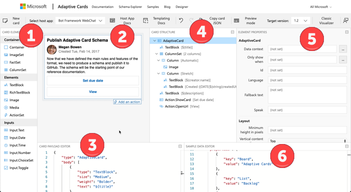

1. **Card Elements**: List of all elements available for use within Adaptive Cards
1. **Rendered Card**: Preview rendering of the card as it would appear in the currently selected host app.
1. **Card Payload Editor**: The browser-friendly JSON editor contains the source of the Adaptive Card that's rendered in the **Rendered Card** pane.
1. **Card Structure**: The card is represented in this panel as a hierarchical structure. Notice that as you select elements in this panel, the corresponding control is highlighted in the **Rendered Card** pane.
1. **Element Properties**: The properties, including those that aren't specified in the source of the Adaptive Card, are displayed in this panel for the control currently selected in the **Card Structure** panel.
1. **Sample Data Editor**: This panel contains the JSON used when using the templating capability of Adaptive Cards.

### Load and modify an existing Adaptive Card sample

The designer has sample cards you can open and customize to get comfortable with both Adaptive Cards and the designer.

Select the **New card** button in the top navigation. Select one of the available samples.

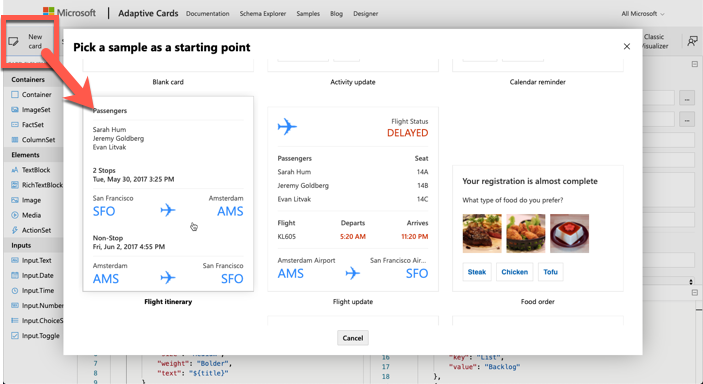

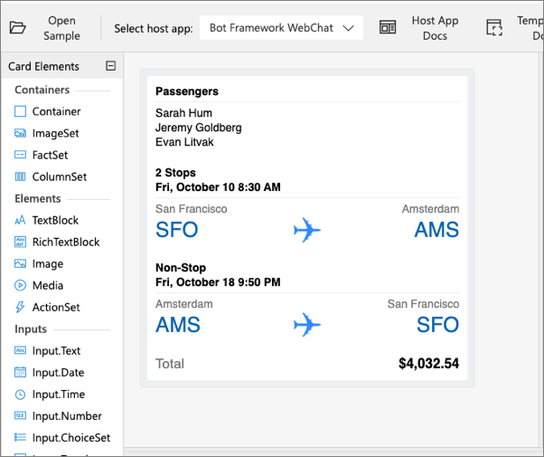

Repeat the process to select the sample card **Activity update**. Let's make some changes to this card and see how it impacts both the source and rendering of the card.

In the **Card Structure** panel, select the **TextBlock** control with the person's name listed in the panel. In the **Card Payload Editor** panel, scroll down to the JSON that represents this control. It should be on or around lines 31-36. Notice the contents of the control are displayed in the **Text** property in the **Element Properties** panel:

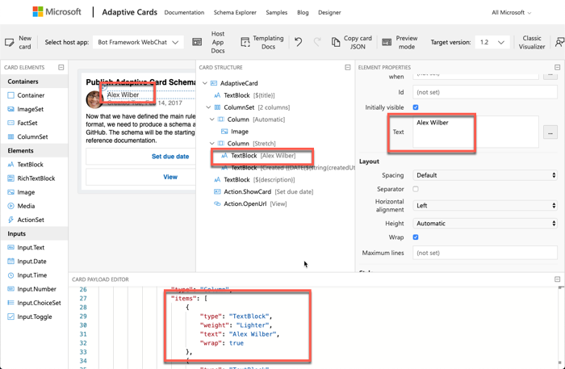

In the **Element Properties** panel, apply the following changes:

- In the **TextBlock** section, set the **Text** property to **Alex Wilber**.
- In the **Style** section, set the **Weight** property to **Lighter**.

Notice how the card has been immediately updated throughout the designer:

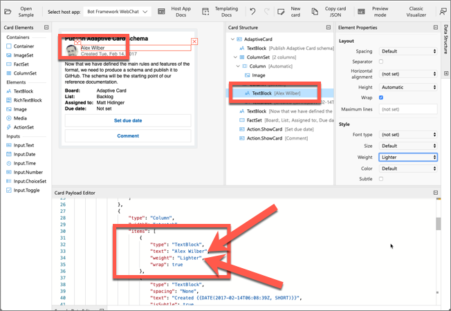

### Preview the card

The Adaptive Card online designer also supports previewing the current card in various supported hosts. Previewing the card and testing out the interaction in various hosts is useful during the card development process.

Select the **Preview mode** button in the top navigation of the designer.

Notice the **Card Structure** and **Element Properties** panels change when the designer is in preview mode.

Next, select the **Set due date** button in the card to see how it will behave when rendered in the selected host app:

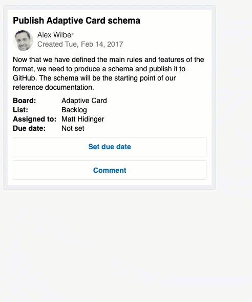

Preview the card rendering in different host apps. By default, the **Bot Framework WebChat** app is currently selected. Use the selector in the top navigation to try a few other rendering options as shown in the following figures:

#### Activity Card rendered in Outlook

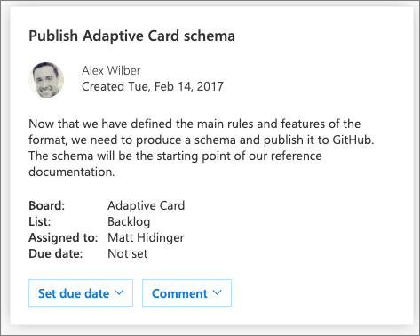

#### Activity Card rendered in Microsoft Teams

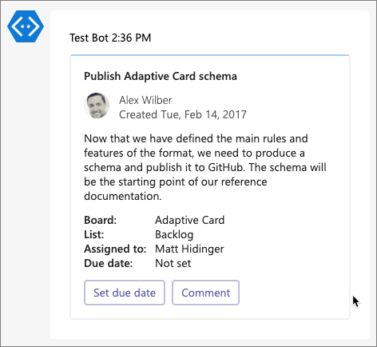

#### Activity Card rendered in Windows Notifications


## Create a new Adaptive Card

In this step, you'll add a custom card to the designer that will display information from Wikipedia on one of the planets in our solar system.

Replace the contents of the **Card Payload Editor** with the following JSON:

```json
{
  "$schema": "http://adaptivecards.io/schemas/adaptive-card.json",
  "type": "AdaptiveCard",
  "version": "1.0",
  "body": [
    {
      "id": "cardHeader",
      "type": "Container",
      "items": [
        {
          "id": "planetName",
          "type": "TextBlock",
          "weight": "Bolder",
          "size": "Medium",
          "text": "Mars"
        }
      ]
    },
    {
      "type": "Container",
      "id": "cardBody",
      "items": [
        {
          "id": "planetSummary",
          "type": "TextBlock",
          "wrap": true,
          "text": "Mars is the fourth planet from the Sun and the second-smallest planet in the Solar System after Mercury. In English, Mars carries a name of the Roman god of war and is often referred to as the 'Red Planet'. The latter refers to the effect of the iron oxide prevalent on Mars' surface, which gives it a reddish appearance distinctive among the astronomical bodies visible to the naked eye."
        },
        {
          "id": "planetDetails",
          "type": "ColumnSet",
          "columns": [
            {
              "type": "Column",
              "width": 100,
              "items": [
                {
                  "id": "planetImage",
                  "size": "Stretch",
                  "type": "Image",
                  "url": "https://upload.wikimedia.org/wikipedia/commons/0/02/OSIRIS_Mars_true_color.jpg"
                }
              ]
            },
            {
              "type": "Column",
              "width": 250,
              "items": [
                {
                  "type": "FactSet",
                  "facts": [
                    {
                      "id": "orderFromSun",
                      "title": "Order from the sun:",
                      "value": "4"
                    },
                    {
                      "id": "planetNumSatellites",
                      "title": "Known satellites:",
                      "value": "2"
                    },
                    {
                      "id": "solarOrbitYears",
                      "title": "Solar orbit (*Earth years*):",
                      "value": "1.88"
                    },
                    {
                      "id": "solarOrbitAvgDistanceKm",
                      "title": "Average distance from the sun (*km*):",
                      "value": "134935000"
                    }
                  ]
                }
              ]
            }
          ]
        },
        {
          "id": "imageAttribution",
          "type": "TextBlock",
          "size": "Small",
          "isSubtle": true,
          "wrap": true,
          "text": "ESA - European Space Agency &amp; Max-Planck Institute for Solar System Research for OSIRIS Team ESA/MPS/UPD/LAM/IAA/RSSD/INTA/UPM/DASP/IDA [CC BY-SA 3.0-IGO (https://creativecommons.org/licenses/by-sa/3.0-igo)]",
          "weight": "Lighter"
        }
      ]
    }
  ],
  "actions": [
    {
      "type": "Action.OpenUrl",
      "title": "Learn more on Wikipedia",
      "url": "https://en.wikipedia.org/wiki/Mars"
    }
  ]
}
```

Notice the preview card changes to display the new card with the specified data:

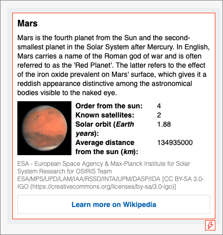

## Implement Adaptive Card Templating

Adaptive Card templating simplifies the reuse of cards by disconnecting the card layout from the data in the card.

The layout of the card is implemented as JSON, except the values of data driven properties are indicated with the property name from a data file and surrounded with `{` and `}`. The data is expressed as JSON. At runtime, the Adaptive Card SDKs will merge the two JSON structures together.

For example, to set the value of a TextBox control of a planet with the property `planetName` from a data file, set the `text` property on the TextBox to `${planetName}`.

## Update the planet example for Adaptive Card templating

Replace the existing card layout in the **Card Payload Editor** panel with the following JSON:

```json
{
  "$schema": "http://adaptivecards.io/schemas/adaptive-card.json",
  "type": "AdaptiveCard",
  "version": "1.0",
  "body": [
    {
      "id": "cardHeader",
      "type": "Container",
      "items": [
        {
          "id": "planetName",
          "type": "TextBlock",
          "weight": "Bolder",
          "size": "Medium",
          "text": "${name}"
        }
      ]
    },
    {
      "type": "Container",
      "id": "cardBody",
      "items": [
        {
          "id": "planetSummary",
          "type": "TextBlock",
          "wrap": true,
          "text": "${summary}"
        },
        {
          "id": "planetDetails",
          "type": "ColumnSet",
          "columns": [
            {
              "type": "Column",
              "width": 100,
              "items": [
                {
                  "id": "planetImage",
                  "size": "Stretch",
                  "type": "Image",
                  "url": "${imageLink}"
                }
              ]
            },
            {
              "type": "Column",
              "width": 250,
              "items": [
                {
                  "type": "FactSet",
                  "facts": [
                    {
                      "id": "orderFromSun",
                      "title": "Order from the sun:",
                      "value": "${id}"
                    },
                    {
                      "id": "planetNumSatellites",
                      "title": "Known satellites:",
                      "value": "${numSatellites}"
                    },
                    {
                      "id": "solarOrbitYears",
                      "title": "Solar orbit (*Earth years*):",
                      "value": "${solarOrbitYears}"
                    },
                    {
                      "id": "solarOrbitAvgDistanceKm",
                      "title": "Average distance from the sun (*km*):",
                      "value": "${solarOrbitAvgDistanceKm}"
                    }
                  ]
                }
              ]
            }
          ]
        },
        {
          "id": "imageAttribution",
          "type": "TextBlock",
          "size": "Small",
          "isSubtle": true,
          "wrap": true,
          "text": "${imageAlt}",
          "weight": "Lighter"
        }
      ]
    }
  ],
  "actions": [
    {
      "type": "Action.OpenUrl",
      "title": "Learn more on Wikipedia",
      "url": "${wikiLink}"
    }
  ]
}
```

Notice the preview of the card displays broken links and placeholders surrounded by `${}` from the card:

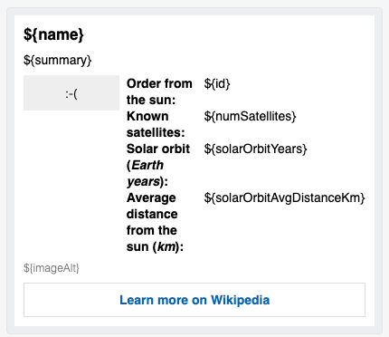

Replace the contents of the **Sample Data Editor** using the following JSON to represent the planet Mars:

```json
{
  "id": "4",
  "name": "Mars",
  "summary": "Mars is the fourth planet from the Sun and the second-smallest planet in the Solar System after Mercury. In English, Mars carries a name of the Roman god of war and is often referred to as the 'Red Planet'. The latter refers to the effect of the iron oxide prevalent on Mars' surface, which gives it a reddish appearance distinctive among the astronomical bodies visible to the naked eye.",
  "solarOrbitYears": "1.88",
  "solarOrbitAvgDistanceKm": "134935000",
  "numSatellites": "2",
  "wikiLink": "https://en.wikipedia.org/wiki/Mars",
  "imageLink": "https://upload.wikimedia.org/wikipedia/commons/0/02/OSIRIS_Mars_true_color.jpg",
  "imageAlt": "ESA - European Space Agency &amp; Max-Planck Institute for Solar System Research for OSIRIS Team ESA/MPS/UPD/LAM/IAA/RSSD/INTA/UPM/DASP/IDA [CC BY-SA 3.0-IGO (https://creativecommons.org/licenses/by-sa/3.0-igo)]"
}
```

Select the **Preview mode** button in the navigation to apply the data to the template. Notice Mars is rendered in the designer:

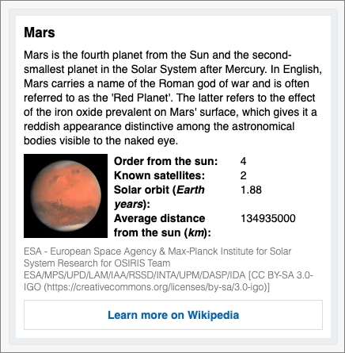

Next, replace the contents of the **Sample Data Editor** using the following JSON to represent the planet Saturn:

```json
{
  "id": "6",
  "name": "Saturn",
  "summary": "Saturn is the sixth planet from the Sun and the second-largest in the Solar System, after Jupiter. It is a gas giant with an average radius about nine times that of Earth. It has only one-eighth the average density of Earth; however, with its larger volume, Saturn is over 95 times more massive. Saturn is named after the Roman god of wealth and agriculture; its astronomical symbol (♄) represents the god's sickle.",
  "solarOrbitYears": "29.46",
  "solarOrbitAvgDistanceKm": "1433525000",
  "numSatellites": "82",
  "wikiLink": "https://en.wikipedia.org/wiki/Saturn",
  "imageLink": "https://upload.wikimedia.org/wikipedia/commons/c/c7/Saturn_during_Equinox.jpg",
  "imageAlt": "NASA / JPL / Space Science Institute [Public domain]"
}
```

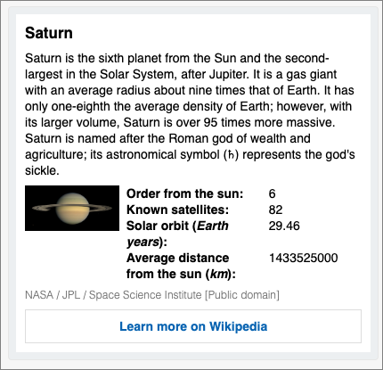

## Summary

In this exercise, you learned how to create and test Adaptive Cards with the online designer.
