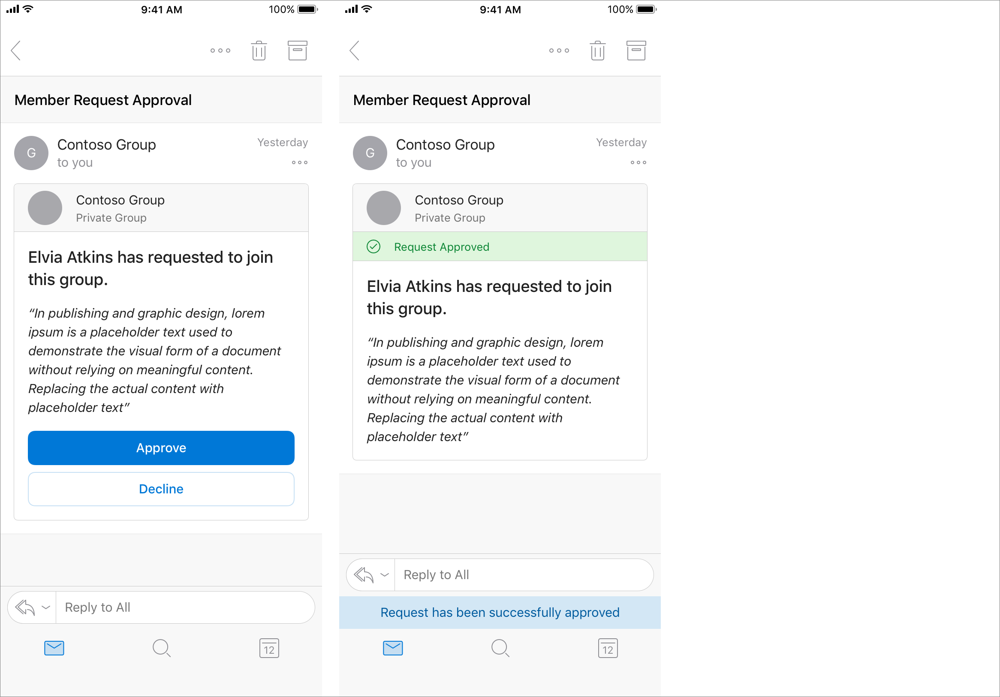
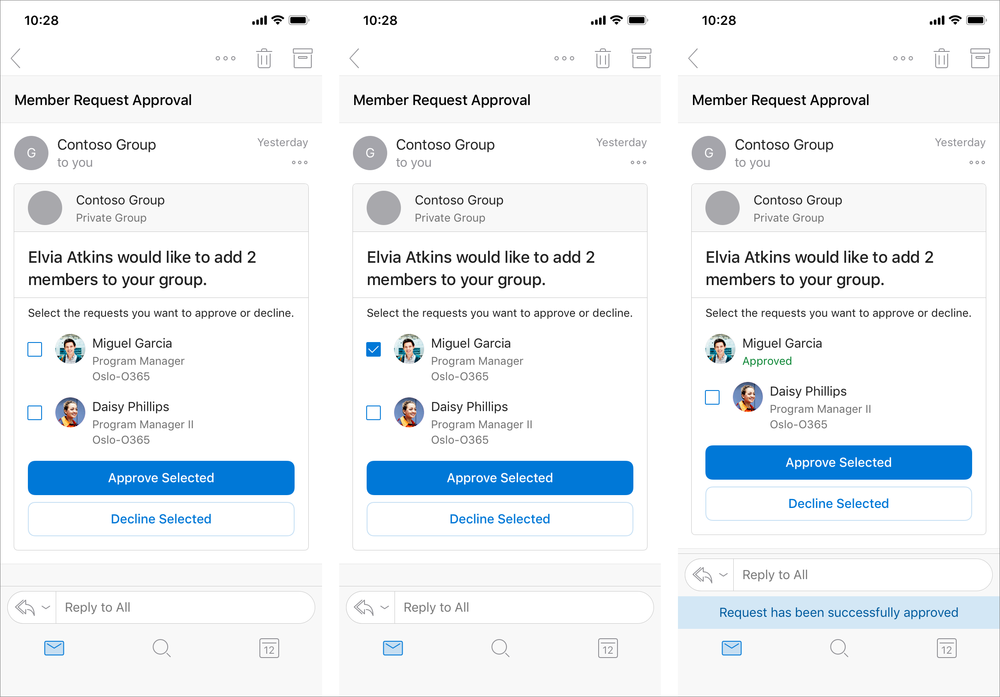
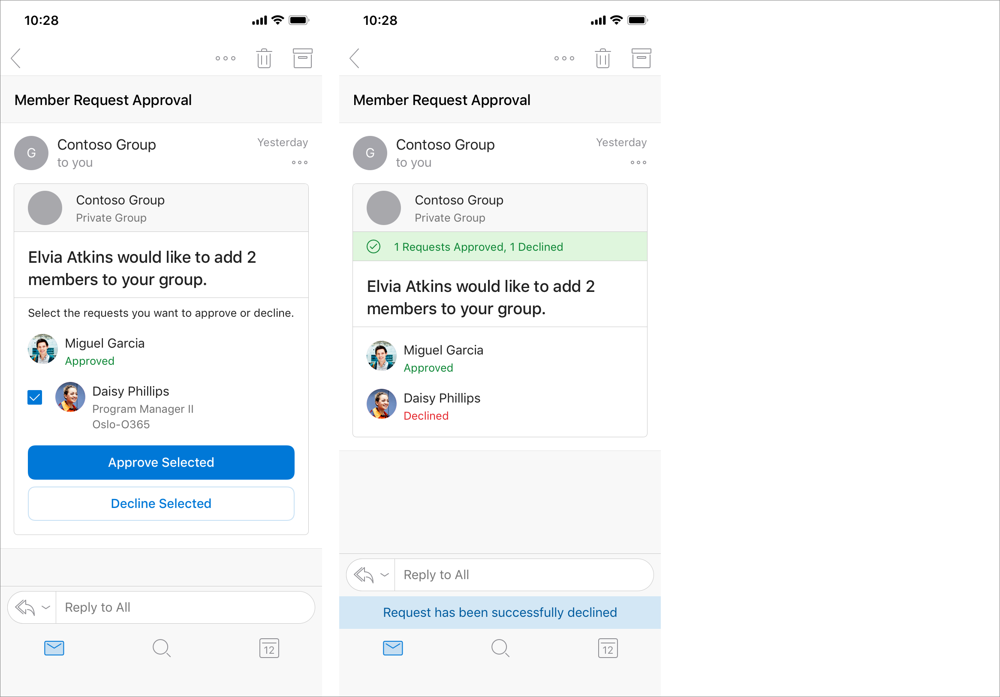
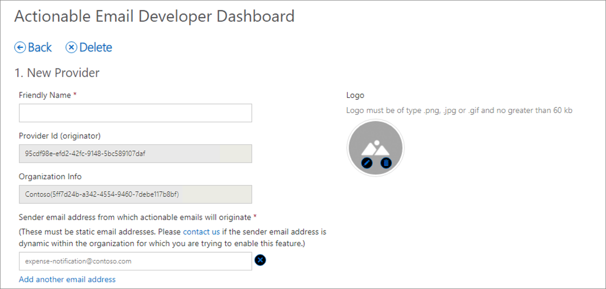

Adaptive Cards are used to create Actionable Messages in Outlook to extend the functionality of email. They enable users to take quick actions without leaving Outlook.

In this unit, you’ll learn what’s possible and required with Outlook Actionable Messages.

Let's start this unit with an example scenario that demonstrates how developers can use Adaptive Cards as Actionable Messages in Outlook.

## Example scenario of Outlook Actionable Messages

In this scenario, Adaptive Cards are used to send Outlook actionable messages to users to process group membership requests.

A Contoso employee submits a request to join a private Office 365 group. Office 365 sends an Actionable Message to the person who owns the group to approve or decline the request. The card included in the message contains all the information the approver might need to quickly understand who submitted the request and any message they included to explain their request. It also includes Approve and Decline actions that can be taken right from Outlook. The owner approves the request, and the card updates to indicate the outcome.



The new member of the group submits a second request to add their team members to the group. Office 365 sends an Actionable Message to the owner with clear information about who submitted the request and the new members to add. The recipient can approve all, some, or none of the proposed new members. The owner approves one new member, and the card updates to indicate the outcome. The approved member is no longer selectable, while the remaining member remains selectable.



The owner declines the other requested new member, and the card updates to indicate the outcome. Both members are no longer selectable, and the action buttons are removed.



Notice the important points in this scenario:

- the group owner can process the group membership request decisions entirely through email
- each time the group owner does an action, the card is refreshed without receiving extra emails
- the group owner can do all necessary actions without leaving Outlook

## Outlook Actionable Messages with Adaptive Cards

Whether you're filling out a survey, approving an expense report, or updating a CRM sales opportunity, Actionable Messages enable you to take quick actions right from within Outlook. Developers can now embed actions in their emails or notifications, elevating user engagement with their services and increasing organizational productivity.

Office 365 provides two solutions to enhance productivity with Outlook Actionable Messages: actionable messages via email, and actionable messages via Office 365 Connectors.

> [!NOTE]
> This module is only addressing actionable messages.

Outlook introduced the actionable message card format that over time has evolved into the Adaptive Card format. Microsoft now recommends developers should use the Adaptive Card format for actionable messages as it's the only format supported on Outlook on iOS and Android.

Cards are included in an HTML email sent to users by including a `<script type="application/adaptivecard+json">` element in the `<head>` element of the email.

The message body of the email should still be placed in the `<body>` element.

## Sender verification for Actionable Messages with Adaptive Cards

Securing actionable email is simple and easy. There are two phases within the end-to-end experience that impose security requirements on your service when supporting actionable messages with Office 365.

Let's first explore the sending phase of actionable messages

In the send phase, the pre-requisites for your service to send actionable messages are as follows:

- If you're using actionable email, you'll need to enable sender verification. This doesn't apply to connector messages.
- Your service must be registered with Microsoft.
- The Action URL must support HTTPS.

### Sender verification

Office 365 requires sender verification to enable actionable messages via email. Your actionable message emails must either originate from servers that implement DomainKeys Identified Mail (DKIM) and Sender Policy Framework (SPF), or you must implement signed cards.

While DKIM and SPF are sufficient for some scenarios, that solution won't work in some situations where emails are sent via an external provider, which can lead to recipients not experiencing the enhanced actionable message. For this reason, we recommend always implementing signed cards, which work in all cases and are fundamentally more secure since they don't rely on DNS records.

#### Implementing DKIM and SPF

DKIM and SPF are industry standard ways to prove a sender's identity when sending emails over SMTP. Many companies already implement these standards to secure the emails they're already sending. To learn more about SPF/DKIM and how to implement them, see:

- [DomainKeys Identified Mail (DKIM)](https://tools.ietf.org/html/rfc5585)
- [Sender Policy Framework](https://en.wikipedia.org/wiki/Sender_Policy_Framework)

#### Signed card payloads

Actionable messages sent via email support an alternative verification method: signing the card payload with an RSA key or X509 certificate. This method is required in the following scenarios:

- SPF/DKIM failure caused by sender setup or recipient tenant set custom security services in front of Office 365 services.
- Your scenario for actionable messages requires sending from multiple email accounts.

To use signed cards, you must register your public key in the email developer dashboard, and use the corresponding private key to sign the card.

## Actionable Email lifecycle

Let's now look at the lifecycle of an Outlook Actionable Message.


Action processing requires a publicly reachable endpoint that is pre-registered using the **Actionable Email Developer Dashboard** (https://aka.ms/publishoam).

> [!IMPORTANT]
> You can't use http://localhost as a URL because that is unreachable from Office 365.

> [!TIP]
> Use the free tool ngrok (https://ngrok.io) to create a public HTTPS endpoint proxy that maps to http://localhost on your development environment.

1. A user receives an email with an actionable message embedded in the `<script>` element.
1. The user interacts with the message action defined in the card such as `Action.HTTP` that sends a POST request to an API.
1. The HTTP POST message is sent from Office 365 to the pre-registered endpoint. The HTTP POST includes a bearer token that should be validated.
1. The status is returned in the HTTP header `CARD-ACTION-STATUS` with a value indicating success or failure. Optionally, the response body can contain JSON to represent the new UI of the card after successful processing. This requires the `CARD-UPDATE-IN-BODY` HTTP header with a value of `true`.

## Actionable Email Developer Dashboard

Your Action URLs won't work until the URL is registered in the **Actionable Email Developer Dashboard**.



Your service must be registered to make Outlook aware the following aspects of your Actionable Message:

- The address of the API endpoint the Actionable Message can submit an HTTP post to and receive card refreshes from in the response.
- The email address that is allowed to send adaptive cards.
- The scope permitted to use the Actionable Message.

Every unique scope (My Mailbox, Organization, or Global) must be registered individually and each must be reviewed and approved by Microsoft.

Developers aren’t blocked on the approval, they can send actionable messages to themselves – cards would render and actions would work without requiring an approval. The approval is required only to send actionable messages to others.

### Registration criteria for global submission scope

If you're registering an Actionable Message for **Global** scope, your service must meet the following requirements:

- emails must be authenticated via DKIM or SPF
- top-level domain (TLD) of the SPF check or DKIM signature must match the TLD of your From: email address
- emails must come from a static email address
- emails must follow the email sender guidelines
- consistent history of sending a high volume of mail from your domain
- low rate of spam complaints from users
- use high-fidelity, routine and simple actions available for your service, otherwise use OpenUri actions for complex interactions
- actions should be used for transactional email where a high interaction rate is expected, they shouldn't be used for promotional bulk mail

## Validating the bearer token

Office 365 will call your configured URL, passing an `authentication` header with a value of `bearer` plus a signed, encoded token. Your API should validate the token is issued by Microsoft by checking the digital signature,

You can inspect the bearer token and use the **Microsoft.O365.ActionableMessages.Utilities** NuGet package for .NET Framework v4.6 projects. This package contains a class, `ActionableMessageTokenValidator` that contains the method `ValidateTokenAsync()` that can be used to validate the token. This method will verify:

- The token is issued by Microsoft and its digital signature is valid.
- The token hasn't expired.
- The audience claim matches the service domain URL.

```csharp
var validator = new ActionableMessageTokenValidator();
var result = await validator.ValidateTokenAsync(
                        Request.Headers.Authorization.Parameter,
                        "https://api.contoso.com"
                   );
```

## Validating the sender

The bearer token also contains other properties your API can and should use to do extra verification checks.

The email address of the email sender that included the Actionable Message can be found in the **sender** claim. The email address of the person who received the email and did the action in the Actionable Message can be found in the **sub** claim.

If you're using the `ActionMessageTokenValidator()` class from the **Microsoft.O365.ActionableMessage.Utilities** NuGet package, these will be exposed in the result as the `Sender` and `ActionPerformer` properties:

```csharp
public async Task<HttpResponseMessage> Post([FromBody]string value)
{
  //Validate token
  var validator = new ActionableMessageTokenValidator();
  var result = await validator.ValidateTokenAsync(Request.Headers.Authorization.Parameter, "https://api.contoso.com");
  if (!result.ValidationSucceeded) {
    return CreateCardResponse(HttpStatusCode.Unauthorized, "Invalid token");
  }

  //Custom business logic to validate the sender and/or performer
  if ((!result.Sender.ToLower().EndsWith("@contoso.com") || !result.ActionPerformer.ToLower().EndsWith("@contoso.com")) {
    return CreateCardResponse(HttpStatusCode.Forbidden, "Invalid sender or the performer is not allowed.");
  }

  // TODO: Add business logic code here to process the expense report.
  return CreateCardResponse(HttpStatusCode.OK, "The expense was approved.");
}
```

Your API should check both of these claims to ensure the correct email address sent the original message and the person who did the action is supported, such as people in your organization.

## Report success or failure to Office 365

When your API receives an HTTP POST request from the action performer, it responds to the HTTP request indicating success or failure along with a message.

The success or failure status is indicated by returning an HTTP 200 (success) or HTTP 400-499 (failure) status code. You can include an extra message to the user by including it in the `CARD-ACTION-STATUS` HTTP response header.

```csharp
private HttpResponseMessage CreateCardResponse(HttpStatusCode code, string cardStatus)
{
  if(code == HttpStatusCode.OK) {
    HttpResponseMessage response = Request.CreateResponse(code);
    response.Headers.Add("CARD-ACTION-STATUS", cardStatus);
    return response;
  }
  else {
    var errorResponse = Request.CreateErrorResponse(code, new HttpError());
    errorResponse.Headers.Add("CARD-ACTION-STATUS", cardStatus);
    return errorResponse;
  }
}
```

## Refresh cards

After the user completes an action, the card body can be refreshed to include details of the interaction such as an expense approval number or a support ticket number.

To refresh a card, your API must do two things:

- include the new card, as a JSON payload, in the body of the HTTP response
- include the HTTP response header `CARD-UPDATE-IN-BODY` set to `true`

When Office 365 receives the new card in the response from the HTTP POST action, it will update the email to use the new card.

```csharp
bool approved = ExpenseModel.IsApproved(value);
if (approved)
{
  var response = Request.CreateResponse(HttpStatusCode.OK);
  response.Headers.Add("CARD-ACTION-STATUS", "The expense was approved.");

  //Refresh card
  response.Headers.Add("CARD-UPDATE-IN-BODY", "true");
  response.Content = new StringContent(ExpenseModel.GetCardBody(value));

  return response;
}
```

## Summary

Adaptive Cards are used to create Actionable Messages in Outlook to extend the functionality of email. They enable users to take quick actions without leaving Outlook.

In this unit, you learned what’s possible and required with Outlook Actionable Messages.
