In this exercise, you'll use Adaptive Cards to implement an engaging user experience with Outlook Actionable Messages.

You'll create two separate projects during this exercise and register your app in two different portals to implement a complete solution:

1. You'll start by first creating an Azure AD application that will be used to send an email with Microsoft Graph.
1. Next, you'll use the Azure AD app in a .NET Core Console app that will send the email using Microsoft Graph that contains the adaptive card in the message.

    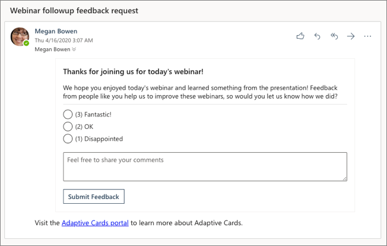

1. The Adaptive Card in the rendered email will submit the form results to an API to record the user's feedback and update the card in the email. The next step is to create the API that receives the form submission and responds with an updated card that Outlook will use to update the existing message.
1. To submit the form to an API, you'll need to register the service in the Outlook Actionable Email Developer Dashboard.

## Create an Azure AD application

The first step is to create the Azure AD application that you'll use to send an email that contains an Adaptive Card.

Open a browser and navigate to the [Azure Active Directory admin center (https://aad.portal.azure.com)](https://aad.portal.azure.com). Sign in using a **Work or School Account** that has global administrator rights to the tenancy.

Select **Azure Active Directory** in the left-hand navigation.

Select **Manage > App registrations** in the left-hand navigation.

  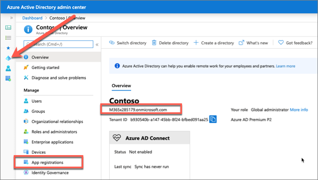

On the **App registrations** page, select **New registration**.

On the **Register an application** page, set the values as follows:

- **Name**: Adaptive Card Mailer
- **Supported account types**: Accounts in this organizational directory only (Contoso only - Single tenant)

  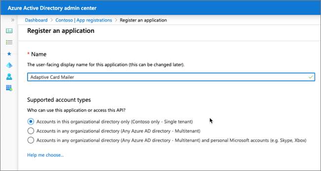

    Select **Register**.

On the **Adaptive Card Mailer** page, copy the value of the **Application (client) ID** and **Directory (tenant) ID**; you'll need these in the application.

  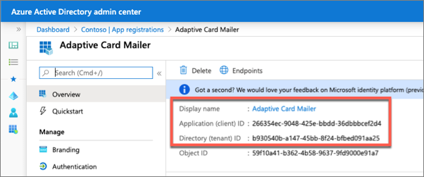

Select **Manage > Authentication**.

In the **Platform configurations** section, select the **Add a platform** button. Then in the **Configure platforms** panel, select the **Mobile and desktop applications** button:

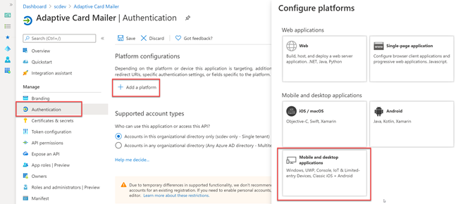

In the **Redirect URIs** section of the **Configure Desktop + devices** panel, select the entry that ends with **nativeclient**, and then select the **Configure** button:

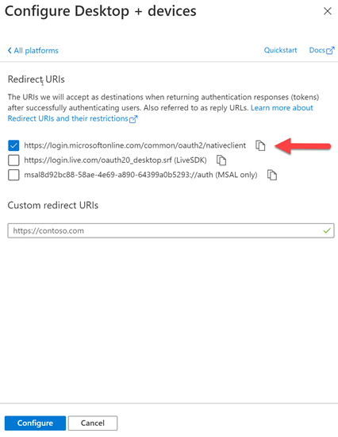

In the **Authentication** panel, scroll down to the **Advanced settings** section and set the toggle for **Allow public client flows** to **Yes**.

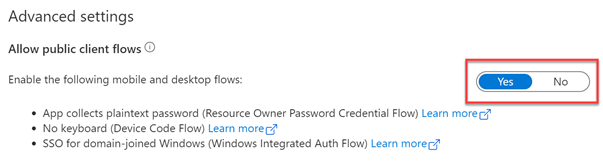

Select **Save** in the top menu to save your changes.

### Grant Azure AD application permissions to Microsoft Graph

After creating the application, you need to grant it the necessary permissions to Microsoft Graph.

Select **API Permissions** in the left-hand navigation panel.

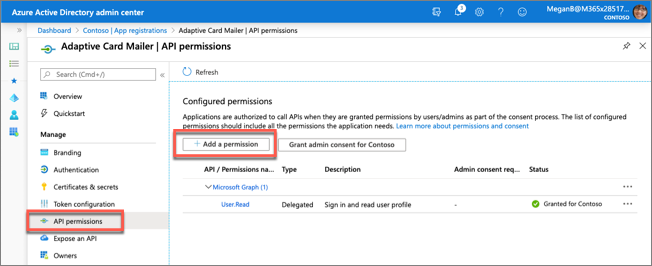

Select the **Add a permission** button.

In the **Request API permissions** panel that appears, select **Microsoft Graph** from the **Microsoft APIs** tab.

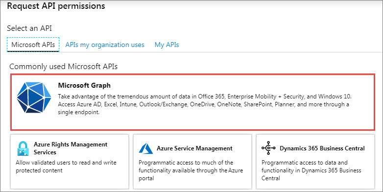

When prompted for the type of permission, select **Delegated permissions**.

Enter **Mail.S** in the **Select permissions** search box and select the **Mail.Send** permission, followed by the **Add permission** button at the bottom of the panel.

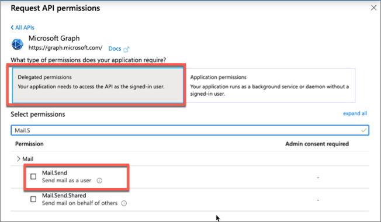

In the **Configured Permissions** panel, select the button **Grant admin consent for [tenant]**, and then select the **Yes** button in the consent dialog to grant all users in your organization this permission.

> [!NOTE]
> The option to **Grant admin consent** here in the Azure AD admin center is pre-consenting the permissions to the users in the tenant to simplify the exercise. This approach allows the console application to use the [resource owner password credential grant](https://docs.microsoft.com/azure/active-directory/develop/v2-oauth-ropc), so the user isn't prompted to grant consent to the application that simplifies the process of obtaining an OAuth access token. You could elect to implement alternative options such as the [device code flow](https://docs.microsoft.com/azure/active-directory/develop/v2-oauth2-device-code) to utilize dynamic consent as another option.

## Create .NET Core console application

Open your command prompt, navigate to a directory where you have rights to create your project, and run the following command to create a new .NET Core console application:

```console
dotnet new console -o graphconsoleapp
```

After creating the application, run the following commands to add the Microsoft Authentication Library (MSAL), Microsoft Graph .NET SDK, and a few configuration packages to the project:

```console
cd graphconsoleapp
dotnet add package Microsoft.Identity.Client
dotnet add package Microsoft.Graph
dotnet add package Microsoft.Extensions.Configuration
dotnet add package Microsoft.Extensions.Configuration.FileExtensions
dotnet add package Microsoft.Extensions.Configuration.Json
```

Open the application in Visual Studio Code using the following command:

```console
code .
```

If Visual Studio code displays a dialog box asking if you want to add required assets to the project, select **Yes**.

### Update the console app to support Azure AD authentication

Create a new file named **appsettings.json** in the root of the project and add the following code to it:

```json
{
  "tenantId": "YOUR_TENANT_ID_HERE",
  "applicationId": "YOUR_APP_ID_HERE"
}
```

Update properties with the following values:

- `YOUR_TENANT_ID_HERE`: Azure AD directory ID
- `YOUR_APP_ID_HERE`: Azure AD client ID

### Create helper class

Create a new folder **Helpers** in the project.

Create a new file **MsalAuthenticationProvider.cs** in the **Helpers** folder and add the following code:

```csharp
using System.Net.Http;
using System.Net.Http.Headers;
using System.Security;
using System.Threading.Tasks;
using Microsoft.Identity.Client;
using Microsoft.Graph;

namespace Helpers
{
  public class MsalAuthenticationProvider : IAuthenticationProvider
  {
    private static MsalAuthenticationProvider _singleton;
    private IPublicClientApplication _clientApplication;
    private string[] _scopes;
    private string _username;
    private SecureString _password;
    private string _userId;

    private MsalAuthenticationProvider(IPublicClientApplication clientApplication, string[] scopes, string username, SecureString password)
    {
      _clientApplication = clientApplication;
      _scopes = scopes;
      _username = username;
      _password = password;
      _userId = null;
    }

    public static MsalAuthenticationProvider GetInstance(IPublicClientApplication clientApplication, string[] scopes, string username, SecureString password)
    {
      if (_singleton == null)
      {
        _singleton = new MsalAuthenticationProvider(clientApplication, scopes, username, password);
      }

      return _singleton;
    }

    public async Task AuthenticateRequestAsync(HttpRequestMessage request)
    {
      var accessToken = await GetTokenAsync();

      request.Headers.Authorization = new AuthenticationHeaderValue("bearer", accessToken);
    }

    public async Task<string> GetTokenAsync()
    {
      if (!string.IsNullOrEmpty(_userId))
      {
        try
        {
          var account = await _clientApplication.GetAccountAsync(_userId);

          if (account != null)
          {
            var silentResult = await _clientApplication.AcquireTokenSilent(_scopes, account).ExecuteAsync();
            return silentResult.AccessToken;
          }
        }
        catch (MsalUiRequiredException){ }
      }

      var result = await _clientApplication.AcquireTokenByUsernamePassword(_scopes, _username, _password).ExecuteAsync();
      _userId = result.Account.HomeAccountId.Identifier;
      return result.AccessToken;
    }
  }
}
```

### Incorporate Microsoft Graph into the console app

Open the **Program.cs** file and add the following `using` statements to the top of the file:

```csharp
using System.Collections.Generic;
using System.Security;
using System.Threading.Tasks;
using Microsoft.Identity.Client;
using Microsoft.Graph;
using Microsoft.Extensions.Configuration;
using Helpers;
```

Add the following method `LoadAppSettings` to the `Program` class. The method retrieves the configuration details from the **appsettings.json** file previously created:

```csharp
private static IConfigurationRoot LoadAppSettings()
{
  try
  {
    var config = new ConfigurationBuilder()
                      .SetBasePath(System.IO.Directory.GetCurrentDirectory())
                      .AddJsonFile("appsettings.json", false, true)
                      .Build();

    if (string.IsNullOrEmpty(config["applicationId"]) ||
        string.IsNullOrEmpty(config["tenantId"]))
    {
      return null;
    }

    return config;
  }
  catch (System.IO.FileNotFoundException)
  {
    return null;
  }
}
```

Add the following method `CreateAuthorizationProvider` to the `Program` class. The method will create an instance of the clients used to call Microsoft Graph.

```csharp
private static IAuthenticationProvider CreateAuthorizationProvider(IConfigurationRoot config, string userName, SecureString userPassword)
{
  var clientId = config["applicationId"];
  var authority = $"https://login.microsoftonline.com/{config["tenantId"]}/v2.0";

  List<string> scopes = new List<string>();
  scopes.Add("User.Read");
  scopes.Add("Mail.Send");

  var cca = PublicClientApplicationBuilder.Create(clientId)
                                          .WithAuthority(authority)
                                          .Build();
  return MsalAuthenticationProvider.GetInstance(cca, scopes.ToArray(), userName, userPassword);
}
```

> [!IMPORTANT]
> Notice in the previous code that two scopes will be included in the request. These are the permissions you added to the Azure AD app.

Add the following method `GetAuthenticatedGraphClient` to the `Program` class. The method creates an instance of the `GraphServiceClient` object.

```csharp
private static GraphServiceClient GetAuthenticatedGraphClient(IConfigurationRoot config, string userName, SecureString userPassword)
{
  var authenticationProvider = CreateAuthorizationProvider(config, userName, userPassword);
  var graphClient = new GraphServiceClient(authenticationProvider);
  return graphClient;
}
```

Add the following method `ReadPassword` to the `Program` class. The method prompts the user for their password:

```csharp
private static SecureString ReadPassword()
{
  Console.WriteLine("Enter your password");
  SecureString password = new SecureString();
  while (true)
  {
    ConsoleKeyInfo c = Console.ReadKey(true);
    if (c.Key == ConsoleKey.Enter)
    {
      break;
    }
    password.AppendChar(c.KeyChar);
    Console.Write("*");
  }
  Console.WriteLine();
  return password;
}
```

Add the following method `ReadUsername` to the `Program` class. The method prompts the user for their username:

```csharp
private static string ReadUsername()
{
  string username;
  Console.WriteLine("Enter your username");
  username = Console.ReadLine();
  return username;
}
```

Finally, add the following two methods to the `Program` class. The `SendEmail()` method will create and send the email to the currently signed in user. It calls the `LoadCardMessageBody()` to load an HTML template and Adaptive Card to create the email message:

```csharp
private static async Task SendEmail(GraphServiceClient client, string email){
  // create email
  Message emailMessage = new Message()
  {
    Subject = "Webinar followup feedback request",
    ToRecipients = new List<Recipient>() {
      new Recipient() {
        EmailAddress = new EmailAddress() { Address = email}
      }
    },
    Body = new ItemBody()
    {
      ContentType = BodyType.Html,
      Content = LoadCardMessageBody()
    }
  };

  // send email
  await client.Me.SendMail(emailMessage, true).Request().PostAsync();
}

private static string LoadCardMessageBody()
{
  // load message body
  string messageBody = System.IO.File.ReadAllText(@"email-body.html");

  // load adaptive card
  string cardJson = System.IO.File.ReadAllText(@"adaptive-card.json");

  // merge card JSON into email message body
  return string.Format(messageBody, cardJson);
}
```

Locate the `Main` method in the `Program` class. Add the following code to the end of the `Main` method to load the configuration settings from the **appsettings.json** file:

```csharp
var config = LoadAppSettings();
if (config == null)
{
  Console.WriteLine("Invalid appsettings.json file.");
  return;
}
```

Add the following code to the end of the `Main` method, just after the code added in the last step. This code will obtain an authenticated instance of the `GraphServiceClient` and call the method to send the email:

```csharp
var userName = ReadUsername();
var userPassword = ReadPassword();

var client = GetAuthenticatedGraphClient(config, userName, userPassword);

SendEmail(client, userName).Wait();
Console.WriteLine("\nEmail sent.");
```

The last step is to add the two templates that contain the HTML email and the Adaptive Card used to send the message to the currently logged in user.

- Create a new file **email-body.html** in the root of the project and add the following HTML to it:

    ```html
    <html>
    <head>
      <meta http-equiv="Content-Type" content="text/html; charset=utf-8">
      <script type="application/adaptivecard+json">
        {0}
      </script>
    </head>
    <body>
      <div>Visit the <a href="https://adaptivecards.io/">Adaptive Cards portal</a> to learn more about Adaptive Cards.</div>
    </body>
    </html>
    ```

- Create a new file **adaptive-card.json** in the root of the project and add the following JSON to it:

    ```json
    {
      "$schema": "http://adaptivecards.io/schemas/adaptive-card.json",
      "type": "AdaptiveCard",
      "version": "1.0",
      "body": [
        {
          "type": "TextBlock",
          "text": "Thanks for joining us for today's webinar!",
          "weight": "Bolder",
          "size": "Medium"
        },
        {
          "type": "TextBlock",
          "text": "We hope you enjoyed today's webinar and learned something from the presentation! Feedback from people like you help us to improve these webinars, so would you let us know how we did?",
          "wrap": true
        },
        {
          "type": "Input.ChoiceSet",
          "id": "rating",
          "placeholder": "Placeholder text",
          "choices": [
            {
              "title": "(3) Fantastic!",
              "value": "3"
            },
            {
              "title": "(2) OK",
              "value": "2"
            },
            {
              "title": "(1) Disappointed",
              "value": "1"
            }
          ],
          "style": "expanded",
          "separator": true
        },
        {
          "type": "Input.Text",
          "id": "comment",
          "placeholder": "Feel free to share your comments",
          "isMultiline": true
        },
        {
          "type": "ActionSet",
          "actions": [
            {
              "type": "Action.Http",
              "method": "POST",
              "title": "Submit Feedback",
              "url": "https://{{REPLACE-WITH-YOUR-SUBDOMAIN)}.ngrok.io/api/card",
              "headers": [
                {
                  "name": "content-type",
                  "value": "application/json"
                }
              ],
              "body": "{ \"rating\": {{rating.value}}, \"comment\": \"{{comment.value}}\" }"
            }
          ]
        }
      ]
    }
    ```

> [!IMPORTANT]
> The Adaptive Card template contains a URL where the contents of the form will be sent. Notice it contains the string `{{REPLACE-WITH-YOUR-SUBDOMAIN)}`.
>
> While it isn't important to modify this now, you'll need to come back and update this value when you do the final testing once you know the URL of the REST API web server you'll create in a later step in this exercise.

### Build and test the application

Run the following command in a command prompt to compile the console application:

```console
dotnet build
```

Run the following command to run the console application:

```console
dotnet run
```

After entering the username and password of a user, you'll see a message than an email was sent.

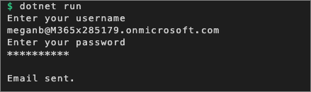

Open a browser and navigate to the Outlook web client: https://mail.office365.com. Sign in using the **Work or School Account** that you used when you tested the console app.

You should see an email with the subject **Webinar followup feedback request**. Select it to see the rendered Adaptive Card:


Delete the email.

> [!IMPORTANT]
> It doesn't yet contain the correct endpoint to submit the Adaptive Card's response to. You need to create the service before you can update the card. After you create the service, you'll update the Adaptive Card template and send a new email.

## Create an API to receive and update the Outlook Actionable Message Adaptive Card

The Adaptive Card in the rendered email will submit the form results to an API to record the user's feedback and update the card in the email. The next step is to create the API that receives the form submission and responds with an updated card that Outlook will use to update the existing message.

You'll use Node.js and TypeScript to create the web service

Open your command prompt, navigate to a directory where you have rights to create your project, and create a new folder **refresh-card-ts**.

### Project setup

Change to that folder and run the following to initialize a new Node project:

```console
npm init -y
```

Install the required dependencies for the project by running the following command. This will install packages used to run project:

```console
npm install adaptivecards adaptivecards-templating adaptive-expressions axios base64url body-parser debug dotenv express json-schema jsonwebtoken morgan rsa-pem-from-mod-exp typescript -S
```

Install the following packages used during development of the project by running the following command.

```console
npm install @types/express @types/jsonwebtoken @types/morgan -D
```

Open the project in an editor such as VS Code by executing the following command, or by opening VS Code and opening the **refresh-card-ts** folder:

```console
code .
```

Add a few utility commands to project to simply building and running the project. Open the **package.json** file and replace the `scripts` section with the following:

```json
"scripts": {
  "build": "tsc -p ./",
  "start-server": "npm run build && DEBUG=msoutlook-adaptivecards node server.js",
  "start-ngrok": "ngrok http 3007"
},
```

You'll write the code for this project using TypeScript. Add a new file **tsconfig.json** to the root of the project and add the following JSON to it. This will configure the TypeScript compiler's settings without having to enter each setting in on the command line each time you run the project:

```json
{
  "compilerOptions": {
    "module": "commonjs",
    "target": "es6",
    "moduleResolution": "node",
    "noImplicitAny": false,
    "strictNullChecks": true,
    "jsx": "react",
    "sourceMap": true,
    "experimentalDecorators": true,
    "resolveJsonModule": true,
  },
  "exclude": [
    "node_modules"
  ]
}
```

Lastly, add a new file **.env** to the root of the project and add the following to it. This will be used during development to specify environment variables when the project is run:

```ini
# allowed sender & domain the API will respond to
ALLOWED_SENDER=alias@contoso.com
ACTION_PERFORMER_DOMAIN=contoso.com

# service hosting details
HOSTNAME=REPLACE-WITH-YOUR-SUBDOMAIN.ngrok.io
PORT=3007
```

> [!NOTE]
> When you run this project in production, set these same environment variables in host environment. The **.env** file is used to simplify the testing process during development.

Set the values of the `ALLOWED_SENDER` and `ACTION_PERFORMER_DOMAIN` equal to the values for your test account. These should make the test account you'll use for this lab.

For example, in our test, we'll use the user **Megan Bowen (meganb@M365x285179.onmicrosoft.com)**, to send the email to herself. In this example, the values should be set to:

```ini
ALLOWED_SENDER=meganb@M365x285179.onmicrosoft.com
ACTION_PERFORMER_DOMAIN=M365x285179.onmicrosoft.com
```

Replace these values with the email address and domain you'll use in your testing.

### Add utility classes to validate tokens

Before you can create the REST API that will receive the requests from Outlook, you need to create some utility classes.

Create a new folder **Utilities** in the project.

Create a new file **OpenIdMetadata.ts** in the **Utilities** folder and add the following code to it. This class will retrieve TLS/SSL keys from the specified service. These keys are used to decode and validate the JWT token sent from Outlook to verify Microsoft sent the Adaptive Card payload:

```typescript
import axios from 'axios';
import { AxiosResponse } from "axios";
const getPem = require('rsa-pem-from-mod-exp');
const base64url = require('base64url');
import * as debug from 'debug';

// init debug logging module
const log = debug('openid');

interface OpenIdConfiguration {
  issuer: string;
  token_endpoint: string;
  jwks_uri: string;
  authorization_endpoint: string;
  response_types_supported: string[];
  subject_types_supported: string[];
  id_token_signing_alg_values_supported: string[];
  claims_supported: string[];
}

class OpenIdMetadata {
  public lastUpdated: number = 0;

  public keys: { kid: string, e: string, n: string }[];

  private _keys: { kid: string, e: string, n: string }[];

  constructor(public url: string) { };

  public getKey(keyId: string, callback): void {
    let _this = this;

    // if keys are more than 5d old, refresh
    let now = new Date().getTime();
    if (this.lastUpdated < (now - 1000 * 60 * 60 * 24 * 5)) {
      this._refreshCache((error) => {
        if (error) { }
        // search cache even if failed to refresh
        callback(_this._findKey(keyId));
      });
    } else {
      // otherwise read fro cache
      callback(this._findKey(keyId))
    }
  }

  /**
   * Refresh the internal cache.
   * @param cb
   *   The callback after the cache is refreshed.
   */
  private _refreshCache(callback): void {
    let _this = this;

    axios.get(this.url)
      .then((openIdConfigResponse: AxiosResponse) => {
        log(`OpenID Config HTTP GET response = (${openIdConfigResponse.status})`, openIdConfigResponse.data);

        if (openIdConfigResponse.status >= 400 || !openIdConfigResponse.data) {
          throw new Error(`Failed to load OpenID config. ${openIdConfigResponse.status}: ${openIdConfigResponse.statusText}`);
        }

        let openIdConfig: OpenIdConfiguration = openIdConfigResponse.data;
        // get the keys
        axios.get(openIdConfig.jwks_uri)
          .then((keySetResponse: AxiosResponse) => {
            log(`Key request = (${keySetResponse.status})`, keySetResponse.data);

            if (keySetResponse.status >= 400 || !keySetResponse.data) {
              throw new Error(`Failed to load JSON web key set. ${openIdConfigResponse.status}: ${openIdConfigResponse.statusText}`);
            }

            _this.lastUpdated = new Date().getTime();
            _this.keys = keySetResponse.data.keys;
            callback(null);
          }).catch((error: Error) => {
            callback(error);
          });
      }).catch((error: Error) => {
        callback(error);
      });
  }

  /**
   * Find the key given the key ID.
   * @param keyId
   *   The ID of the key.
   *
   * @return
   *   The value of the key if found; else null.
   */
  private _findKey(keyId: string): any {
    if (!this.keys) {
      return null;
    }

    for (let i = 0; i < this.keys.length; i++) {
      if (this.keys[i].kid == keyId) {
        let key = this.keys[i];
        if (!key.n || !key.e) {
          return null;
        }
        let modulus = base64url.toBase64(key.n);
        let exponent = key.e;
        return getPem(modulus, exponent);
      }
    }
  }

}

export { OpenIdMetadata };
```

Create another file **ActionableMessageTokenValidator.ts** in the **Utilities** folder and add the following code to it. This contains two classes:

- `ActionableMessageTokenValidatorResult`: the object returned to the caller that contains the sender of the original email and person who did the action in the Adaptive Card
- `ActionableMessageTokenValidator`: the object that will validate the token received in the message to verify the request was sent by Microsoft and parse the contents of the token to return to the caller as an `ActionableMessageTokenValidatorResult`

```typescript
import axios from 'axios';
import { AxiosResponse } from "axios";
const getPem = require('rsa-pem-from-mod-exp');
const base64url = require('base64url');
import * as jwt from 'jsonwebtoken';
import { OpenIdMetadata } from './OpenIdMetadata';
import * as debug from 'debug';

// init debug logging module
const log = debug('msoutlook-actionablemessages');

// Office 365 constants
const OFFICE365_APP_ID = "48af08dc-f6d2-435f-b2a7-069abd99c086";
const OFFICE365_OPENID_METADATA_URL = "https://substrate.office.com/sts/common/.well-known/openid-configuration";
const OFFICE365_TOKEN_ISSUER = "https://substrate.office.com/sts/";

class ActionableMessageTokenValidatorResult {
  constructor(public sender: String | undefined, public actionPerformer: String | undefined) { }
}

/**
 * Validates an actionable message token.
 * @param token
 *   A JWT issued by Microsoft.
 *
 * @param targetUrl
 *   The expected URL in the token. This should the web service URL.
 *
 * @param cb
 *   The callback when the validation is completed.
 */
class ActionableMessageTokenValidator {
  public validateToken(token: string, targetUrl: string, callback): void {
    const decodedJwt: any = jwt.decode(token, { complete: true });
    log(`Decoded JWT`, decodedJwt);

    const verifyOptions = {
      issuer: OFFICE365_TOKEN_ISSUER,
      audience: targetUrl
    };

    // get openid metadata from o365
    const openIdConfig = new OpenIdMetadata(OFFICE365_OPENID_METADATA_URL);

    // get the matching key from the token
    openIdConfig.getKey(decodedJwt.header.kid, (key) => {
      let result = new ActionableMessageTokenValidatorResult(undefined, undefined);

      if (key) {
        try {
          // verify the token has valid claims
          jwt.verify(token, key, verifyOptions);
          if (decodedJwt.payload.appid.toLowerCase() !== OFFICE365_APP_ID.toLowerCase()) {
            let error = new Error('Invalid app ID');
            Error.captureStackTrace(error);
            callback(error);
          } else {
            result = new ActionableMessageTokenValidatorResult(
              decodedJwt.payload.sender,
              decodedJwt.payload.sub
            );
          }
        } catch (error) {
          callback(error);
          return;
        }
      } else {
        let error = new Error('Invalid key');
        Error.captureStackTrace(error);
        callback(error);
      }

      callback(null, result);
    });
  }
}

export { ActionableMessageTokenValidator };
export { ActionableMessageTokenValidatorResult }
```

### Create the web service and API endpoint

In this setup, you'll implement the web server and API endpoint. The endpoint will receive the form submission from Outlook and respond with an updated card.

Add a new file **server.ts** to the root of the project and add the following TypeScript to it. The code contains comments explaining what each block of code does. As an overview, the code will do the following:

1. Initialize a web server that listens for HTTP POST requests sent to `/api/card`.
1. Validate the submission by:
    1. Verify the card was sent by Microsoft by checking the digital signature of the token included in the request
    1. Verify the card was sent to the user by the expected address
    1. Verify the form was submitted by a user in a supported domain
1. Process the form submission
1. Respond to Outlook with an updated card that Outlook will use to replace the existing email

```typescript
import * as Express from 'Express';
import * as BodyParser from "body-parser";
import * as http from 'http';
import * as Validator from './Utilities/ActionableMessageTokenValidator';
import * as ACData from "adaptivecards-templating";
import * as morgan from 'morgan';
import * as debug from 'debug';

// init console logging module
const log = debug('msoutlook-adaptivecards');
log(`Initializing Outlook Actionable Messages Adaptive Card service...`);

// init dotenv to obtain environment variables
//  it will use the:
//    (1) .env file if present or
//    (2) host process
require('dotenv').config();

// load environment settings
const PORT: any = process.env.port || process.env.PORT || 3007;
const HOSTNAME: string = process.env.host || process.env.HOSTNAME || 'http://localhost';
const ALLOWED_SENDER: string = process.env.ALLOWED_SENDER || 'john.doe@contoso.com';
const ACTION_PERFORMER_DOMAIN: string = process.env.ACTION_PERFORMER_DOMAIN || 'contoso.com';


log(`ENVVAR - PORT: ${PORT}`);
log(`ENVVAR - HOSTNAME: ${HOSTNAME}`);
log(`ENVVAR - ALLOWED_SENDER: ${ALLOWED_SENDER}`);
log(`ENVVAR - ACTION_PERFORMER_DOMAIN: ${ACTION_PERFORMER_DOMAIN}`);

// setup web server
const express = Express();

// setup parsing body as JSON
express.use(BodyParser.json());

// add simple logging
express.use(morgan('tiny'));

// set port
express.set('port', PORT);

// start the web server
http.createServer(express).listen(PORT, () => {
  log(`Server running on ${PORT}`);
});

// setup API endpoint
express.post('/api/card', (request: Express.Request, response: Express.Response, callback) => {
  let token: string | undefined = undefined;

  // get the auth token from the "AUTHORIZATION" request header
  if (request.headers && request.headers.authorization) {
    let authHeaderArray: string[] = request.headers.authorization.trim().split(' ');
    if (authHeaderArray.length === 2 && authHeaderArray[0].toLowerCase() === 'bearer') {
      token = authHeaderArray[1];
    }
  }

  // if no token received, respond with HTTP 401
  if (token === undefined) {
    response.status(401);
    response.end();
    return;
  }

  // validate the token sender & parse if valid
  const validator = new Validator.ActionableMessageTokenValidator();
  validator.validateToken(
    token,
    `https://${HOSTNAME}`,
    (error: Error, result: Validator.ActionableMessageTokenValidatorResult) => {
      // if token isn't valid, respond with HTTP 401 & specific error message why it failed
      if (error) {
        response.status(401).send(error.message);
        response.end();
        return;
      }

      // while token is valid, verify it was sent from the allowed senders & an allowed domain
      if (result.sender?.toLowerCase() !== ALLOWED_SENDER || !result.actionPerformer?.toLowerCase().endsWith(ACTION_PERFORMER_DOMAIN)) {
        response.set('CARD-ACTION-STATUS', 'Invalid sender or the action performer is not allowed.');
        response.status(403);
        response.end();
        return;
      }

      /*
      * at this point...
      *  1) by validating the token, we've confirmed the request was sent by Microsoft
      *  2) the sender of the original email & domain it was sent from are from values we expect
      *
      * this means the API can record the submission & respond with a card that Outlook
      * will use to refresh the email to provide the user feedback on their submission
      */

      // load sample feedback
      let feedback: { name: string, rating: number, comment: string }[] = require('./fake-feedback.json');

      // add newly submitted feedback
      log("HTTP POST request.body contents", request.body);
      let feedbackResponse = request.body;
      // add the user's name to the response
      // NOTE: for simplicity, we're using their email, but you could use
      //       Microsoft Graph to obtain the user's real name for a better experience
      feedbackResponse.name = result.sender;
      feedback.push(feedbackResponse);

      // create data structure for Adaptive Card
      let cardData: ACData.IEvaluationContext = {
        $root : {
          average_rating: feedback
          .map((feedbackReply) => {
            return feedbackReply.rating
          })
          .reduce((total, rating) => {
            return total + rating;
          }, 0) / feedback.length,
          feedback: feedback,
          total_responses: feedback.length
        }
      };

      // load the template Adaptive Card response
      let cardSource: any = require('./response-card.json');
      const cardTemplate = new ACData.Template(cardSource);

      // generate the Adaptive Card response by merging the template with the data
      const cardExpanded = cardTemplate.expand(cardData);

      // respond to Outlook with the refresh card source
      response.set('CARD-ACTION-STATUS', 'The webinar feedback was received.');
      response.set('CARD-UPDATE-IN-BODY', 'true');
      response.status(200).send(cardExpanded);
      response.end();
    }
  );
});
```

Add the Adaptive Card template to the project by creating a new file **response-card.json** in the root of the project and add the following JSON to it:

```json
{
  "$schema": "http://adaptivecards.io/schemas/adaptive-card.json",
  "type": "AdaptiveCard",
  "version": "1.0",
  "body": [
    {
      "type": "TextBlock",
      "text": "Thanks! v3",
      "weight": "Bolder",
      "size": "Medium"
    },
    {
      "type": "TextBlock",
      "text": "Thank you for providing your feedback. Overall the webinar has an **average rating of ${average_rating}** with a total of **${total_responses} people responding**.\n\nSome of the recently comments we've received include the following:",
      "wrap": true
    },
    {
      "type": "FactSet",
      "facts": [
        {
          "$data": "${feedback}",
          "title": "${name}",
          "value": "(${rating}) ${comment}"
        }
      ],
      "separator": true,
      "spacing": "Large"
    }
  ]
}
```

Add the fake feedback responses data file **fake-feedback.json** to the root of the project and add the following JSON to it:

```json
[
  {
    "name": "Alex Wilber",
    "rating": 3,
    "comment": "This was exactly what I was looking for, thanks!"
  },
  {
    "name": "Adele Vance",
    "rating": 1,
    "comment": "Seems like a promising solution, but I left with more questions than answers."
  },
  {
    "name": "Linda Holloway",
    "rating": 2,
    "comment": "I wasn't able to submit any questions, but the content looked great."
  },
  {
    "name": "John Doe",
    "rating": 1,
    "comment": "I had a hard time understanding the speaker and the demo went too fast."
  }
]
```

## Obtain the HTTPS routable API endpoint

The last step is to register the service with the Actionable Email Developer Portal. The registration will require the URL where the service is located.

In order for Outlook to send the POST request to your endpoint running on your development machine, you need to use a tool such as ngrok to tunnel calls from the internet to your development machine. Ngrok allows calls from the internet to be directed to your application running locally without needing to create firewall rules.

Before you continue, you should have [ngrok](https://ngrok.com) installed on your development machine. If you don't have it installed, download and install the free version.

Run ngrok by executing the following command from the command line:

```console
ngrok http 3007
```

This will start ngrok and will tunnel requests from an external ngrok url to your development machine on port 3007.

Copy the https forwarding address. In the following sample output, that is **https://787b8292.ngrok.io**.

```console
ngrok by @inconshreveable

Session Status                online
Account                       ???? ???? (Plan: Free)
Version                       2.3.15
Region                        United States (us)
Web Interface                 http://127.0.0.1:4040
Forwarding                    http://787b8292.ngrok.io -> http://localhost:3007
Forwarding                    https://787b8292.ngrok.io -> http://localhost:3007

Connections                   ttl     opn     rt1     rt5     p50     p90
                              0       0       0.00    0.00    0.00    0.00
```

Open the **./.env** file and set the value of the `HOSTNAME` variable to the dynamic ngrok URL.

> [!IMPORTANT]
> Each time ngrok is restarted a new address will be generated and you'll need to repeat the following steps.

## Register the service with the Actionable Email Developer Dashboard

Outlook will only render and send Adaptive Card submissions for services & users that are registered in the Actionable Email Developer Dashboard. To test the service, you need to register your service.

Open a browser and navigate to the [Actionable Email Developer Dashboard](https://aka.ms/publishoam). Sign in using a **Work or School Account**.

Select the **New Provider** link:

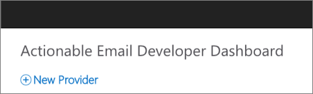

Enter the following values in the corresponding fields. Leave any additional fields set to their default values:

- **Friendly Name**: Adaptive Card Responder
- **Sender email address from which actionable emails will originate**: *enter the email address you'll use to test. For example, our test will use **meganb@M365x285179.onmicrosoft.com***.
- **Target URLs**: https://{{REPLACE-WITH-YOUR-SUBDOMAIN)}.ngrok.io/api/card
- **Scope of submission**: Test Users
  - **Test user email addresses**: *enter the email address you'll use to test. For example, our test will use **meganb@M365x285179.onmicrosoft.com***.

Select the **I accept the terms and conditions of the App Developer Agreement** and select the **Save** button.

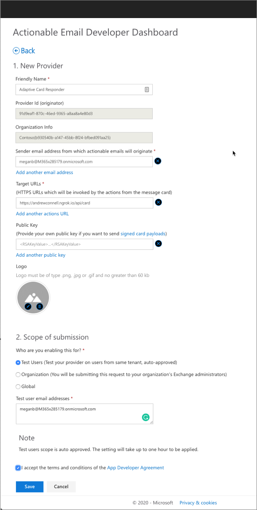

## Test the complete process

At this point, you're ready to test the complete process. There are four parts to the test:

1. Update the .NET Core console app to use the dynamic ngrok URL
1. Execute the .NET Core console app to send an email containing the Adaptive Card to the recipient
1. Start the Node.js API service project
1. Submit the form in the rendered Adaptive Card in Outlook

### Update the .NET Core console app to use the dynamic ngrok URL

Locate and open the file **adaptive-card.json** in the .NET Core console app project. Locate the string `https://{{REPLACE-WITH-YOUR-SUBDOMAIN)}.ngrok.io/api/card` and set it to the ngrok URL obtained in a previous step.

Save your changes.

### Execute the .NET Core console app to send the email with the Adaptive Card to the recipient

Rerun the project by executing the following commands:

```console
dotnet build
dotnet run
```

Enter the username and password of your test user.

### Start the Node.js API service project

Verify the ngrok process is still running from the previous time you started it. If it isn't running, you can start it by running either of the following two commands from the root of the Node.js API project:

```console
ngrok http 3007
# or
npm run start-ngrok
```

> [!IMPORTANT]
> If you started the ngrok service at this point, you'll need to update the different places where the dynamic subdomain is used throughout this exercise. This includes:
>
> - .NET Core console app's Adaptive Card template
> - App registration in the Actionable Email Developer Dashboard
> - Node.js project's **./.env** file
>
> If you have to start or restart ngrok and the subdomain changes, make sure you apply the subdomain changes to these areas and resend the email to the test user using the .NET Core console app.

#### Start the web server in bash

Start the Node.js web server by running the following command from the project's root folder:

```console
npm run start-server
```

This command will run the script **start** that will first build the project and then start the web server.

#### Start the web server in PowerShell

Start the Node.js web server by running the following commands from the project's root folder:

```powershell
$ENV:DEBUG="msoutlook-adaptivecards"
npm run build
node server.js
```

### Submit the form in the rendered Adaptive Card in Outlook

Now you can test the entire process.

Open a browser and navigate to the Outlook web client: https://mail.office365.com. Sign in using the **Work or School Account** that you used when you tested the console app.

You should see an email with the subject **Webinar followup feedback request**. Select it to see the rendered Adaptive Card:


Select one of the rating values and enter some comments into the field. Then select the **Submit Feedback** button. After a few seconds, you'll see Outlook refresh the email with the new refreshed Adaptive Card received from your Node.js service:

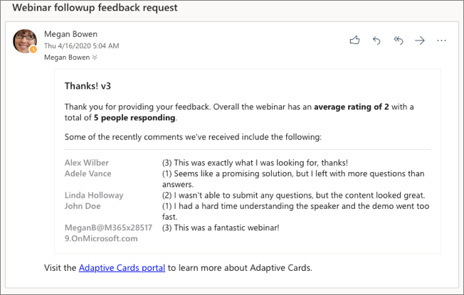

You can now stop the ngrok process and Node.js web server by pressing <kbd>CTRL</kbd>+<kbd>C</kbd> in each console.

## Summary

In this exercise, you used Adaptive Cards to implement an engaging user experience with Outlook Actionable Messages.
