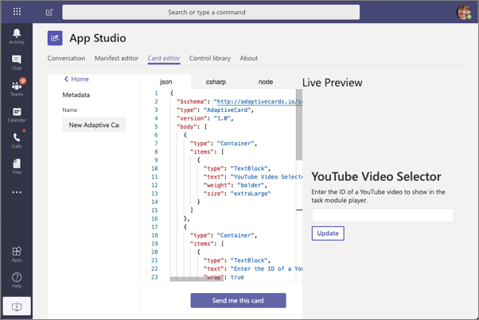
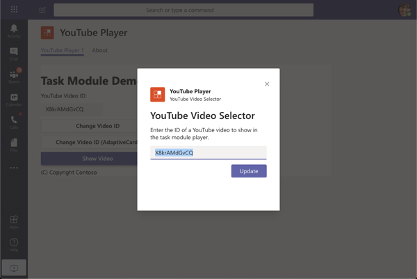

Microsoft Teams enables developers to create custom apps that include capabilities including bots, task modules, and messaging extensions. While each of these components supports text-based messaging or HTML rendering, developers can use Adaptive Cards to create experiences that when rendered, will look like the native Microsoft Teams client experience.

In this unit, you’ll learn how to use Adaptive Cards in task modules, bots, and messaging extensions in custom Microsoft Teams apps.

## Adaptive Cards in Microsoft Teams

Developers building custom apps for Microsoft Teams can use adaptive cards in various extensibility points. Some of these options include the following:

- **Task modules**: Dialogs in Microsoft Teams are implemented as task modules. A task module can be either a web page loaded within an Iframe, or an Adaptive Card.
- **Bots**: Conversational bots built using the Microsoft Bot Framework can reply to messages or sent proactive messages as a text-based message or as an Adaptive Card.
- **Messaging extensions**: Messaging extensions can pre-fill or add content to a new or existing message. This content can be in the format of a text-based message or an Adaptive Card.

### Design Adaptive Cards with App Studio

Microsoft Teams offers developers App Studio, a personal app they can install in their Microsoft Teams client.



Developers can use the **Card editor** tab in App Studio to design Adaptive Cards used in Microsoft Teams. This isn't a replacement to the Adaptive Card designer hosted on the Adaptive Card site, but rather it's another Adaptive Card authoring option.

## Use Adaptive Cards in Microsoft Teams task modules

Task modules are dialogs in Microsoft Teams. Developers can implement task modules in one of two ways:

- **IFramed web page**: A task module can point to a URL of an HTML page that is rendered in an Iframe in the task module popup window.
- **Adaptive Card**: A task module can render an Adaptive Card in the contents of the task module popup window.



Using Adaptive Cards in task modules follows nearly all the same requirements as a HTML-based task module.

One difference is how you create the task module. Task modules are invoked by passing a populated instance of the `taskInfo` object in the `microsoftTeams.tasks.startTask()` method. For an HTML-based task module, you set the address of the web page loaded in the task module in the `taskInfo.url` property.

When using an Adaptive Card, you assign the JSON of the card to the `taskInfo.card` property.

Another difference with Adaptive Cards is in the parameter of the callback method defined when invoking the task module with the `startTask()` method. The values of all input control defined in the Adaptive Card are returned in a single object, `result`, in the callback method.

## Use Adaptive Cards in Microsoft Teams conversational bots

Conversational bots in Microsoft Teams are implemented using the Microsoft Bot Framework. The bot is a web service that's registered with the Microsoft Bot Framework and has the Microsoft Teams channel enabled.

Your custom web service that sends replies and messages to Microsoft Teams can send text-based messages or messages as Adaptive Cards. The message is sent via the Bot Framework to Microsoft Teams that knows how to render each type of message.


The following code demonstrates sending a message to a newly created channel when the channel is created:

```typescript
export class MyBot extends TeamsActivityHandler {
  constructor() {
    super();

    this.onTeamsChannelCreatedEvent(async (channelInfo: ChannelInfo, teamInfo: TeamInfo, turnContext: TurnContext, next: () => Promise<void>): Promise<void> => {
      const card = CardFactory.adaptiveCard({..});
      const message = MessageFactory.attachment(card);
      await turnContext.sendActivity(message);
      await next();
    });
  }
}
```

Bots can also update messages they created. The update can replace an existing Adaptive Card, similar to how Outlook Actionable Messages can be refreshed.

The following code demonstrates how to update an existing message. The `replyToId` property on the activity that started the turn, use the `updateActivity()` method to update an existing message.

```typescript
export class ConvoBot extends TeamsActivityHandler {
  private async updateCardActivity(context): Promise<void> {
    const data = context.activity.value;
    data.count += 1;
    const card = CardFactory.adaptiveCard({..});
    await context.updateActivity({
      attachments: [card], id: context.activity.replyToId, type: 'message' }
    );
  } }
```

## Use Adaptive Cards in Messaging Extensions

Messaging extensions in Microsoft Teams enable developers to pre-fill or update a message by searching for content in an external system (*search commands*) or do an action (*action commands*).

Adaptive Cards can be used in both types of messaging extension command types.

Search commands are used from the compose box at the bottom of the Microsoft Teams client. Either through an @mention, or by selecting the extension's icon, the user can search an external system. The search results are returned as Adaptive Cards:


### Respond to search command queries

When your search action is invoked, the Bot Framework will send an `Activity` object to your web service of type `composeExtension/query` with the command ID that you need to respond to with an object containing a `composeExtension` object within five seconds of receiving the request.

The method `handleTeamsMessagingExtensionQuery()` is called by the Bot Framework SDK when a message of type `composeExtension/query` is received.

The `attachmentLayout` property can be either a `list` of results containing thumbnails, titles and text fields, or a `grid` of thumbnail images.

The `attachments` property is used when `type` is set to `result` and contains an array of supported cards.

```typescript
export class PlanetBot extends TeamsActivityHandler {
  protected handleTeamsMessagingExtensionQuery(context, query):                                                           Promise<MessagingExtensionResponse> {
    // get the search query
    let searchQuery = query.parameters[0].value.trim().toLowerCase();
    // execute search logic
    let queryResults: string[] = ...;
    // get results as cards
    let cards: MessagingExtensionAttachment[] = [];
    queryResults.forEach((planet) => {
      cards.push(this.getPlanetResultCard(planet));
    });
    let response: MessagingExtensionResponse = <MessagingExtensionResponse>{
      composeExtension: { type: "result", attachmentLayout: "list", attachments: cards } };
    return Promise.resolve(response);
  } }
```

## Summary

In this unit, you learned how to use Adaptive Cards in task modules, bots, and messaging extensions in custom Microsoft Teams apps.
