In this exercise, you'll use Adaptive Cards to implement custom task modules in Microsoft Teams. Task modules are used as dialogs in Microsoft Teams to display or collect information from users.

One is a standard HTML page that accepts the ID of a video on YouTube. When the task module is invoked, it will display the video using the YouTube embedded player in an HTML page. This task module will get the video ID from the query string, but it won't need to return any information back to the tab.

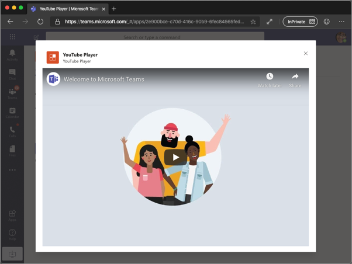

The other task module is implemented with an Adaptive Card. This task module enables the user to specify the ID of the YouTube video to display. Once changed, when the user saves their changes, it will use the callback to close submit the new ID back to the tab.

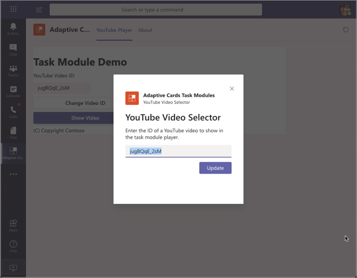

## Prerequisites

Developing Microsoft Teams apps requires an Office 365 tenant, Microsoft Teams configured for development, and the necessary tools installed on your workstation.

For the Office 365 tenant, follow the instructions on [Microsoft Teams: Prepare your Office 365 tenant](/microsoftteams/platform/get-started/get-started-tenant) for obtaining a developer tenant if you don't currently have an Office 365 account. Make sure you've also enabled Microsoft Teams for your organization.

Microsoft Teams must be configured to enable custom apps and allow custom apps to be uploaded to your tenant to build custom apps for Microsoft Teams. Follow the instructions on the same **Prepare your Office 365 tenant** page mentioned above.

You'll use Node.js to create custom Microsoft Teams tabs in this module. The exercises in this module assume you've the following tools installed on your developer workstation.

> [!IMPORTANT]
> In most cases, installing the latest version of the following tools is the best option. The versions listed here were used when this module was published and last tested.

- [Node.js](https://nodejs.org/) - v10.\* (or higher)
- NPM (installed with Node.js) - v6.\* (or higher)
- [Gulp](https://gulpjs.com/) - v4.\* (or higher)
- [Yeoman](https://yeoman.io/) - v3.\* (or higher)
- [Yeoman Generator for Microsoft Teams](https://github.com/OfficeDev/generator-teams) - v3.2.0 (or higher)
- [Visual Studio Code](https://code.visualstudio.com)

You must have the minimum versions of these prerequisites installed on your workstation.

## Create Microsoft Teams app

Open your command prompt, navigate to a directory where you want to save your work, create a new folder **learn-msteams-taskmodules**, and change directory into that folder.

Run the Yeoman Generator for Microsoft Teams by running the following command:

```console
yo teams
```

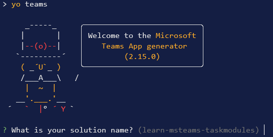

Yeoman will launch and ask you a series of questions. Answer the questions with the following values:

- **What is your solution name?**: YouTubePlayer
- **Where do you want to place the files?**: Use the current folder
- **Title of your Microsoft Teams App project?**: Adaptive Cards Task Modules
- **Your (company) name? (max 32 characters)**: Contoso
- **Which manifest version would you like to use?**: v1.10
- **Quick scaffolding**: Yes
- **What features do you want to add to your project?**: A Tab
- **The URL where you will host this solution?**: (Accept the default option)
- **Would you like to show a loading indicator when your app/tab loads?** No
- **Default Tab name? (max 16 characters)**: YouTube Player 
- **What kind of Tab would you like to create?**: Personal (static)
- **Do you require Azure AD Single-Sign-On support for the tab?** No

> [!NOTE]
> Most of the answers to these questions can be changed after creating the project. For example, the URL where the project will be hosted isn't important at the time of creating or testing the project.

After answering the generator's questions, the generator will create the scaffolding for the project and then execute `npm install` that downloads all the dependencies required by the project.

### Ensure the project is using the latest version of Teams SDK

Run the npm command to install the latest version of the SDK

```console
npm i @microsoft/teams-js
```

### Test the personal tab

Before customizing the tab, let's test the tab to see the initial developer experience for testing.

From the command line, navigate to the root folder for the project and execute the following command:

```console
gulp ngrok-serve
```

This gulp task will run many other tasks all displayed within the command-line console. The **ngrok-serve** task builds your project and starts a local web server (http://localhost:3007). It then starts ngrok with a random subdomain that creates a secure URL to your local webserver.

> [!NOTE]
> Microsoft Teams requires all content displayed within a tab be loaded from an HTTPS request. In development, can be done using the tool [ngrok](https://www.ngrok.com) that creates a secure rotatable URL to your local HTTP webserver. Ngrok is included as a dependency within the project so there is nothing to setup or configure.

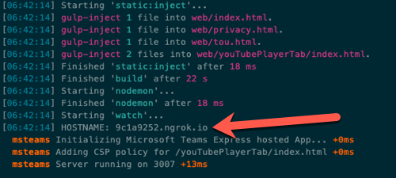

Open a browser and navigate to the ngrok URL displayed in the console:

> [!IMPORTANT]
> The first part of the URL displayed in the console will change each time Ngrok is started. The address shown in the previous and following screenshots will be different when you run it.

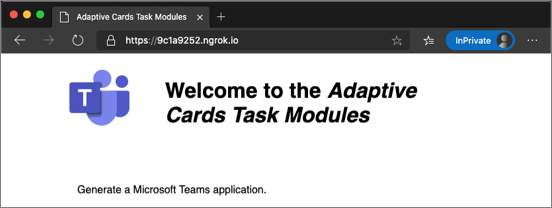

Update the URL in the browser to load the tab created by the scaffolding process. Here you can see the page can determine that it isn't running within the Microsoft Teams client.

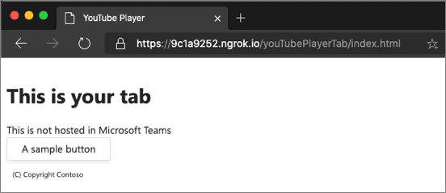

Now let's load the tab in Microsoft Teams. In the browser, navigate to **https://teams.microsoft.com** and sign in with the credentials of a Work and School account.

> [!NOTE]
> Microsoft Teams is available for use as a web client, desktop client and a mobile client. In this module, we will use the web client but any of the clients can be used.

Using the app bar navigation menu, select the **More added apps** button. Then select **More apps**.

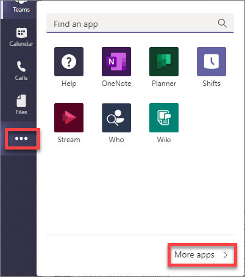

On the **Apps** page, select **Upload a custom app** > **Upload for me or my teams**.

In the file dialog that appears, select the Microsoft Teams package in your project. This app package is a ZIP file that can be found in the project's **./package** folder.

> [!NOTE]
> If the **./package** folder is not present, this means you are affected by a bug in the yoteams-deploy package. To resolve the issue:
> - Stop the local web server by pressing <kbd>CTRL</kbd>+<kbd>C</kbd> in the console.
> - Install the preview version of the **yoteams-deploy** package using the command `npm install yoteams-deploy@preview`
> - Restart the server process: `gulp ngrok-serve`

Once the package is uploaded, Microsoft Teams will display a summary of the app. Here you can see some "todo" items to address. *None of these "todo" items are important to this exercise, so you'll leave them as is.*

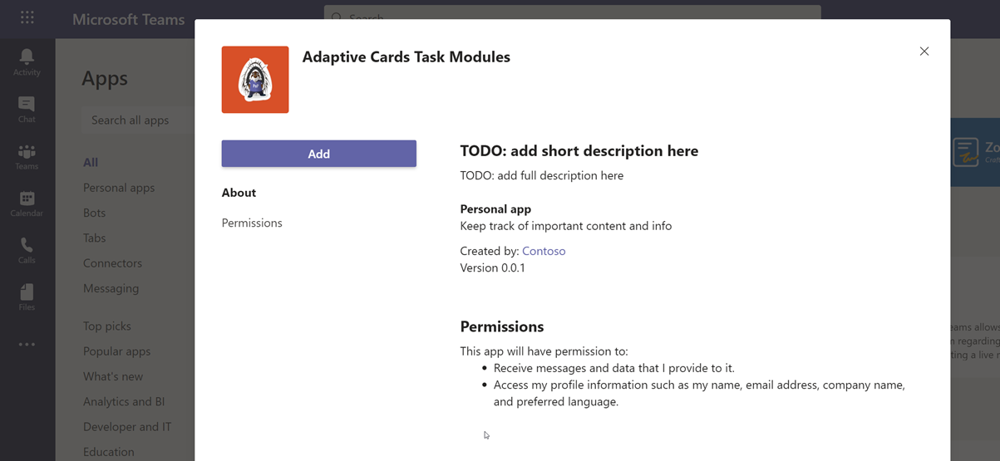

Select the **Add** button to install the app, adding a new personal tab to your **More added apps** dialog:

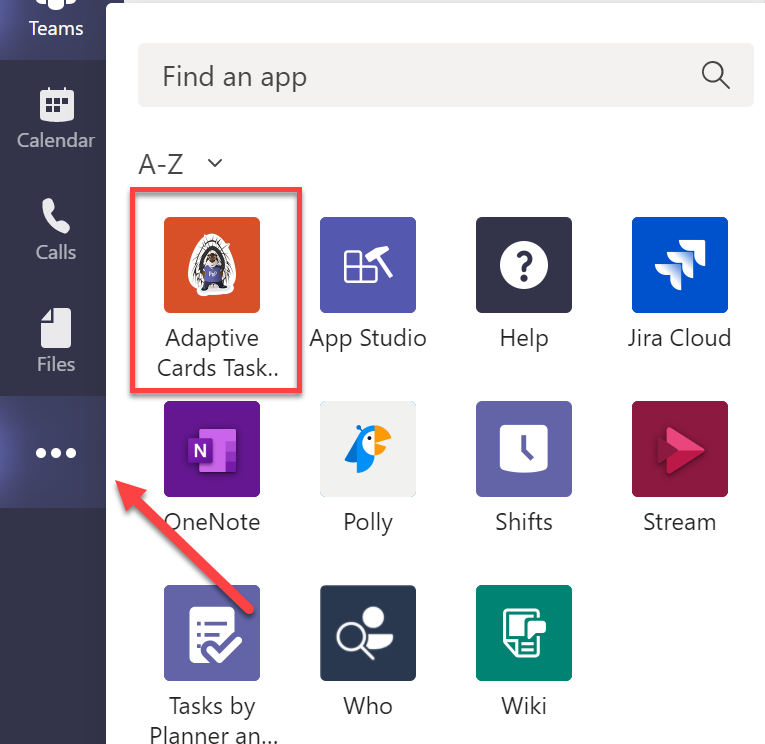

Select the app to navigate to the new tab:

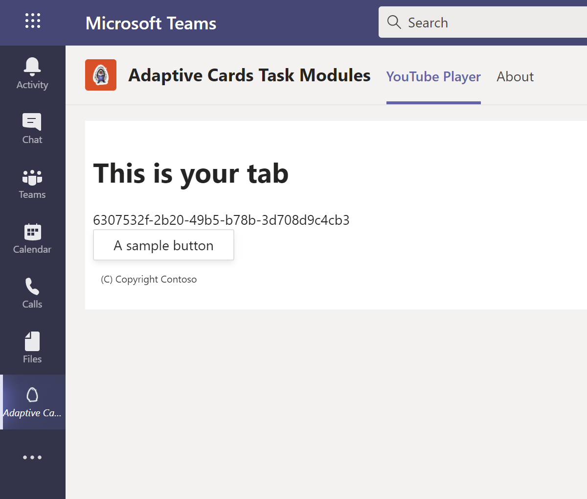

Notice that when the content page is loaded in a tab within the Microsoft Teams client, it's displaying the value of the `entityId` property of the tab, not the message "This isn't hosted in Microsoft Teams" as you saw when viewing the content page in the browser. The tab can detect if it's loaded within the Microsoft Teams client using the Microsoft Teams JavaScript SDK.

The next step is to make some changes to the project.

Next, stop the local web server by pressing <kbd>CTRL</kbd>+<kbd>C</kbd> in the console to stop the running process.

### Implement the personal tab's user interface

Now you can implement the user interface for the tab. The simple tab will have a basic interface.

Locate and open the file that contains the React component used in the project: **./src/client/youTubePlayerTab/YouTubePlayerTab.tsx**.

Update the import statements in this file to add components from the Fluent UI - React library. Find the following import statement at the top of the file that imports components from the Fluent UI - React library:

```typescript
import { Provider, Flex, Text, Button, Header } from "@fluentui/react-northstar";
```

Replace the previous statement with the following import statement:

```typescript
import { Provider, Flex, Text, Button, Header, Input } from "@fluentui/react-northstar";
```

Update the state of the component to contain a video ID. Add the following statement after the existing `useState` statements in the `YouTubePlayerTab` function:

```typescript
const [youTubeVideoId, setYouTubeVideoId] = useState<string | undefined>("jugBQqE_2sM");
```

Add the following methods to the `YouTubePlayerTab` component. These methods will handle updating the state when specific events happen on the form you'll add to the component:

```typescript
const onChangeVideo = (): void => { 
};

const onShowVideo = ():  void => {
};
```

Locate the `return` statement and update to the following code. The component will now display the state with a brief copyright statement:

```tsx
return (
  <Provider theme={theme}>
    <Flex fill={true} column styles={{
      padding: ".8rem 0 .8rem .5rem"
    }}>
      <Flex.Item>
        <Header>Task Module Demo</Header>
      </Flex.Item>
      <Flex.Item>
        <div>
          <div>
            <Text>YouTube Video ID:</Text>
            <Input value={youTubeVideoId} disabled></Input>
          </div>
          <div>
            <Button content="Change Video ID" onClick={onChangeVideo}></Button>
            <Button content="Show Video" primary onClick={onShowVideo}></Button>
          </div>
        </div>
      </Flex.Item>
      <Flex.Item styles={{
        padding: ".8rem 0 .8rem .5rem"
      }}>
        <Text content="(C) Copyright Contoso" size="smaller"></Text>
      </Flex.Item>
    </Flex>
  </Provider>
);
```

### Test the personal tab

At this point, our Microsoft Teams app, implemented as a custom person tab is set up and working. Verify this by starting ngrok again and refreshing the Microsoft Teams interface.

From the command line, navigate to the root folder for the project and execute the following command:

```console
gulp ngrok-serve
```

The ngrok subdomain will change when the ngrok process is restarted. Re-add the app to Teams, following the same steps as before:
- Using the app bar navigation menu, select the **More added apps** button. Then select **More apps**.
- On the **Apps** page, select **Upload a custom app** > **Upload for me or my teams**. In the file dialog that appears, select the Microsoft Teams package in your project. (This app package is a ZIP file that can be found in the project's **./package** folder.)
- Once the package is uploaded, Microsoft Teams will display a summary of the app. Select the **Add** button to install the app, adding a new personal tab to your **More added apps** dialog.
- Select the app to navigate to the new tab.

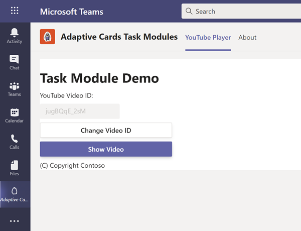

Now you can update the project and add task modules to the custom Microsoft Teams app.

## Add video player task module

A task module can be a web page implemented with HTML and JavaScript. Create the video player task module by creating a new file, **player.html** in the **./src/public/youTubePlayerTab** folder in your project.

Add the following HTML to the **player.html** file:

```html
<!DOCTYPE html>
<html lang="en">

<head>
  <title>YouTube Player Task Module</title>
  <style>
    #embed-container iframe {
      position: absolute;
      top: 0;
      left: 0;
      width: 95%;
      height: 95%;
      padding-left: 20px;
      padding-right: 20px;
      padding-top: 10px;
      padding-bottom: 10px;
      border-style: none;
    }
  </style>
</head>

<body>
  <div id="embed-container"></div>
</body>

</html>
```

The video player task module will use the YouTube embedded player to show the specified video. The video will be defined in the query string when the **player.html** file is loaded.

Implement the `<iframe>` embedded video player by adding the following JavaScript before the closing `</body>` tag in the **player.html** file:

```html
<script>
  function getUrlParameter(name) {
    name = name.replace(/[\[]/, '\\[').replace(/[\]]/, '\\]');
    var regex = new RegExp('[\\?&]' + name + '=([^&#]*)');
    var results = regex.exec(location.search);
    return results === null ? '' : decodeURIComponent(results[1].replace(/\+/g, ' '));
  };

  var element = document.createElement("iframe");
  element.src = "https://www.youtube.com/embed/" + getUrlParameter("vid");
  element.width = "1000";
  element.height = "700";
  element.frameborder = "0";
  element.allow = "autoplay; encrypted-media";
  element.allowfullscreen = "";

  document.getElementById("embed-container").appendChild(element);
</script>
```

Now, implement the task module in the personal tab.

Locate and open the **./src/client/youTubePlayerTab/YouTubePlayerTab.tsx** file.

First, add the following utility method to the `YouTubePlayerTab` component:

```typescript
const appRoot = (): string => {
  if (typeof window === "undefined") {
    return "https://{{HOSTNAME}}";
  } else {
    return window.location.protocol + "//" + window.location.host;
  }
}
```

Next, add the following code to the `onShowVideo` method:

```typescript
const onShowVideo = (): void => {
  const taskModuleInfo = {
    title: "YouTube Player",
    url: appRoot() + `/youTubePlayerTab/player.html?vid=${youTubeVideoId}`,
    width: 1000,
    height: 700
  };
  microsoftTeams.tasks.startTask(taskModuleInfo);
};
```

This code will create a new `taskInfo` object with the details of the task module. It will then launch the task module. This task module does nothing but display information, so we don't need to implement the callback.

### Test the video player task module

From the command line, navigate to the root folder for the project and execute the following command:

```console
gulp ngrok-serve
```

Re-add the app as above. Select the **Show video** button. Microsoft Teams will load the video player task module with the specified video loaded in the embedded player:


Stop the local web server by pressing <kbd>CTRL</kbd>+<kbd>C</kbd> in the console to stop the running process.

## Add a task module rendered using an Adaptive Card

Create a new JSON file, **YouTubeSelectorCard.json**, in the following folder in the existing project **./src/client/youTubePlayerTab/**. Add the following JSON to it. This JSON defines the Adaptive Card used to collect the ID the YouTube video to display:

```json
{
  "$schema": "http://adaptivecards.io/schemas/adaptive-card.json",
  "type": "AdaptiveCard",
  "version": "1.0",
  "body": [
    {
      "type": "Container",
      "items": [
        {
          "type": "TextBlock",
          "text": "YouTube Video Selector",
          "weight": "bolder",
          "size": "extraLarge"
        }
      ]
    },
    {
      "type": "Container",
      "items": [
        {
          "type": "TextBlock",
          "text": "Enter the ID of a YouTube video to show in the task module player.",
          "wrap": true
        },
        {
          "type": "Input.Text",
          "id": "youTubeVideoId",
          "value": ""
        }
      ]
    }
  ],
  "actions": [
    {
      "type": "Action.Submit",
      "title": "Update"
    }
  ]
}
```

### Create a new task module that uses the Adaptive Card

After creating the Adaptive Card, the next step is to create a task module that will display it and handle the submission action.

Within the existing Microsoft Teams app project, locate the file **./src/client/youTubePlayerTab/YouTubePlayerTab.tsx** that contains the custom personal tab.

Update the existing `onChangeVideo` handler in `YouTubePlayerTab` class to contain the following code:

```typescript
const onChangeVideo = (): void => {
  const taskModuleInfo = {
    title: "YouTube Video Selector",
    width: 350,
    height: 250
  };

  const submitHandler = (err: string, result: any): void => {
  };

  microsoftTeams.tasks.startTask(taskModuleInfo, submitHandler);
};
```

The first step is to load the Adaptive Card and set the value of the video ID to display when it loads. Do this by adding the following code to the top of the `onChangeVideo()` method:

```typescript
// load adaptive card
const adaptiveCard: any = require("./YouTubeSelectorCard.json");
// update card with current video ID
adaptiveCard.body.forEach((container: any) => {
  if (container.type === "Container") {
    container.items.forEach((item: any) => {
      if (item.id && item.id === "youTubeVideoId") {
        item.value = youTubeVideoId;
      }
    });
  }
});
```

Next, implement the callback. When the Adaptive Card executes the submit action, it will send an object back with all the input objects as properties. Add the following code to the existing `submitHandler()` in the `onChangeVideo()` function. This code will update the state with the value of the video ID specified in the Adaptive Card:

```typescript
const submitHandler = (err: string, result: any): void => {
  if (err) {
    console.log(err);
  }
  setYouTubeVideoId(result.youTubeVideoId);
};
```

Lastly, add a new `card` property to the `taskModuleInfo` object, and set its value to the adaptive card. The resulting `taskModuleInfo` should look like the following code:

```typescript
const taskModuleInfo = {
  title: "YouTube Video Selector",
  card: adaptiveCard,
  width: 350,
  height: 250
};
```

### Test the Adaptive Card task module

From the command line, navigate to the root folder for the project and execute the following command:

```console
gulp ngrok-serve
```

Refresh the Microsoft Teams interface and select the button **Change Video ID**. Microsoft Teams will open a task module with the rendered Adaptive Card:


Replace the video ID in the input box and select **Update**. Notice the video ID displayed in the tab is updated to reflect this new value.

## Summary

In this exercise, you used Adaptive Cards to implement custom task modules in Microsoft Teams.
