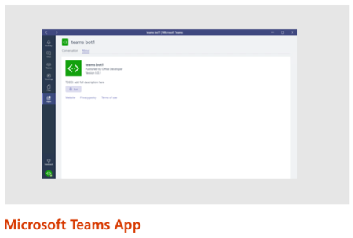
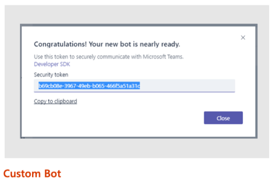
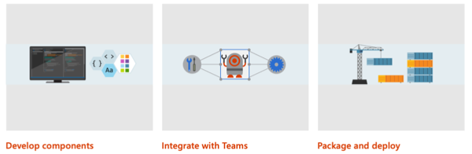
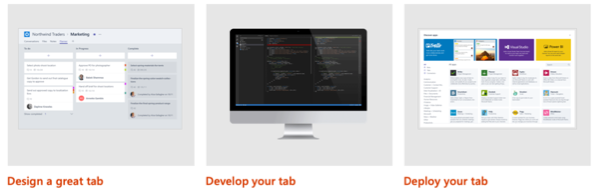
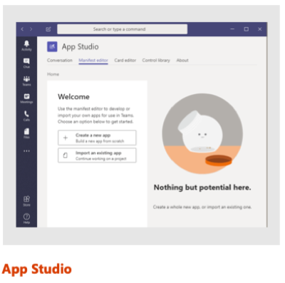
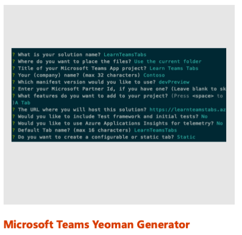
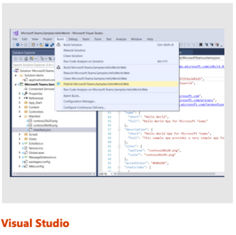

> [!VIDEO https://www.microsoft.com/videoplayer/embed/RE4NHyj]

In this unit, you'll learn how to create tabs in Microsoft Teams apps.

## Microsoft Teams extensibility options

Microsoft Teams enables developers to create custom experiences for users. For the best and most extensible option for adding your service into Teams, create a Microsoft Teams app.



A Microsoft Teams app is a package of services that you host. The services can be distributed through the Microsoft Teams product or uploaded by owners. These apps can consist of custom tabs, bots, messaging extensions, or web hooks and connectors.



For quick one-off integration of your existing web hook, you can take advantage of the custom bot feature. You can use this ad-hoc extensibility option to set up web hooks or notifications in a specific team, with no additional coding required.

### What is a Microsoft Teams app?

You can use apps in Microsoft Teams to make your service available to users in the contexts, or "scopes," that make the most sense.

You declare precisely which capabilities you support, in which scopes, via your app package's manifest file. Microsoft Teams app capabilities, such as bots and tabs, are available in most scopes. These capabilities are offered via a single Microsoft Teams app package that users can acquire through the Microsoft Teams in-product app gallery or the Microsoft Store. They also can be uploaded directly by your organization.

### How to create a Microsoft Teams app

How do you create a custom Microsoft Teams app?



First, you develop the components that support your Microsoft Teams app. Microsoft Teams apps are web applications that can be created by using HTML, TypeScript, or JavaScript, client-side web frameworks such as React, or any server-side framework such as .NET.

Microsoft Teams apps can be stand-alone, or they can integrate with Microsoft Teams. Microsoft provides a JavaScript SDK for interactivity with the Microsoft Teams client and the Bot Framework SDK for building bots.

After you're finished creating the application, the final step is to package and deploy the application. Every Microsoft Teams app contains a manifest file that describes all aspects of your app. The manifest includes the URLs and unique identifiers for the components that you created to implement the application. After you create the manifest, create a package that includes the manifest and associated images used by the app. This package is a zip file. Before uploading and publishing the package, you need to deploy all resources that implement the app. These resources include webpages and services used within tabs, bots, and web hooks.

## Microsoft Teams tabs

This module focuses on creating custom tabs for Microsoft Teams.

### What is a Microsoft Teams tab?

By using a Microsoft Teams tab, you can display rich interactive web content within Microsoft Teams clients. There are two approaches to creating a custom tab. You can take an existing web-app experience and adapt it to a custom tab. You also can build a custom tab from scratch.

Microsoft Teams tabs are web applications that are hosted by the provider or developer of the application. A tab in Microsoft Teams displays the specified web app within an `<iframe>` in the Microsoft Teams client.

### Tabs differ from web applications when you browse the same content

While Microsoft Teams tabs are `<iframes>` that display webpages, there are some differences between interacting with the web app within the Microsoft Teams client compared to browsing the same content.

Microsoft Teams tabs always display web content in an `<iframe>` where a webpage is loaded in any browser. In this way, you can create unique experiences with the web app for only Microsoft Teams by limiting where the application is hosted. For instance, you can limit a webpage to be displayed within an `<iframe>` only from a specific domain such as `teams.microsoft.com`.

Authentication is handled differently in a Microsoft Teams tab compared to a web app, either via a pop-up window or by calling Azure Active Directory (Azure AD) to fetch tokens. Most websites redirect to a sign-in provider that typically breaks custom tabs that are hosted inside an `<iframe>`. Tabs break in this experience because the sign-in pages typically don't load within an `<iframe>` to prevent click-jacking.

Cross-domain navigation is handled differently in tabs from a web app. The Teams client needs to validate the origin against a static `validDomains` list in the app manifest when it loads or communicates with the tab.

Microsoft Teams tabs can be styled to match the current Microsoft Teams client's theme, such as default, dark or high contrast.

Developers of Microsoft Teams tabs also can communicate with the hosting Microsoft Teams client by using the JavaScript SDK (`microsoftTeams.initialize()`). The SDK gives Teams a communication channel with the hosted page and more visibility into its operations.

### Tab scope: Where can a tab exist in Microsoft Teams?

Teams determines where a tab can be used based on its scope. Scope is set in the app manifest and can be one of three values:


- **Team scope**: Tabs in channels can be used by teams to interact with your shared experience. These tabs are referred to as channel tabs and were previously known as configurable tabs. When these tabs are added to a team, a user configures the content of your tab experience when the tab is first added to a channel.

- **Group chat**: Channel tabs also can be used in group chats. These are conversations between two or more users.

- **Personal scope**: By using personal tabs, users can interact with your experience privately. The content in a personal tab is only relevant to individual users.

## Develop custom Microsoft Teams tabs

> [!VIDEO https://www.microsoft.com/videoplayer/embed/RE4NzEu]

This section addresses the process of creating custom tabs for Microsoft Teams.

### Overview of how to build a Microsoft Teams tab

Let's look at what's involved in building a Microsoft Teams tab.



Microsoft design guidelines for creating custom tabs include the following points:

#### Focus on functionality

Tabs work best when they're built to address a specific need. Focus on a small set of tasks or a subset of data that's relevant to the channel the tab is in.

#### Reduced chrome

Avoid creating multiple panels in a tab, adding layers of navigation, or requiring users to scroll both vertically and horizontally in one tab. In other words, try not to have tabs in your tab.

#### Integration

Find ways to notify users about tab activity. For example, post a message card to a conversation about tab activity.

#### Conversational

Find a way to implement conversation around a tab to ensure that conversations center on the content, data, or process at hand.

#### Streamlined access

Make sure that you grant access to the right people at the right time. Keep your sign-in process simple to avoid barriers to contribution and collaboration.

After you've designed a Microsoft Teams tab, the next step is to develop it. Tabs are web apps hosted in an `<iframe>` within the Microsoft Teams client. You're free to use any web technologies and frameworks you're most comfortable with to implement the custom tab experience, such as HTML, JavaScript, TypeScript, web frameworks such as React or Angular, and server-side technologies.

The last step is to deploy the custom tab. Unlike other Microsoft Teams extensibility options, such as bots and message extensions, you can upload custom tabs directly to a team. Microsoft Teams apps can also be uploaded to your tenant's app gallery for other users to install in their teams.

### Custom Microsoft Teams tabs: Key points

When you create a Microsoft Teams tab, keep in mind the following key points:

- A Microsoft Teams tab is a webpage hosted by the tab provider or developer. No data related to the tab is stored in Microsoft Teams. The developer of the tab is responsible for all aspects of the tab, which includes data storage, configuration settings, and authentication. Microsoft Teams saves only minimal configuration details on the tab, such as the URLs for the content and website of the tab and the name and IDs of the tab.

- When you build your tab, you might want to implement the user experience more like an application and less like a webpage. Many websites implement the traditional page-to-page and postback style of submitting and presenting information. The users of your tabs interact with your application from the Microsoft Teams client. They might use a desktop, mobile, or web experience, but all enable a rich client experience. Using web frameworks, such as React, Angular, and Vue.js, you can implement a rich client experience without continuously reloading the page.

### Developer tooling options

Microsoft provides you with multiple tools to create custom Microsoft Teams apps, which includes custom tabs.

With App Studio, you can create or integrate your own Microsoft Teams apps, whether you develop custom apps for your enterprise or SaaS applications for teams around the world by streamlining the creation of the manifest and package for your app and providing useful tools like the Card Editor and a React control library. App Studio is a Teams app that's available in the Teams store. App Studio helps developers preview the rendering of cards and visually edit the manifest file for a Teams app.



You have two options to create the project and resources necessary to implement Microsoft Teams tabs: Node.js or .NET.



To create a Node.js-based project, use the Microsoft Teams Yeoman Generator. After you answer multiple questions related to the project you want to create, the generator creates the scaffolding for your project. This option requires Git, Node.js, NPM, and a text editor such as Visual Studio Code.



To create a .NET-based project, use tooling provided in Visual Studio 2017 or later. Similar to the Node.js option, after you select the project type and answer multiple questions, Visual Studio generates the scaffolding for your project. This option requires only Git and Visual Studio.

### Get context within Teams tabs

Your Microsoft Teams tab might require contextual information to display relevant content. Or it might need basic information about the user, team, or company. The tab also might need locale and theme information. Or it might need to read `entityId` or `subEntityId` to identify what's in this tab for additional context.

Microsoft Teams offers two ways to obtain context on the current user or from within Microsoft Teams. When Microsoft Teams loads the content page for a tab, it can include placeholder values on the URL that the web application can use to obtain context. After the web app is loaded within Microsoft Teams, it can use the Microsoft Teams JavaScript SDK.

### Access context: URL placeholder values

Use placeholders in your configuration or content URLs. Microsoft Teams replaces the placeholders with the relevant values when it determines the actual configuration or content URL to go to. The available placeholders include all fields on the Microsoft Teams context object available within the JavaScript SDK.

Some of the values available as URL placeholders are set when the tab is configured. Other values are set when a deep link to the tab is generated. Deep links are used to implement tab-to-tab communication.

The URL placeholder values include the properties listed in the following table.

|      Properties       |                                   Description                                    |
| --------------------- | -------------------------------------------------------------------------------- |
| `{entityId}`          | The ID you supplied on the tab's configuration page                                     |
| `{subEntityId}`       | The ID you supplied when you generate a deep link for a specific item within the tab |
| `{loginHint}`         | Value suitable as a sign-in hint for Azure AD                                        |
| `{locale}`            | Lowercase lang-locale                                                            |
| `{theme}`             | `default` / `dark` / `contrast`                                                  |
| `{userPrincipalName}` | The user identifier of the current user in the current tenant in email format    |
| `{userObjectId}`      | The Azure AD object ID of the current user in the current tenant                 |
| `{tid}`               | GUID ID of the current Azure tenant ID                                           |
| `{groupId}`           | GUID ID of the current Office 365 group ID                                       |

### Access context: Microsoft Teams JavaScript client SDK

You can also retrieve the information listed previously by using the Microsoft Teams JavaScript client SDK by calling `microsoftTeams.getContext(function(teamsContext) { … })`.

The context values include the properties listed in the following table.

| Noteworthy properties |                     Description                     |
| --------------------- | --------------------------------------------------- |
| `teamId`              | The team ID in the format `19:[id]@thread.skype`    |
| `teamName`            | Name of the current team                            |
| `channelId`           | The channel ID in the format `19:[id]@thread.skype` |
| `channelName`         | Name of the current channel                         |
| `chatId`              | The chat ID in the format  `19:[id]@thread.skype`   |
| `locale`              | Lowercase lang-locale                               |
| `theme`               | `default` / `dark` / `contrast`                     |
| `entityId`            | The entity ID you set up on your configuration page        |
| `subEntityId`         | The sub entity ID you set up on your configuration page    |
| `userPrincipalName`   | The user identifier in email format                 |
| `tid`                 | GUID that identifies the current tenant ID              |
| `groupId`             | GUID that identifies the current Office 365 group ID    |
| `tenantSKU`           | SKU of the current tenant (for example: EDU)        |

### Personal tabs: Manifest

You can create two different types of tabs for Microsoft Teams. One type of tab is a personal tab. This type of tab was previously known as a static tab. Users can use personal tabs to interact with your experience privately. The content in a personal tab is only relevant to individual users.

A personal tab is defined within the static tabs collection of the Microsoft Teams app manifest. These are a set of tabs that can be "pinned" by default, without the user adding them manually. Personal tabs declared in personal scope are always pinned to the app's personal experience.

```json
"staticTabs":
[
  {
    "entityId": "candidatesTab",
    "name": "Candidates",
    "contentUrl": "https://.../Tabs/candidates.html",
    "websiteUrl": "https://.../Tabs/candidates.html?web=1",
    "scopes": ["personal"]
  }
],
"validDomains": [
  "token.botframework.com"
]
```

The `entityId` property is a unique identifier for the entity that the tab displays. This property is required.

The `name` property is the display name of the tab in the channel interface. This property is required.

The `contentUrl` property is the HTTPS URL that points to the entity URL to be displayed in the Microsoft Teams canvas. This property is required.

The `websiteUrl` property is the HTTPS URL used if a user opts to view a tab in the browser. This property isn't required.

The `scopes` property is an array of scopes supported. This property is required and supports only the personal scope.

If your Microsoft Teams tab loads or redirects to other URLs, those URLs must be listed in the `validDomains` collection.
