> [!VIDEO https://www.microsoft.com/videoplayer/embed/RE4NCi6]

In this exercise, you'll create a new Microsoft Teams personal tab by using the Microsoft Teams Yeoman generator, Visual Studio Code, and App Studio.

## Prerequisites

Developing Microsoft Teams apps requires a Microsoft 365 tenant, Microsoft Teams configured for development, and the necessary tools installed on your workstation.

For the Microsoft 365 tenant, follow the instructions in [Microsoft Teams: Prepare your Microsoft 365 tenant](/microsoftteams/platform/get-started/get-started-tenant) to obtain a developer tenant if you don't currently have a Microsoft 365 account. Make sure you've also enabled Microsoft Teams for your organization.

Microsoft Teams must be configured to enable custom apps and allow custom apps to be uploaded to your tenant to build custom apps for Microsoft Teams. Follow the instructions in "Prepare your Microsoft 365 tenant" mentioned previously.

You'll use Node.js to create custom Microsoft Teams tabs in this module. The exercises in this module assume you've the following tools installed on your developer workstation.

> [!IMPORTANT]
> In most cases, installing the latest version of the following tools is the best option. The versions listed here were used when this module was published and last tested.

- [Node.js](https://nodejs.org/) - (*the active [LTS](https://nodejs.org/about/releases) version*)
- npm (*installed with Node.js*)
- [Gulp-cli](https://www.npmjs.com/package/gulp-cli) - v2.3.\*
- [Yeoman](https://yeoman.io/) - v4.3.\*
- [Yeoman Generator for Microsoft Teams](https://github.com/pnp/generator-teams) - v4.0.1
- [Visual Studio Code](https://code.visualstudio.com)

*You must have the minimum versions of these prerequisites installed on your workstation.

## Create Microsoft Teams app

Open your command prompt, and go to a directory where you want to save your work. Create a new folder named **learn-msteams-tabs**, and change the directory into that folder.

Run the Yeoman generator for Microsoft Teams by running the following command:

```console
yo teams
```

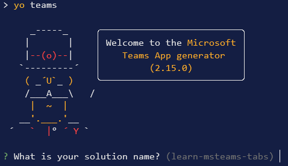

Yeoman starts and asks you a series of questions. Answer the questions with the following values:

- **What is your solution name?**: Learn MSTeams Tabs
- **Where do you want to place the files?**: Use the current folder
- **Title of your Microsoft Teams App project**: Learn MSTeams Tabs
- **Your (company) name (max 32 characters)**: Contoso
- **Which manifest version would you like to use?**: v1.13
- **Quick scaffolding**: Yes
- **What features do you want to add to your project?**: A tab
- **The URL where you will host this solution?**: (Accept the default option)
- **Would you like to show a loading indicator when your app/tab loads?** No
- **Default Tab name (max 16 characters)**: LearnPersonalTab
- **What kind of Tab would you like to create?**: Personal (for Teams, Outlook and Office)
- **Do you require Azure AD Single-Sign-On support for the tab?** No

> [!NOTE]
> Most of the answers to these questions can be changed after you create the project. For example, the URL where the project will be hosted isn't important at the time of creating or testing the project.

After you answer the generator's questions, the generator creates the scaffolding for the project. The generator then runs `npm install` that downloads all the dependencies required by the project.

### Ensure the project is using the latest version of Teams SDK

Run the npm command to install the latest version of the SDK

```console
npm i @microsoft/teams-js
```

## Test the personal tab

Before you customize the tab, let's test the tab to see the initial developer experience for testing.

From the command line, go to the root folder for the project and run the following command:

```console
gulp ngrok-serve --debug
```

This gulp task runs many other tasks all displayed within the command-line console. The ngrok-serve task builds your project and starts a local web server (http://localhost:3007). It then starts ngrok with a random subdomain that creates a secure URL to your local web server.

> [!NOTE]
> Microsoft Teams requires all content displayed within a tab to be loaded from an HTTPS request. In development, this can be done by using the tool [ngrok](https://www.ngrok.com) that creates a secure rotatable URL to your local HTTP web server. Ngrok is included as a dependency within the project, so there's nothing to set up or configure.

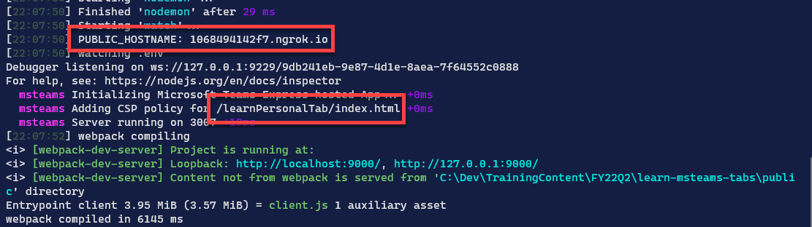

Open a browser, and go to the ngrok URL displayed in the console.


Update the URL in the browser to load the tab created by the scaffolding process. Here you can see the page can determine that it isn't running within the Microsoft Teams client.

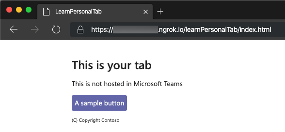

Now let's load the tab in Microsoft Teams. In the browser, go to [Microsoft Teams](https://teams.microsoft.com). Sign in with the credentials of a Work and School account.

> [!NOTE]
> Microsoft Teams is available for use as a web client, a desktop client, and a mobile client. In this module, we use the web client, but any of the clients can be used.

In the app bar on the left, select the **More added apps** button. Then select **More apps**.


On the **Apps** page, select **Manage your apps** > **Publish an app** > **Upload a custom app**.

> [!NOTE]
> If Developer Preview is turned on for Teams, the button is labelled **Upload an app** instead of **Publish an app**.

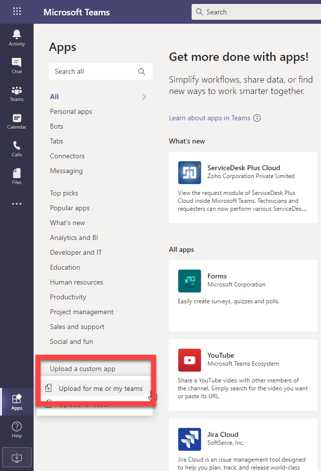

In the file dialog box that appears, select the Microsoft Teams package in your project. This app package is a zip file in the project's **./package** folder.


After the package is uploaded, select it to display a summary of the app. Here you can see some todo items to address. You'll update the todo items later in the exercise.

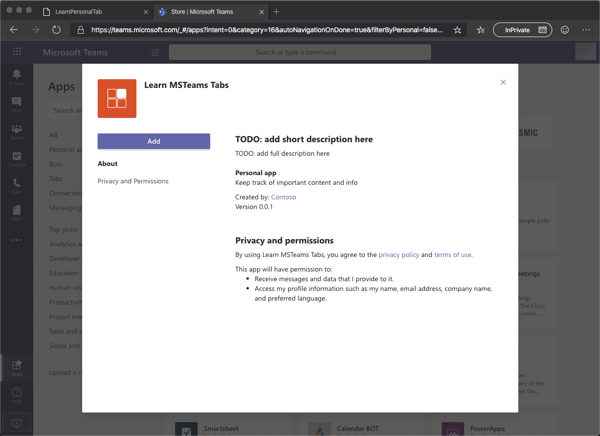

Select the **Add** button to install the app, which adds a new personal tab to your **More added apps** dialog box.

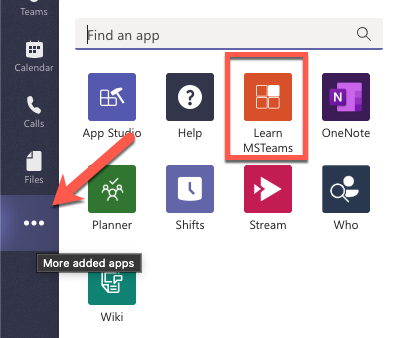

Select the app to go to the new tab.

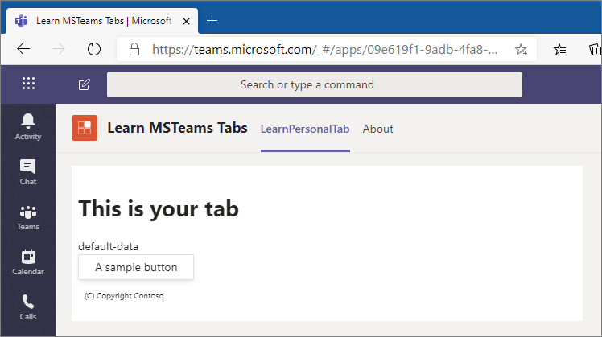

Notice that when the content page is loaded in a tab within the Microsoft Teams client, it displays the `entityId` property of the tab, not the message "This isn't hosted in Microsoft Teams" as you saw when you viewed the content page in the browser. The tab can detect if it's loaded within the Microsoft Teams client by using the Microsoft Teams JavaScript SDK.

The next step is to make some changes to the project.

Uninstall the app by right-clicking the app in the **More added apps** dialog box and select **Uninstall**. Then select **Uninstall** in the confirmation dialog box that appears.

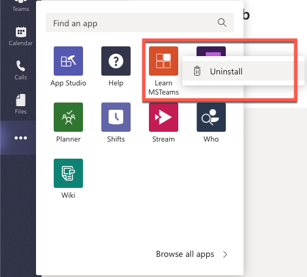

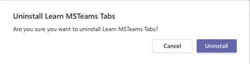

Next, stop the local web server by selecting <kbd>Ctrl</kbd>+<kbd>C</kbd> in the console to stop the running process.

## Implement the personal tab's user interface

> [!VIDEO https://www.microsoft.com/videoplayer/embed/RE4NHyn]

Now you can implement the user interface for the tab. The simple tab has a basic interface. It presents a list of items, and users can add items to the list.

Locate and open the file that contains the React component used in the project: **./src/client/learnPersonalTab/LearnPersonalTab.tsx**.

Update the `import` statements in this file to add components from the Fluent UI - React library. Find the following `import` statement at the top of the file that imports components from the Fluent UI - React library:

```typescript
import { Provider, Flex, Text, Button, Header } from "@fluentui/react-northstar";
```

Replace the previous statement with the following `import` statement:

```typescript
import { Provider, Flex, Text, Button, Header,
  List, Alert, WindowMaximizeIcon, ExclamationTriangleIcon,
  Label, Input, ToDoListIcon
} from "@fluentui/react-northstar";
```

Next, update the state of the component to contain a list of to do items and a property for a new item. Add the following statements after the existing `useState` statements in the **LearnPersonalTab.tsx** file:

```typescript
const [todoItems, setTodoItems] = useState<string[]>(["Submit time sheet","Submit expense report"]);
const [newTodoValue, setNewTodoValue] = useState<string>("");
```

Locate the `return` statement, and update it to the following code. The component now displays the list of items in our state with a brief copyright statement.

```tsx
return (
  <Provider theme={theme}>
    <Flex column gap="gap.smaller">
      <Header content="This is your tab" />
      <Alert icon={<ExclamationTriangleIcon />} content={entityId} dismissible></Alert>
      <Text content="These are your to-do items:" size="medium"></Text>
      <List selectable>
        {todoItems.map((todoItem, i) => (
          <List.Item key={i}
            media={<WindowMaximizeIcon outline />}
            content={todoItem} index={i} >
          </List.Item>))
        }
      </List>

      TODO: add new list item form here

      <Text content="(C) Copyright Contoso" size="smallest"></Text>
    </Flex>
  </Provider>
);
```

> [!TIP]
> At this point, you can test your tab without loading it in Microsoft Teams. Run the command **gulp ngrok-serve --debug** from the command line, and go to **https://`{your-ngrok-subdomain}`.ngrok.io/learnPersonalTab/index.html** in the browser.
>
> 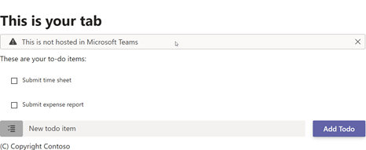
>
> Add the query string value `?theme=dark` to the URL to see the theme change:
>
> 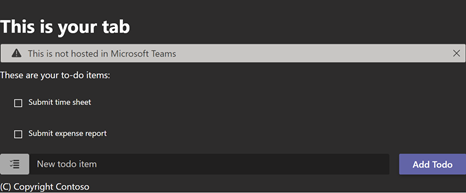

The next step is to add some interactivity to the tab. Add the following methods to the `LearnPersonalTab` class. These methods handle updating the state when specific events happen on the form that you'll add to the component.

```typescript
const handleOnChanged = (event): void => {
  setNewTodoValue(event.target.value);
};

const handleOnClick = (event: React.MouseEvent<HTMLButtonElement>): void => {
  const newTodoItems = todoItems;
  newTodoItems.push(newTodoValue);
  setTodoItems(newTodoItems);
  setNewTodoValue("");
};
```

Finally, locate the string `TODO: add new list item form here` in the `render()` method, and replace it with the following code. This code displays a form that the user can use to add items to the list.

```tsx
<Flex gap="gap.medium">
  <Flex.Item grow>
    <Flex>
      <Label icon={<ToDoListIcon />}
             styles={{
               background: "darkgray",
               height: "auto",
               padding: "0 15px"
             }}></Label>
      <Flex.Item grow>
        <Input placeholder="New todo item" fluid
               value={newTodoValue}
               onChange={handleOnChanged}></Input>
      </Flex.Item>
    </Flex>
  </Flex.Item>
  <Button content="Add Todo" primary
          onClick={handleOnClick}></Button>
</Flex>
```

## Use Developer Portal to update the Microsoft Teams app manifest

> [!VIDEO https://www.microsoft.com/videoplayer/embed/RE4NHyl]

At this point, the app is complete. Recall from our initial test that when the app was added to Microsoft Teams, it had a few todo strings for the description of the app. While you could change these values in the project's **./src/manifest/manifest.json** file, you'll use Developer Portal to make these changes.

First, build, and run the project by running the command **gulp ngrok-serve** in the command line like you did previously. This step also creates the Microsoft Teams app package.

In the browser, go to [Developer Portal for Teams](https://dev.teams.microsoft.com/) and sign in with the credentials of a Work and School account.

Select the **Apps** link in the app bar on the left, select **Import App** in the toolbar.

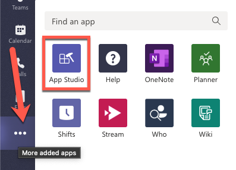

Locate the zip file that can be found in the project's **./package** folder and open it. You'll see a warning regarding the version number. Select **Import**.

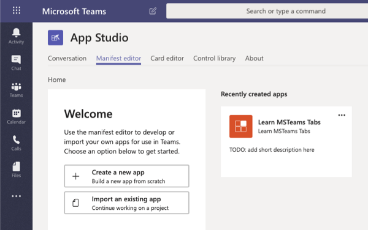

On the **App details** page, change the **Full name** of the app to **Learn Teams Tabs**.

On the **App details** page, scroll down to the **Descriptions** section and enter the following values:

- **Short description**: My first custom Teams app
- **Full description**: *enter a long description*

On the **App details** page, change the **Version** to **1.0.0**.

Scroll to the bottom of the page and select **Save**.

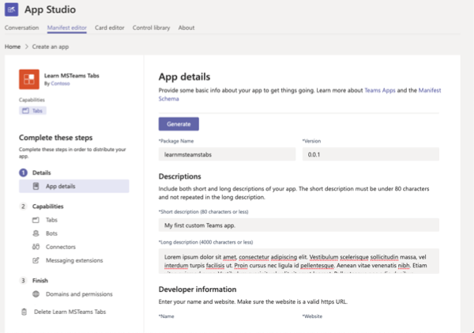

Update the name of the tab by selecting **App features** in the left pane in Developer Portal. Then select **Personal App** .

Locate the LearnPersonalTab in the project. Select the menu for more options on the tab, and select **Edit**. Change the name of the tab to **My First Tab**. Update the **Content URL** property with your new ngrok subdomain. Ensure that `&theme={theme}` is added to the end of the Content URL property. Select **Confirm** to save your changes for the tab. Then select **Save**.

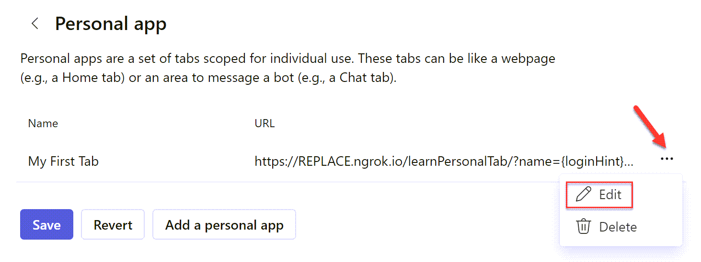

The changes made to the app within the Developer Portal aren't saved to your project. If you want to update the project, download the app package from the portal.

To download the project, return to the **Apps** page by selecting **Apps** in the Toolbar.


From the Apps page in Developer Portal, open the app's menu and select **Download app package**.

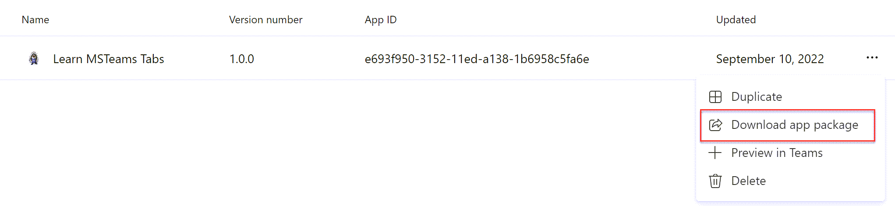

> [!CAUTION]
> Be careful if you chose to update the **manifest.json** file in your project with the one in the package downloaded from Developer Portal.
>
> The manifest file in your project contains placeholder strings that are updated by the build and debugging process that's replaced when you test the project. Using placeholder strings simplifies the development and debugging process.
>
> For example, the placeholder `{{PUBLIC_HOSTNAME}}` is replaced with the hosting URL of the app each time the package is re-created.
>
> So you might not want to completely replace the existing **manifest.json** file with the file generated by Developer Portal.


## Summary

In this exercise, you created a new Microsoft Teams personal tab by using the Microsoft Teams Yeoman generator, Visual Studio Code, and Developer Portal.
