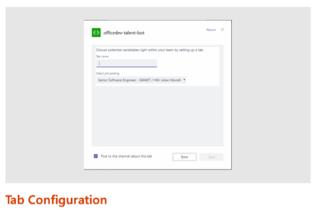
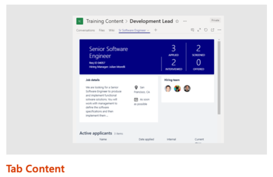
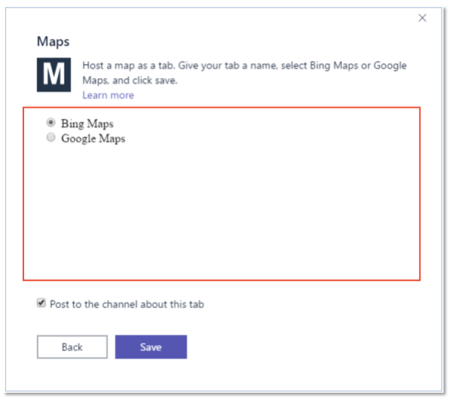
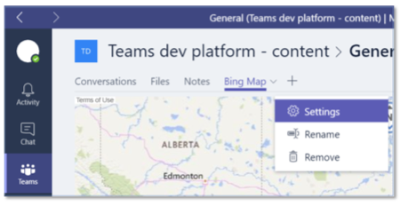

> [!VIDEO https://www.microsoft.com/videoplayer/embed/RE4NCi3]

In this unit, you'll learn how to create channel tabs and configuration pages in Microsoft Teams apps.

## Compare personal and channel tabs

In the previous unit, you learned the fundamentals of Microsoft Teams tabs and how to create a custom personal tab. Your Microsoft Teams app also can include channel tabs, which were formerly known as configurable tabs.

Personal and channel tabs differ in how they're used and in their capabilities.

Personal tabs are supported only in the personal scope. Channel tabs can be used within the team or group chat scope.

The content displayed within a personal tab is specific to an individual user and isn't intended to be shared with others on a team. Channel tabs support all members of a team or channel.

## Tab configuration and content

 A channel tab has one characteristic that differs from a personal tab. Channel tabs display a configuration experience to the user when the tab is added to a channel. You can use the configuration page defined in the manifest to collect any configuration information the web app might need to customize the information shown in the tab.



For example, consider a channel tab that displays the contents of a SharePoint list. The configuration page can collect the SharePoint site and list from the user. It can then use that information to retrieve and display the correct list data in the tab.

The configuration page is another web app that you must create. With the Microsoft Teams SDK, you can attach to an event that fires when the user saves the configuration information. You're responsible for saving any configuration information your tab will need.

You can set the tab's `contentUrl` and `entityId` properties from this save method, based on the options specified on the configuration page.



Similar to a personal tab, the content displayed in a channel tab is displayed in an `<iframe>`. The URL loaded in the `<iframe>` is defined by the `contentUrl` property that's specified on the configuration page. The web app can then use the Microsoft Teams JavaScript SDK to obtain the `entityId` or `subEntityId` properties to determine the content to display. These properties can be used to implement tab-to-tab communication by using deep linking.

## Channel tab manifest syntax

Channel tabs are defined within the Microsoft Teams app manifest file's `configurableTabs` collection.

```json
"configurableTabs": [
  {
    "configurationUrl": "https://{{HOSTNAME}}/configMathTab/config.html",
    "canUpdateConfiguration": true,
    "scopes": [
      "team"
    ],
    "sharePointPreviewImage": "https://{{HOSTNAME}}/assets/configMathTab-preview.png",
    "supportedSharePointHosts": [
      "sharePointFullPage",
      "sharePointWebPart"
    ]
  }
],
```

The `configurationUrl` property is the https:// URL to use when you configure the tab. This property is required.

The `canUpdateConfiguration` property is the value that indicates whether an instance of the tab's configuration can be updated by the user after creation. The default is true.

The scopes property is an array of the scopes the tab supports. Channel tabs can be either **team** or **groupchat** for scopes. This property is required.

The `sharePointPreviewImage` and `supportedSharePointHosts` properties are options. They're used to make the tab available as a web part or a full app page within SharePoint sites.

## Channel tab capabilities: Configuration page

The configuration page is a webpage that you host. When a user chooses to add or update a channel tab, Microsoft Teams loads the `configurationUrl` property that's specified in the app manifest within an `<iframe>` inside the **Add Tab** dialog box.

On this page, you present options and gather information from the user about what they want in your tab. For example, the user might want to select existing app resources, such as files or task lists, or create new resources only for this tab.

You might decide that a tab's configuration can or can't be changed after it's added to a team. This setting can be controlled within the app manifest by using the `canUpdateConfiguration` flag. By default, this property is set to true.

## Channel tab configuration page

Here's an example of the channel tab configuration page experience.



This image is the configuration page that prompts the user for the mapping site to use in the custom tab.



This image shows the tab context menu. If the channel tab doesn't have the `canUpdateConfiguration` property set to false, the **Settings** option is displayed in the menu. Selecting this menu option displays the configuration page again.

## Configuration page: Implementation and requirements

Configuration pages, just like personal and channel tabs, are webpages loaded within an `<iframe>`. You're responsible for implementing the user interface. Similar to the content pages for tabs, the webpage used as a configuration page must be permitted to load within an `<iframe>`.

Configuration pages must notify Microsoft Teams when the settings have been configured and saved. This notification is done by registering a save handler by using the `registerOnSaveHandler()` event. Within your handler for this event, use the `microsoftTeams.settings.setSettings()` method to update the tab's settings. Use the `saveEvent.notifySuccess()` method to make Microsoft Teams aware that the settings were successfully saved.

You're responsible for saving any configuration information your tab will need.

## Save settings on the configuration page

This code is what you'll use to save any settings from the configuration page in your web app. It notifies Microsoft Teams that the settings were saved successfully.

```typescript
microsoftTeams.settings.registerOnSaveHandler((saveEvent: microsoftTeams.settings.SaveEvent) => {
  // Calculate host dynamically to enable local debugging
  const host = "https://" + window.location.host;
  microsoftTeams.settings.setSettings({
    contentUrl: host + "/configMathTab/?data=",
    suggestedDisplayName: "ConfigMathTab",
    removeUrl: host + "/configMathTab/remove.html",
    entityId: `${ this.state.mathOperator }MathPage`
  });
  saveEvent.notifySuccess();
});
```

Register your handler when the **Save** button is selected on the configuration page by calling the `microsoftTeams.settings.registerOnSaveHandler()` method from the Microsoft Teams JavaScript SDK.

Use the `microsoftTeams.settings.setSettings()` method to save any settings on the channel tab. Finally, notify Microsoft Teams that the configuration page completed successfully by calling the `saveEvent.notifySuccess()` method.

## Channel tab capabilities: Removal page

Channel tabs can be configured with a removal page. This page displays when a channel tab is removed from a channel or group chat. You can use this page to clean up any resources that were created when you added the tab to the channel.
