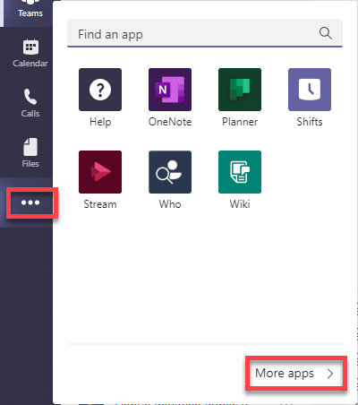
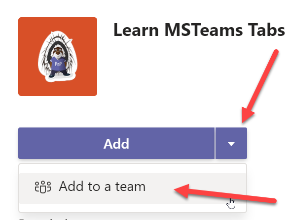
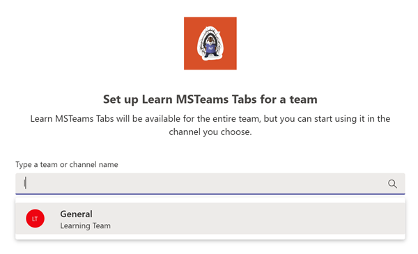
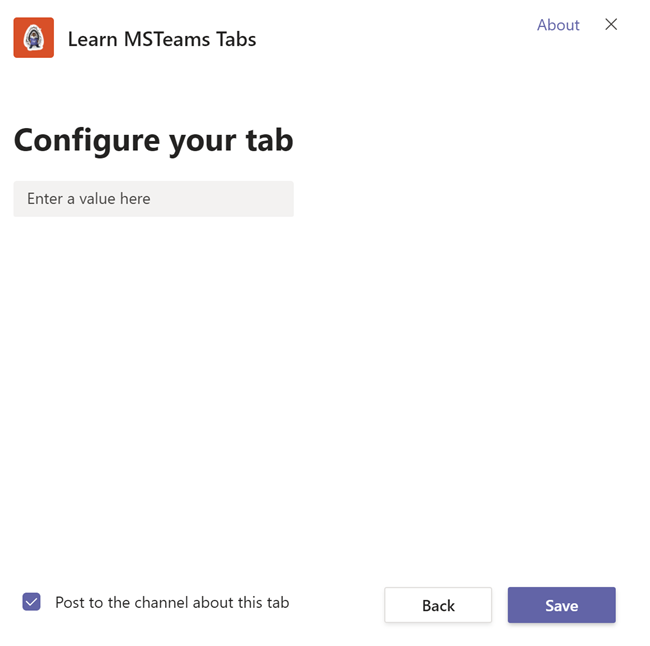
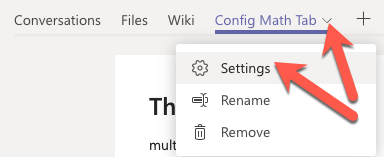
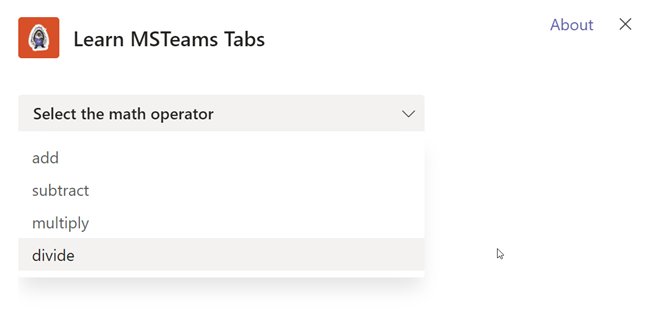
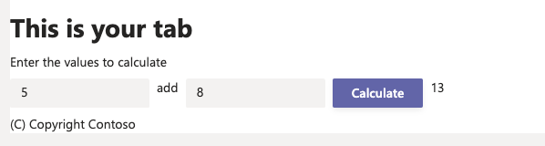

> [!VIDEO https://www.microsoft.com/videoplayer/embed/RE4NzEt]

In this exercise, you'll learn how to create a channel tab with a configuration page in a Microsoft Teams app.

> [!IMPORTANT]
> This exercise assumes that you created the Microsoft Teams app project with the Yeoman generator that contains a personal tab from the previous unit in this module. You'll update the project and add a channel tab in this exercise.

## Add a channel app to the Microsoft Teams app project

The Yeoman generator for Microsoft Teams can be used to add new components to an existing project. In this section, you'll add a channel tab to the existing project.

Execute the following command in the console from the root folder of the project:

```console
yo teams
```

> [!NOTE]
> If you see an error stating that the project has a non supported-schema, change the `$schema` and `manifestVersion` properties in the manifest.json file to a supported version. Supported versions are listed in the [generator's GitHub Wiki](https://github.com/pnp/generator-teams/wiki/Manifest-Versions).

Yeoman starts and asks you a series of questions. Answer the questions with the following values:

- **You are running the generator on an already existing project... are you sure you want to continue?**: Yes
- **Do you want to change the current manifest version (1.11)?**: No
- **Quick scaffolding**: Yes
- **What features do you want to add to your project?**: A Tab
- **Default tab name (max 16 characters)**: ConfigMathTab
- **What kind of Tab would you like to create?**: Configurable
- **What scopes do you intend to use for your tab?**: In a Team
- **Do you require Azure AD Single-Sign-On support for the tab?** No
- **Do you want this tab to be available in SharePoint Online?**: No

If prompted to overwrite files, select **Y**.

After you answer the generator's questions, the generator adds the additional files for a new component. Then it may run the `npm install` command to ensure that any new dependencies are downloaded for the project.

## Test the channel tab

Before you customize the tab, let's test the tab to see the experience for testing.

From the command line, go to the root folder for the project and run the following command:

```console
gulp ngrok-serve --debug
```

Open a browser, and go to [Microsoft Teams](https://teams.microsoft.com). Sign in with the credentials of a Work and School account.

In the app bar on the left, select the **More added apps** button. Then select **Manage your apps** > **Upload a custom app**.



In the file dialog box that appears, select the Microsoft Teams package in your project. This app package is a zip file in the project's **./package** folder.

After the package is uploaded, Microsoft Teams displays a summary of the app. Select the arrow next to the **Add** button, and select **Add to a team** to install the app:



In the **Select a channel to start using** dialog box, select an existing team. Then select **Set up a tab**:



Before the tab is added to the team, Microsoft Teams displays the tab's configuration page:



Enter anything in the text box, and select **Save**.

Microsoft Teams adds the tab to the channel and displays it for you. You should see the text you entered on the configuration page displayed in the tab.

## Update the configuration tab

On the tab you create in this exercise, the user can select a math operation to do on the configuration page. This value is saved with the tab so that users of the tab can do this operation on two values to see the results.

The first step is to modify the configuration page.

Locate and open the file **./src/client/configMathTab/ConfigMathTabConfig.tsx**.

Update the `import` statements in this file to include the components used in the configuration tab.

Find the following `import` statement that imports the Fluent UI - React library:

```typescript
import { Provider, Flex, Header, Input} from "@fluentui/react-northstar";
```

Replace the previous statement with the following import statement:

```typescript
import { Provider, Flex, Header, Input, DropdownProps, Dropdown } from "@fluentui/react-northstar";
```

Find the following `useState` statement:

```typescript
const [text, setText] = useState<string>();
```

Replace the previous statement with the following:

```typescript
const [mathOperator, setMathOperator] = useState<string>();
```

### Implement the configuration page logic and user interface

The configuration page displays a drop-down list of four math operators to select from. After an operator is selected, it's saved to the tab's `entityId` property with the string **MathPage** appended to it. This value is used by the tab page to determine what operation to perform in the tab.

Locate the `useEffect` method that depends upon the `context` variable. This method sets the state of the React component. Change the statement that contains the `setText` method with the following code. This new code takes the value of the `entityId` property on the tab, removes the **MathPage** string, and leaves only the operator.

```typescript
useEffect(() => {
  if (context) {
    setMathOperator(context.entityId.replace("MathPage", ""));
    entityId.current = context.entityId;
    microsoftTeams.settings.registerOnSaveHandler(onSaveHandler);
    microsoftTeams.settings.setValidityState(true);
    microsoftTeams.appInitialization.notifySuccess();
    }
    // eslint-disable-next-line react-hooks/exhaustive-deps
  }, [context]);
```

Locate the `return` statement. Replace it with the following code, which adds a drop-down list for the user to select the operator they want to use:

```tsx
return (
  <Provider theme={theme}>
    <Flex gap="gap.smaller" style={{ height: "300px" }}>
      <Dropdown placeholder="Select the math operator"
        items={[
          "add",
          "subtract",
          "multiply",
          "divide"
        ]}
        onChange={(e, data) => {
          if (data) {
            const op = (data.value) ? data.value.toString() : "add";
            setMathOperator(op);
            entityId.current = `${op}MathPage`;
          }
        }}
        value={mathOperator}></Dropdown>
    </Flex>
  </Provider>
);
```

### Test the configuration page

At this point, the configuration page is complete. If you removed the tab in the last step, repeat the process to upload and add it again.

If you didn't remove the tab, select the menu from the tab and then select **Settings**.



The configuration page opens with the updated component.



Select one of the math operators, and save your changes by selecting **Save**. The tab should display the selected operator with the **MathPage** suffix.

## Implement the channel tab

> [!VIDEO https://www.microsoft.com/videoplayer/embed/RE4NCi7]

The last step is to implement the channel tab.

Locate and open the file **./src/client/configMathTab/ConfigMathTab.tsx**.

### Update the channel tab to use the Stardust UI library

Update the `import` statements in this file to include the components used in the configuration tab. Find the following `import` statement that imports the Fluent UI - React library:

```typescript
import { Provider, Flex, Text, Button, Header } from "@fluentui/react-northstar";
```

Replace the previous statement with the following import statement:

```typescript
import { Provider, Flex, Text, Button, Header, Input, InputProps } from "@fluentui/react-northstar";
```

Add an interface to define the state our component will use. Add the following after the `import` statements:

```typescript
export interface IConfigMathTabState {
  mathOperator ?: string;
  operandA: number;
  operandB: number;
  result: string;
}
```

Add the following after the existing `useState` statements. This code defines a variable to contain the component state.

```typescript
const [mathTabState, setMathTabState] = useState<IConfigMathTabState>({ mathOperator: "add" } as IConfigMathTabState);
```

### Implement the channel page logic

Locate the `useEffect` hook that depends upon the Microsoft Teams context. This new code takes the value of the `entityId` property on the tab, removes the **MathPage** string, and leaves only the operator.

```typescript
useEffect(() => {
  if (context) {
    setEntityId(context.entityId);
    setMathTabState(state => ({ 
      ...state, 
      mathOperator: context.entityId.replace("MathPage", "")
    } as IConfigMathTabState));
  }
}, [context]);
```

Add the following event handlers to the `ConfigMathTab` class. These event handlers will update the state with the values from the controls and do the calculation of the two numbers by using the operator specified on the configuration page.

```typescript
const handleOnChangedOperandA = (data?: InputProps): void => {
  if (data && !isNaN(Number(data.value))) {
    setMathTabState(state => ({
      ...state,
      operandA: data.value
    } as IConfigMathTabState));
  }
};

const handleOnChangedOperandB = (data?: InputProps): void => {
  if (data && !isNaN(Number(data.value))) {
    setMathTabState(state => ({
      ...state,
      operandB: data.value
    } as IConfigMathTabState));
  }
};

const handleOperandChange = (): void => {
  let stringResult: string = "n/a";

  if (mathTabState) {
    if (!isNaN(Number(mathTabState.operandA)) && !isNaN(Number(mathTabState.operandB))) {
      switch (mathTabState.mathOperator) {
        case "add":
          stringResult = (Number(mathTabState.operandA) + Number(mathTabState.operandB)).toString();
          break;
        case "subtract":
          stringResult = (Number(mathTabState.operandA) - Number(mathTabState.operandB)).toString();
          break;
        case "multiply":
          stringResult = (Number(mathTabState.operandA) * Number(mathTabState.operandB)).toString();
          break;
        case "divide":
          stringResult = (Number(mathTabState.operandA) / Number(mathTabState.operandB)).toString();
          break;
        default:
          stringResult = "n/a";
          break;
      }
    }
  }
  setMathTabState(state => ({
    ...state,
    result: stringResult
  } as IConfigMathTabState));
};
```

### Implement the channel page user interface

Locate the `return` statement in the `ConfigMathTab` component. Replace the existing statement with the following code. This new code adds two input boxes and a button to the page. When the button is selected, it does the math operation selected on the configuration page to the two values and displays the results.

```typescript
return (
  <Provider theme={theme}>
    <Flex column gap="gap.smaller">
      <Header>This is your tab</Header>
      <Text content="Enter the values to calculate" size="medium"></Text>

      <Flex gap="gap.smaller">
        <Flex.Item>
          <Flex gap="gap.smaller">
            <Flex.Item>
              <Input autoFocus
                value={mathTabState.operandA}
                onChange={(e, data) => handleOnChangedOperandA(data)}></Input>
            </Flex.Item>
            <Text content={mathTabState.mathOperator}></Text>
            <Flex.Item>
              <Input value={mathTabState.operandB}
                onChange={(e, data) => handleOnChangedOperandB(data)}></Input>
            </Flex.Item>
          </Flex>
        </Flex.Item>
        <Button content="Calculate" primary
          onClick={handleOperandChange}></Button>
        <Text content={mathTabState.result}></Text>
      </Flex>
      <Text content="(C) Copyright Contoso" size="smallest"></Text>
    </Flex>
  </Provider>
);
```

### Test the channel tab page

At this point, the channel tab page is complete. If the web server isn't still running, rebuild the project and start the web server by running **gulp ngrok-server --debug**.

Open a browser, and go to [Microsoft Teams](https://teams.microsoft.com). Sign in with the credentials of a Work and School account.

Go to the team where the tab is installed, and select the channel tab. Enter two values, and select the **Calculate** button. The results of the calculation appear next to the button.



Use the **Settings** link on the tab to open the configuration tab, and change the math operation.

Stop the local web server by selecting <kbd>Ctrl</kbd>+<kbd>C</kbd> in the console to stop the running process.

## Summary

In this exercise, you created a channel tab with a configuration page in a Microsoft Teams app.
