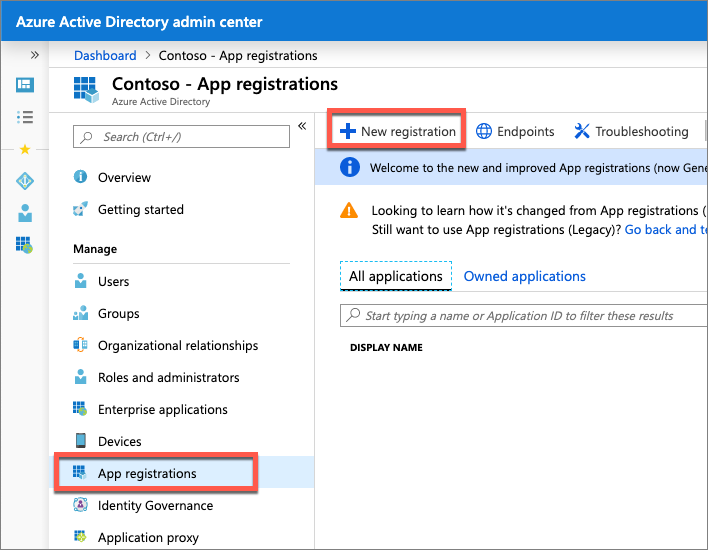
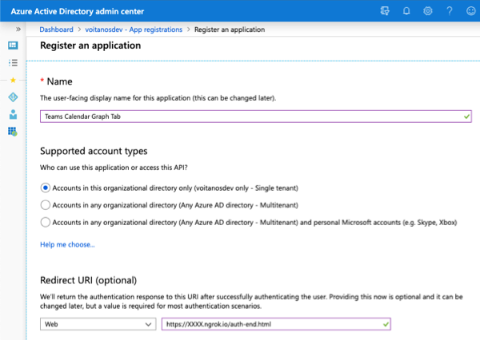
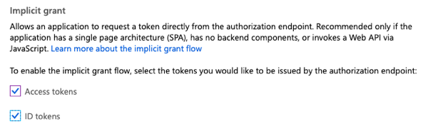
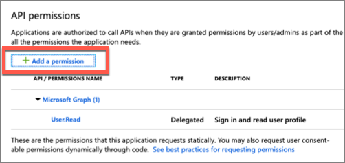
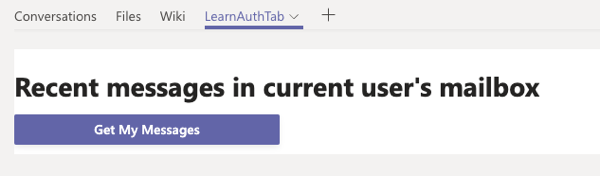
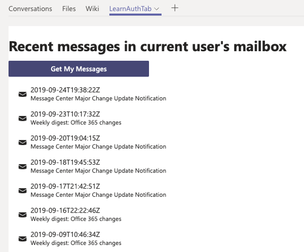

In this exercise, you'll create a custom channel tab that displays information about the current user, retrieved from Microsoft Graph.

## Prerequisites

Developing Microsoft Teams apps requires an Office 365 tenant, Microsoft Teams configured for development, and the necessary tools installed on your workstation.

For the Office 365 tenant, follow the instructions on [Microsoft Teams: Prepare your Office 365 tenant](https://docs.microsoft.com/microsoftteams/platform/get-started/get-started-tenant) for obtaining a developer tenant if you don't currently have an Office 365 account. Make sure you have also enabled Microsoft Teams for your organization.

Microsoft Teams must be configured to enable custom apps and allow custom apps to be uploaded to your tenant to build custom apps for Microsoft Teams. Follow the instructions on the same **Prepare your Office 365 tenant** page mentioned above.

You'll use Node.js to create custom Microsoft Teams tabs in this module. The exercises in this module assume you have the following tools installed on your developer workstation.

> [!IMPORTANT]
> In most cases, installing the latest version of the following tools is the best option. The versions listed here were used when this module was published and last tested.

- [Node.js](https://nodejs.org/) - v10.\* (or higher)
- NPM (installed with Node.js) - v6.\* (or higher)
- [Gulp](https://gulpjs.com/) - v4.\* (or higher)
- [Yeoman](https://yeoman.io/) - v3.\* (or higher)
- [Yeoman Generator for Microsoft Teams](https://github.com/OfficeDev/generator-teams) - v2.\* (or higher)
- [Visual Studio Code](https://code.visualstudio.com)

You must have the minimum versions of these prerequisites installed on your workstation.

## Create an Azure AD application

The tab created in this project will submit a request to Microsoft Graph to retrieve email messages. All requests to Microsoft Graph must include an access token as proof of the user's identity and that they have the necessary permissions to call Microsoft Graph. To obtain an access token, you must create an Azure AD application that has the necessary Microsoft Graph permissions.

Open a browser and navigate to the [Azure Active Directory admin center (https://aad.portal.azure.com)](https://aad.portal.azure.com). Sign in using a **Work or School Account** that has global administrator rights to the tenancy.

Select **Azure Active Directory** in the left-hand navigation.

  

Select **Manage > App registrations** in the left-hand navigation.

On the **App registrations** page, select **New registration**.

  

On the **Register an application** page, set the values as follows:

- **Name**: Teams Calendar Graph Tab
- **Supported account types**: Accounts in this organizational directory only (Contoso only - Single tenant)
- **Redirect URI**: Web = https://XXXX.ngrok.io/auth-end.html

    > [!NOTE]
    > Each time ngrok starts, it generates a new random subdomain. Azure AD requires the redirect URI is specified in the app registration. Therefore, you'll need to return to this Azure AD app registration to add or change the redirect URI once you start the ngrok utility.

    

    Select **Register**.

On the **Teams Calendar Graph Tab** page, copy the value of the **Application (client) ID**; you'll need it later in this exercise.

  

On the **Teams Calendar Graph Tab** page, select the **1 web, 0 public client** link under the **Redirect URIs**.

Locate the section **Implicit grant** and select both **Access tokens** and **ID tokens**. This tells Azure AD to return these tokens the authenticated user if requested.



Save the settings by selecting the **Save** in the top navigation.

### Grant Azure AD application permissions to Microsoft Graph

After creating the application, you need to grant it the necessary permissions to Microsoft Graph

Select **API Permissions** in the left-hand navigation panel.


Select the **Add a permission** button.



In the **Request API permissions** panel that appears, select **Microsoft Graph** from the **Microsoft APIs** tab.


When prompted for the type of permission, select **Delegated permissions**.

Enter **Mail.R** in the **Select permissions** search box and select the **Mail.Read** permission, followed by the **Add permission** button at the bottom of the panel.

At the bottom of the **API Permissions** panel, select the button **Grant admin consent for [tenant]**, followed by the **Yes** button to grant all users in your organization this permission.

## Create Microsoft Teams app

Open your command prompt, navigate to a directory where you want to save your work, create a new folder **auth-tab**, and change directory into that folder.

Run the Yeoman Generator for Microsoft Teams by running the following command:

```shell
yo teams
```


Yeoman will launch and ask you a series of questions. Answer the questions with the following values:

- **What is your solution name?**: Learn MSTeams Auth Tabs
- **Where do you want to place the files?**: Use the current folder
- **Title of your Microsoft Teams App project?**: Learn MSTeams Auth Tabs
- **Your (company) name? (max 32 characters)**: Contoso
- **Which manifest version would you like to use?**: 1.5
- **Enter your Microsoft Partner ID, if you have one?**: (Leave blank to skip)
- **What features do you want to add to your project?**: A Tab
- **The URL where you'll host this solution?**: https://larnteamsauthtabs.azurewebsites.net
- **Would you like to include Test framework and initial tests?**: No
- **Would you like to use Azure Applications Insights for telemetry?**: No
- **Default Tab name? (max 16 characters)**: LearnAuthTab
- **Do you want to create a configurable or static tab?**: Configurable

After answering the generator's questions, the generator will create the scaffolding for the project and then execute `npm install` that downloads all the dependencies required by the project.

The tab you'll create in this exercise is going to get the latest emails from the current user's mailbox using Microsoft Graph. Install the Microsoft Graph JavaScript SDK and associated TypeScript type declarations for the Microsoft Graph in the project. Run the following commands to install these packages:

```shell
npm install @microsoft/microsoft-graph-client
npm install @types/microsoft-graph --save-dev
```

## Update the project to use the Stardust UI library

Microsoft Teams recommends your custom apps use React and the themable React component library [Stardust UI React](https://stardust-ui.github.io/react/). To use Stardust in the Microsoft Teams app, we need to make some changes to the project.

> [!IMPORTANT]
> At the time of publication of this module, there are plans to update the Yeoman generator for Microsoft Teams to include Stardust in the default project. However, at the time of publication of this module, the default project uses the older Microsoft Teams control library that Stardust is replacing.
>
> Therefore, the steps in this section may or may not be necessary as the Yeoman generator for Microsoft Teams may have been updated. Review each of the instructions in this section and compare the results with your project to determine if they are necessary.

The first step is to uninstall the existing control library and install the Stardust library. Execute the following two commands in the command line from the root folder of the project:

```shell
npm uninstall msteams-ui-components-react
npm install @stardust-ui/react
```

Locate and open the file that contains the React component used in the project: **./src/app/scripts/learnAuthTab/LearnAuthTab.tsx**.

Update the `import` statements in this file to replace the component library used. Find the following `import` statement that imports the legacy Microsoft Teams UI Components - React library:

```ts
import {
    PrimaryButton,
    TeamsThemeContext,
    Panel,
    PanelBody,
    PanelHeader,
    PanelFooter,
    Surface,
    getContext
} from "msteams-ui-components-react";
```

Replace the above statement with the following import statement:

```ts
import {
  Flex, Provider, themes, ThemePrepared,
  Header,
  Button, Icon, List
} from "@stardust-ui/react";
```

The default project contains additional user interface style code that used the previous control library. This code is no longer necessary

Locate the following code in the `componentWillMount()` method in the `LearnAuthTab` class and delete it:

```ts
this.setState({
    fontSize: this.pageFontSize()
});
```

Locate the following code in the `render()` method in the `LearnAuthTab` class and delete it:

```ts
const context = getContext({
    baseFontSize: this.state.fontSize,
    style: this.state.theme
});
const { rem, font } = context;
const { sizes, weights } = font;
const styles = {
    header: { ...sizes.title, ...weights.semibold },
    section: { ...sizes.base, marginTop: rem(1.4), marginBottom: rem(1.4) },
    footer: { ...sizes.xsmall }
};
```

Locate the `return ()` statement in the `render()` method in the `LearnAuthTab` class and delete the contents. This code used the UI library that you replaced with Stardust. At this point, the `render()` method should look like the following code:

```ts
public render() {
    return (
    );
}
```

Update the state of the component to contain a property for the current Stardust theme. Locate the `ILearnAuthTabState` interface in the **LearnAuthTab.tsx** file and add the following member to it:

```ts
teamsTheme: ThemePrepared;
```

Add the following method to the `LearnAuthTab` class that will update the component state to the Stardust theme that matches the currently selected Microsoft Teams client theme:

```ts
private updateStardustTheme = (teamsTheme: string = "default"): void => {
  let stardustTheme: ThemePrepared;

  switch (teamsTheme) {
    case "default":
      stardustTheme = themes.teams;
      break;
    case "dark":
      stardustTheme = themes.teamsDark;
      break;
    case "contrast":
      stardustTheme = themes.teamsHighContrast;
      break;
    default:
      stardustTheme = themes.teams;
      break;
  }
  // update the state
  this.setState(Object.assign({}, this.state, {
    teamsTheme: stardustTheme
  }));
}
```

Initialize the current theme and state of the component. Locate the line `this.updateTheme(this.getQueryVariable("theme"));` and replace it with the following code in the `componentWillMount()` method:

```ts
this.updateStardustTheme(this.getQueryVariable("theme"));
```

Within the `componentWillMount()` method, locate the following line:

```ts
microsoftTeams.registerOnThemeChangeHandler(this.updateTheme);
```

This code registers an event handler to update the component's theme to match the theme of the current Microsoft Teams client when this page is loaded as a tab. Update this line to call the new handler the following line to register another handler to update the Stardust library theme:

```ts
microsoftTeams.registerOnThemeChangeHandler(this.updateStardustTheme);
```

With the theme management and state initialized, we can now implement the user interface.

## Implement the tab's logic and user interface

Now you can implement the user interface for the tab. The simple tab will have a basic interface. It will present a list of email messages for the current user and a button to initiate the request.

Add the following `import` statements after the existing `import` statements in the **LearnAuthTab.tsx** file. These statements will include the Microsoft Graph JavaScript SDK and associated TypeScript type declarations into the file:

```ts
import * as MicrosoftGraphClient from "@microsoft/microsoft-graph-client";
import * as MicrosoftGraph from "microsoft-graph";
```

Locate the `ILearnAuthTabState` interface and add the following members to it. These properties will be used to store the OAuth access token used to authenticate with, and the email messages returned from Microsoft Graph:

```ts
accessToken: string;
messages: MicrosoftGraph.Message[];
```

Add the following code to the top of the `LearnAuthTab` class. This creates a new class-scoped member of the Microsoft Graph client and initializes the state of the component:

```ts
private msGraphClient: MicrosoftGraphClient.Client;

constructor(props: IMyGraphTabProps, state: IMyGraphTabState) {
  super(props, state);

  state.messages = [];
  state.accessToken = "";

  this.state = state;
}
```

Locate the `render()` method and update the return statement to the following code. The `render()` method will display a button for the user to sign in and request their emails from Microsoft Graph. It will then display the email messages in a list:

```tsx
public render() {
  return (
    <Provider theme={themes.teams}>
      <Flex column gap="gap.small">
        <Header>Recent messages in current user's mailbox</Header>
        <Button primary
                content="Get My Messages"
                onClick={this.handleGetMyMessagesOnClick}></Button>
        <List selectable>
          {
            this.state.messages.map(message => (
              <List.Item media={<Icon name="email"></Icon>}
                header={message.receivedDateTime}
                content={message.subject}>
              </List.Item>
            ))
          }
        </List>
      </Flex>
    </Provider>
  );
}
```

Add the `onclick` event handler for the button to the `LearnAuthTab` class:

```ts
private handleGetMyMessagesOnClick = async (event): Promise<void> => {
  await this.getMessages();
}
```

## Implement the authentication and Microsoft Graph request logic

At this point, the tab is ready to add the logic necessary to request the email messages for the current user. Before requesting email messages from Microsoft Graph, you need the user to sign in and obtain an access token from Azure AD. There are multiple steps to perform to implement the authentication routine.

Start by adding the following code to the end of the `componentWillMount()` to initialize the Microsoft Graph client:

```ts
// init the graph client
this.msGraphClient = MicrosoftGraphClient.Client.init({
  authProvider: async (done) => {
    if (!this.state.accessToken) {
      const token = await this.getAccessToken();
      this.setState({
        accessToken: token
      });
    }
    done(null, this.state.accessToken);
  }
});
```

Next, add the following method to the `LearnAuthTab` class:

```ts
private async getMessages(promptConsent: boolean = false): Promise<void> {
  if (promptConsent || this.state.accessToken === "") {
    await this.signin(promptConsent);
  }

  this.msGraphClient
    .api("me/messages")
    .select(["receivedDateTime", "subject"])
    .top(15)
    .get(async (error: any, rawMessages: any, rawResponse?: any) => {
      if (!error) {
        this.setState(Object.assign({}, this.state, {
          messages: rawMessages.value
        }));
        Promise.resolve();
      } else {
        console.error("graph error", error);
        // re-signin but this time force consent
        await this.getMessages(true);
      }
    });
}
```

The `getMessages()` method first checks if the component has an access token. If so, it will submit the request to Microsoft Graph for the top 15 email messages. Otherwise, if the component doesn't have an access token, it calls the `signin()` method.

Add the following code to implement the `signin()` method:

```ts
private async signin(promptConsent: boolean = false): Promise<void> {
  const token = await this.getAccessToken(promptConsent);

  this.setState({
    accessToken: token
  });

  Promise.resolve();
}
```

This method calls the `getAccessToken()` method that uses the Microsoft Teams JavaScript SDK to initiate the authentication process. It will open a popup window that loads the **auth-start.html** page to start the authentication process with Azure AD. Ultimately the authentication process will end in the popup and result in either a successful or failed authentication process. In either case, the associated callback handlers are registered in the `authenticate()` method in the following code:

```ts
private async getAccessToken(promptConsent: boolean = false): Promise<string> {
  return new Promise<string>((resolve, reject) => {
    microsoftTeams.authentication.authenticate({
      url: window.location.origin + "/auth-start.html",
      width: 600,
      height: 535,
      successCallback: (accessToken: string) => {
        resolve(accessToken);
      },
      failureCallback: (reason) => {
        reject(reason);
      }
    });
  });
}
```

Create a new file, **./src/app/web/auth-start.html** in the project and add the following code to it. This file will use the Microsoft Teams JavaScript SDK & ADAL.js libraries to configure ADAL for the Azure AD application created previously in this exercise. It will then redirect the user to the Azure AD sign in page, instructing it to redirect the user back to the **auth-end.html** on our site:

```html
<!DOCTYPE html>
<html>
<body>
  <script src="https://statics.teams.microsoft.com/sdk/v1.5.2/js/MicrosoftTeams.min.js" crossorigin="anonymous"></script>
  <script src="https://secure.aadcdn.microsoftonline-p.com/lib/1.0.17/js/adal.min.js" crossorigin="anonymous"></script>
  <script type="text/javascript">
    microsoftTeams.initialize();
    microsoftTeams.getContext(function (msTeamsContext) {

      // ADAL.js configuration
      let config = {
        clientId: "{{REPLACE_AZUREAD_APP_ID}}",
        redirectUri: window.location.origin + "/auth-end.html",
        cacheLocation: "localStorage",
        endpoints: {
          "https://graph.microsoft.com": "https://graph.microsoft.com"
        }
      };

      // add extra query parameters AzureAD login request
      //  include scope for OpenID connect & login-hint using current MSTeams logged in user
      config.extraQueryParameters = "scope=open+profile";
      if (msTeamsContext.upn) {
        config.extraQueryParameters += "&login-hint=" + encodeURIComponent(msTeamsContext.userProfileName);
      }
      // check if consent required for new permission
      if (getUrlParameter('prompt') !== "") {
        config.extraQueryParameters += "&prompt=" + getUrlParameter('prompt');
      }

      // override URL to AzureAD auth endpoint to include extra query params
      config.displayCall = function (urlNavigate) {
        if (urlNavigate) {
          if (config.extraQueryParameters) {
            urlNavigate += "&" + config.extraQueryParameters;
          }
          window.location.replace(urlNavigate);
        }
      }

      // login
      let authContext = new AuthenticationContext(config);
      authContext.clearCache();
      authContext.login();
    });

    function getUrlParameter(name) {
      name = name.replace(/[\[]/, '\\[').replace(/[\]]/, '\\]');
      var regex = new RegExp('[\\?&]' + name + '=([^&#]*)');
      var results = regex.exec(location.search);
      return results === null ? '' : decodeURIComponent(results[1].replace(/\+/g, ' '));
    };
  </script>
</body>
</html>
```

Create a new file, **./src/app/web/auth-end.html** in the project and add the following code to it. Like the **auth-start.html** file, this file will use the Microsoft Teams JavaScript SDK & ADAL.js libraries to configure ADAL for the Azure AD application created previously in this exercise. It will parse the results received from Azure AD. If the user successfully authenticated, this page will request an access token for Microsoft Graph from Azure AD and then notify Microsoft Teams the authentication process succeeded or failed.

The notification process will trigger Microsoft Teams to close the popup window and execute the registered callback handlers in our tab:

```html
<!DOCTYPE html>
<html>
<body>
  <script src="https://statics.teams.microsoft.com/sdk/v1.5.2/js/MicrosoftTeams.min.js" crossorigin="anonymous"></script>
  <script src="https://secure.aadcdn.microsoftonline-p.com/lib/1.0.17/js/adal.min.js" crossorigin="anonymous"></script>

  <script type="text/javascript">
    microsoftTeams.initialize();

    // ADAL.js configuration
    let config = {
      clientId: "{{REPLACE_AZUREAD_APP_ID}}",
      cacheLocation: "localStorage",
      navigateToLoginRequestUrl: false,
      endpoints: {
        "https://graph.microsoft.com": "https://graph.microsoft.com"
      }
    };

    let authContext = new AuthenticationContext(config);

    // ensure page loaded via AzureAD callback
    if (authContext.isCallback(window.location.hash)) {
      authContext.handleWindowCallback(window.location.hash);

      // Only call notifySuccess or notifyFailure if this page is in the authentication popup
      if (window.opener) {
        // if able to retrieve current user... 
        if (authContext.getCachedUser()) {
          // get access token for Microsoft Graph
          authContext.acquireToken("https://graph.microsoft.com", function (error, token) {
            if (token) {
              microsoftTeams.authentication.notifySuccess(token);
            } else if (error) {
              microsoftTeams.microsoftTeams.notifyFailure(error);
            } else {
              microsoftTeams.authentication.notifyFailure("UnexpectedFailure");
            }
          });
        } else {
          microsoftTeams.authentication.notifyFailure(authContext.getLoginError());
        }
      }
    }
  </script>
</body>
</html>
```

> [!IMPORTANT]
> Make sure to replace the string `{{REPLACE_AZUREAD_APP_ID}}` in the previous two code listings with the ID of the Azure AD application you created previously in this exercise.

## Install and test the Microsoft Teams app

From the command line, navigate to the root folder for the project and execute the following command:

```shell
gulp ngrok-serve
```

Copy the ngrok URL displayed in the console. Go back to Azure AD and add or update the Redirect URI of the Azure AD application previously created in this lab. Otherwise, Azure AD will not redirect you back to the **auth-end.html** page. The URL should be in the form of **https://{ngrok-subdomain}.ngrok.io/auth-end.html**.

In the browser, navigate to **https://teams.microsoft.com** and sign in with the credentials of a Work and School account.

Using the app bar navigation menu, select the **Mode added apps** button. Then select **Browse all apps** followed by **Upload for me or my teams**.

In the file dialog that appears, select the Microsoft Teams package in your project. This app package is a ZIP file that can be found in the project's **./package** folder.

Once the package is uploaded, Microsoft Teams will display a summary of the app. Select the **Add** button to install the app. Select a team to add the channel to and select **Save** on the configuration page.

Select the app to navigate to the new tab:



Select the button **Get My Messages**. Microsoft Teams will open the popup window that will be redirected to Azure AD to sign in. If you are prompted to sign in, enter the credentials of your Work and School account.

> [!NOTE]
> You may not be prompted to signin as you are already signed into Microsoft Teams. Azure AD will not require you to signin again and will redirect you to the specified redirect URI for the Azure AD application.

After successfully signing into Azure AD, Microsoft Teams will close the popup and display the last 15 emails in your mailbox retrieved from Microsoft Graph:



## Summary

In this exercise, you created a custom channel tab that displays information about the current user, retrieved from Microsoft Graph.
