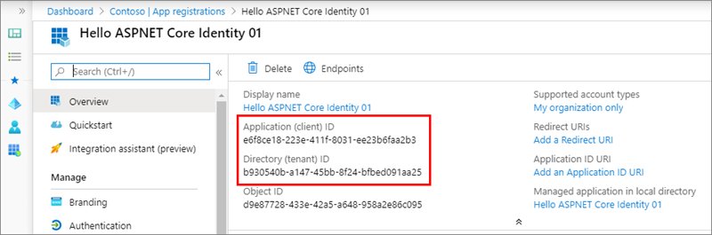
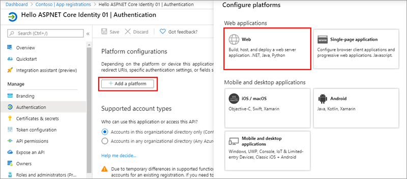
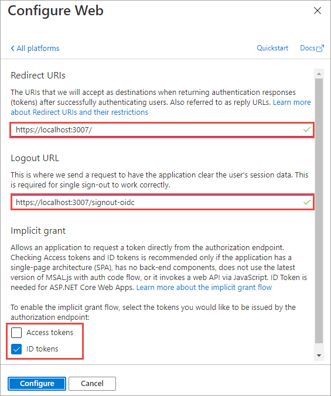
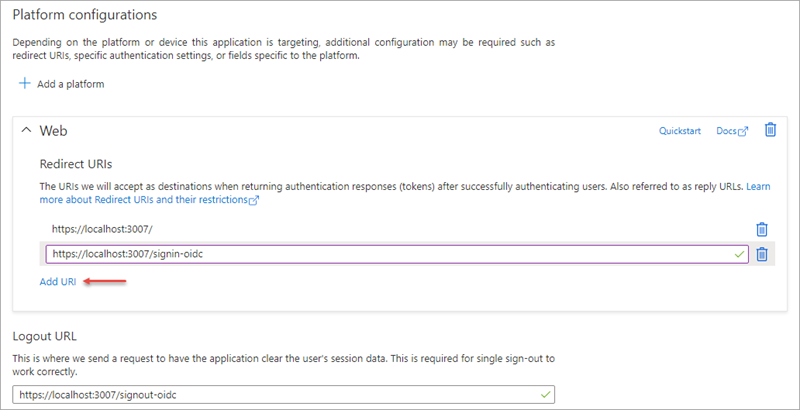
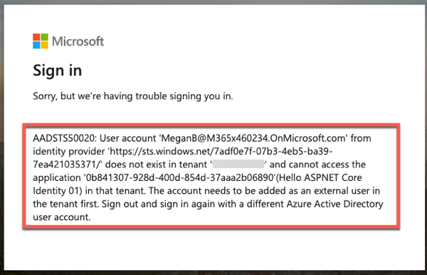
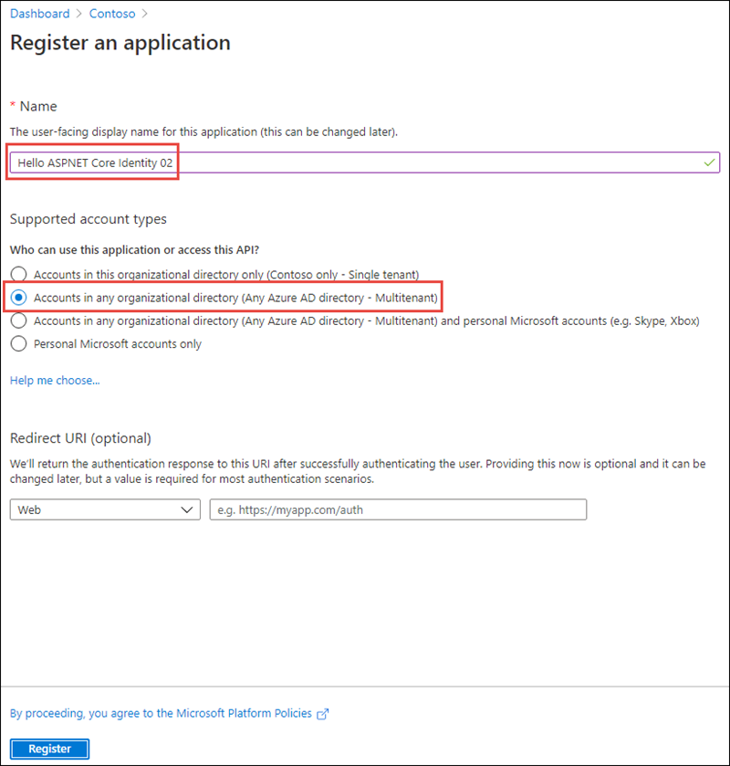
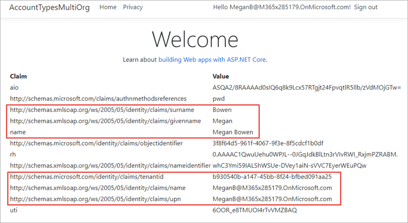
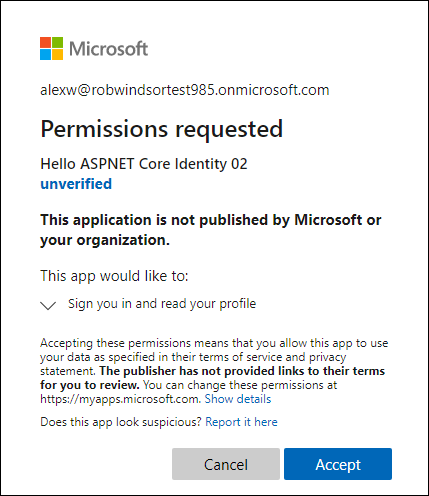
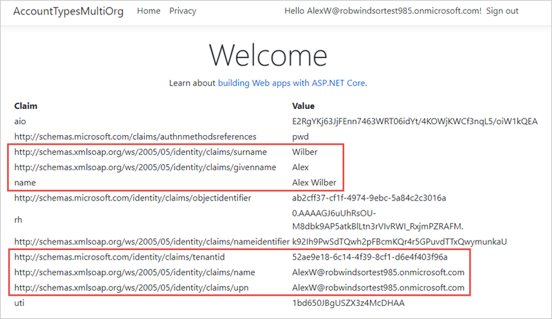

This exercise will demonstrate the different account types that are used within the Microsoft identity platform.

> [!NOTE]
> This exercise demonstrates signing into a web application using two different accounts. These two accounts will come from two organizations, one of them being the organization where the Azure AD application is registered. Therefore, in order to complete the exercise, you'll need access to two user accounts in different Azure AD directories.

## Create an application that only allows a single organization's users to sign in

In this first application, you'll create an Azure AD application and an ASP.NET Core web application that allows users from the current organization to sign in and display their information.

### Create a single-tenant Azure AD application

Open a browser and navigate to the [Azure Active Directory admin center (https://aad.portal.azure.com)](https://aad.portal.azure.com). Sign in using a **Work or School Account** that has global administrator rights to the tenancy.

Select **Azure Active Directory** in the left-hand navigation.

  

Select **Manage > App registrations** in the left-hand navigation.

On the **App registrations** page, select **New registration**.

  

On the **Register an application** page, set the values as follows:

- **Name**: Hello ASPNET Core Identity 01
- **Supported account types**: Accounts in this organizational directory only (Single tenant)

    

Select **Register** to create the application.

On the **Hello ASPNET Core Identity 01** page, copy the values **Application (client) ID** and **Directory (tenant) ID**; you'll need these values later in this exercise.

  

Select **Manage > Authentication** in the left-hand navigation.

On the **Authentication** page, select **Add a platform**. When the **Configure platforms** panel appears, select **Web**.



In the **Configure Web** panel, add **https://localhost:3007** under **Redirect URIs**, add **https://localhost:3007/signout-oidc** under **Logout URL**, select **ID tokens (used for implicit and hybrid flows)** under **Implicit grant and hybrid flows**, and select **Configure**.



When the **Authentication** page refreshes, select **Add URI**, add **https://localhost:3007/signin-oidc**, and select **Save** near the top of the page to save the changes. 



### Create a single organization ASP.NET core web application

> [!NOTE]
> The instructions below assume you are using .NET 5. They were last tested using v5.0.202 of the .NET 5 SDK.

Open your command prompt, navigate to a directory where you want to save your work, create a new folder, and change directory into that folder.

Execute the following command to create a new ASP.NET Core MVC web application:

```shell
dotnet new mvc --auth SingleOrg -o AccountTypesSingleOrg
```

Open the application in Visual Studio Code using the following command:

```console
code .
```

If Visual Studio code displays a dialog box asking if you want to add required assets to the project, select **Yes**.

#### Configure the web application with the Azure AD application you created

Locate and open the **./appsettings.json** file in the ASP.NET Core project.

Set the **AzureAd.Domain** property to the domain of your Azure AD tenant where you created the Azure AD application (*for example: contoso.onmicrosoft.com*).

Set the **AzureAd.TenantId** property to the **Directory (tenant) ID** you copied when creating the Azure AD application in the previous step.

Set the **AzureAd.ClientId** property to the **Application (client) ID** you copied when creating the Azure AD application in the previous step.

#### Update the web application's launch configuration

Locate and open the **./Properties/launchSettings.json** file in the ASP.NET Core project.

Set the **iisSettings.iisExpress.applicationUrl** property to **https://localhost:3007**.

Set the **iisSettings.iisExpress.sslPort** property to **3007**.

#### Update the user experience

Finally, update the user experience of the web application to display all the claims in the OpenID Connect ID token.

Locate and open the **./Views/Home/Index.cshtml** file.

Add the following code to the end of the file:

```html
@if (User.Identity.IsAuthenticated)
{
<div>
  <table cellpadding="2" cellspacing="2">
    <tr>
      <th>Claim</th>
      <th>Value</th>
    </tr>
    @foreach (var claim in User.Claims)
    {
      <tr>
        <td>@claim.Type</td>
        <td>@claim.Value</td>
      </tr>
    }
  </table>
</div>
}
```

#### Build and test the web app

Run the following command in a command prompt to ensure the developer certificate has been trusted:

```console
dotnet dev-certs https --trust
```

Run the following command in a command prompt to compile the application:

```shell
dotnet build
```

Run the following command to run the application:

```shell
dotnet run
```

Open a browser and navigate to the url **https://localhost:5001**. The web application will redirect you to the Azure AD sign in page.

Sign in using a Work and School account from your Azure AD directory. Azure AD will redirect you back to the web application. 


Notice some of the details from the claims included in the ID token. Take special note of the **preferred_username** and **tenantid** claim. These claims indicate the ID of the Azure AD directory and ID of the user that signed in. Make a note of these values to compare them to the values displayed later in this exercise.

> [!NOTE]
> Optional claims may be added to the ID token. This is done using the **Token configuration** option in the Azure AD app registration.

Now try logging in as a user from a different organization. Select the **Sign out** link in the top left. Wait for Azure AD and the web application signs out the current user. When the web application reloads, repeat the sign in process, except this time try signing in as a user from a different organization or use a Microsoft Account.

Notice Azure AD will reject the user's sign in, explaining that the user's account doesn't exist in the current tenant.



Stop the web server by pressing <kbd>CTRL</kbd>+<kbd>C</kbd> in the command prompt.

## Create an application that allows any organization's users to sign in

In this second application, you'll create an Azure AD application and ASP.NET Core web application that allow users from any organization or Microsoft Accounts to sign in and display their information.

### Create a multi-tenant Azure AD application

Create a second Azure AD application using the same process outlined previously in this exercise. However, when registering the new application, use the following values on the **Register an application** page:

- **Name**: Hello ASPNET Core Identity 02
- **Supported account types**: Accounts in any organizational directory only (Any Azure AD directory - Multitenant)

    

Select **Register** to create the application.

Repeat the remaining steps to set the applications Redirect URIs, Logout URL, and Implicit grant settings to match the same values as the first Azure AD application.

### Create a multiple organization ASP.NET core web application

> [!NOTE]
> The instructions below assume you are using .NET 5. They were last tested using v5.0.202 of the .NET 5 SDK.

Open your command prompt, navigate to a directory where you want to save your work, create a new folder, and change directory into that folder.

Execute the following command to create a new ASP.NET Core MVC web application:

```shell
dotnet new mvc --auth MultiOrg -o AccountTypesMultiOrg
```

Open the application in Visual Studio Code using the following command:

```console
code .
```

If Visual Studio code displays a dialog box asking if you want to add required assets to the project, select **Yes**.

#### Configure the web application with the Azure AD application you created

Locate and open the **./appsettings.json** file in the ASP.NET Core project.

Set the **AzureAd.ClientId** property to the **Application (client) ID** you copied when creating the Azure AD application in the previous step.

#### Update the web application's launch configuration

Locate and open the **./Properties/launchSettings.json** file in the ASP.NET Core project.

Set the **iisSettings.iisExpress.applicationUrl** property to **https://localhost:3007**.

Set the **iisSettings.iisExpress.sslPort** property to **3007**.

#### Update the user experience

Finally, update the user experience of the web application to display all the claims in the OpenID Connect ID token.

Locate and open the **./Views/Home/Index.cshtml** file.

Add the following code to the end of the file:

```html
@if (User.Identity.IsAuthenticated)
{
<div>
  <table cellpadding="2" cellspacing="2">
    <tr>
      <th>Claim</th>
      <th>Value</th>
    </tr>
    @foreach (var claim in User.Claims)
    {
      <tr>
        <td>@claim.Type</td>
        <td>@claim.Value</td>
      </tr>
    }
  </table>
</div>
}
```

#### Build and test the web app

Execute the following command in a command prompt to compile and run the application:

```shell
dotnet build
dotnet run
```

Open a browser and navigate to the url **https://localhost:5001**. The web application will redirect you to the Azure AD sign in page.

Sign in using a Work and School account from your Azure AD directory. Azure AD will redirect you back to the web application. 



Notice some of the details from the claims included in the ID token. Take special note of the **preferred_username** and **tenantid** claim. These indicate the ID of the Azure AD directory and ID of the user that signed in. Make a note of these values to compare them to the values displayed later in this exercise.

Now try logging in as a user from a different organization. Select the **Sign out** link in the top left. Wait for Azure AD and the web application signs out the current user.

This time, the user is prompted to first trust the application:



Select **Accept**.

Notice the web application's page loads with different claims, specifically for the **preferred_username** and **tenantid** claim. This indicates the user is not from the current directory where the Azure AD application is registered:



Stop the web server by pressing <kbd>CTRL</kbd>+<kbd>C</kbd> in the command prompt.

## Summary

In this exercise, you learned how to create different types of Azure AD applications and use an ASP.NET Core application to support the different sign in options that support different types of accounts.
