This exercise will demonstrate how to configure and implement an application that supports B2B.

> [!NOTE]
> This exercise demonstrates signing into a web application using three different accounts. These three accounts will come from two organizations, one of them being the organization where the Azure AD application is registered. Therefore, in order to complete the exercise, you'll need access to two user accounts in different Azure AD directories.

In this application, you'll create an an Azure AD application and ASP.NET Core web application that allow users from the current organization to sign in and display their information. You'll then invite a user from another organization as a guest to access the same resources in your organization

## Create a single-tenant Azure AD application

Open a browser and navigate to the [Azure Active Directory admin center (https://aad.portal.azure.com)](https://aad.portal.azure.com). Sign in using a **Work or School Account** that has global administrator rights to the tenancy.

Select **Azure Active Directory** in the left-hand navigation.

  

Select **Manage > App registrations** in the left-hand navigation.

On the **App registrations** page, select **New registration**.

  

On the **Register an application** page, set the values as follows:

- **Name**: Hello ASPNET Core Identity 03
- **Supported account types**: Accounts in this organizational directory only (Single tenant)

    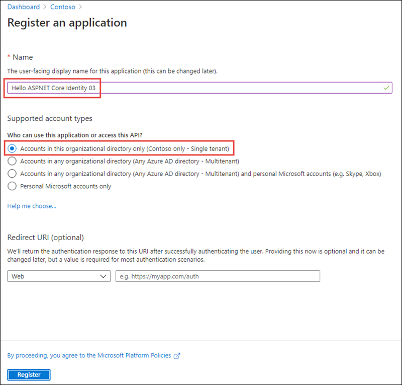

Select **Register** to create the application.

On the **Hello ASPNET Core Identity 03** page, copy the values **Application (client) ID** and **Directory (tenant) ID**; you'll need these values later in this exercise.

  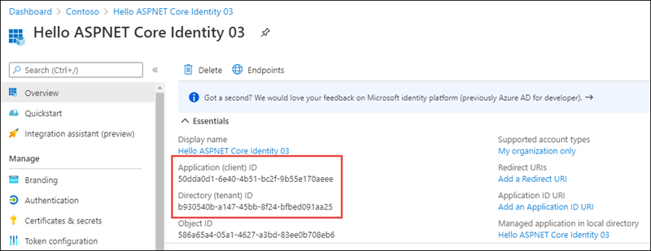

Select **Manage > Authentication** in the left-hand navigation.

In the **Authentication** page, select **Add a platform**. When the **Configure platform** panel appears, select **Web**.

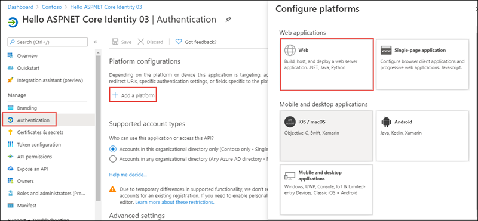

In the **Configure Web** panel, add **https://localhost:3007** under **Redirect URIs**, add **https://localhost:3007/signout-oidc** under **Logout URL**, select **ID tokens (used for implicit and hybrid flows)** under **Implicit grant and hybrid flows**, and select **Configure**.

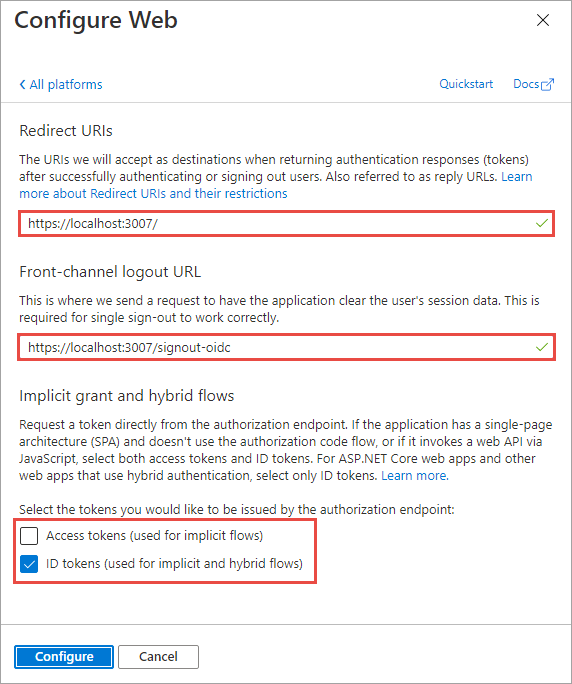

When the **Authentication** page refreshes, select **Add URI**, add **https://localhost:3007/signin-oidc**, and select **Save** near the top of the page to save the changes. 


## Create a single organization ASP.NET core web application

> [!NOTE]
> The instructions below assume you are using .NET 5. They were last tested using v5.0.202 of the .NET 5 SDK.

Open your command prompt, navigate to a directory where you want to save your work, create a new folder, and change directory into that folder.

Execute the following command to create a new ASP.NET Core MVC web application:

```shell
dotnet new mvc --auth SingleOrg -o TopologyOptions
```

Open the application in Visual Studio Code using the following command:

```console
code .
```

If Visual Studio code displays a dialog box asking if you want to add required assets to the project, select **Yes**.

### Configure the web application with the Azure AD application you created

Locate and open the **./appsettings.json** file in the ASP.NET Core project.

Set the **AzureAd.Domain** property to the domain of your Azure AD tenant where you created the Azure AD application (*for example: contoso.onmicrosoft.com*).

Set the **AzureAd.TenantId** property to the **Directory (tenant) ID** you copied when creating the Azure AD application in the previous step.

Set the **AzureAd.ClientId** property to the **Application (client) ID** you copied when creating the Azure AD application in the previous step.

### Update the web application's launch configuration

Locate and open the **./Properties/launchSettings.json** file in the ASP.NET Core project.

Set the **iisSettings.iisExpress.applicationUrl** property to **https://localhost:3007**.

Set the **iisSettings.iisExpress.sslPort** property to **3007**.

### Update the user experience

Finally, update the user experience of the web application to display all the claims in the OpenID Connect ID token.

Locate and open the **./Views/Home/Index.cshtml** file.

Add the following code to the end of the file:

```html
@if (User.Identity.IsAuthenticated)
{
<div>
  <table cellpadding="2" cellspacing="2">
    <tr>
      <th>Claim</th>
      <th>Value</th>
    </tr>
    @foreach (var claim in User.Claims)
    {
      <tr>
        <td>@claim.Type</td>
        <td>@claim.Value</td>
      </tr>
    }
  </table>
</div>
}
```

## Build and test the web app

Run the following commands in a command prompt to compile and run the application:

```shell
dotnet build
dotnet run
```

Open a browser and navigate to the url **https://localhost:5001**. The web application will redirect you to the Azure AD sign in page.

Sign in using a Work and School account from your Azure AD directory. Azure AD will redirect you back to the web application. 

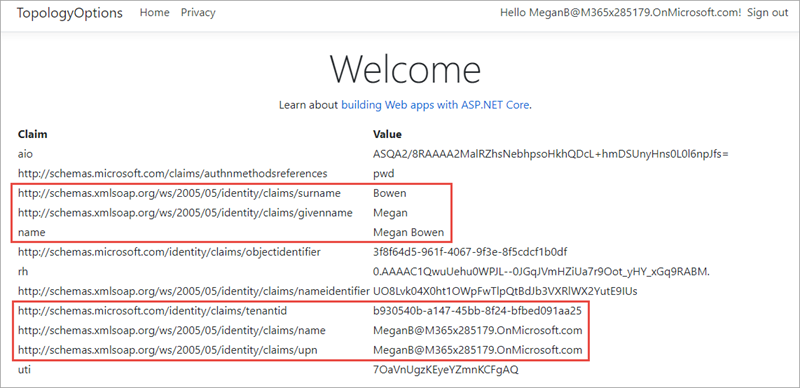

Notice some of the details from the claims included in the ID token. Take special note of the **preferred_username** and **tenantid** claim. These claims indicate the ID of the Azure AD directory and ID of the user that signed in. Make a note of these values to compare them to the values displayed later in this exercise.

Now try logging in as a user from a different organization. Select the **Sign out** link in the top left. Wait for Azure AD and the web application signs out the current user. When the web application reloads, repeat the sign in process, except this time try signing in as a user from a different organization or use a Microsoft Account.

Notice Azure AD will reject the user's sign in, explaining that the user's account doesn't exist in the current tenant.

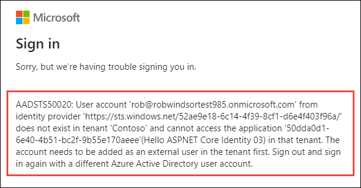

Before this user can access this application, they need to be added as a guest into the Azure AD directory where the application was registered.

## Invite a guest user from another organization

Within a browser, navigate to the [Azure Active Directory admin center (https://aad.portal.azure.com)](https://aad.portal.azure.com) and sign in using the **Work or School Account** that has global administrator rights to your tenant where you registered the Azure AD application.

In the left-hand navigation, select **Users**.

Examine the external user settings available to administrators by selecting **User Settings** and then **Manage external collaboration settings**.

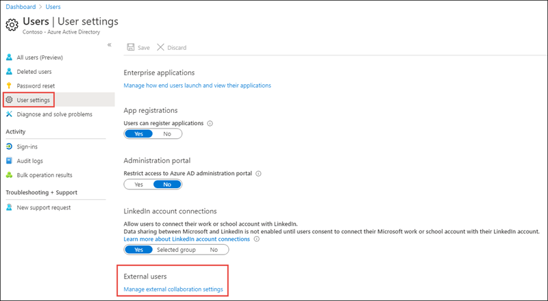

Notice that administrators can configure the Azure AD directory so guest users have limited rights compared to other users, and who can invite guest users.

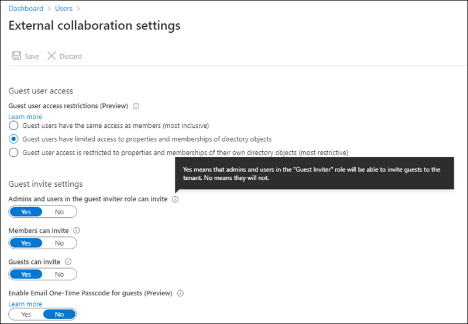

Now let's invite a guest user. Select **All users** in the left-hand navigation, and then select **New guest user**:

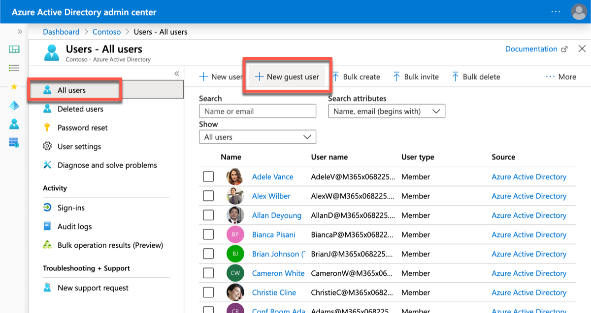

On the **New user** page, select **Invite user**, enter the email address of a user in another Azure AD directory that you want to invite and select **Invite**. In this scenario displayed in the following screenshot, we are inviting the user we previously tried to sign in with.

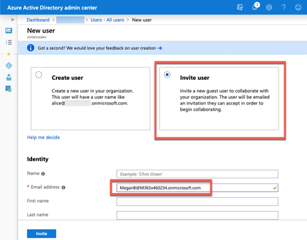

Now let's try to sign in with the user. In the browser, navigate to **https://localhost:5001**.

This time, after successfully logging in, the user's Azure AD directory will prompt the them to grant the application's Azure AD directory permissions. That is to sign in as the user and obtain basic information about them.

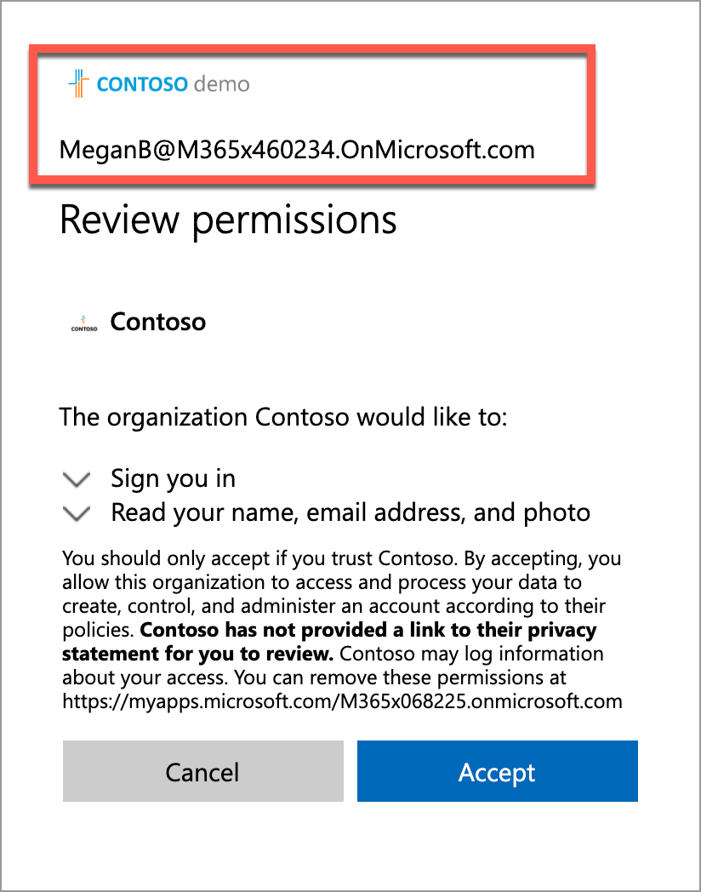

Take note of what is happening at this point. The application's Azure AD directory is not signing in the user, rather the user has been redirected to sign in with their Azure AD directory. Once they sign in, their Azure AD directory will provide a token to the application's directory. That token is used to verify the user is authenticated and that they have authorized the application to obtain their basic profile information. The application's Azure AD then created a new access token that can be used by our ASP.NET Core web application.

After selecting **Accept**, the user is taken to our ASP.NET application. Notice the difference in some of the claims.

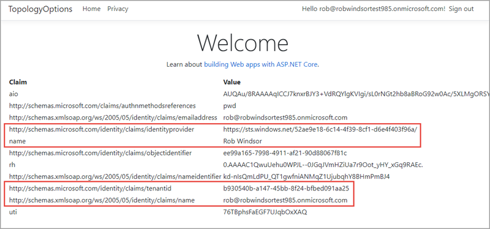

- The **identityprovider** claim is the ID of the Azure AD directory that authenticated the user. This claim is the user's Azure AD directory
- The **tenantid** claim is the ID of the Azure AD directory our application is registered in. Notice this value is not the same as the **identityprovider** claim, indicating the user's identity is in one directory while they have been added as a guest user to another Azure AD directory.

Stop the web server by pressing <kbd>CTRL</kbd>+<kbd>C</kbd> in the command prompt.

## Summary

In this exercise, you created an ASP.NET Core web application and an Azure AD application that allows guest users from partner Azure AD directories to sign in and access the application. You then invited a guest user to the directory and signed into the application with this user.
