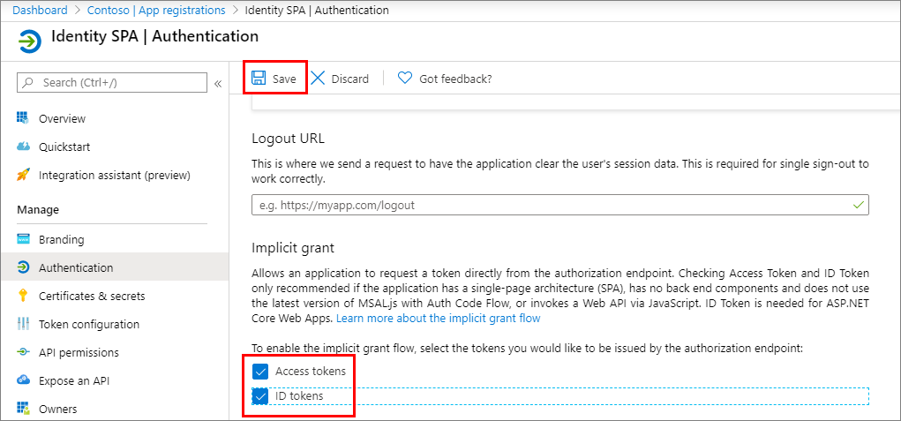

Web standards and modern browsers have advanced considerably in recent years to the point that developers can create sophisticated client-side applications. These client-side applications, also referred to as single-page applications (SPAs), can enable users to authenticate and obtain tokens from Microsoft identity platform that can be used to call secured web APIs.

In this unit, you’ll learn how to create, configure, and use Azure AD applications that use data returned from Microsoft Graph in single-page applications by using the OAuth 2.0 implicit grant flow.

## Single-page applications (SPA)

Many modern web applications are built as client-side SPAs written using JavaScript or a SPA framework such as Angular, Vue, or React. These applications run in a web browser and have different authentication characteristics than traditional server-side web applications. The Microsoft identity platform enables SPAs to sign in users and get tokens to access backend services or web APIs using the OAuth 2.0 implicit flow. The implicit flow allows the application to get ID tokens to represent the authenticated user and also access tokens needed to call protected APIs.

SPAs and other JavaScript apps that run primarily in a browser have unique challenges when it comes to authentication:

- Security characteristics of these apps are different from traditional server-based web applications
- Many authorization servers and identity providers don't support CORS requests
- Full-page browser redirects away from the app become invasive to the user experience

## OAuth 2.0 implicit grant flow

The OAuth 2.0 implicit grant flow is a popular way for these SPAs to authenticate to obtain an access token to connect to protected services. The Microsoft identity platform supports the OAuth 2.0 implicit grant flow.

## Azure AD app registration

In order for a SPA to use Microsoft identity to enable users to authenticate and obtain access tokens for use with services such as Microsoft Graph, you must register a new app with Azure AD. You can do this using the Azure AD admin center https://aad.portal.azure.com.

By default, Azure AD apps don't support the OAuth 2.0 implicit grant flow. After registering the Azure AD app, there are a few things you need to do.

First, ensure the redirect URI of the app points to the URL of the SPA. This URL must match the redirect URL provided by the SPA when the authentication process is initiated.

Next, ensure the implicit flow is enabled by selecting the **ID token** option on the app's authentication settings. If the app is also going to request an access token to use in authenticating requests to other Microsoft identity-protected endpoints, you must also select the **Access tokens** option.



## MSAL JS & code configuration

The easiest way to use Microsoft identity for authentication and to obtain access tokens to authorize requests to secured endpoints in SPAs is to use the Microsoft Authentication Library (MSAL) for JavaScript.

After adding a script reference to the page, add the following code to obtain an instance of the application:

```js
const msalConfig = {
  auth: {
    clientId: '{{AZUREAD_APP_ID}}',
    authority: 'https://login.microsoftonline.com/{{AZUREAD_DIRECTORY_ID}}',
    redirectURI: 'https://localhost:3007'
  },
  cache: {
    cacheLocation: "localStorage",
    storeAuthStateInCookie: true
  }
};
const msalApplication = new Msal.UserAgentApplication(msalConfig);
```

The app ID and directory ID tokens in the code are placeholders for the values from the Azure AD app.

> [!IMPORTANT]
> The preferred experience when using MSAL when signing-in and obtaining access tokens is to use a popup window. However, some browsers have known issues with popup windows. In these cases, you can choose to use MSAL's equivalent methods that use browser redirects.

## Sign in

With the application configured, the next step is for the user to sign in. Do this by calling the `loginPopup()` method and pass in an object with the wanted permissions defined:

```js
var loginRequest = {
  scopes: ["user.read", "mail.read"]
};
msalApplication.loginPopup(loginRequest)
  .then(function (loginResponse) {
    let idToken = loginResponse.idToken;
  }).catch(function (error) {
    console.log(error);
  });
```

This code will open a popup that loads the Azure AD sign-in experience. If the user hasn't signed in previously and granted the app the specified permissions, after a successful sign-in, Azure AD will present the user with the consent experience.


After completing the sign-in experience, MSAL.js will close the sign-in popup and execute the success path of the `loginPopup()` method.

## Acquire token

After the user has signed in, the next step is to obtain an access token to use in the authorization header of the request.

There are two methods on the MSAL.js API that you can use for this task:

- `acquireTokenSilent()`: If the user has already signed in and an interactive sign-in is not required, this method will return a response that includes the access token:

    ```js
    var accessTokenRequest = { scopes: ["user.read", "mail.read"] };

    msalApplication.acquireTokenSilent(accessTokenRequest)
      .then(function(accessTokenResponse) {
        let accessToken = accessTokenResponse.accessToken;
      });
    ```

- `acquireTokenPopup()`: if the `acquireTokenSilent()` fails and/or an interactive sign-in is required, you can use this method. It will combine the request to sign-in and obtain an access token in one step:

    ```js
    var accessTokenRequest = { scopes: ["user.read", "mail.read"] };

    msalApplication.acquireTokenPopup(accessTokenRequest)
      .then(function(accessTokenResponse) {
        let accessToken = accessTokenResponse.accessToken;
      });
    ```

## Calling APIs - Microsoft Graph

Once your SPA has an access token, you can use it to call the secured endpoint, such as Microsoft Graph:

```js
getMessagesFromMSGraph(
  'https://graph.microsoft.com/v1.0/me/messages?$top=10&$select=subject',
  tokenResponse.accessToken
  onSuccessGraphCallback);

function getMessagesFromMSGraph(endpoint, accessToken, callback) {
  var xmlHttp = new XMLHttpRequest();
  xmlHttp.onreadystatechange = function () {
    if (this.readyState == 4 && this.status == 200)
      callback(JSON.parse(this.responseText));
  }
  xmlHttp.open("GET", endpoint, true);
  xmlHttp.setRequestHeader('Authorization', 'Bearer ' + accessToken);
  xmlHttp.send();
}
```

## Summary

In this unit, you learned how to create, configure, and use Azure AD applications that use data returned from Microsoft Graph in single-page applications by using the OAuth 2.0 implicit grant flow.
