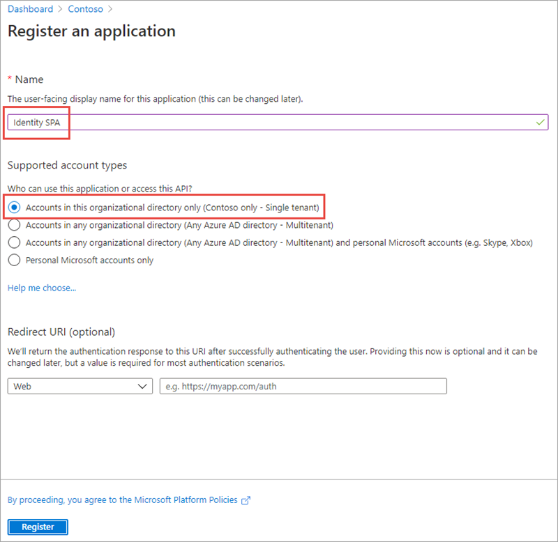
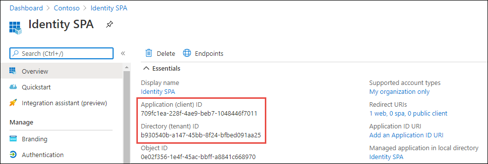
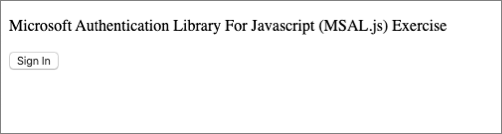
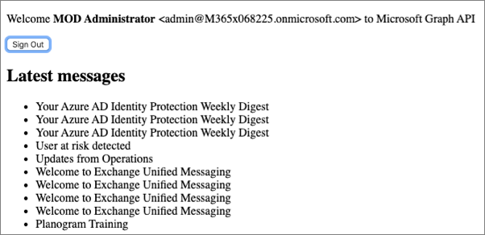

In this exercise, you’ll learn how to create and configure a single-page application that will use an Azure AD application to issue an authenticated request to Microsoft Graph using the OAuth 2.0 implicit grant flow.

## Create a single-page application

A single-page application (SPA) is typically a dynamic web application that runs entirely client side in the browser, usually in a single web page. To do this, the SPA must be served up as a routable page with a web server. The first step is to create a small web server and then create the SPA.

### Create a Node.js web application

Open your command prompt, navigate to a directory where you want to save your work, create a new folder, and change directory into that folder.

Execute the following command to create a new Node.js application:

```console
npm init -y
```

Install the Node.js webserver **express** and HTTP request middleware **morgan** into the application:

```console
npm install express morgan
```

Create a new file **server.js** in the root of the folder and add the following JavaScript to it. This code will start the web server:

```javascript
var express = require('express');
var app = express();
var morgan = require('morgan');
var path = require('path');

var port = 3007;
app.use(morgan('dev'));

// set the front-end folder to serve public assets.
app.use(express.static('web'));

// set up our one route to the index.html file.
app.get('*', function (req, res) {
  res.sendFile(path.join(__dirname + '/index.html'));
});

// Start the server.
app.listen(port);
console.log(`Listening on port ${port}...`);
console.log('Press CTRL+C to stop the web server...');
```

### Create a web page for the user to sign in and display details

In the current folder, add a new file named **index.html**. Add the following code to the **index.html** file:

```html
<!DOCTYPE html>
<html>
<head>
  <title>Microsoft Identity: Application Types</title>
  <script src="https://cdnjs.cloudflare.com/ajax/libs/bluebird/3.7.2/bluebird.min.js"></script>
  <script src="https://alcdn.msauth.net/lib/1.4.0/js/msal.min.js"></script>
</head>

<body>
  <div class="container">
    <div>
      <p id="WelcomeMessage">Microsoft Authentication Library For Javascript (MSAL.js) Exercise</p>
      <button id="SignIn" onclick="signIn()">Sign In</button>
    </div>
    <h2>Latest messages</h2>
    <div id="messages"></div>
  </div>
  <script>
    var msalConfig = {
      auth: {
        clientId: '',
        authority: '',
        redirectURI: ''
      },
      cache: {
        cacheLocation: "localStorage",
        storeAuthStateInCookie: true
      }
    };

    var graphConfig = {
      graphMeEndpoint: "https://graph.microsoft.com/v1.0/me",
      requestObj: {
        scopes: ["user.read", "mail.read"]
      }
    };

    var msalApplication = new Msal.UserAgentApplication(msalConfig);

    // init the auth handling on the page
    initPage();


    // TODO: add CODE before this line


    // TODO: add FUNCTIONS before this line


    function initPage() {
      // Browser check variables
      var ua = window.navigator.userAgent;
      var msie = ua.indexOf('MSIE ');
      var msie11 = ua.indexOf('Trident/');
      var msedge = ua.indexOf('Edge/');
      var isIE = msie > 0 || msie11 > 0;
      var isEdge = msedge > 0;

      // if you support IE, recommendation: sign in using Redirect APIs vs. popup
      // Browser check variables
      // can change this to default an experience outside browser use
      var loginType = isIE ? "REDIRECT" : "POPUP";

      // runs on page load, change config to try different login types to see what is best for your application
      switch (isIE) {
        case true:
          document.getElementById("SignIn").onclick = function () {
            msalApplication.loginRedirect(graphConfig.requestObj);
          };

          // avoid duplicate code execution on page load in case of iframe and popup window
          if (msalApplication.getAccount() && !msalApplication.isCallback(window.location.hash)) {
            updateUserInterface();
            acquireTokenRedirectAndGetUser();
          }
          break;
        case false:
          // avoid duplicate code execution on page load in case of iframe and popup window
          if (msalApplication.getAccount()) {
            updateUserInterface();
            acquireTokenPopupAndGetUser();
          }
          break;
        default:
          console.error('Please set a valid login type');
          break;
      }
    }
  </script>
</body>
</html>
```

> [!NOTE]
> The remainder of this exercise instructs you to add code to this **index.html** file. Pay close attention where you add the code using the two `TODO:` comments for placement.

Add the following function to the **index.html** file immediately before the `// TODO: add FUNCTIONS before this line` comment that will configure the welcome message for the page:

```javascript
// Update the welcome message &
// init the signin button
function updateWelcomeMessageAndSigninControl() {
  // update welcome message
  var divWelcome = document.getElementById('WelcomeMessage');
  divWelcome.innerHTML = `Welcome <strong>${msalApplication.getAccount().name}</strong> &lt;${msalApplication.getAccount().userName}&gt; to Microsoft Graph API`;

  // update signin/out button
  var loginbutton = document.getElementById('SignIn');
  loginbutton.innerHTML = 'Sign Out';
  loginbutton.setAttribute('onclick', 'signOut();');
}
```

Next, add the following functions to **index.html** immediately before the `// TODO: add FUNCTIONS before this line` comment. These functions request an access token from Microsoft identity and submit a request to Microsoft Graph for the current user's information. The function `acquireTokenPopupAndGetUserEmails()` uses the popup approach that works for all modern browsers while the `acquireTokenRedirectAndGetUserEmails()` function uses the redirect approach that is suitable for Internet Explorer:

```javascript
function acquireTokenPopupAndGetUserEmails() {
  // try to get token silently without logging in (ie: from token cache)
  msalApplication.acquireTokenSilent(graphConfig.requestObj)
    .then(function (tokenResponse) {
      // request email messages from Microsoft Graph
      getMessagesFromMSGraph(graphConfig.graphMeEndpoint +'/messages?$top=10&$select=subject', tokenResponse.accessToken, graphAPICallback);
    }).catch(function (error) {
      console.log(error);
      if (requiresInteraction(error.errorCode)) {
        // unable to get token silently, so log the user in interactively (ie: display popup)
        msalApplication.acquireTokenPopup(graphConfig.requestObj).then(function (tokenResponse) {
          // request email messages from Microsoft Graph
          getMessagesFromMSGraph(graphConfig.graphMeEndpoint +'/messages?$top=10&$select=subject', tokenResponse.accessToken, graphAPICallback);
        }).catch(function (error) {
          console.log(error);
        });
      }
    });
}

function acquireTokenRedirectAndGetUserEmails() {
  // try to get token silently without logging in (ie: from token cache)
  msalApplication.acquireTokenSilent(graphConfig.requestObj).then(function (tokenResponse) {
    getMessagesFromMSGraph(graphConfig.graphMeEndpoint +'/messages?$top=10&$select=subject', tokenResponse.accessToken, graphAPICallback);
  }).catch(function (error) {
    console.log(error);
    // unable to get token silently, so log the user in interactively (ie: display popup)
    if (requiresInteraction(error.errorCode)) {
      msalApplication.acquireTokenRedirect(graphConfig.requestObj);
    }
  });
}

// Check the error code for the error returned to determine if interactive login required
function requiresInteraction(errorCode) {
  if (!errorCode || !errorCode.length) {
    return false;
  }
  return errorCode === "consent_required" ||
          errorCode === "interaction_required" ||
          errorCode === "login_required";
}
```

These functions first attempt to retrieve the access token silently from the currently signed in user. If the user needs to sign in, the functions will trigger either the popup or redirect authentication process.

The redirect approach to authenticating requires an extra step. The MSAL application on the page needs to see if the current page was requested based on a redirect from Azure AD. If so, it needs to process information in the URL request provided by Azure AD.

Add the following function immediately before the `// TODO: add FUNCTIONS before this line` comment:

```javascript
function authRedirectCallBack(error, response) {
  if (error) {
    console.log(error);
  } else {
    if (response.tokenType === "access_token") {
      getMessagesFromMSGraph(graphConfig.graphMeEndpoint +'//messages?$top=10&$select=subject', response.accessToken, graphAPICallback);
    } else {
      console.log("token type is:" + response.tokenType);
    }
  }
}
```

Configure MSAL to use this function by adding the following line immediately before the `// TODO: add CODE before this line` comment:

```javascript
msalApplication.handleRedirectCallback(authRedirectCallBack);
```

Once the user is authenticated, the code can submit a request to Microsoft Graph for the current user's information. The two `acquireToken*()` functions pass the access token acquired from Azure AD to the function.

Add the following function immediately before the `// TODO: add FUNCTIONS before this line` comment:

```javascript
function getMessagesFromMSGraph(endpoint, accessToken, callback) {
  var xmlHttp = new XMLHttpRequest();
  xmlHttp.onreadystatechange = function () {
    if (this.readyState == 4 && this.status == 200)
      callback(JSON.parse(this.responseText));
  }
  xmlHttp.open("GET", endpoint, true);
  xmlHttp.setRequestHeader('Authorization', 'Bearer ' + accessToken);
  xmlHttp.send();
}

// Process response from Microsoft Graph
function graphAPICallback(data) {
  var htmlBody = '';
  data.value.forEach(message => {
    htmlBody += `<li>${message.subject}</li>`;
  });
  document.getElementById("messages").innerHTML = `<ul>${htmlBody}</ul>`;
}
```

Finally, add the following two functions to implement a sign in and sign out capability for the button on the page.

Add the following function immediately before the `// TODO: add FUNCTIONS before this line` comment:

```javascript
function signIn() {
  msalApplication.loginPopup(graphConfig.requestObj)
    .then(function (loginResponse) {
      updateWelcomeMessageAndSigninControl();
      acquireTokenPopupAndGetUserEmails();
    }).catch(function (error) {
      console.log(error);
    });
}

function signOut() {
  msalApplication.logout();
}
```

## Create an Azure AD application

The web page you created will submit a request to Microsoft Graph to retrieve the user's details. All requests to Microsoft Graph must include an access token as proof of the user's identity and that they have the necessary permissions to call Microsoft Graph. To obtain an access token, you must create an Azure AD application.

Open a browser and navigate to the [Azure Active Directory admin center](https://aad.portal.azure.com). Sign in using a **Work or School Account** that has global administrator rights to the tenant.

Select **Azure Active Directory** in the left-hand navigation.

Select **App registrations** in the left-hand navigation.

  

On the **App registrations** page, select **New registration**.

  

On the **Register an application** page, set the values as follows:

- **Name**: Identity SPA
- **Supported account types**: Accounts in this organizational directory only (Single tenant)
- **Redirect URI**: Web = http://localhost:3007

  

Select **Register** to create the application.

On the **Identity SPA** page, copy the values **Application (client) ID** and **Directory (tenant) ID**; you'll need these values later in this exercise.

  

On the **Identity SPA** page, select the **1 web, 0 public client** link under the **Redirect URIs**.

Locate the section **Implicit grant** and select both **Access tokens** and **ID tokens**. This tells Azure AD to return these tokens the authenticated user if requested.

  

Select **Save** in the top menu to save your changes.

## Update the web page with the Azure AD application details

The last step is to configure the web page to use the Azure AD application.

Locate the `var msalConfig = {}` code in the **index.html** file. The `auth` object contains three properties you need to set as follows:

- `clientId`: set to the Azure AD application's ID
- `authority`: set to **https://login.microsoftonline.com/{{DIRECTORY_ID}}**, replacing the **{{DIRECTORY_ID}}** with the Azure AD directory ID of the Azure AD application
- `redirectURI`: set to the Azure AD application's redirect URI: **http://localhost:3007**

## Test the web application

To test the web page, first start the local web server. In the command prompt, execute the following command from the root of the project:

```console
node server.js
```

Next, open a browser and navigate to http://localhost:3007. The page initially contains a default welcome message and sign-in button.



Select the **Sign in** button.

Depending on the browser, you're using, a popup window will load or the page will redirect to the Azure AD sign-in prompt.

Sign in using a **Work or School Account** and accept the permissions requested for the application by selecting **Accept**.


Depending on the browser you're using, the popup will disappear or you'll be redirected back to the web page. When the page loads, MSAL will request an access token and request your information from Microsoft Graph. After the request complete, it will display the results on the page:



Stop the local web server by pressing <kbd>CTRL</kbd>+<kbd>C</kbd> in the console.

## Summary

In this exercise, you learned how to create and configure a single-page application that will use an Azure AD application to issue an authenticated request to Microsoft Graph using the OAuth 2.0 implicit grant flow.
