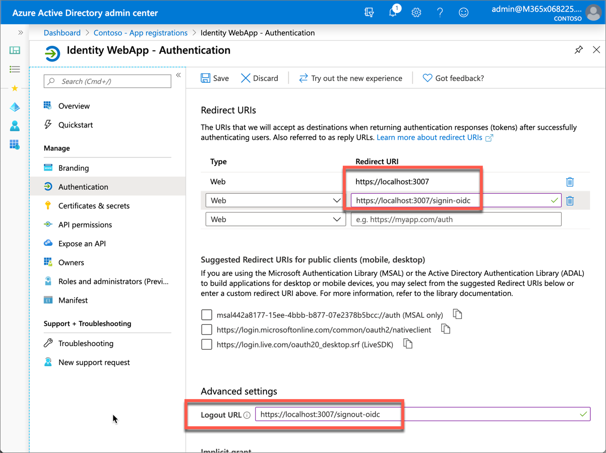
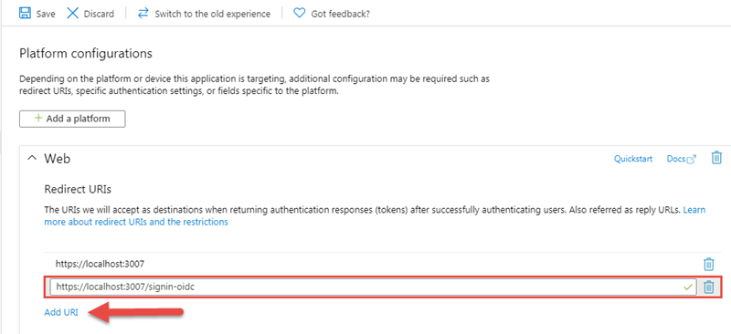
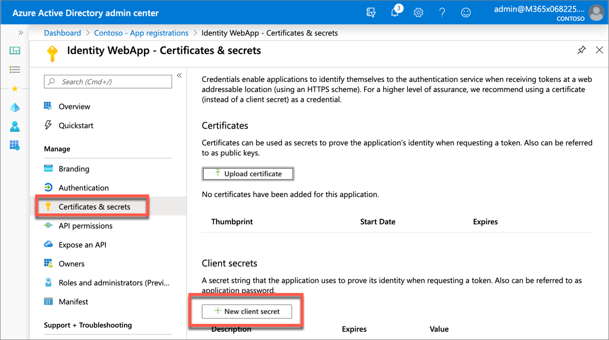
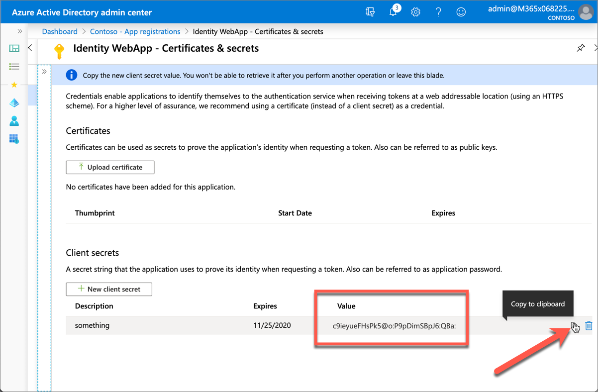

In this unit, you’ll learn how to create server-side web apps that allow users to sign in and grant the app permissions to act on the user’s behalf. One the user has authenticated and granted the app consent to act on their behalf, the web application will use data returned from Microsoft Graph by using the OAuth 2.0 auth code grant flow.

## Create an application that only allows a single organization's users to sign in

In this first application, you'll create an Azure AD application and ASP.NET Core web application that allows users from the current organization to sign in and display their information.

### Create a single-tenant Azure AD application

Open a browser and navigate to the [Azure Active Directory admin center](https://aad.portal.azure.com). Sign in using a **Work or School Account** that has global administrator rights to the tenancy.

Select **Azure Active Directory** in the left-hand navigation.

  

Select **Manage > App registrations** in the left-hand navigation.

On the **App registrations** page, select **New registration**.

  

On the **Register an application** page, set the values as follows:

- **Name**: Identity WebApp
- **Supported account types**: Accounts in this organizational directory only (Single tenant)

    

Select **Register** to create the application.

On the **Identity WebApp** page, copy the values **Application (client) ID** and **Directory (tenant) ID**; you'll need these values later in this exercise.

  

Select **Manage > Authentication** in the left-hand navigation.

On the **Authentication** page, select **Add a platform**. When the **Configure platforms** panel appears, select **Web**.



In the **Configure Web** panel, add **https://localhost:3007** under **Redirect URIs**, add **https://localhost:3007/signout-oidc** under **Logout URL**, select both **Access tokens** and **ID tokens** under **Implicit grant**, and select **Configure**.


When the **Authentication** page refreshes, select **Add URI**, add **https://localhost:3007/signin-oidc**, and select **Save** in the top menu to save your changes. 



### Create a client secret for the app

In order for the app to run without user involvement, it will sign in to Azure AD with an application ID and either a certificate or secret. In this exercise, you'll use a secret.

Select **Certificates & secrets** from the left-hand navigation panel.

Select the **New client secret** button:



When prompted, give the secret a description and select one of the expiration duration options provided and select **Add**. *What you enter and select doesn't matter for the exercise.*


The **Certificate & Secrets** page will display the new secret. Its important you copy this value as its only shown this one time; if you leave the page and come back, it will only show as a masked value.



## Create a single organization ASP.NET web application

Open your command prompt, navigate to a directory where you want to save your work, create a new folder, and change directory into that folder.

Execute the following command to create a new ASP.NET Core MVC web application:

```shell
dotnet new mvc --auth SingleOrg
```

After creating the application, run the following commands to ensure your new project runs correctly.

```shell
dotnet add package Microsoft.Identity.Client
dotnet add package Microsoft.Graph
dotnet add package Microsoft.Extensions.Configuration
```

Open the root folder of the new ASP.NET core application using a text editor such as Visual Studio Code.

### Update the web application's launch configuration

Locate and open the **./Properties/launchSettings.json** file in the ASP.NET Core project.

Set the **iisSettings.iisExpress.applicationUrl** property to **https://localhost:3007**.

Set the **iisSettings.iisExpress.sslPort** property to **3007**.

### Configure the web application with the Azure AD application

Locate and open the **./appsettings.json** file in the ASP.NET Core project.

Set the **AzureAd.Domain** property to the domain of your Azure AD tenant where you created the Azure AD application (*for example: contoso.onmicrosoft.com*).

Set the **AzureAd.TenantId** property to the **Directory (tenant) ID** you copied when creating the Azure AD application in the previous section.

Set the **AzureAd.ClientId** property to the **Application (client) ID** you copied when creating the Azure AD application in the previous section.

Create a new property, **ClientSecret**, immediately after the **ClientId**. Set the value of this to the client secret you created when creating the Azure AD application in the previous section.

Locate and open the **./Startup.cs** file in the ASP.NET Core project.

Add the following `using` statements after the existing statements:

```cs
using Microsoft.AspNetCore.Authentication.OpenIdConnect;
using Microsoft.IdentityModel.Protocols.OpenIdConnect;
using Microsoft.Identity.Client;
using System.Security.Claims;
```

Within the method `ConfigureServices()`, locate the following line:

```cs
services.AddAuthentication(AzureADDefaults.AuthenticationScheme)
    .AddAzureAD(options => Configuration.Bind("AzureAd", options));
```

Add the following code after the `services.AddAuthentication()` line. This code will configure the web app's middleware to support Azure AD for authentication and to obtain an ID token:

```cs
List<string> scopes = new List<string>();
scopes.Add("offline_access");
scopes.Add("user.read");

var appSettings = new AzureADOptions();
Configuration.Bind("AzureAd", appSettings);

var application = ConfidentialClientApplicationBuilder.Create(appSettings.ClientId)
                      .WithAuthority(appSettings.Instance + appSettings.TenantId +"/v2.0/")
                      .WithRedirectUri("https://localhost:5001" + appSettings.CallbackPath)
                      .WithClientSecret(appSettings.ClientSecret)
                      .Build();

// TODO: add MS Graph Code here

services.Configure<OpenIdConnectOptions>(AzureADDefaults.OpenIdScheme, options => {
    // configure authority to use v2 endpoint
    options.Authority = options.Authority + "/v2.0/";

    // asking Azure AD for id_token (to establish identity) and authorization code (to get access/refresh tokens for calling services)
    options.ResponseType = OpenIdConnectResponseType.CodeIdToken;

    // add the permission scopes you want the application to use
    options.Scope.Add("offline_access");
    options.Scope.Add("user.read");

    // validate the token issuer
    options.TokenValidationParameters.NameClaimType = "preferred_username";

    // wire up event to do second part of code authorization flow (exchanging authorization code for token)
    var handler = options.Events.OnAuthorizationCodeReceived;
    options.Events.OnAuthorizationCodeReceived = async context => {
      // handle the auth code returned post signin
      context.HandleCodeRedemption();
      if (!context.HttpContext.User.Claims.Any()) {
        (context.HttpContext.User.Identity as ClaimsIdentity).AddClaims(context.Principal.Claims);
      }

      // get token
      var token = await application.AcquireTokenByAuthorizationCode(options.Scope, context.ProtocolMessage.Code).ExecuteAsync();

      context.HandleCodeRedemption(null, token.IdToken);
      await handler(context).ConfigureAwait(false);
    };
});
```

### Add Microsoft Graph to the web app

The next step is to add support for calling Microsoft Graph to the web application.

Create a new folder **Helpers** in the ASP.NET application.

Then, create a new file, **GraphUserAccount.cs**, and add the following code to it. This helper class is used to map an `IAccount` object to an account that can be used with the Microsoft Graph .NET SDK:

```cs
using Microsoft.Identity.Client;

namespace Helpers
{
  public class GraphUserAccount: Microsoft.Identity.Client.IAccount
  {
    public string Email;
    public string ObjectId;
    public string TenantId;
    public string Username {get; set;}
    public string Environment {get; set;}
    public AccountId HomeAccountId {get; set;}

    public GraphUserAccount(System.Security.Claims.ClaimsPrincipal claimsPrincipal)
    {
      this.Email = claimsPrincipal.FindFirst("preferred_username")?.Value;
      this.ObjectId = claimsPrincipal.FindFirst("http://schemas.microsoft.com/identity/claims/objectidentifier")?.Value;
      this.TenantId = claimsPrincipal.FindFirst("http://schemas.microsoft.com/identity/claims/tenantid")?.Value;

      this.Username = this.Email;
      this.Environment = "login.windows.net";
      this.HomeAccountId = new AccountId($"{this.ObjectId}.{this.TenantId}", this.ObjectId, this.TenantId);
    }
  }
}
```

Locate and open the **./Startup.cs** file in the root of the project.

At the top of the file, add the following `using` statement to the end of the existing `using` statements:

```cs
using Microsoft.Graph;
```

Locate the following comment in the `ConfigureServices()` method:

```cs
// TODO: add MS Graph Code here
```

Add the following code immediately after that comment:

```cs
var graphServiceClient = new GraphServiceClient(new DelegateAuthenticationProvider(async (request) => {
  var graphUserAccount = new Helpers.GraphUserAccount(request.Properties["User"] as System.Security.Claims.ClaimsPrincipal);
  var accessToken = await application.AcquireTokenSilent(scopes, graphUserAccount).ExecuteAsync();
  request.Headers.Authorization = new System.Net.Http.Headers.AuthenticationHeaderValue("bearer", accessToken.AccessToken);
}));
services.AddSingleton<GraphServiceClient>(graphServiceClient);
```

This code will create a new instance of the Microsoft Graph .NET client. The client is configured to use the currently signed-in user to request an access token using MSAL. It then adds the token to all requests to Microsoft Graph as an HTTP **Authorization** header. Finally, it adds the service as a singleton to the ASP.NET Core dependency injection (DI) configuration.

### Add a User controller and view to the web app

The last step is to add a controller and view to the web app that will display the current user's name from a Microsoft Graph request.

Add a new file **UserController.cs** to the **Controllers** folder. Add the following code to it:

```cs
using System.Threading.Tasks;
using Microsoft.AspNetCore.Authorization;
using Microsoft.AspNetCore.Mvc;
using Microsoft.Extensions.Logging;

using Microsoft.Graph;

namespace <PROJECT-NAMESPACE>.Controllers
{
  [Authorize]
  public class UserController : Controller
  {
    private readonly ILogger<UserController> _logger;
    private readonly GraphServiceClient _graphServiceClient;

    public UserController(ILogger<UserController> logger, GraphServiceClient graphServiceClient)
    {
      _logger = logger;
      _graphServiceClient = graphServiceClient;
    }

    public async Task<IActionResult> Index()
    {
      var request = this._graphServiceClient.Me.Request().GetHttpRequestMessage();
      request.Properties["User"] = HttpContext.User;
      var response = await this._graphServiceClient.HttpProvider.SendAsync(request);
      var handler = new ResponseHandler(new Serializer());
      var user = await handler.HandleResponse<User>(response);

      return View(user);
    }
  }
}
```

Replace the string `<PROJECT-NAMESPACE>` with the root namespace of the project. This can be found in the **Startup.cs** file.

This controller's default method, `Index()`, submits a request to Microsoft Graph for the current user's details. It then deserializes the request to a `User` object and adds that to the view.

Now create the view to display the user's name.

Add a new folder **User** to the **Views** folder. Add a new file, **Index.cshtml**, to the new **User** folder and add the following code to it. This will display the currently signed-in user's name on the page:

```html
@{
  ViewData["Title"] = "User Page";
}

<div class="text-center">
  <h1 class="display-4">Welcome @Model.DisplayName</h1>
</div>
```

#### Build and test the web app

Execute the following command in a command prompt to compile and run the application:

```shell
dotnet build
dotnet run
```

Open a browser and navigate to the url **https://localhost:5001**. The web application will redirect you to the Azure AD sign in page.

Sign in using a Work and School account from your Azure AD directory. Azure AD will redirect you back to the web application.

Update the URL to **https://localhost:5001/User** to navigate to the **User** controller. Notice the name of the currently signed in user is displayed on the page:


## Summary

In this unit, you learned how to create server-side web apps that allow users to sign in and grant the app permissions to act on the user’s behalf. One the user has authenticated and granted the app consent to act on their behalf, the web application will use data returned from Microsoft Graph by using the OAuth 2.0 auth code grant flow.
