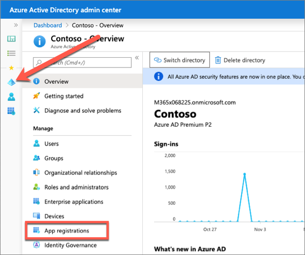
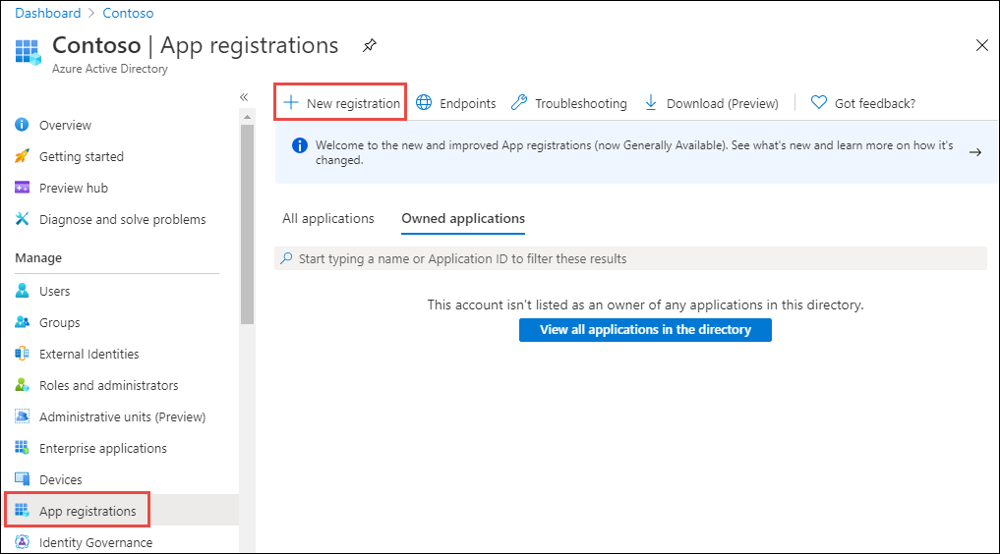
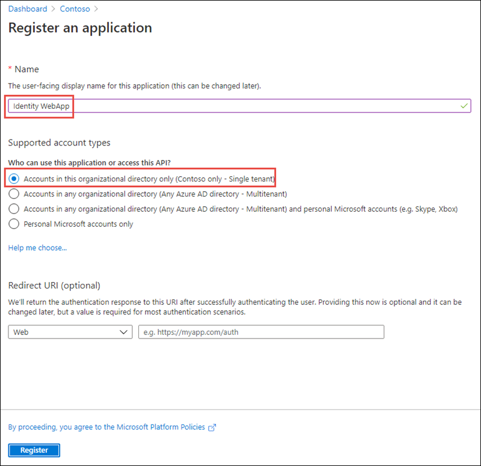
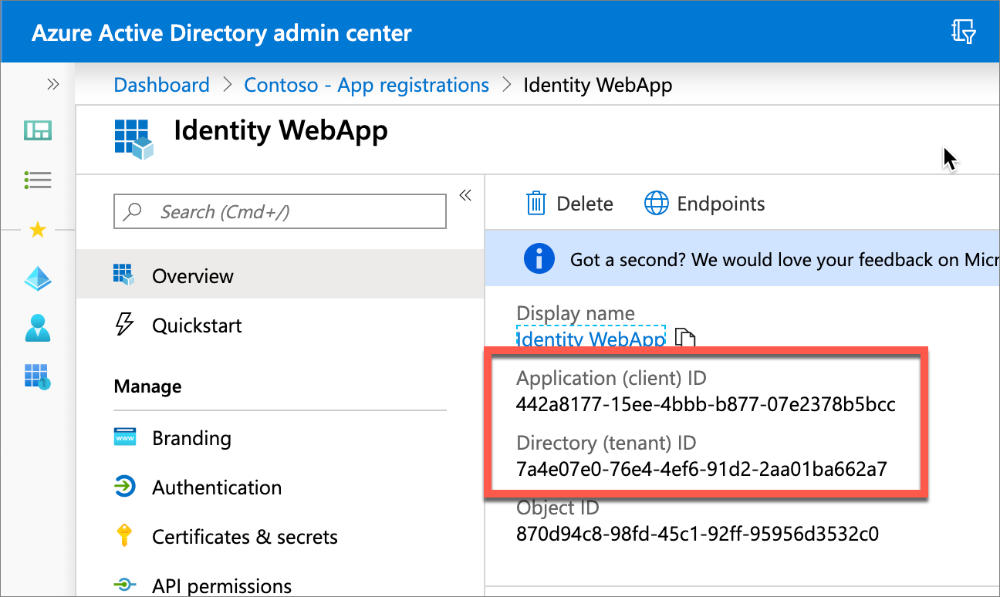
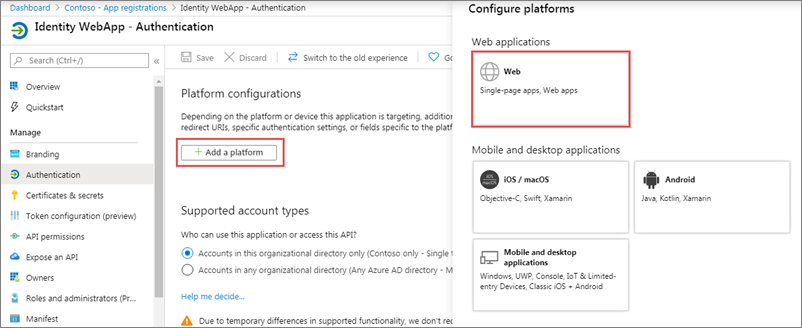
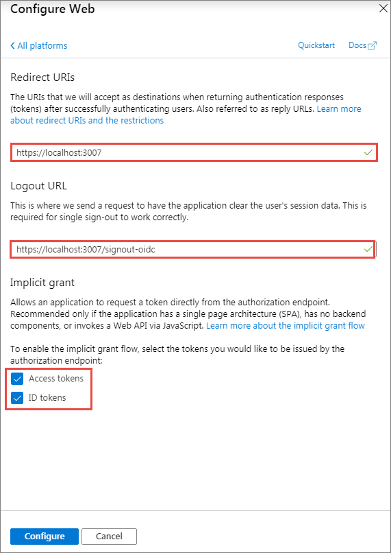
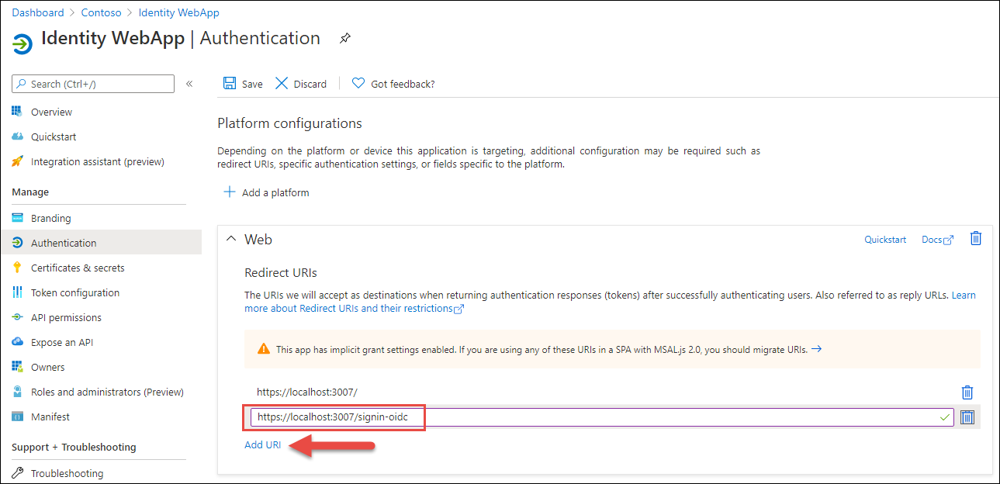
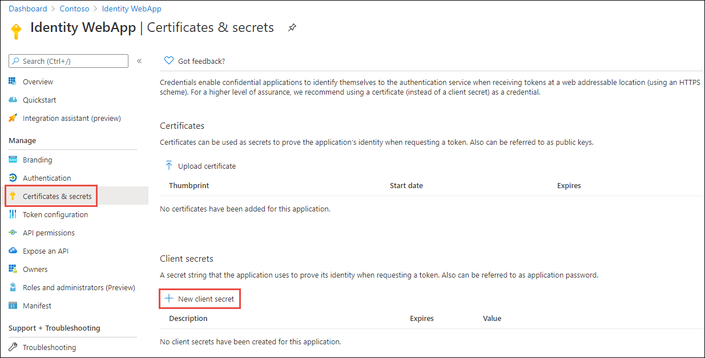
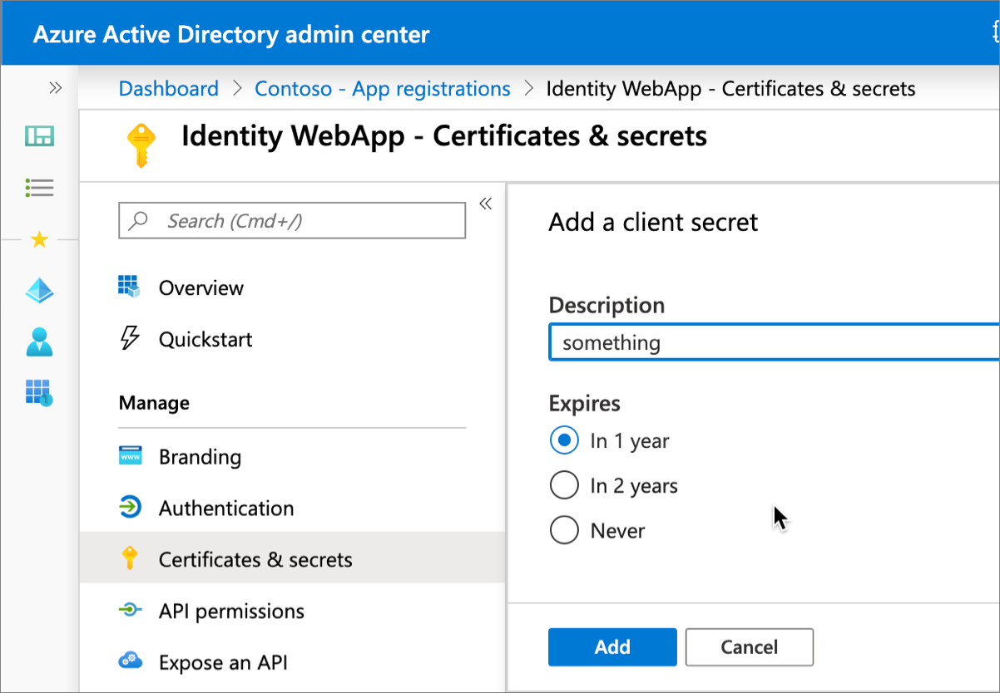
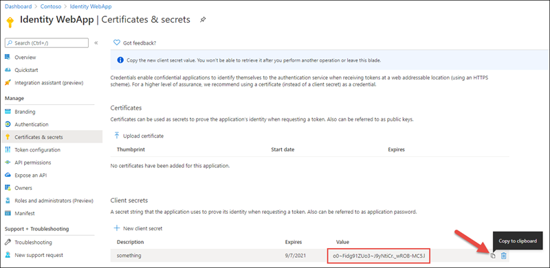

In this exercise, you'll learn how to a create server-side web app that allows a user to sign in and grant the app permissions to act on the user's behalf. Once the user has authenticated and granted the app consent to act on their behalf, the web application will use data returned from Microsoft Graph by using the OAuth 2.0 auth code grant flow.

## Create an application that only allows a single organization's users to sign in

In this example, you'll create an Azure AD application and an ASP.NET Core web application that allows users from the current organization to sign in and display their information.

### Create a single-tenant Azure AD application

Open a browser and navigate to the [Azure Active Directory admin center](https://aad.portal.azure.com). Sign in using a **Work or School Account** that has global administrator rights to the tenancy.

Select **Azure Active Directory** in the left-hand navigation.

  

Select **Manage > App registrations** in the left-hand navigation.

On the **App registrations** page, select **New registration**.

  

On the **Register an application** page, set the values as follows:

- **Name**: Identity WebApp
- **Supported account types**: Accounts in this organizational directory only (Single tenant)

    

Select **Register** to create the application.

On the **Identity WebApp** page, copy the values **Application (client) ID** and **Directory (tenant) ID**; you'll need these values later in this exercise.

  

Select **Manage > Authentication** in the left-hand navigation.

On the **Authentication** page, select **Add a platform**. When the **Configure platforms** panel appears, select **Web**.



In the **Configure Web** panel, add **https://localhost:3007** under **Redirect URIs**, add **https://localhost:3007/signout-oidc** under **Logout URL**, select **ID tokens (used for implicit and hybrid flows)** under **Implicit grant and hybrid flows**, and select **Configure**.



When the **Authentication** page refreshes, select **Add URI**, add **https://localhost:3007/signin-oidc**, and select **Save** in the top menu to save your changes. 



### Create a client secret for the app

In order for the app to run without user involvement, it will sign in to Azure AD with an application ID and either a certificate or secret. In this exercise, you'll use a secret.

Select **Certificates & secrets** from the left-hand navigation panel.

Select the **New client secret** button:



When prompted, give the secret a description and select one of the expiration duration options provided and select **Add**. *What you enter and select doesn't matter for the exercise.*



The **Certificate & Secrets** page will display the new secret. It's important you copy this value as it's only shown this one time; if you leave the page and come back, it will only show as a masked value.



## Create a single organization ASP.NET web application

> [!NOTE]
> The instructions below assume you are using .NET 5. They were last tested using v5.0.202 of the .NET 5 SDK.

Open your command prompt, navigate to a directory where you want to save your work, create a new folder, and change directory into that folder.

Execute the following command to create a new ASP.NET Core MVC web application:

```console
dotnet new mvc --auth SingleOrg -o IdentityWeb
```

After creating the application, run the following commands to ensure your new project runs correctly.

```console
cd IdentityWeb
dotnet add package Microsoft.Identity.Web
dotnet add package Microsoft.Identity.Web.UI
dotnet add package Microsoft.Identity.Web.MicrosoftGraph
```

Open the application in Visual Studio Code using the following command:

```console
code .
```

When a dialog box asks if you want to add required assets to the project, select **Yes**.

### Update the web application's launch configuration

Locate and open the **./Properties/launchSettings.json** file in the ASP.NET Core project.

Set the **iisSettings.iisExpress.applicationUrl** property to **https://localhost:3007**.

Set the **iisSettings.iisExpress.sslPort** property to **3007**.

### Configure the web application with the Azure AD application

Locate and open the **./appsettings.json** file in the ASP.NET Core project.

Set the **AzureAd.Domain** property to the domain of your Azure AD tenant where you created the Azure AD application (*for example: contoso.onmicrosoft.com*).

Set the **AzureAd.TenantId** property to the **Directory (tenant) ID** you copied when creating the Azure AD application in the previous section.

Set the **AzureAd.ClientId** property to the **Application (client) ID** you copied when creating the Azure AD application in the previous section.

Create a new property, **ClientSecret**, immediately after the **ClientId**. Set the value of this to the client secret you created when creating the Azure AD application in the previous section.

Locate and open the **./Startup.cs** file in the ASP.NET Core project.

Within the `ConfigureServices()` method, locate the following line:

```csharp
services.AddAuthentication(OpenIdConnectDefaults.AuthenticationScheme)
    .AddMicrosoftIdentityWebApp(Configuration.GetSection("AzureAd"));
```
Update the line to the following. This will configure the web app's middleware to add support for the Microsoft Graph:

```csharp
services.AddAuthentication(OpenIdConnectDefaults.AuthenticationScheme)
    .AddMicrosoftIdentityWebApp(Configuration.GetSection("AzureAd"))
    .EnableTokenAcquisitionToCallDownstreamApi(new string[] { "User.Read" })
    .AddMicrosoftGraph("https://graph.microsoft.com/v1.0", "User.Read")
    .AddInMemoryTokenCaches();
```

### Add a User controller and view to the web app

The last step is to add a controller and view to the web app that will display the current user's name from a Microsoft Graph request.

Add a new file **UserController.cs** to the **Controllers** folder. Add the following code to it:

```csharp
using System.Threading.Tasks;
using Microsoft.AspNetCore.Authorization;
using Microsoft.AspNetCore.Mvc;
using Microsoft.Extensions.Logging;
using Microsoft.Graph;
using Microsoft.Identity.Web;

namespace IdentityWeb.Controllers
{
  [Authorize]
  public class UserController : Controller
  {
    private readonly ILogger<UserController> _logger;
    private readonly GraphServiceClient _graphServiceClient;

    public UserController(ILogger<UserController> logger, GraphServiceClient graphServiceClient)
    {
      _logger = logger;
      _graphServiceClient = graphServiceClient;
    }


    [AuthorizeForScopes(Scopes = new[] { "User.Read" })]
    public async Task<IActionResult> Index()
    {
      var user = await _graphServiceClient.Me.Request().GetAsync();

      return View(user);
    }
  }
}
```

This controller's default method, `Index()`, submits a request to Microsoft Graph for the current user's details. This is done using the `GraphServiceClient` added as a singleton to the ASP.NET Core dependency injection (DI) configuration in the previous step. 

Now create the view to display the user's name.

Add a new folder **User** to the **Views** folder. Add a new file, **Index.cshtml**, to the new **User** folder and add the following code to it. This will display the currently signed-in user's name on the page:

```html
@{
  ViewData["Title"] = "User Page";
}

<div class="text-center">
  <h1 class="display-4">Welcome @Model.DisplayName</h1>
</div>
```

#### Build and test the web app

Execute the following command in a command prompt to compile and run the application:

```console
dotnet build
dotnet run
```

Open a browser and navigate to the url **https://localhost:5001**. The web application will redirect you to the Azure AD sign-in page.

Sign in using a Work and School account from your Azure AD directory. Azure AD will redirect you back to the web application.

Update the URL to **https://localhost:5001/User** to navigate to the **User** controller. Notice the name of the currently signed in user is displayed on the page:


## Summary

In this unit, you learned how to create a server-side web app that allows users to sign in and grant the app permissions to act on the user's behalf. One the user has authenticated and granted the app consent to act on their behalf, the web application will use data returned from Microsoft Graph by using the OAuth 2.0 auth code grant flow.
