The Microsoft identity platform implements the OAuth 2.0 authorization protocol. This protocol is a method that a third-party app can use to access web-hosted resources on behalf of a user. The web-hosted resources can define a set of permissions that can be used to implement functionality in smaller chucks.

In this exercise, you’ll learn about the different types of permissions supported by the Microsoft identity platform and the consent experience that users and admins must go through to grant permission requests to apps.

> [!NOTE]
> This exercise utilizes two different accounts in the same organization. One of the accounts, **admin@{org}.onmicrosoft.com**, is assigned the global administrator role and is used to perform management tasks in the directory such as creating the app. The other account, **adelev@{org}.onmicrosoft.com**, is not a member of the global administrator role and is used to demonstrate a typical user without administrative rights.

## Create a Node.js web application

> [!NOTE]
> The instructions below assume you are using v2.14.2 of the Microsoft Authentication Library for JavaScript 2.0.

In this first section, you'll create a web application to host a web page that will host the single page application. To do this, you'll create a Node.js web server to serve the HTML page from a web server running on your workstation as http://localhost:3007.

Open your command prompt, navigate to a directory where you want to save your work, create a new folder, and change directory into that folder.

Execute the following command to create a new Node.js application:

```console
npm init -y
```

Install the Node.js webserver **express** and HTTP request middleware **morgan** into the application:

```console
npm install express morgan
```

Open the application in **Visual Studio Code** using the following command:

```console
code .
```

Create a new file **server.js** in the root of the folder and add the following JavaScript to it. This code will start the web server:

```javascript
var express = require('express');
var app = express();
var morgan = require('morgan');
var path = require('path');

var port = 3007;
app.use(morgan('dev'));

// set the front-end folder to serve public assets.
app.use(express.static('web'));

// set up our one route to the index.html file.
app.get('*', function (req, res) {
  res.sendFile(path.join(__dirname + '/index.html'));
});

// Start the server.
app.listen(port);
console.log(`Listening on port ${port}...`);
console.log('Press CTRL+C to stop the web server...');
```

## Create a web page for the user to sign in and display details

Create a new folder **web** in the current folder and add a new file **index.html** to the folder. Add the following code to the **index.html** file:

```html
<!DOCTYPE html>
<html>
<head>
  <title>Getting Started with Microsoft identity</title>
  <script src="https://cdnjs.cloudflare.com/ajax/libs/bluebird/3.7.2/bluebird.min.js"></script>
  <script src="https://alcdn.msauth.net/browser/2.14.2/js/msal-browser.js"></script>
</head>

<body>
  <div class="container">
    <div>
      <p id="WelcomeMessage">Microsoft Authentication Library For Javascript (MSAL.js) Exercise</p>
      <button id="SignIn" onclick="signIn()">Sign In</button>
      <h2>Latest messages</h2>
      <div id="messages"></div>      
    </div>
    <div>
      <pre id="json"></pre>
    </div>
  </div>
  <script>
    var ua = window.navigator.userAgent;
    var msie = ua.indexOf('MSIE ');
    var msie11 = ua.indexOf('Trident/');
    var msedge = ua.indexOf('Edge/');
    var isIE = msie > 0 || msie11 > 0;
    var isEdge = msedge > 0;

    var msalConfig = {
      auth: {
        clientId: '',
        authority: '',
        redirectURI: 'http://localhost:3007'
      },
      cache: {
        cacheLocation: "localStorage",
        storeAuthStateInCookie: isIE || isEdge
      }
    };

    var graphConfig = {
      graphMeEndpoint: "https://graph.microsoft.com/v1.0/me",
      requestObj: {
        scopes: ["user.read", "mail.read"]
      }
    };

    var msalApplication = new msal.PublicClientApplication(msalConfig);
    var userName = "";
    var loginType = isIE ? "REDIRECT" : "POPUP";


    // TODO: add CODE before this line


    // TODO: add FUNCTIONS before this line
  </script>
</body>
</html>
```

> [!NOTE]
> The remainder of this exercise instructs you to add code to this **index.html** file. Pay close attention where you add the code using the using the two `TODO:` comments for placement.

Add the following function to the **index.html** file immediately before the `// TODO: add FUNCTIONS before this line` comment that will configure the welcome message for the page:

```javascript
function updateUserInterface() {
  var divWelcome = document.getElementById('WelcomeMessage');
  divWelcome.innerHTML = 'Welcome <strong>' + userName + '</strong> to Microsoft Graph API';

  var loginbutton = document.getElementById('SignIn');
  loginbutton.innerHTML = 'Sign Out';
  loginbutton.setAttribute('onclick', 'signOut();');
}
```

Next, add the following function to **index.html** immediately before the `// TODO: add FUNCTIONS before this line` comment. This function requests an access token from Microsoft identity and submits a request to Microsoft Graph for the current user's information. The function uses the popup approach for modern browsers and it uses the redirect approach for Internet Explorer:

```javascript
function acquireTokenAndGetUserEmails() {
  var request = graphConfig.requestObj;
  request.account = msalApplication.getAccountByUsername(userName);

  msalApplication.acquireTokenSilent(request)
    .then(function (tokenResponse) {
      getMessagesFromMSGraph(tokenResponse.accessToken, graphAPICallback);
    })
    .catch(function (error) {
      console.log("silent token acquisition fails.");
      if (error instanceof msal.InteractionRequiredAuthError) {
        if (loginType == "POPUP") {
          msalApplication.acquireTokenPopup(request)
            .then(function (tokenResponse) {
              getMessagesFromMSGraph(tokenResponse.accessToken, graphAPICallback);
            })
            .catch(function (error) { console.error(error); }
            );
        } else {
          msalApplication.acquireTokenRedirect(request);
        }
      } else {
        console.error(error);
      }
    });
}
```

The function first attempts to retrieve the access token silently from the currently signed in user. If the user needs to sign in, the function will trigger either the popup or redirect authentication process.

The redirect approach to authenticating requires an extra step. The MSAL application on the page needs to see if the current page was requested based on a redirect from Azure AD. If so, it needs to process information in the URL request provided by Azure AD.

Add the following code immediately before the `// TODO: add CODE before this line` comment:

```javascript
msalApplication.handleRedirectPromise()
  .then(handleResponse)
  .catch(function (error) { console.log(error); }
  );
```

Once the user is authenticated, the code can submit a request to Microsoft Graph for the current user's information. The `acquireTokenAndGetUser()` function passes the access token acquired from Azure AD to the `getUserFromMSGraph()` function you are about to add.

Add the following functions immediately before the `// TODO: add FUNCTIONS before this line` comment:

```javascript
function getMessagesFromMSGraph(accessToken, callback) {
  var endpoint = graphConfig.graphMeEndpoint + '/messages?$top=10&$select=subject';

  var xmlHttp = new XMLHttpRequest();
  xmlHttp.onreadystatechange = function () {
    if (this.readyState == 4 && this.status == 200)
      callback(JSON.parse(this.responseText));
  }
  xmlHttp.open("GET", endpoint, true);
  xmlHttp.setRequestHeader('Authorization', 'Bearer ' + accessToken);
  xmlHttp.send();
}

function graphAPICallback(data) {
  var htmlBody = '';
  data.value.forEach(message => {
    htmlBody += `<li>${message.subject}</li>`;
  });
  document.getElementById("messages").innerHTML = `<ul>${htmlBody}</ul>`;
}
```

Finally, add the following functions to implement a sign in and sign out capability for the button on the page.

Add the functions immediately before the `// TODO: add FUNCTIONS before this line` comment:

```javascript
function handleResponse(loginResponse) {
  if (loginResponse != null) {
    userName = loginResponse.account.username;
  } else {
    var currentAccounts = msalApplication.getAllAccounts();
    if (currentAccounts == null || currentAccounts.length == 0) {
      return;
    } else {
      userName = currentAccounts[0].username;
    }
  }

  updateUserInterface();
  acquireTokenAndGetUserEmails();
}

function signIn() {
  if (loginType == "POPUP") {
    msalApplication.loginPopup(graphConfig.requestObj)
      .then(handleResponse)
      .catch(function (error) { console.log(error); }
      );
  } else {
    msalApplication.loginRedirect(graphConfig.requestObj);
  }
}

function signOut() {
  var logoutRequest = {
    account: msalApplication.getAccountByUsername(userName)
  };

  msalApplication.logout(logoutRequest);
}
```

## Create an Azure AD application

The web page you created will submit a request to Microsoft Graph to retrieve the user's emails. All requests to Microsoft Graph must include an access token as proof of the user's identity and that they have the necessary permissions to call Microsoft Graph. To obtain an access token, you must create an Azure AD application.

Open a browser and navigate to the [Azure Active Directory admin center](https://aad.portal.azure.com). Sign in using a **Work or School Account** that has global administrator rights to the tenancy.

Select **Azure Active Directory** in the left-hand navigation.

Then select **Manage > App registrations** in the left-hand navigation.

  

On the **App registrations** page, select **New registration**.

  

On the **Register an application** page, set the values as follows:

- **Name**: Identity Exercise 01
- **Supported account types**: Accounts in this organizational directory only (Single tenant)

    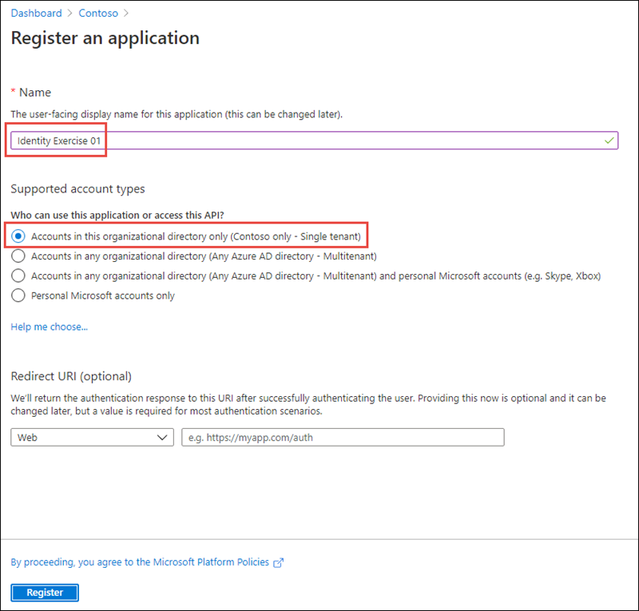

Select **Register** to create the application.

On the **Identity Exercise 01** page, copy the values **Application (client) ID** and **Directory (tenant) ID**; you'll need these values later in this exercise.

  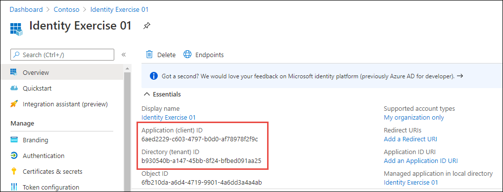

Select **Manage > Authentication** in the left-hand navigation.

On the **Authentication** page, select **Add a platform**. When the **Configure platforms** panel appears, select **Single-page application**.

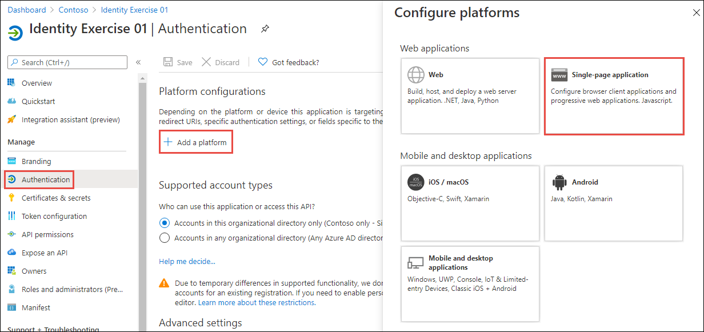

In the **Configure single-page application** panel, add **http://localhost:3007** under **Redirect URIs**, and select **Configure**.

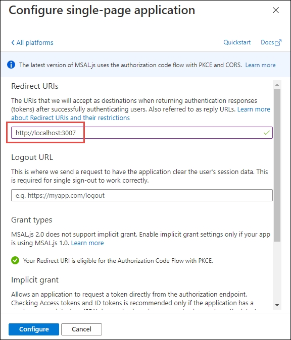

### Add permissions to the Azure AD app

Select **API Permissions** from the left-hand navigation, and then select **Add a permission**:

  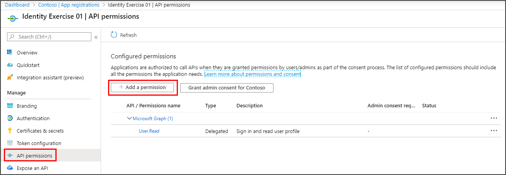

On the **Request API Permissions** page, select **Microsoft APIs**, **Microsoft Graph**, and then select **Delegated permissions**:

  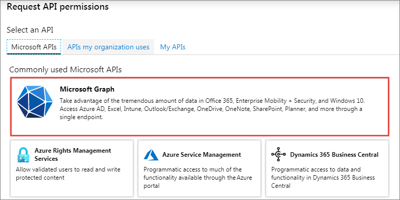

In the search box in the **Select permissions** section, enter **Mail.R**, select the permission **Mail.Read** permission, and then select **Add permissions**.

  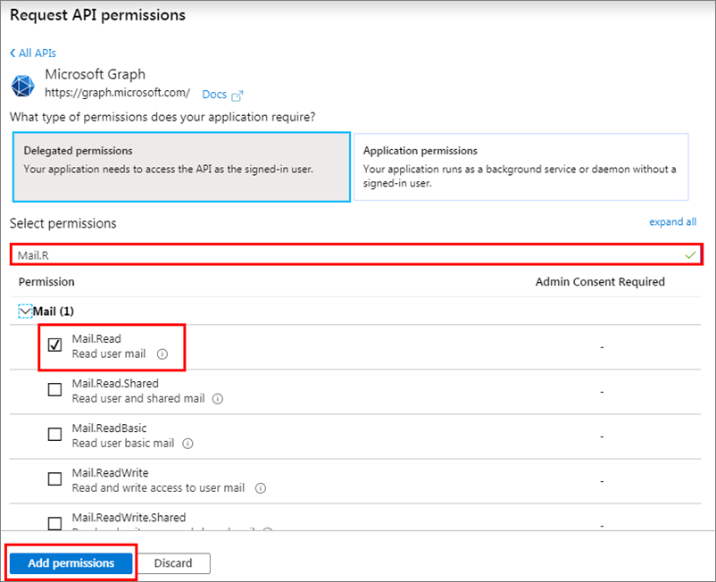

## Update the web page with the Azure AD application details

The last step is to configure the web page to use the Azure AD application.

Locate the `var msalConfig = {}` code in the **index.html** file. The `auth` object contains three properties you need to set as follows:

- `clientId`: set to the Azure AD application's ID
- `authority`: set to **https://login.microsoftonline.com/{{DIRECTORY_ID}}**, replacing the **{{DIRECTORY_ID}}** with the Azure AD directory ID of the Azure AD application
- `redirectURI`: set to the Azure AD application's redirect URI: **http://localhost:3007**

## Test the web application

To test the web page, first start the local web server. In the command prompt, execute the following command from the root of the project:

```console
node server.js
```

Next, open a browser where you are not signed-in to Office 365 and navigate to **http://localhost:3007**. The page initially contains a default welcome message and sign-in button.

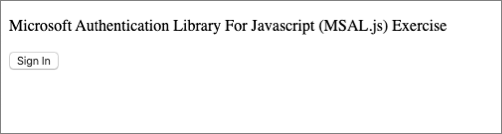

Select the **Sign In** button.

Depending on the browser, you're using, a popup window will load or the page will redirect to the Azure AD sign-in prompt.

Sign in using a **Work or School Account** with a user *who isn't assigned* the global administrator role. On the next screen, **don't select** the **Accept** button. Instead, examine the dialog:


This screenshot demonstrates the *user consent experience* in Microsoft identity.

Notice the permissions are all specific to the current user. Each of the permissions includes "you" or "your" as they related to the type of data and permission requested. Each of these permissions requested is delegated permissions. Delegated permissions are those which a user can grant to an app so that the app can act on behalf of the user.

For a user to grant an app delegated permissions, the user must have those same permissions. In other words, if the user doesn't have permissions to do something, they can't grant the permission to the app.

In this scenario, each user will need to grant the application permission before the app can obtain the permission and act on behalf of the user.

Close the browser and open a new instance so that you can sign in again.

Navigate to **http://localhost:3007** again and select the **Sign In** button. This time, sign in with a user *who is assigned* the global administrator role. Notice the difference in the consent dialog:


There's one significant difference to take notice of. First, because you signed in using an administrator account, you have an additional option. The checkbox after the permission list enables an administrator to grant these delegated permissions to *all users* in the organization. This removes the requirement for each user to grant the permission.

Select the checkbox **Consent on behalf of your organization**. Notice how the permissions change and an additional informational message are displayed. Take special notice how the words "you" and "your" in the permissions have been replaced with "user".

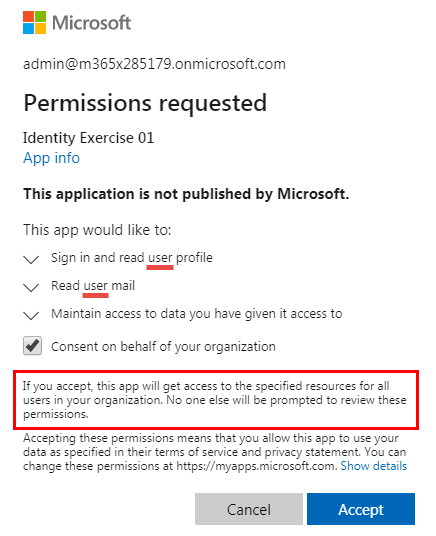

Select the **Accept** button.

Depending on the browser you're using, the popup will disappear or you'll be redirected back to the web page. When the page loads, MSAL will request an access token and request your information from Microsoft Graph. After the request complete, it will display the results on the page:

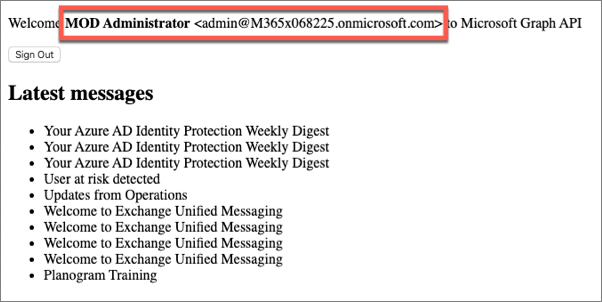

Now try signing-in as the non-administrator user. Select the **Sign Out** button and complete the sign-out process.

Select **Sign In** and enter the credentials of the user who is not an administrator. Notice this time, you aren't prompted with the consent dialog because the administrator has already consented the permissions on behalf of everyone in the organization.

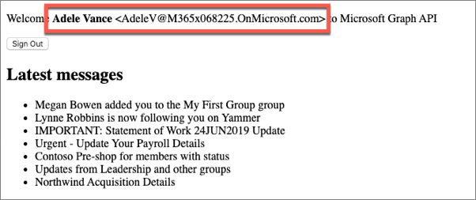

You can also provide organization administrators a specific link that will take them to an admin consent experience.

In a new browser window, navigate to the following URL. Make sure you replace the `{{APPLICATION_ID}}` with the ID of the Azure AD application you created

`https://login.microsoftonline.com/common/adminconsent?client_id={{APPLICATION_ID}}&state=12345&redirect_uri=http://localhost:3007`

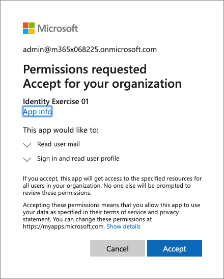

This experience is more targeted to an administrator as it states that the permissions requested are for an entire organization.

Stop the local web server by pressing <kbd>CTRL</kbd>+<kbd>C</kbd> in the console.

## Summary

In this unit, you learned about the different types of permissions supported by the Microsoft identity platform and the consent experience that users and admins must go through to grant permission requests to apps.
