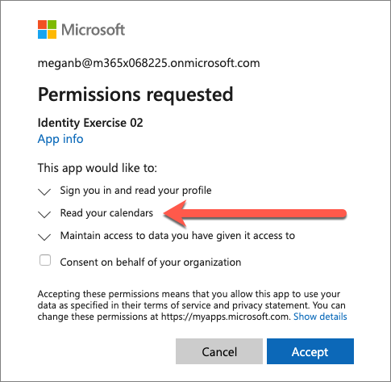
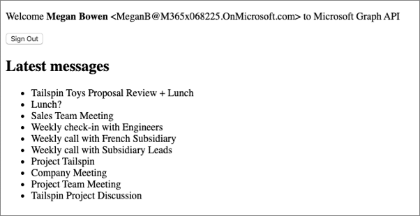
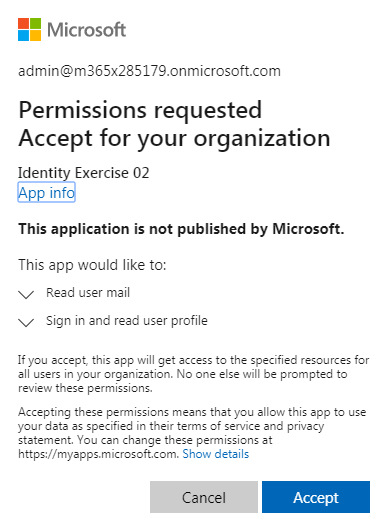

In this unit, you'll create an Azure AD application. You'll use this application and the web page you created in unit 3 of this module to see how delegated permissions work for both static and dynamic permissions.

## Static permissions

The web page you created in unit 2 will submit a request to Microsoft Graph to retrieve the user's emails. All requests to Microsoft Graph must include an access token as proof of the user's identity and that they have the necessary permissions to call Microsoft Graph. To obtain an access token, you must create an Azure AD application.

Open a browser and navigate to the [Azure Active Directory admin center](https://aad.portal.azure.com). Sign in using a **Work or School Account** that has global administrator rights to the tenancy.

Select **Azure Active Directory** in the left-hand navigation.

Then select **Manage > App registrations** in the left-hand navigation.

On the **App registrations** page, select **New registration**.

On the **Register an application** page, set the values as follows:

- **Name**: Identity Exercise 01
- **Supported account types**: Accounts in this organizational directory only (Single tenant)

Select **Register** to create the application.

On the **Identity Exercise 01** page, copy the values **Application (client) ID** and **Directory (tenant) ID**; you'll need these values later in this exercise.

  

Select **Manage > Authentication** in the left-hand navigation.

On the **Authentication** page, select **Add a platform**. When the **Configure platforms** panel appears, select **Single-page application**.

In the **Configure single-page application** panel, add **http://localhost:3007** under **Redirect URIs**, and select **Configure**.

### Add permissions to the Azure AD app

Select **API Permissions** from the left-hand navigation, and then select **Add a permission**:

On the **Request API Permissions** page, select **Microsoft APIs**, **Microsoft Graph**, and then select **Delegated permissions**:

  

In the search box in the **Select permissions** section, enter **Mail.R**, select the permission **Mail.Read** permission, and then select **Add permissions**.

  

## Update the web page with the Azure AD application details

The last step is to configure the web page to use the Azure AD application.

Locate the `var msalConfig = {}` code in the **index.html** file. The `auth` object contains three properties you need to set as follows:

- `clientId`: set to the Azure AD application's ID
- `authority`: set to `**https://login.microsoftonline.com/{{DIRECTORY_ID}}**`, replacing the **{{DIRECTORY_ID}}** with the Azure AD directory ID of the Azure AD application
- `redirectURI`: set to the Azure AD application's redirect URI: **http://localhost:3007**

## Test the web application

To test the web page, first start the local web server. In the command prompt, execute the following command from the root of the project:

```console
node server.js
```

Next, open a browser where you aren't signed-in to Office 365 and navigate to **http://localhost:3007**. The page initially contains a default welcome message and sign-in button.


Select the **Sign In** button.

Depending on the browser, you're using, a popup window will load or the page will redirect to the Azure AD sign-in prompt.

Sign in using a **Work or School Account** with a user *who isn't assigned* the global administrator role. On the next screen, **don't select** the **Accept** button. Instead, examine the dialog:


This screenshot demonstrates the *user consent experience* in Microsoft identity.

Notice the permissions are all specific to the current user. Each of the permissions includes "you" or "your" as they related to the type of data and permission requested. Each of these permissions requested is delegated permissions. Delegated permissions are permissions that a user can grant to an app so that the app can act on behalf of the user.

For a user to grant an app delegated permissions, the user must have those same permissions. In other words, if the user doesn't have permissions to do something, they can't grant the permission to the app.

In this scenario, each user will need to grant the application permission before the app can obtain the permission and act on behalf of the user.

Close the browser and open a new instance so that you can sign in again.

Navigate to **http://localhost:3007** again and select the **Sign In** button. This time, sign in with a user *who is assigned* the global administrator role. Notice the difference in the consent dialog:


There's one significant difference to take notice of. First, because you signed in using an administrator account, you have an additional option. The checkbox after the permission list enables an administrator to grant these delegated permissions to *all users* in the organization. This removes the requirement for each user to grant the permission.

Select the checkbox **Consent on behalf of your organization**. Notice how the permissions change and an additional informational message are displayed. Take special notice of how the words "you" and "your" in the permissions have been replaced with "user".


Select the **Accept** button.

Depending on the browser you're using, the popup will disappear or you'll be redirected back to the web page. When the page loads, MSAL will request an access token and request your information from Microsoft Graph. After the request complete, it will display the results on the page:


Now try signing-in as the non-administrator user. Select the **Sign Out** button and complete the sign-out process.

Select **Sign In** and enter the credentials of the user who isn't an administrator. Notice this time, you aren't prompted with the consent dialog because the administrator has already consented the permissions on behalf of everyone in the organization.


One way you can see a difference between the static and dynamic permissions is using the admin consent endpoint.

In a new browser window, navigate to the following URL. Make sure you replace the `{{APPLICATION_ID}}` with the ID of the Azure AD application you created

`https://login.microsoftonline.com/common/adminconsent?client_id={{APPLICATION_ID}}&state=12345&redirect_uri=http://localhost:3007`


One permission, sign in and read user profile, is the default one that all apps have: User.Read. The other permission, Read user mail, was the one that you added in the Azure AD admin center: Mail.Read.

This experience is more targeted to an administrator as it states that the permissions requested are for an entire organization.

## Dynamic permissions

Let's see how this differs from dynamic permissions.

### Update the SPA to show calendar events

In this section, you'll update the existing SPA to display calendar events. To do this, the app needs a new permission to access the currently signed-in user's calendar. However, you won't add the permission to the Azure AD app. Instead, you'll add the permission in the code and it will be requested when the app needs it.

Locate the `var graphConfig = {}` code in the **index.html** file. The `scopes` array contains the permissions the app will request in the access token when the user signs-in. Replace the **mail.read** permission with **calendars.read**.

The `graphConfig` object should now look like the following code:

```javascript
var graphConfig = {
  graphMeEndpoint: "https://graph.microsoft.com/v1.0/me",
  requestObj: {
    scopes: ["user.read", "calendars.read"]
  }
};
```

Now change the Microsoft Graph requests to request calendar items instead of email messages. Search for `/messages?` in the SPA and replace it with `/events?`. The rest of the request can remain as is because both email messages and calendar events have a *subject* property.

### Test the web application

To test the web page, first start the local web server. In the command prompt, execute the following command from the root of the project:

```console
node server.js
```

Next, open a browser and navigate to http://localhost:3007. The page initially contains a default welcome message and sign-in button.

Select the **Sign In** button.

Depending on the browser, you're using, a popup window will load or the page will redirect to the Azure AD sign-in prompt.

Sign in using a **Work or School Account** of a user in your organization. On the next screen, notice how the list of permissions has changed:



This time, you're prompted to grant the application access to your calendar. This is a dynamic permission because it was defined in the SPA's code and included in the list of permissions in the access token request.

Select the **Accept** button.

Depending on the browser you're using, the popup will disappear or you'll be redirected back to the web page. When the page loads, MSAL will request an access token and request your information from Microsoft Graph. After the request complete, it will display the results on the page:



Try the admin consent experience. In a new browser window, navigate to the following URL. Make sure you replace the `{{APPLICATION_ID}}` with the ID of the Azure AD application you created

`https://login.microsoftonline.com/common/adminconsent?client_id={{APPLICATION_ID}}&state=12345&redirect_uri=http://localhost:3007`



Notice the list of permissions is the same as it was in the previous section. Only static permissions, defined in the Azure AD admin center, are displayed in the admin consent experience.

Stop the local web server by pressing <kbd>CTRL</kbd>+<kbd>C</kbd> in the console.
