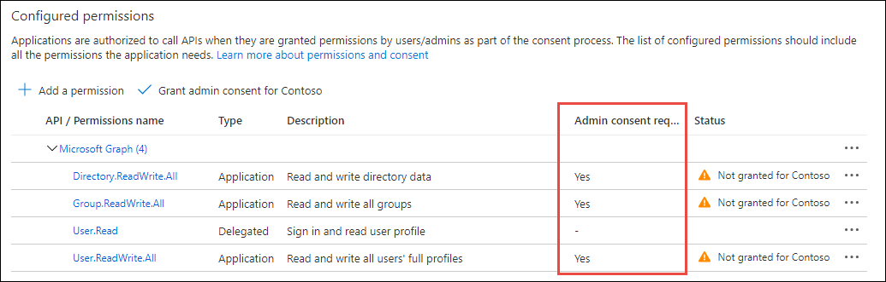

Application permissions are the other type of permission supported by the Microsoft identity platform. Application permissions are used by apps that run without a signed-in user present such as services or daemon processes.

In this unit, you’ll learn about application permissions, how to define them and how to grant them using a different type of consent flow in your apps.

## Application permissions

Some high-privilege permissions in the Microsoft ecosystem can be set to admin-restricted. Here are a few examples of these kinds of permissions:

- Read all user's full profiles by using **User.Read.All**
- Write data to an organization's directory by using **Directory.ReadWrite.All**
- Read all groups in an organization's directory by using **Group.Read.All**



Although a consumer user might grant an application access to this kind of data, organizational users are restricted from granting access to the same set of sensitive company data. If your application requests access to one of these permissions from an organizational user, the user receives an error message that says they're not authorized to consent to your app's permissions.

If your app requires access to admin-restricted scopes for organizations, you should request them directly from a company administrator. This can be done using the admin consent endpoint.

When the application is requesting application permissions and an administrator grants these permissions via the admin consent endpoint, this grant isn't done on behalf of any specific user. Instead, the client application is granted permissions directly. These types of permissions are only used by daemon services and other non-interactive applications that run in the background.

When an organization administrator uses your application and is directed to the authorize endpoint, the Microsoft identity platform will detect the user's role and ask them if they would like to consent on behalf of the entire tenant for the permissions you've requested.

## Admin consent

There's also a dedicated admin consent endpoint you can use if you would like to proactively request that an administrator grants permission on behalf of the entire tenant. Using this endpoint is also necessary for requesting Application Permissions (which can't be requested using the authorize endpoint).

```http
GET https://login.microsoftonline.com/{tenant}/v2.0/adminconsent?
  client_id=6731de76-14a6-49ae-97bc-6eba6914391e
  &redirect_uri=http://localhost/myapp/permissions
  &scope=https://graph.microsoft.com/calendars.read%20https://graph.microsoft.com/mail.send
  &state=12345
```

This endpoint is also available by selecting the **Grant admin consent for ...** button from the Azure AD admin center:


If you follow these steps, your app can request permissions for all users in a tenant, including admin-restricted scopes. This is a high privilege operation and should only be done if necessary for your scenario.

### Recommended: Sign the user into your app

When you build an application that uses the admin consent endpoint, the app should have an experience that enables the admin to approve the app's permissions. This page can be part of the app's sign-up flow, part of the app's settings, or it can be a dedicated "connect" flow. In many cases, it makes sense for the app to show this "connect" view only after a user has signed in with a work or school Microsoft account.

When you sign the user into your app, you can identify the organization to which the admin belongs before asking them to approve the necessary permissions. Although not strictly necessary, it can help you create a more intuitive experience for your organizational users. To sign the user in, follow our Microsoft identity platform protocol tutorials.


