Application permissions are the other type of permission supported by the Microsoft identity platform. Application permissions are used by apps that run without a signed-in user present such as services or daemon processes.

In this exercise, you'll learn about application permissions, how to define them and how to grant them using a different type of consent flow in your apps.

## Create an Azure AD application

Open a browser and navigate to the [Azure Active Directory admin center](https://aad.portal.azure.com). Sign in using a **Work or School Account** that has global administrator rights to the tenancy.

Select **Azure Active Directory** in the left-hand navigation.

Select **Manage > App registrations** in the left-hand navigation.

  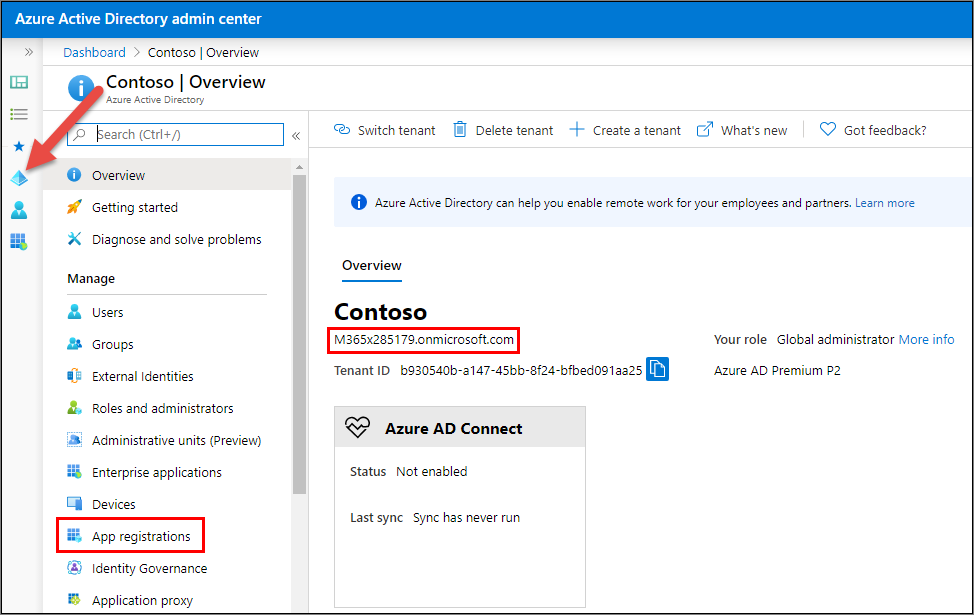

On the **App registrations** page, select **New registration**.

  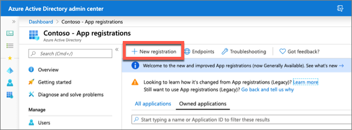

On the **Register an application** page, set the values as follows:

- **Name**: Identity Daemon
- **Supported account types**: Accounts in this organizational directory only (Contoso only - Single tenant)

    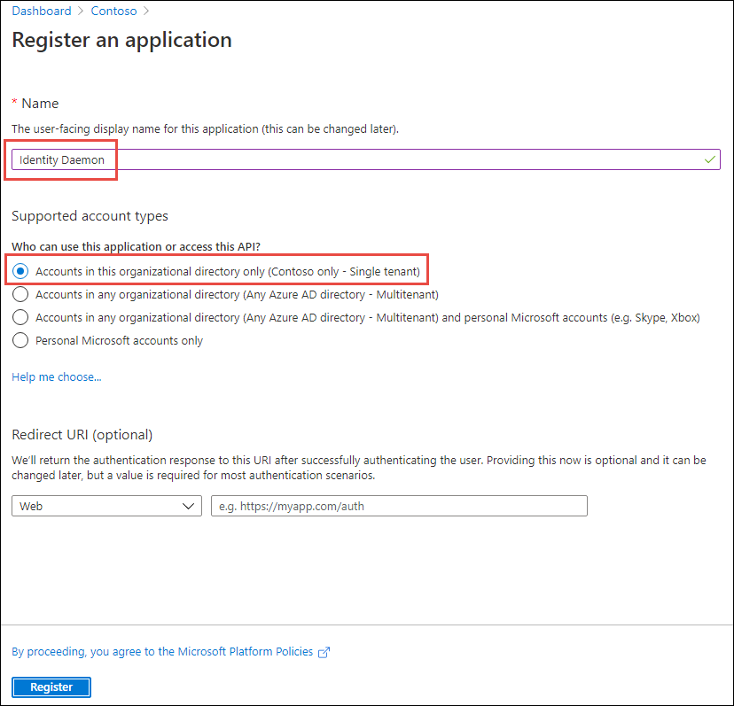

    Select **Register**.

On the **Identity Daemon** page, copy the value of the **Application (client) ID** and **Directory (tenant) ID**; you'll need these in the application.

  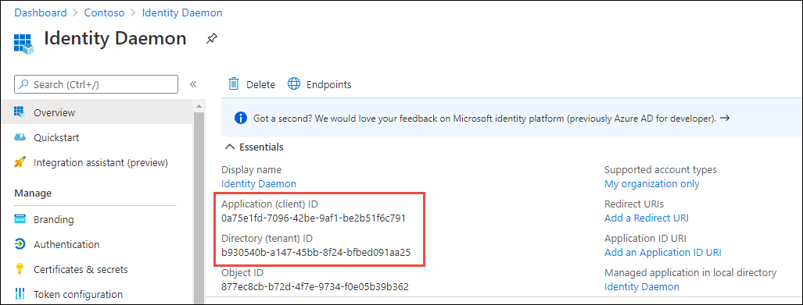

### Configure the Azure AD application's authentication settings

Select **Manage > Authentication**.

In the **Platform configurations** section, select the **Add a platform** button. Then in the **Configure platforms** panel, select the **Mobile and desktop applications** button:

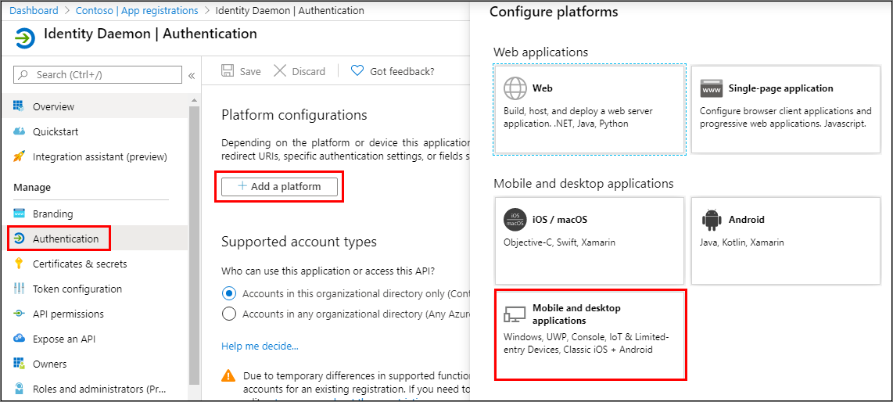

In the **Redirect URIs** section of the **Configure Desktop + devices** panel, select the entry that ends with **nativeclient**, and then select the **Configure** button:

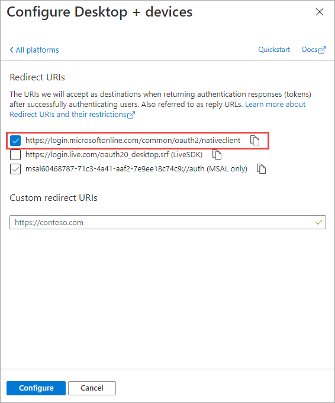

Select **Save** in the top menu to save your changes.

### Create a client secret for the app

In order for the daemon app to run without user involvement, it will sign in to Azure AD with an application ID and either a certificate or secret. In this exercise, you'll use a secret.

Select **Certificates & secrets** from the left-hand navigation panel.

Select the **New client secret** button:

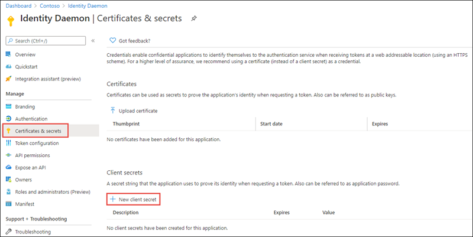

When prompted, give the secret a description and select one of the expiration duration options provided and select **Add**. *What you enter and select doesn't matter for the exercise.*

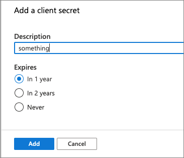

The **Certificate & Secrets** page will display the new secret. Its important you copy this value as its only shown this one time; if you leave the page and come back, it will only show as a masked value.

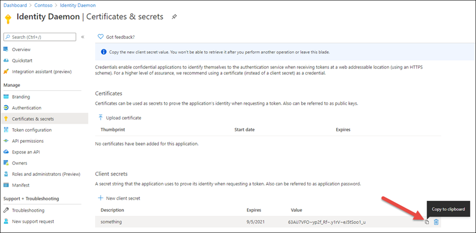

Copy the value of the secret as you'll need it later.

### Grant Azure AD application permissions to Microsoft Graph

After creating the application, you need to grant it the necessary permissions to Microsoft Graph

Select **API Permissions** in the left-hand navigation panel.

From the **Identity Daemon - API Permissions** page, select the **Add a permission** button.

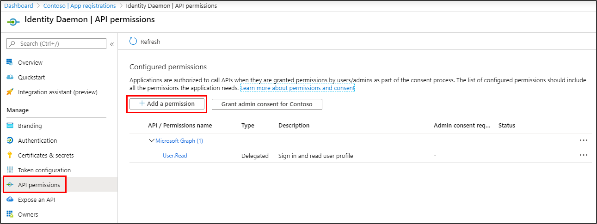

In the **Request API permissions** panel that appears, select **Microsoft Graph** from the **Microsoft APIs** tab.

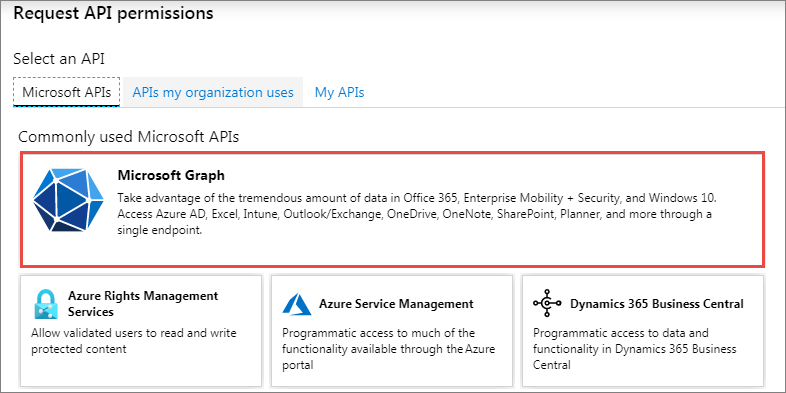

When prompted for the type of permission, select **Application permissions**.

Enter **Mail.R** in the **Select permissions** search box and select the **Mail.Read** permission, followed by the **Add permission** button at the bottom of the panel.

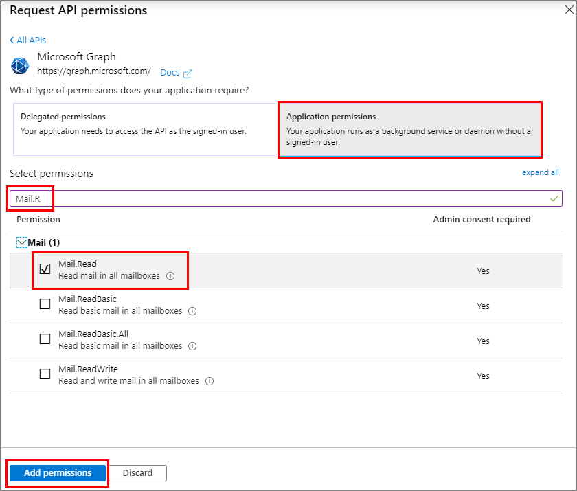

Notice that the permission has **Yes** listed in the column **Admin Consent Required** in the previous screenshot? This means that an administrator must grant this permission.

On the **Identity Daemon - API Permissions** panel, select the button **Grant admin consent for [tenant]**, followed by the **Yes** button to grant all users in your organization this permission.

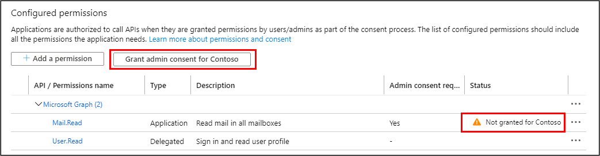

## Create a headless application

> [!NOTE]
> The instructions below assume you are using .NET 5. They were last tested using v5.0.202 of the .NET 5 SDK.

You'll use a .NET 5 console application to run as a service. This app can then be configured to run on a defined schedule with no user involvement.

Open your command prompt, navigate to a directory where you have rights to create your project, and run the following command to create a new .NET Core console application:

```console
dotnet new console -o graphdaemon
```

After creating the application, run the following commands to ensure your new project runs correctly.

```console
cd graphdaemon
dotnet add package Microsoft.Identity.Client
dotnet add package Microsoft.Graph
dotnet add package Microsoft.Extensions.Configuration
dotnet add package Microsoft.Extensions.Configuration.FileExtensions
dotnet add package Microsoft.Extensions.Configuration.Json
```

Open the application in **Visual Studio Code** using the following command:

```console
code .
```

If Visual Studio code displays a dialog box asking if you want to add required assets to the project, select **Yes**.

### Update the console app to support Azure AD authentication

Create a new file named **appsettings.json** in the root of the project and add the following code to it:

```json
{
  "tenantId": "YOUR_TENANT_ID_HERE",
  "applicationId": "YOUR_APP_ID_HERE",
  "applicationSecret": "YOUR_APP_SECRET_HERE",
  "targetUserId": "TARGET_USER_ID_HERE"
}
```

Update properties with the following values:

- `YOUR_TENANT_ID_HERE`: Azure AD directory ID
- `YOUR_APP_ID_HERE`: Azure AD client ID
- `YOUR_APP_SECRET_HERE`: Azure AD client secret

#### Create helper classes

Create a new folder **Helpers** in the project.

Create a new file **AuthHandler.cs** in the **Helpers** folder and add the following code:

```cs
using System.Net.Http;
using System.Threading;
using System.Threading.Tasks;
using Microsoft.Graph;

namespace Helpers
{
  public class AuthHandler : DelegatingHandler
  {
    private IAuthenticationProvider _authenticationProvider;

    public AuthHandler(IAuthenticationProvider authenticationProvider, HttpMessageHandler innerHandler)
    {
      InnerHandler = innerHandler;
      _authenticationProvider = authenticationProvider;
    }

    protected override async Task<HttpResponseMessage> SendAsync(HttpRequestMessage request, CancellationToken cancellationToken)
    {
      await _authenticationProvider.AuthenticateRequestAsync(request);
      return await base.SendAsync(request, cancellationToken);
    }
  }
}
```

Create a new file **MsalAuthenticationProvider.cs** in the **Helpers** folder and add the following code:

```cs
using System.Net.Http;
using System.Net.Http.Headers;
using System.Threading.Tasks;
using Microsoft.Identity.Client;
using Microsoft.Graph;

namespace Helpers
{
  public class MsalAuthenticationProvider : IAuthenticationProvider
  {
    private static MsalAuthenticationProvider _singleton;
    private IConfidentialClientApplication _application;
    private string[] _scopes;

    private MsalAuthenticationProvider(IConfidentialClientApplication application, string[] scopes)
    {
      _application = application;
      _scopes = scopes;
    }

    public static MsalAuthenticationProvider GetInstance(IConfidentialClientApplication application, string[] scopes)
    {
      if (_singleton == null)
      {
        _singleton = new MsalAuthenticationProvider(application, scopes);
      }

      return _singleton;
    }

    public async Task AuthenticateRequestAsync(HttpRequestMessage request)
    {
      request.Headers.Authorization = new AuthenticationHeaderValue("bearer", await GetTokenAsync());
    }

    public async Task<string> GetTokenAsync()
    {
      AuthenticationResult result = null;

      try {
        result = await _application.AcquireTokenForClient(_scopes).ExecuteAsync();
      } catch (MsalServiceException) { }

      return result.AccessToken;
    }
  }
}
```

### Incorporate Microsoft Graph into the console app

Open the **Program.cs** file and add the following `using` statements to the top fo the file:

```cs
using System.Collections.Generic;
using Microsoft.Identity.Client;
using Microsoft.Graph;
using Microsoft.Extensions.Configuration;
using Helpers;
```

Add the following method `LoadAppSettings` to the `Program` class. The method retrieves the configuration details from the **appsettings.json** file previously created:

```cs
private static IConfigurationRoot LoadAppSettings()
{
  try
  {
    var config = new ConfigurationBuilder()
                      .SetBasePath(System.IO.Directory.GetCurrentDirectory())
                      .AddJsonFile("appsettings.json", false, true)
                      .Build();

    if (string.IsNullOrEmpty(config["applicationId"]) ||
        string.IsNullOrEmpty(config["applicationSecret"]) ||
        string.IsNullOrEmpty(config["tenantId"]) ||
        string.IsNullOrEmpty(config["targetUserId"]))
    {
      return null;
    }

    return config;
  }
  catch (System.IO.FileNotFoundException)
  {
    return null;
  }
}
```

Add the following method `CreateAuthorizationProvider` to the `Program` class. The method will create an instance of the clients used to call Microsoft Graph.

```cs
private static IAuthenticationProvider CreateAuthorizationProvider(IConfigurationRoot config)
{
  var tenantId = config["tenantId"];
  var clientId = config["applicationId"];
  var clientSecret = config["applicationSecret"];
  var authority = $"https://login.microsoftonline.com/{config["tenantId"]}/v2.0";

  List<string> scopes = new List<string>();
  scopes.Add("https://graph.microsoft.com/.default");

  var cca = ConfidentialClientApplicationBuilder.Create(clientId)
                                          .WithAuthority(authority)
                                          .WithClientSecret(clientSecret)
                                          .Build();
  return MsalAuthenticationProvider.GetInstance(cca, scopes.ToArray());
}
```

Add the following method `GetAuthenticatedGraphClient` to the `Program` class. The method creates an instance of the `GraphServiceClient` object.

```cs
private static GraphServiceClient GetAuthenticatedGraphClient(IConfigurationRoot config)
{
  var authenticationProvider = CreateAuthorizationProvider(config);
  return new GraphServiceClient(authenticationProvider);
}
```

Locate the `Main` method in the `Program` class. Add the following code to the end of the `Main` method to load the configuration settings from the **appsettings.json** file:

```cs
var config = LoadAppSettings();
if (config == null)
{
  Console.WriteLine("Invalid appsettings.json file.");
  return;
}
```

Add the following code to the end of the `Main()` method to obtain an instance of the Microsoft Graph .NET SDK client that you'll use to get a user's email messages:

```cs
var client = GetAuthenticatedGraphClient(config);
```

Next, add the following code to the end of the `Main()` method. This will create a request using Microsoft Graph for a specific user's email messages and display them in the console. The ID of the user is pulled from the **appsettings.json** file:

```cs
var requestUserEmail = client.Users[config["targetUserId"]].Messages.Request();
var results = requestUserEmail.GetAsync().Result;
foreach (var message in results)
{
  Console.WriteLine("");
  Console.WriteLine("Subject : " + message.Subject);
  Console.WriteLine("Received: " + message.ReceivedDateTime.ToString());
  Console.WriteLine("ID      : " + message.Id);
}

Console.WriteLine("\nGraph Request:");
Console.WriteLine(requestUserEmail.GetHttpRequestMessage().RequestUri);
```

### Obtain the ID of a user to use in the test

Using the [Azure AD admin center](https://aad.portal.azure.com/), select **Users**, and then select one of the users from the organization:

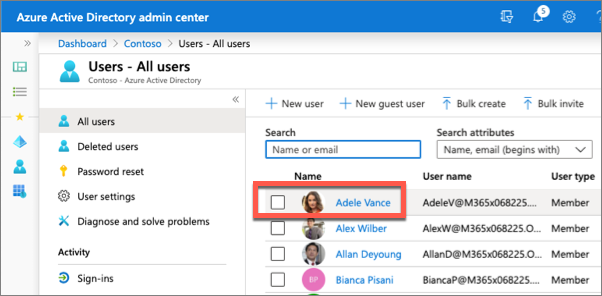

Locate the **Object ID** property and copy the value.

In the **appsettings.json** file in the console application, replace  `TARGET_USER_ID_HERE` value with the user's Object ID property you copied.

### Build and test the application

Run the following command in a command prompt to ensure the developer certificate has been trusted:

```console
dotnet dev-certs https --trust
```

Run the following command in a command prompt to compile the console application:

```console
dotnet build
```

Run the following command to run the console application:

```console
dotnet run
```

After a moment, the app will display a list of all the specified user's emails obtained using the Microsoft Graph .NET SDK.


## Summary

In this exercise, you learned how to create apps that obtain tokens without user interaction to either act on behalf of a user or perform tasks as the app's identity.
