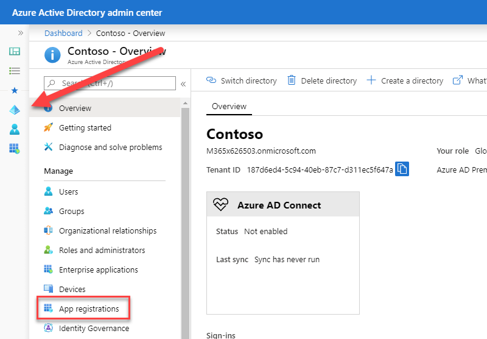
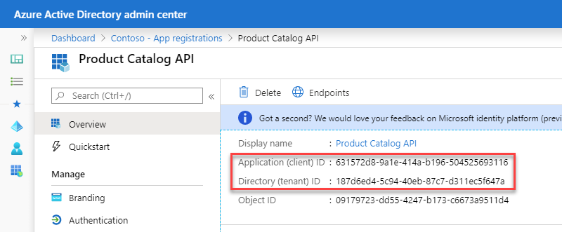
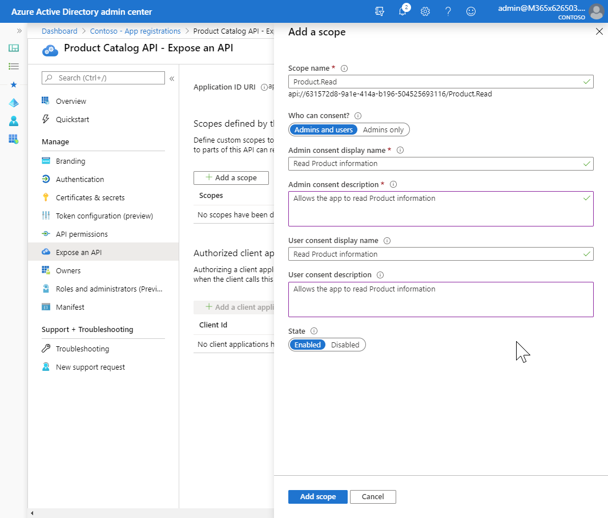

In this exercise, you’ll learn how to create a .NET Core web API application and secure it with Microsoft identity.

## Create an Azure AD application

Open a browser and navigate to the [Azure Active Directory admin center](https://aad.portal.azure.com). Sign in using a **Work or School Account** that has global administrator rights to the tenant.

Select **Azure Active Directory** in the left-hand navigation.

Select **App registrations** in the left-hand navigation.



On the **App registrations** page, select **New registration**.


On the **Register an application** page, set the values as follows:

- **Name**: Product Catalog API
- **Supported account types**: Accounts in this organizational directory only (Single tenant)

Select **Register** to create the application.

On the **Product Catalog API** page, copy the values **Application (client) ID** and **Directory (tenant) ID**; you'll need these values later in this exercise.



Select **Expose an API** in the left-hand navigation.

Select **Add a scope**.

If prompted, accept the proposed application ID URI, `api://{clientId}`, by selecting **Save and Continue**.

On the **Add a scope** panel, set the values as follows:

- **Scope name**: Product.Read
- **Who can consent**: Admins and users
- **Admin consent display name**: Read Product information
- **Admin consent description**: Allows the app to read Product information.
- **User consent display name**: Read Product information
- **User consent description**: Allows the app to read Product information.
- **State**: Enabled

Select **Add scope**.



Repeat the steps to add the following scopes, allowing **Admin and users** consent:

- **Product.Write**
- **Category.Read**

The API can require administrative consent for specific scopes as well. Create a scope requiring admin consent by specifying the values as follows on the **Add a scope** panel:

- **Scope name**: Category.Write
- **Who can consent**: Admins only
- **Admin consent display name**: Write Product Category information
- **Admin consent description**: Allows the app to write Product Category information.
- **State**: Enabled

## Create a .NET Core web API application

A web API application is typically a dynamic web application that is called by client applications, returning information as JSON. This example will use an Azure AD application to authenticate calls made to the application using a token provided in the Authentication header of the Http request.

Open your command prompt, navigate to a directory where you want to save your work.

Execute the following command to create a new .NET Core web API application:

```shell
dotnet new webapi -o ProductCatalog -au singleorg
```

Open the scaffolded project folder, which is named **ProductCatalog** in **Visual Studio Code**. When a dialog box asks if you want to add required assets to the project, select **Yes**.

The scaffolded project contains a controller for weather forecasts that isn't needed. Delete the following files:

- **WeatherForecast.cs**
- **Controllers\WeatherForecastController.cs**

The web API application will run concurrently with other web applications in later modules. Each application must bind to a different TCP port. Update this web API application to use a specific port:

- Locate and open the **./.vscode/launch.json** file.
- Locate the configuration named `.NET Core Launch (web)`. Update the `env` attribute of that configuration to include the `ASPNETCORE_URLS` property:

    ```json
    "env": {
      "ASPNETCORE_URLS":"https://localhost:5050"
    }
    ```

The web API application doesn't contain any HTML pages, so there's no need to launch the browser. In the **launch.json** file, locate and remove the entire `serverReadyAction` node.

```json
// "serverReadyAction": {
//   "action": "openExternally",
//   "pattern": "^\\s*Now listening on:\\s+(https?://\\S+)"
// },
```

### Request Authentication & Bearer Token validation

The scaffolded project is pre-configured to authenticate requests using the HTTP request's Authorization header. In the **Startup.cs** file, the `ConfigureServices()` method has the following statements that add the appropriate middleware:

```csharp
services.AddAuthentication(AzureADDefaults.BearerAuthenticationScheme)
        .AddAzureADBearer(options => Configuration.Bind("AzureAd", options));
```

The **AzureADBearer** middleware will validate core token attributes, such as the token lifetime, signature, and audience. The **appsettings.json** file must have the values from the app registration provided so that the middleware can do this validation. The scaffolded **appsettings.json** file has placeholder values for `TenantId` and `ClientId`. Replace these placeholders with the values copied from the AAD Portal when creating the app registration.

The valid audiences must be provided using a `JwtBearerOptions` class, which is configured in the `ConfigureServices()` method.

First, add the following statement to the top of the **Startup.cs** file:

```csharp
using Microsoft.AspNetCore.Authentication.JwtBearer;
```

Next, add the following to the `ConfigureServices()` method after the statement that adds the AzureADBearer middleware:

```csharp
services.Configure<JwtBearerOptions>(AzureADDefaults.JwtBearerAuthenticationScheme, options =>
{
  // The web API accepts as audiences both the Client ID (options.Audience) and api://{ClientID}.
  options.TokenValidationParameters.ValidAudiences = new[]
  {
    options.Audience,
    $"api://{options.Audience}"
  };
});
```

While the provided middleware will validate the token, authorizing a request for a specific controller action is the responsibility of the developer. In this exercise, the presence of scopes in the token is used to authorize the action. If the scope is present, the action is allowed.

In the root folder of the project, create a file named **ScopeValidator.cs**. Add the following code to the file:

```csharp
using System;
using System.Linq;
using System.NET;
using System.NET.Http;
using System.Security.Claims;
using Microsoft.AspNetCore.Http;

namespace ProductCatalog
{
  public static class ScopeValidator
  {

    /// <summary>
    /// When applied to a <see cref="HttpContext"/>, verifies that the user authenticated in the
    /// web API has any of the accepted scopes.
    /// If the authenticated user doesn't have any of these <paramref name="acceptedScopes"/>, the
    /// method throws an HTTP Unauthorized error with a message noting which scopes are expected in the token.
    /// </summary>
    /// <param name="acceptedScopes">Scopes accepted by this API</param>
    /// <exception cref="HttpRequestException"/> with a <see cref="HttpResponse.StatusCode"/> set to
    /// <see cref="HttpStatusCode.Unauthorized"/>
    public static void VerifyUserHasAnyAcceptedScope(this HttpContext context, params string[] acceptedScopes)
    {
      if (acceptedScopes == null)
      {
        throw new ArgumentNullException(nameof(acceptedScopes));
      }
      Claim scopeClaim = context?.User?.FindFirst("http://schemas.microsoft.com/identity/claims/scope");
      if (scopeClaim == null || !scopeClaim.Value.Split(' ').Intersect(acceptedScopes).Any())
      {
        context.Response.StatusCode = (int)HttpStatusCode.Unauthorized;
        string message = $"The 'scope' claim doesn't contain scopes '{string.Join(",", acceptedScopes)}' or was not found";
        throw new HttpRequestException(message);
      }
    }
  }
}
```

### Data models and sample data

By convention, .NET Core web API projects store model classes in a folder named Models. Create a new folder named **Models** in the project directory.

In the **Models** folder, create a new file named **Category.cs** and add the follow C# code to it:

```csharp
namespace ProductCatalog.Models
{
  public class Category
  {
    public int Id { get; set; }
    public string Name { get; set; }
  }
```

In the **Models** folder, create a new file named **Product.cs** and add the following C# code to it:

```csharp
namespace ProductCatalog.Models
{
  public class Category
  {
    public int Id { get; set; }
    public string Name { get; set; }
    public Category Category { get; set; }
  }
}
```

This exercise will store sample data in-memory while the app is running. The data is randomly generated when the app is started using a NuGet package.

Install the NuGet package by running the following from your command prompt in the project folder:

```shell
dotnet add package Bogus
```

Return to **Visual Studio Code** and create a new file named **SampleData.cs** in the root folder of the project. Add the following C# code to the file:

```csharp
using System.Collections.Generic;
using Bogus;
using ProductCatalog.Models;

namespace ProductCatalog
{
  public class SampleData
  {
    public List<Category> Categories { get; set; }
    public List<Product> Products { get; set; }

    public static SampleData Initialize()
    {
      var data = new SampleData();

      var categoryIds = 0;
      var categoryFaker = new Faker<Category>()
        .StrictMode(true)
        .RuleFor(c => c.Id, f => ++categoryIds)
        .RuleFor(c => c.Name, f => f.Commerce.Categories(1)[0]);
      data.Categories = categoryFaker.Generate(10);

      var productIds = 0;
      var productFaker = new Faker<Product>()
        .StrictMode(true)
        .RuleFor(p => p.Id, f => ++productIds)
        .RuleFor(p => p.Name, f => f.Commerce.Product())
        .RuleFor(p => p.Category, f => f.PickRandom(data.Categories));
      data.Products = productFaker.Generate(20);

      return data;
    }
  }
}
```

The sample data will be stored as a singleton in the dependency injection container built into ASP.NET Core. Open the **Startup.cs** file in the root folder of the project. The contents of the `ConfigureServices()` method should match the following code:

```csharp
public void ConfigureServices(IServiceCollection services)
{
  services.AddAuthentication(AzureADDefaults.BearerAuthenticationScheme)
      .AddAzureADBearer(options => Configuration.Bind("AzureAd", options));
  services.Configure<JwtBearerOptions>(AzureADDefaults.JwtBearerAuthenticationScheme, options =>
  {
    // The web API accepts as audiences both the Client ID (options.Audience) and api://{ClientID}.
    options.TokenValidationParameters.ValidAudiences = new[]
    {
      options.Audience,
      $"api://{options.Audience}"
    };
  });
  services.AddControllers();
  services.AddSingleton(SampleData.Initialize());
}
```

### Web API Controllers

By convention, .NET Core WebAPI projects store controller classes in a folder named Controllers. In the **Controllers** folder, create a new file named **CategoriesController.cs** and add the follow C# code. The controller has the `[Authorize]` attribute, which forces the request to have a valid Authorization header in the request. Each action method makes a call to the `VerifyUserHasAnyAcceptedScope()` method, specifying the scope required to execute the action:

```csharp
using System.Collections.Generic;
using System.Linq;
using identity04.Models;
using Microsoft.AspNetCore.Authorization;
using Microsoft.AspNetCore.Mvc;

namespace ProductCatalog.Controllers
{
  [Authorize]
  [ApiController]
  [Route("api/[controller]")]
  public class CategoriesController : ControllerBase
  {
    SampleData data;

    public CategoriesController(SampleData data)
    {
      this.data = data;
    }

    public List<Category> GetAllCategories() {
      HttpContext.VerifyUserHasAnyAcceptedScope(new string[] { "Category.Read" });
      return data.Categories;
    }

    [HttpGet("{id}")]
    public Category GetCategory(int id)
    {
      HttpContext.VerifyUserHasAnyAcceptedScope(new string[] { "Category.Read" });
      return data.Categories.FirstOrDefault(p => p.Id.Equals(id));
    }

    [HttpPost]
    public ActionResult CreateCategory([FromBody] Product newCategory)
    {
      HttpContext.VerifyUserHasAnyAcceptedScope(new string[] { "Category.Write" });
      if (string.IsNullOrEmpty(newCategory.Name))
      {
        return BadRequest("Product Name cannot be empty");
      }
      newCategory.Id = (data.Categories.Max(c => c.Id) + 1);
      data.Products.Add(newCategory);
      return CreatedAtAction(nameof(GetCategory), new { id = newCategory.Id }, newCategory);
    }
  }
}
```

In the **Controllers** folder, create a new file named **ProductsController.cs** and add the follow C# code:

```csharp
using System;
using System.Collections.Generic;
using System.Linq;
using Microsoft.AspNetCore.Authorization;
using Microsoft.AspNetCore.Http;
using Microsoft.AspNetCore.Mvc;
using ProductCatalog.Models;

namespace ProductCatalog.Controllers
{
  [Authorize]
  [ApiController]
  [Route("api/[controller]")]
  public class ProductsController : ControllerBase
  {
    SampleData data;

    public ProductsController(SampleData data)
    {
      this.data = data;
    }

    public List<Product> GetAllProducts()
    {
      HttpContext.VerifyUserHasAnyAcceptedScope(new string[] { "Product.Read" });
      return data.Products;
    }

    [HttpGet("{id}")]
    public Product GetProduct(int id)
    {
      HttpContext.VerifyUserHasAnyAcceptedScope(new string[] { "Product.Read" });
      return data.Products.FirstOrDefault(p => p.Id.Equals(id));
    }

    [HttpPost]
    public ActionResult CreateProduct([FromBody] Product newProduct)
    {
      HttpContext.VerifyUserHasAnyAcceptedScope(new string[] { "Product.Write" });
      if (string.IsNullOrEmpty(newProduct.Name))
      {
        return BadRequest("Product Name cannot be empty");
      }

      newProduct.Category.Name = data.Categories.FirstOrDefault(c => c.Id == newProduct.Category.Id)?.Name;
      if (string.IsNullOrEmpty(newProduct.Category?.Name))
      {
        return BadRequest("Product Category cannot be empty");
      }
      newProduct.Id = (data.Products.Max(p => p.Id) + 1);
      data.Products.Add(newProduct);
      return CreatedAtAction(nameof(GetProduct), new { id = newProduct.Id }, newProduct);
    }
  }
}
```

You now have a web API that is secured with Microsoft identity. Additional exercises in this module demonstrate different types of applications that can authenticate and call this web API.

## Summary

In this exercise, you learned how to create a .NET web API application and secure it with Microsoft identity.
