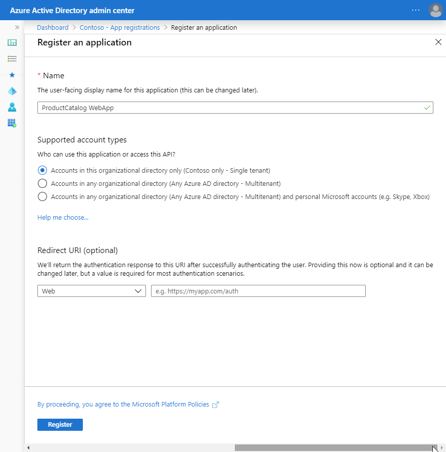
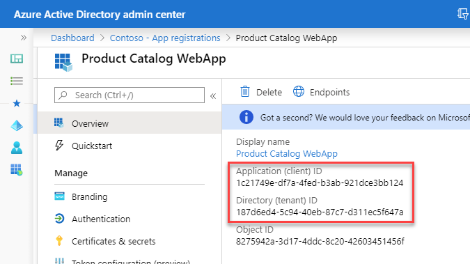
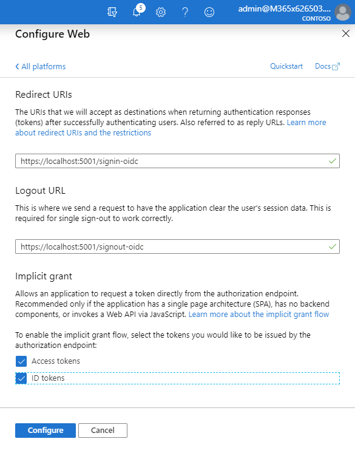
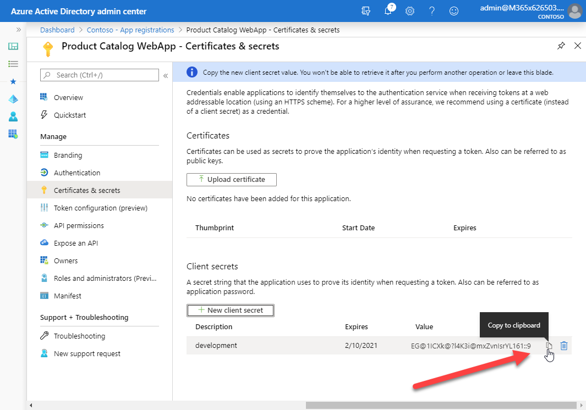

In this unit, you’ll learn how to create server-side web apps that enable users to sign in and grant the app permissions to act on the user’s behalf. Once the user has authenticated and granted the app consent to act on their behalf, the web application will use data returned from a secure web API by using the OAuth 2.0 auth code grant flow.

> [!IMPORTANT]
> This exercise assumes you have created the secured API app registration in the Azure AD admin center and associated project from the previous unit in this module. You'll consume that API in this exercise.

## Create an application that only allows a single organization's users to sign in

In this first application, you'll create an Azure AD application and ASP.NET Core web application that enables users from the current organization to sign in and display their information.

### Create a single-tenant Azure AD application

Open a browser and navigate to the [Azure Active Directory admin center](https://aad.portal.azure.com). Sign in using a **Work or School Account** that has global administrator rights to the tenancy.

Select **Azure Active Directory** in the left-hand navigation.


Select **Manage > App registrations** in the left-hand navigation.

On the **App registrations** page, select **New registration**.


On the **Register an application** page, set the values as follows:

- **Name**: Product Catalog WebApp
- **Supported account types**: Accounts in this organizational directory only (Single tenant)

  

Select **Register** to create the application.

On the **Product Catalog WebApp** page, copy the values **Application (client) ID** and **Directory (tenant) ID**; you'll need these values later in this exercise.



On the **Product Catalog WebApp** page, select the **Add a Redirect URI** link under the **Redirect URIs**.

Select **Add a platform**, then select **Web**.


On the **Configure Web** panel, use the following values to configure the application:

- **Redirect URIs**: https://localhost:5001/signin-oidc
- **Logout URL**: https://localhost:5001/signout-oidc
- **Implicit grant**: select both **Access tokens** and **ID tokens**

Select **Configure** when finished setting these values.



### Create a client secret for the app

In order for the app to call the web API, it must acquire an access token with the user's context. The web app will use the Authorization code flow to acquire the token. The Authorization code flow requires the web app to authenticate with an application ID and either a certificate or secret. In this exercise, you'll use a secret.

Select **Certificates & secrets** from the left-hand navigation panel.

Select the **New client secret** button:


When prompted, give the secret a description and select one of the expiration duration options provided and select **Add**. *What you enter and select doesn't matter for the exercise.*

The **Certificate & Secrets** page will display the new secret. It's important you copy this value as it's only shown this one time; if you leave the page and come back, it will only show as a masked value.



Copy the value of the secret as you'll need it later.

## Create a single organization ASP.NET web application

Open your command prompt, navigate to a directory where you want to save your work, create a new folder, and change directory into that folder.

Execute the following command to create a new ASP.NET Core MVC web application:

```shell
dotnet new mvc --auth SingleOrg
```

Open the root folder of the new ASP.NET core application using a text editor such as Visual Studio Code.

After creating the application, run the following commands to ensure your new project runs correctly.

```shell
dotnet add package Microsoft.Identity.Client
dotnet add package Microsoft.Extensions.Configuration
```

### Configure the web application with the Azure AD application

Locate and open the **./appsettings.json** file in the ASP.NET Core project.

Set the `AzureAd.Domain` property to the domain of your Azure AD tenant where you created the Azure AD application (*for example: contoso.onmicrosoft.com*).

Set the `AzureAd.TenantId` property to the **Directory (tenant) ID** you copied when creating the Azure AD application in the previous section.

Set the `AzureAd.ClientId` property to the **Application (client) ID** you copied when creating the Azure AD application in the previous section.

Create a new property, `ClientSecret`, immediately after the `ClientId`. Set the value of this to the client secret you created when creating the Azure AD application in the previous section.

### Configure the web API information

The web application must know the URL and scopes required by the web API application created in the previous exercise. The scopes defined for the web API application are found in the **Expose an api** blade of the app registration in the Azure Active Directory portal. (The scopes are specified in the format `api://[client-id]/[scope]`).

In the root folder of the project, create a file named **Constants.cs**. Add the following to the file, specifying the correct value for the web API application client id. The claim ids (which are strings that look like a URI) that are required for token acquisition are added to the Constants class.

```csharp
using System.Collections.Generic;

namespace Constants
{
  public static class ProductCatalogAPI
  {
    public const string CategoryUrl = "https://localhost:5050/api/Categories";
    public const string ProductUrl = "https://localhost:5050/api/Products";

    public static List<string> SCOPES = new List<string>()
    {
      "api://[web-api-client-id]/Product.Read",
      "api://[web-api-client-id]/Product.Write",
      "api://[web-api-client-id]/Category.Read",
      "api://[web-api-client-id]/Category.Write",
    };
  }

  public static class ClaimIds
  {
    public const string UserObjectId = "http://schemas.microsoft.com/identity/claims/objectidentifier";
    public const string TenantId = "http://schemas.microsoft.com/identity/claims/tenantid";
  }
}
```

### Configure web application middleware

Locate and open the **./Startup.cs** file in the ASP.NET Core project.

Add the following `using` statements after the existing `using` statements:

```cs
using Microsoft.AspNetCore.Authentication.OpenIdConnect;
using Microsoft.IdentityModel.Protocols.OpenIdConnect;
using Microsoft.Identity.Client;
using System.Security.Claims;
```

Within the method `ConfigureServices()`, locate the following line:

```cs
services.AddAuthentication(AzureADDefaults.AuthenticationScheme)
    .AddAzureAD(options => Configuration.Bind("AzureAd", options));
```

Add the following code after the `services.AddAzureAD()` line. This code will configure the web app's middleware to support Azure AD for authentication and to obtain an access token for the web API:

```cs
var appSettings = new AzureADOptions();
Configuration.Bind("AzureAd", appSettings);

var application = ConfidentialClientApplicationBuilder.Create(appSettings.ClientId)
                      .WithAuthority(appSettings.Instance + appSettings.TenantId + "/v2.0/")
                      .WithRedirectUri("https://localhost:5001" + appSettings.CallbackPath)
                      .WithClientSecret(appSettings.ClientSecret)
                      .Build();
services.AddSingleton(application);

services.Configure<OpenIdConnectOptions>(AzureADDefaults.OpenIdScheme, options =>
{
  // configure authority to use v2 endpoint
  options.Authority = options.Authority + "/v2.0/";

  // asking Azure AD for id_token (to establish identity) and
  // authorization code (to get access/refresh tokens for calling services)
  options.ResponseType = OpenIdConnectResponseType.CodeIdToken;

  // add the permission scopes you want the application to use
  options.Scope.Add("offline_access");
  Constants.ProductCatalogAPI.SCOPES.ForEach(s => options.Scope.Add(s));

  options.TokenValidationParameters.NameClaimType = "preferred_username";

  // wire up event to do second part of code authorization flow (exchanging authorization code for token)
  var handler = options.Events.OnAuthorizationCodeReceived;
  options.Events.OnAuthorizationCodeReceived = async context =>
  {
    // handle the auth code returned post signin
    context.HandleCodeRedemption();
    if (!context.HttpContext.User.Claims.Any())
    {
      (context.HttpContext.User.Identity as ClaimsIdentity).AddClaims(context.Principal.Claims);
    }

    // get token
    var token = await application.AcquireTokenByAuthorizationCode(options.Scope, context.ProtocolMessage.Code).ExecuteAsync();

    context.HandleCodeRedemption(null, token.IdToken);
    await handler(context).ConfigureAwait(false);
  };
});
```

This code will create a new instance of the Confidential Client application with the app registration settings for the web app. This MSAL application will use an in-memory cache for user tokens. The Confidential Client application is registered as a singleton in the ASP.NET Core dependency injection (DI) configuration, making it available to the controllers.

The application middleware is configured to use the MSAL application to redeem authorization codes. This will ensure that the token cache has an entry for each user of the application.

### Add a Categories model, controller, and view to the web app

The next step is to add a model, controller, and view to the web app that will display the Categories returned from the product catalog API.

Add a new file **Category.cs** to the **Models** folder. add the following code to it:

```cs
namespace <PROJECT-NAMESPACE>.Models
{
  public class Category
  {
    public int Id { get; set; }
    public string Name { get; set; }
  }
}
```

Replace the string `<PROJECT-NAMESPACE>` with the root namespace of the project. This string can be found in the **Startup.cs** file.

Add a new file **CategoriesController.cs** to the **Controllers** folder. Add the following code to it:

```cs
using System.Collections.Generic;
using System.Net.Http;
using System.Net.Http.Headers;
using System.Security.Claims;
using System.Text;
using System.Text.Json;
using System.Threading.Tasks;
using id4web.Models;
using Microsoft.AspNetCore.Authorization;
using Microsoft.AspNetCore.Mvc;
using Microsoft.Identity.Client;

namespace <PROJECT-NAMESPACE>.Controllers
{
  [Authorize]
  public class CategoriesController : Controller
  {
    private IConfidentialClientApplication application;
    string[] scopes = Constants.ProductCatalogAPI.SCOPES.ToArray();
    string url = "https://localhost:5050/api/Categories";

    public CategoriesController(IConfidentialClientApplication application)
    {
      this.application = application;
    }

    private async Task<string> GetTokenForUser()
    {
      // Get the account.
      string userObjectId = User.FindFirstValue(Constants.ClaimIds.UserObjectId);
      string tenantId = User.FindFirstValue(Constants.ClaimIds.TenantId);
      var accountIdentifier = $"{userObjectId}.{tenantId}";
      IAccount account = await application.GetAccountAsync(accountIdentifier);

      var authResult = await application.AcquireTokenSilent(scopes, account).ExecuteAsync();
      return authResult.AccessToken;
    }

    public async Task<ActionResult> Index()
    {
      HttpClient client = new HttpClient();
      client.DefaultRequestHeaders.Authorization = new AuthenticationHeaderValue("Bearer", await GetTokenForUser());
      string json = await client.GetStringAsync(url);

      var serializerOptions = new JsonSerializerOptions
      {
        PropertyNamingPolicy = JsonNamingPolicy.CamelCase
      };
      var categories = JsonSerializer.Deserialize(json, typeof(List<Category>), serializerOptions) as List<Category>;
      return View(categories);
    }

    public ActionResult Create()
    {
      return View();
    }

    [HttpPost]
    [ValidateAntiForgeryToken]
    public async Task<ActionResult> Create([Bind("Name")] Category category)
    {
      if (ModelState.IsValid)
      {
        var newCat = new Category() { Name = category.Name };

        HttpClient client = new HttpClient();
        client.DefaultRequestHeaders.Authorization = new AuthenticationHeaderValue("Bearer", await GetTokenForUser());

        var content = new StringContent(JsonSerializer.Serialize(newCat, typeof(Category)), Encoding.UTF8, "application/json");
        await client.PostAsync(url, content);

        return RedirectToAction("Index");
      }
      return View(category);
    }
  }
}
```

Replace the string `<PROJECT-NAMESPACE>` with the root namespace of the project. This can be found in the **Startup.cs** file.

This controller's `GetTokenForUser()` method demonstrates how to use the MSAL application to get a token for the current user.

Now create the view to display the categories.

Add a new folder **Categories** to the **Views** folder. Add a new file, **Index.cshtml**, to the new **Categories** folder and add the following code to it. This view will display all the categories provided by the API:

```html
@model IEnumerable<<PROJECT-NAMESPACE>.Models.Category>

@{
  ViewData["Title"] = "Categories";
}

<h1>Categories</h1>

<p>
  <a asp-action="Create">Create New</a>
</p>
<table class="table">
  <thead>
    <tr>
      <th>
        @Html.DisplayNameFor(model => model.Id)
      </th>
      <th>
        @Html.DisplayNameFor(model => model.Name)
      </th>
    </tr>
  </thead>
  <tbody>
@foreach (var item in Model) {
    <tr>
      <td>
        @Html.DisplayFor(modelItem => item.Id)
      </td>
      <td>
        @Html.DisplayFor(modelItem => item.Name)
      </td>
    </tr>
}
  </tbody>
</table>
```

Replace the string `<PROJECT-NAMESPACE>` with the root namespace of the project. This can be found in the **Startup.cs** file.

Add a new file, **Create.cshtml**, to the **Views\Categories** folder and add the following code to it. This view view will provide a form for creating a new category:

```html
@model <PROJECT-NAMESPACE>.Models.Category

@{
  ViewData["Title"] = "New Category";
}

<h1>New Category</h1>
<hr />
<div class="row">
  <div class="col-md-4">
    <form asp-action="Create">
      <div asp-validation-summary="ModelOnly" class="text-danger"></div>
      <input type="hidden" asp-for="Id" />
      <div class="form-group">
        <label asp-for="Name" class="control-label"></label>
        <input asp-for="Name" class="form-control" />
        <span asp-validation-for="Name" class="text-danger"></span>
      </div>
      <div class="form-group">
        <input type="submit" value="Save" class="btn btn-primary" />
      </div>
    </form>
  </div>
</div>

<div>
  <a asp-action="Index">Back to List</a>
</div>

@section Scripts {
  @{await Html.RenderPartialAsync("_ValidationScriptsPartial");}
}
```

Replace the string `<PROJECT-NAMESPACE>` with the root namespace of the project. This can be found in the **Startup.cs** file.

### Add a Products model, controller, and view to the web app

The final step is to add a model, controller, and view to the web app that will display the products returned from the product catalog API.

Add a new file **Product.cs** to the **Models** folder. add the following code to it:

```cs
namespace <PROJECT-NAMESPACE>.Models
{
  public class Product
  {
    public int Id { get; set; }
    public string Name { get; set; }
    public Category Category { get; set; }
  }
}
```

Replace the string `<PROJECT-NAMESPACE>` with the root namespace of the project. This string can be found in the **Startup.cs** file.

Add a new file **ProductViewModel.cs** to the **Models** folder. add the following code to it:

```cs
namespace <PROJECT-NAMESPACE>.Models
{
  public class ProductViewModel
  {
    public string ProductName { get; set; }
    public int CategoryId { get; set; }
    public List<Category> Categories { get; set; }
  }
}
```

Replace the string `<PROJECT-NAMESPACE>` with the root namespace of the project. This string can be found in the **Startup.cs** file.

Add a new file **ProductsController.cs** to the **Controllers** folder. Add the following code to it:

```cs
using System.Collections.Generic;
using System.Net.Http;
using System.Net.Http.Headers;
using System.Security.Claims;
using System.Text;
using System.Text.Json;
using System.Threading.Tasks;
using id4web.Models;
using Microsoft.AspNetCore.Authorization;
using Microsoft.AspNetCore.Mvc;
using Microsoft.Identity.Client;

namespace <PROJECT-NAMESPACE>.Controllers
{
  [Authorize]
  public class ProductsController : Controller
  {
    private IConfidentialClientApplication application;

    public ProductsController(IConfidentialClientApplication application)
    {
      this.application = application;
    }

    private async Task<string> GetTokenForUser()
    {
      // Get the account.
      string userObjectId = User.FindFirstValue(Constants.ClaimIds.UserObjectId);
      string tenantId = User.FindFirstValue(Constants.ClaimIds.TenantId);
      var accountIdentifier = $"{userObjectId}.{tenantId}";
      IAccount account = await application.GetAccountAsync(accountIdentifier);

      var authResult = await application.AcquireTokenSilent(Constants.ProductCatalogAPI.SCOPES.ToArray(), account).ExecuteAsync();
      return authResult.AccessToken;
    }

    public async Task<ActionResult> Index()
    {
      HttpClient client = new HttpClient();
      client.DefaultRequestHeaders.Authorization = new AuthenticationHeaderValue("Bearer", await GetTokenForUser());
      string json = await client.GetStringAsync(Constants.ProductCatalogAPI.ProductUrl);

      var serializerOptions = new JsonSerializerOptions
      {
        PropertyNamingPolicy = JsonNamingPolicy.CamelCase
      };
      var products = JsonSerializer.Deserialize(json, typeof(List<Product>), serializerOptions) as List<Product>;
      return View(products);
    }

    public async Task<ActionResult> Create()
    {
      // get list of categories for dropdown
      HttpClient client = new HttpClient();
      client.DefaultRequestHeaders.Authorization = new AuthenticationHeaderValue("Bearer", await GetTokenForUser());
      string json = await client.GetStringAsync(Constants.ProductCatalogAPI.CategoryUrl);

      var serializerOptions = new JsonSerializerOptions
      {
        PropertyNamingPolicy = JsonNamingPolicy.CamelCase
      };
      var categories = JsonSerializer.Deserialize(json, typeof(List<Category>), serializerOptions) as List<Category>;

      var viewModel = new ProductViewModel()
      {
        Categories = categories
      };

      return View(viewModel);
    }

    [HttpPost]
    [ValidateAntiForgeryToken]
    public async Task<ActionResult> Create([Bind("ProductName", "CategoryId")] ProductViewModel model)
    {
      if (ModelState.IsValid)
      {
        var newProd = new Product()
        {
          Name = model.ProductName,
          Category = new Category { Id = model.CategoryId }
        };

        HttpClient client = new HttpClient();
        client.DefaultRequestHeaders.Authorization = new AuthenticationHeaderValue("Bearer", await GetTokenForUser());

        var content = new StringContent(JsonSerializer.Serialize(newProd, typeof(Product)), Encoding.UTF8, "application/json");
        await client.PostAsync(Constants.ProductCatalogAPI.ProductUrl, content);

        return RedirectToAction("Index");
      }
      return View(model);
    }
  }
}
```

Replace the string `<PROJECT-NAMESPACE>` with the root namespace of the project. This string can be found in the **Startup.cs** file.

This controller's `GetTokenForUser()` method demonstrates how to use the MSAL application to get a token for the current user.

Now create the view to display the categories.

Add a new folder **Products** to the **Views** folder. Add a new file, **Index.cshtml**, to the new **Products** folder and add the following code to it. This view will display all the products provided by the API:

```html
@model IEnumerable<<PROJECT-NAMESPACE>.Models.Product>

@{
  ViewData["Title"] = "Products";
}

<h1>Categories</h1>

<p>
  <a asp-action="Create">Create New</a>
</p>
<table class="table">
  <thead>
    <tr>
      <th>
        @Html.DisplayNameFor(model => model.Id)
      </th>
      <th>
        @Html.DisplayNameFor(model => model.Name)
      </th>
      <th>
        @Html.DisplayNameFor(model => model.Category)
      </th>
    </tr>
  </thead>
  <tbody>
@foreach (var item in Model) {
    <tr>
      <td>
        @Html.DisplayFor(modelItem => item.Id)
      </td>
      <td>
        @Html.DisplayFor(modelItem => item.Name)
      </td>
      <td>
        @Html.DisplayFor(modelItem => item.Category.Name)
      </td>
    </tr>
}
  </tbody>
</table>
```

Replace the string `<PROJECT-NAMESPACE>` with the root namespace of the project. This can be found in the **Startup.cs** file.

Add a new file, **Create.cshtml**, to the **Views\Products** folder and add the following code to it. This will provide a form for creating a new product:

```html
@model <PROJECT-NAMESPACE>.Models.ProductViewModel

@{
  ViewData["Title"] = "New Product";
}

<h1>New Product</h1>
<hr />
<div class="row">
  <div class="col-md-4">
    <form asp-action="Create">
      <div asp-validation-summary="ModelOnly" class="text-danger"></div>
      <input type="hidden" asp-for="Id" />
      <div class="form-group">
        <label asp-for="ProductName" class="control-label"></label>
        <input asp-for="ProductName" class="form-control" />
        <span asp-validation-for="ProductName" class="text-danger"></span>
      </div>
      <div class="form-group">
        <label asp-for="CategoryId" class="control-label"></label>
        <select asp-for="CategoryId"
                asp-items=@(new SelectList(Model.Categories,"Id","Name")) class="form-control"></select>
        <span asp-validation-for="CategoryId" class="text-danger"></span>
      </div>
      <div class="form-group">
        <input type="submit" value="Save" class="btn btn-primary" />
      </div>
    </form>
  </div>
</div>

<div>
  <a asp-action="Index">Back to List</a>
</div>

@section Scripts {
  @{await Html.RenderPartialAsync("_ValidationScriptsPartial");}
}
```

Replace the string `<PROJECT-NAMESPACE>` with the root namespace of the project. This can be found in the **Startup.cs** file.

#### Start the web API

In a separate instance of Visual Studio code, open the folder containing the web API application from the previous exercise.

On the Visual Studio Code menu bar, select **Debug** > **Run Without Debugging** to start the web API.

#### Build and test the web app

Execute the following in a command prompt to compile and run the application:

```shell
dotnet build
dotnet run
```

Open a browser and navigate to the url **https://localhost:5001**. The web application will redirect you to the Azure AD sign-in page.

Sign in using a Work and School account from your Azure AD directory. The first login will prompt for consent to the scopes required by the web API. After consent, Azure AD will redirect you back to the web application.


Update the URL to **https://localhost:5001/Categories** to navigate to the **Categories** controller. Update the URL to **https://localhost:5001/Products** to navigate to the **Products** controller.

The products and categories are stored in memory. If the web API is restarted, different values will be created.

The MSAL token cache is stored in memory. If the web app is restarted, log out and log in again to populate the cache with tokens.

## Summary

In this unit, you learned how to create server-side web apps that enabled users to sign in and grant the app permissions to act on the user’s behalf. Once the user has authenticated and granted the app consent to act on their behalf, the web application will use data returned from a secure web API by using the OAuth 2.0 auth code grant flow.
