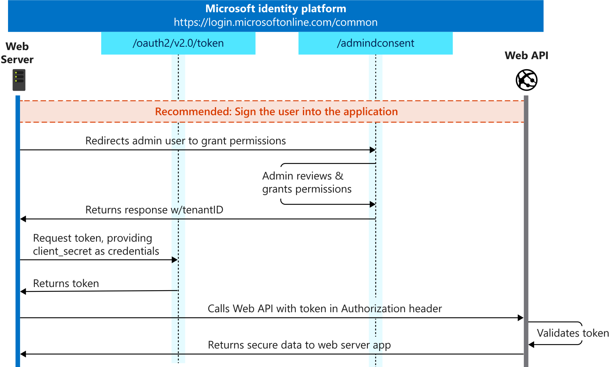

In this unit, you'll learn how to add app roles to an Azure AD Application registration and consume a secured API from a daemon application.

## Overview

The previous units demonstrated how to use the on-behalf-of flow to call a Microsoft identity-secured web API. The on-behalf-of flow was implemented using the currently signed-in user's access token as well as a web app's access token to obtain a new access token used to call the web API.

Another scenario is for an application to act on its own without user interaction. In this scenario, the application obtains an access token from Microsoft identity to access the web API without any user involvement.

## Access Microsoft identity-secured web APIs with daemon apps

Apps that run without user interaction are referred to as services or daemon apps. A daemon is an application that runs, typically on a schedule, and doesn't require a user to be involved in the process. An administrator does need to go through a consent process to grant the daemon the necessary permissions to call a web API.

Unlike the apps that have a user involved and implement the on-behalf-of flow, daemon apps implement the *client credentials flow*.

Some examples of use cases for daemon apps include the following scenarios:

- Web applications that are used to provision or administer users or do batch processes in a directory
- Desktop applications (like Windows services on Windows or daemon processes on Linux) that do batch jobs, or an operating system service that runs in the background
- Web APIs that need to manipulate directories, not specific users

There's another common case where non-daemon applications use client credentials: even when a daemon does act on behalf of a user, the daemon needs to access a web API or a resource under own their identity for technical reasons. For example, accessing to secrets in Azure Key Vault or querying Azure SQL Databases.

Damon applications, like applications that implement the on-behalf-of flow, are *confidential client* applications. These apps, given that they access resources independently of users, need to prove their identity. They're also sensitive apps and they must be approved by the Azure AD tenant admins.

## Create daemon apps that call Microsoft identity-secured web APIs

Now let's see how to create and configure a daemon app that can access a secured web API.

The first step is to register a new Azure AD app in the Azure AD admin center that will represent the web application.


The important part of the app registration is the creation of an app secret. This secret, along with the client ID of the app, are used by the daemon app to authenticate with Microsoft identity when it requests an access token.


> [!IMPORTANT]
> It's recommended to use a certificate instead of a client secret for production apps.

> [!NOTE]
> Unlike web apps, a daemon app doesn't require a redirect URI. Daemon apps don't have a user experience, nor is a user involved, so there is no need to redirect a user to a web page.

### Client credentials grant flow

Daemon apps implement the OAuth 2.0 client credentials grant flow to obtain an access token from Microsoft identity. This flow permits a confidential client to use its own credentials to authenticate the app when calling a web API.

Your application can acquire a token to call a web API on behalf of itself (not on behalf of a user). This scenario is useful for daemon applications.



The first step an admin user must do is to grant the specified permissions to the daemon app. Once permissions have been granted via an admin consent experience, the app can request an access token.

The daemon submits a request to the Azure AD token issuing endpoint and includes its client ID and client secret (or certificate).

## Configure daemon apps to call secured APIs

The next step is to create the daemon app that will obtain an access token and then access the secured web API.

Create a new .NET Core console app using the following command, followed by installing a few NuGet packages to support and Microsoft identity.

```shell
dotnet new console
dotnet add package Microsoft.Identity.Client
dotnet add package Microsoft.Extensions.Configuration
dotnet add package Microsoft.Extensions.Configuration.Binder
```

### Update app to support Microsoft identity

Now update the project so it will authenticate with Microsoft identity and obtain an access token:

```csharp
IConfidentialClientApplication app =
  ConfidentialClientApplicationBuilder.Create("{{CLIENT_ID}})
      .WithClientSecret("{{CLIENT_SECRET}}")
      .WithAuthority(new Uri("https://login.microsoftonline.com/{{TENANT_ID}}"))
      .Build();

string[] scopes = new string[] { "api://{{CLIENT_ID}}/.default" };

AuthenticationResult result await app.AcquireTokenForClient(scopes).ExecuteAsync();
```

The scope to request for a client credential flow is the app ID followed by `/.default`. This tells Azure AD to use the application level permissions declared statically during the application registration.

The last step is to add code to call the web API:

```csharp
var httpClient = new HttpClient();

var defaultRequestHeaders = httpClient.DefaultRequestHeaders;
// add ACCEPT header if not present
if (defaultRequestHeaders.Accept == null
    || !defaultRequestHeaders.Accept.Any(m => m.MediaType == "application/json")) {
  httpClient.DefaultRequestHeaders.Accept.Add(new MediaTypeWithQualityHeaderValue("application/json"));
}
// add AUTHORIZATION header with access token
defaultRequestHeaders.Authorization = new AuthenticationHeaderValue("bearer", result.AccessToken);

// call web API endpoint
HttpResponseMessage response = await httpClient.GetAsync($"{{WEB_API_ENDPOINT}}/api/Categories");
if (response.IsSuccessStatusCode)
{
  string json = await response.Content.ReadAsStringAsync();
  var results = JsonDocument.Parse(json);
  // display results
}
```

## Summary

In this unit, you learned how to add app roles to an Azure AD Application registration and consume a secured API from a daemon application.
