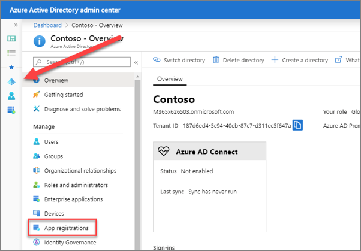
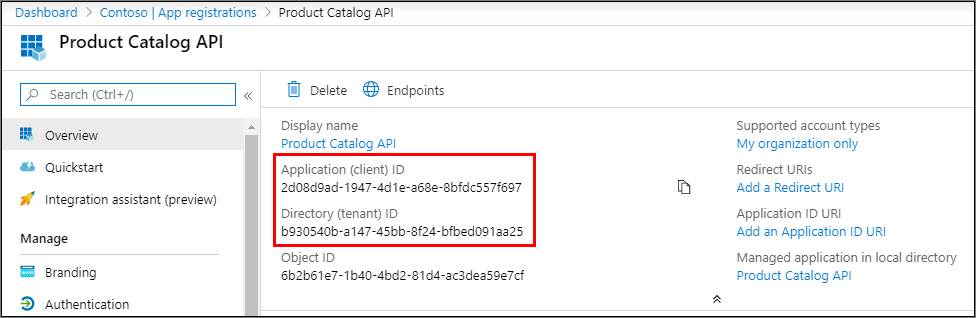
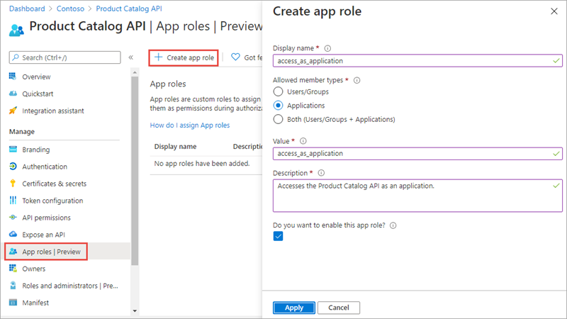
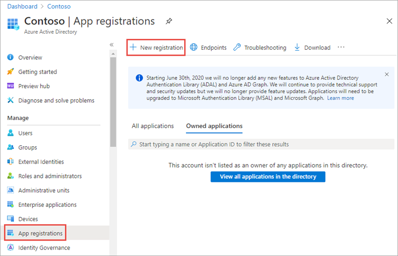
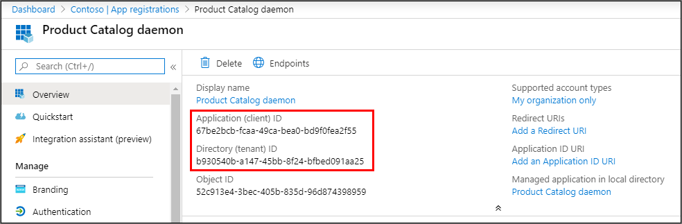
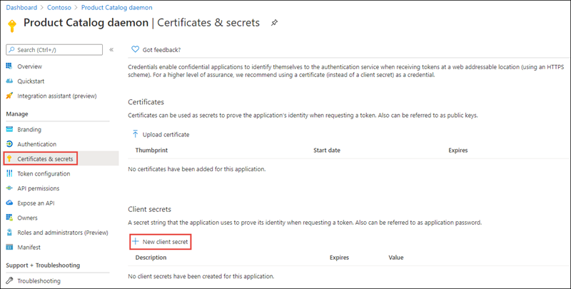
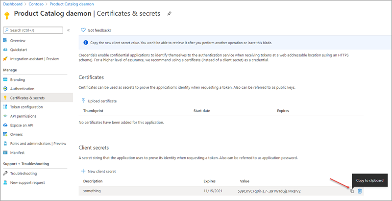
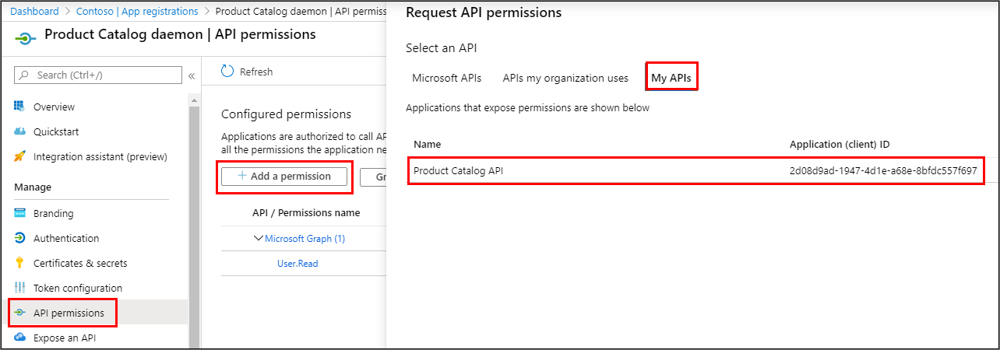
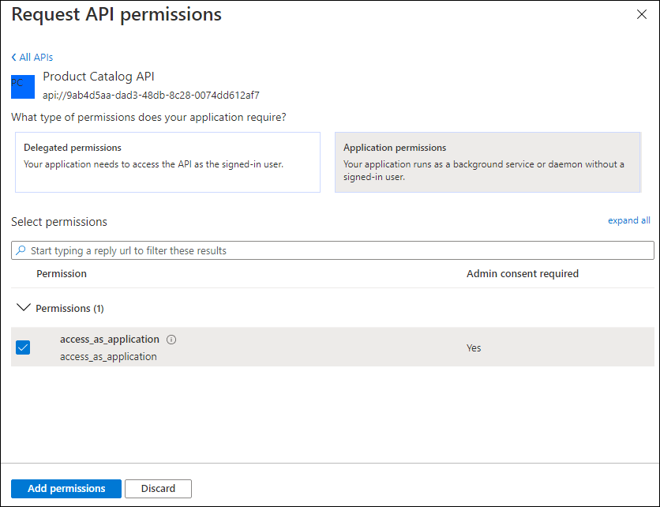
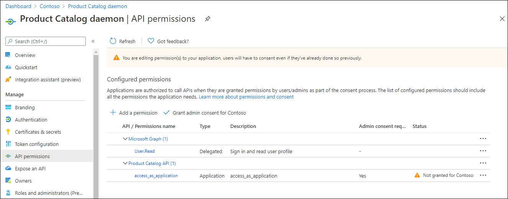

In this exercise, you'll learn how to add app roles (application permission) to an Azure AD Application registration and consume a secured API from a daemon application.

> [!IMPORTANT]
> This exercise assumes you have created the secured API app registration in the Azure AD admin center and associated project from the previous unit in this module. You'll consume that API in this exercise.

## Add app roles (application permission) to an Azure AD application

Open a browser and navigate to the [Azure Active Directory admin center](https://aad.portal.azure.com). Sign in using a **Work or School Account** that has global administrator rights to the tenant.

Select **Azure Active Directory** in the left-hand navigation.

Select **App registrations** in the left-hand navigation.



On the **App registrations** page, locate the application registration that represents the secured web API application from the first exercise in this module. To verify the application, compare the **Application (client) ID** and **Directory (tenant) ID** in the portal to the values set in the web api application.



Select **App roles** in the left-hand navigation.

Select **Create app role**.

On the **Create app role** panel, set the values as follows:

- **Display name**: access_as_application
- **Allowed member types**: Applications
- **Value**: access_as_application
- **Description**: Accesses the Product Catalog API as an application.
- **Do you want to enable this app role?**: Checked

Select **Apply**.



When creating an app role, consider the following requirements:

- Leave allowedMemberTypes set to "Application" only.
- Make sure displayName and value don't contain spaces.

## Register daemon app to call a protected web API

On the **App registrations** page, select **New registration**.



On the **Register an application** page, set the values as follows:

- **Name**: Product Catalog daemon
- **Supported account types**: Accounts in this organizational directory only (Single tenant)

Select **Register** to create the application.

On the **Product Catalog daemon** page, copy the values **Application (client) ID** and **Directory (tenant) ID**; you'll need these values later in this exercise.



### Create a client secret for the daemon app

The daemon app will use the Client Credentials flow to acquire the token. The Client Credentials flow requires the web app to authenticate with its application ID and either a certificate or secret. In this exercise, you'll use a secret.

Select **Certificates & secrets** from the left-hand navigation panel.

Select the **New client secret** button:



When prompted, give the secret a description and select one of the expiration duration options provided and select **Add**. *What you enter and select doesn't matter for the exercise.*

The **Certificate & Secrets** page will display the new secret. It's important you copy this value as it's only shown this one time; if you leave the page and come back, it will only show as a masked value.



Copy the value of the secret as you'll need it later.

### Grant API permissions

The daemon app requires permission to call the web API. This permission is requested in the same manner as Microsoft provided APIs in the Azure Active Directory portal.

Select **API permissions** from the left-hand navigation panel.

Select **Add a permission**. Select the app registration that represents the web API application.



Select **Application permissions**, select the **access_as_application** role, then select **Add permission**.



The **API permissions** page will redisplay. Note there are two warning messages about the application:

- Users will have to reconsent to the application even if they've already done so.
- The application permission is not yet consented by a tenant administrator.



Since this exercise is creating a daemon application that doesn't have a user interface, admin consent will be granted using the Azure AD admin center.

Select **Grant admin consent for [Tenant Name]**. Select **Yes** to complete the consent process.

## Create a .NET Core console application

> [!NOTE]
> The instructions below assume you are using .NET 5. They were last tested using v5.0.202 of the .NET 5 SDK.

Open your command prompt, navigate to a directory where you want to save your work.

Execute the following command to create a new .NET 5 console application:

```console
dotnet new console -o ProductCatalogDaemon
cd ProductCatalogDaemon
dotnet add package Microsoft.Identity.Client
dotnet add package Microsoft.Extensions.Configuration
dotnet add package Microsoft.Extensions.Configuration.Binder
dotnet add package Microsoft.Extensions.Configuration.Json
```

Open the scaffolded project folder in **Visual Studio Code**. When a dialog box asks if you want to add required assets to the project, select **Yes**.

Create a new file in the root folder of the project named **AuthenticationConfig.cs**. This class will contain the information necessary to acquire a token as the configured daemon application. Add the following to the file:

```csharp
using Microsoft.Extensions.Configuration;
using System;
using System.Globalization;
using System.IO;

namespace ProductCatalogDaemon
{
  public class AuthenticationConfig
  {
    public string Instance { get; set; } = "https://login.microsoftonline.com/{0}";
    public string Tenant { get; set; }
    public string ClientId { get; set; }
    public string Authority
    {
      get
      {
        return String.Format(CultureInfo.InvariantCulture, Instance, Tenant);
      }
    }
    public string ClientSecret { get; set; }
    public string ApiBaseAddress { get; set; }
    public string ApiScope { get; set; }
    public static AuthenticationConfig ReadFromJsonFile(string path)
    {
      IConfigurationRoot Configuration;

      var builder = new ConfigurationBuilder()
      .SetBasePath(Directory.GetCurrentDirectory())
      .AddJsonFile(path);

      Configuration = builder.Build();
      return Configuration.Get<AuthenticationConfig>();
    }
  }
}
```

Add a file to the root folder of the project named **appsettings.json**. Add the following to the file:

```json
{
  "Instance": "https://login.microsoftonline.com/{0}",
  "Tenant": "[TENANT-ID-FROM-PORTAL]",
  "ClientId": "[CLIENT-ID-FROM-PORTAL]",
  "ClientSecret": "[CLIENT-SECRET-FROM-PORTAL]",
  "ApiBaseAddress": "https://localhost:5050",
  "ApiScope": "api://[web-api-client-id]/.default"
}
```

Set the `Tenant` property to the **Directory (tenant) ID** you copied when creating the Azure AD application in the previous section.

Set the `ClientId` property to the **Application (client) ID** you copied when creating the Azure AD application in the previous section.

Set the `ClientSecret` property to the client secret you created when creating the Azure AD application in the previous section.

Replace `[web-api-client-id]` in the `APIScope` property value with the client ID for the web API application created in the first exercise in this module.

The scope doesn't include the delegated scopes (Category.Read, etc.) nor does it include the application role (access_as_application).  Apps using the client credentials flow must use a static scope definition that has been configured in the portal. The `.default` suffix indicates that the pre-configured scopes/roles are used.

Open the file **Program.cs**. Add the following code at the top of the file:

```csharp
using Microsoft.Identity.Client;
using System.Linq;
using System.Net.Http;
using System.Threading.Tasks;
using System.Text.Json;
using System.Net.Http.Headers;
```

Leave the namespace declaration untouched, then replace the contents of the `Program` class with the following code:

```csharp
class Program
{
  static void Main(string[] args)
  {
    try
    {
      RunAsync().GetAwaiter().GetResult();
    }
    catch (Exception ex)
    {
      Console.ForegroundColor = ConsoleColor.Red;
      Console.WriteLine(ex.Message);
      Console.ResetColor();
    }
  }

  private static async Task RunAsync()
  {
    AuthenticationConfig config = AuthenticationConfig.ReadFromJsonFile("appsettings.json");

    IConfidentialClientApplication app =
      ConfidentialClientApplicationBuilder.Create(config.ClientId)
          .WithClientSecret(config.ClientSecret)
          .WithAuthority(new Uri(config.Authority))
          .Build();

    // With client credentials flows the scopes is ALWAYS of the shape "resource/.default", as the
    // application permissions need to be set statically (in the portal or by PowerShell), and then granted by
    // a tenant administrator
    string[] scopes = new string[] { config.ApiScope };

    AuthenticationResult result = null;
    try
    {
      result = await app.AcquireTokenForClient(scopes).ExecuteAsync();
      Console.ForegroundColor = ConsoleColor.Green;
      Console.WriteLine("Token acquired \n");
      Console.ResetColor();
    }
    catch (MsalServiceException ex) when (ex.Message.Contains("AADSTS70011"))
    {
      // Invalid scope. The scope has to be of the form "https://resourceurl/.default"
      // Mitigation: change the scope to be as expected
      Console.ForegroundColor = ConsoleColor.Red;
      Console.WriteLine("Scope provided is not supported");
      Console.ResetColor();
    }

    if (result != null)
    {
      var httpClient = new HttpClient();
      var defaultRequestHeaders = httpClient.DefaultRequestHeaders;
      if (defaultRequestHeaders.Accept == null || !defaultRequestHeaders.Accept.Any(m => m.MediaType == "application/json"))
      {
        httpClient.DefaultRequestHeaders.Accept.Add(new MediaTypeWithQualityHeaderValue("application/json"));
      }
      defaultRequestHeaders.Authorization = new AuthenticationHeaderValue("bearer", result.AccessToken);

      HttpResponseMessage response = await httpClient.GetAsync($"{config.ApiBaseAddress}/api/Categories");
      if (response.IsSuccessStatusCode)
      {
        string json = await response.Content.ReadAsStringAsync();
        var results = JsonDocument.Parse(json);
        Console.ForegroundColor = ConsoleColor.Gray;
        Display(results.RootElement.EnumerateArray());
      }
      else
      {
        Console.ForegroundColor = ConsoleColor.Red;
        Console.WriteLine($"Failed to call the Web Api: {response.StatusCode}");
        string content = await response.Content.ReadAsStringAsync();

        // Note that if you got reponse.Code == 403 and reponse.content.code == "Authorization_RequestDenied"
        // this is because the tenant admin as not granted consent for the application to call the Web API
        Console.WriteLine($"Content: {content}");
      }
      Console.ResetColor();

    }
  }

  private static void Display(JsonElement.ArrayEnumerator results)
  {
    Console.WriteLine("Web Api result: \n");

    foreach (JsonElement element in results)
    {
      var id = -1;
      var name = string.Empty;

      if (element.TryGetProperty("id", out JsonElement idElement))
      {
        id = idElement.GetInt32();
      }
      if (element.TryGetProperty("name", out JsonElement nameElement))
      {
        name = nameElement.GetString();
      }
      Console.WriteLine($"ID: {id} - {name}");
    }
  }
}
```

## Update web API application to authorize application roles

The web API application does an authorization check on the scopes provided in each request. This check must be updated to consider the **access_as_application** role.

In a separate instance of Visual Studio Code, open the folder containing the web API application from the first exercise.

Open the file **Controllers\CategoriesController.cs**. Locate the method `GetAllCategories` and replace its contents with the following code:

```csharp
public List<Category> GetAllCategories() {
  if (!HttpContext.User.IsInRole("access_as_application"))
  {
    HttpContext.VerifyUserHasAnyAcceptedScope(new string[] { "Category.Read" });
  }
  return data.Categories;
}
```

The authorization by scope is only done if the caller isn't part of the **access_as_application** role.

On the Visual Studio Code menu bar, select **Run** > **Run Without Debugging** to start the web API.

## Build and run the daemon application

Execute the following command in a command prompt to compile and run the application:

```console
dotnet dev-certs https --trust
dotnet build
dotnet run
```

The list of categories will display in the command window.

## Summary

In this exercise, you learned how to add app roles (application permission) to an Azure AD Application registration and consume a secured API from a daemon application.
