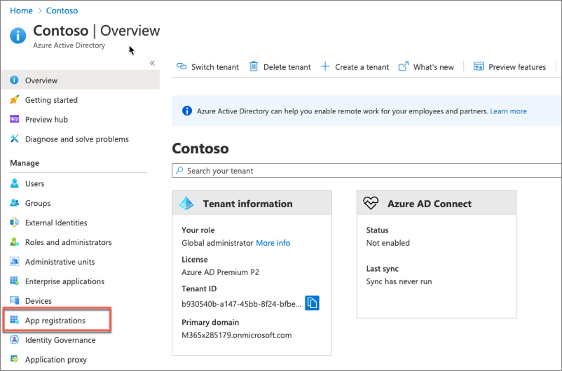
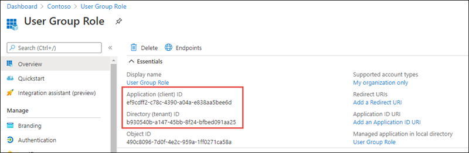
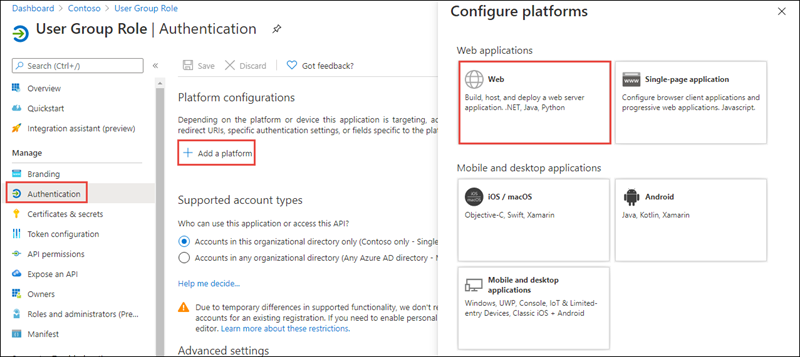
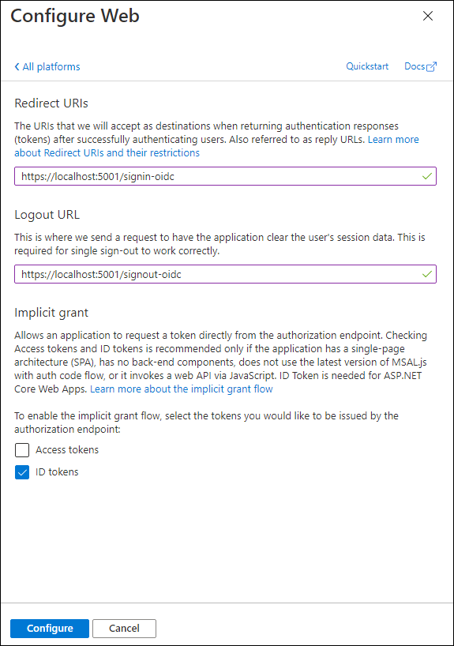
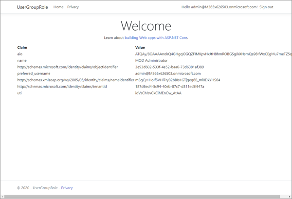

In this exercise, you’ll learn how to create a .NET Web application that uses Microsoft identity to log in, and to show the claims available to apply authorization checks.

## Create an Azure AD application

Open a browser and navigate to the [Azure Active Directory admin center](https://aad.portal.azure.com). Sign in using a **Work or School Account** that has global administrator rights to the tenant.

Select **Azure Active Directory** in the left-hand navigation.

Select **App registrations** in the left-hand navigation.



On the **App registrations** page, select **New registration**.


On the **Register an application** page, set the values as follows:

- **Name**: User Group Role
- **Supported account types**: Accounts in this organizational directory only (Single tenant)

Select **Register** to create the application.
On the **Product Catalog WebApp** page, copy the values **Application (client) ID** and **Directory (tenant) ID**; you'll need these values later in this exercise.



On the **Overview** page, select the **Add a Redirect URI** link under the **Redirect URIs**.

Select **Add a platform**, then select **Web**.



On the **Configure Web** panel, use the following values to configure the application:

- **Redirect URIs**: https://localhost:5001/signin-oidc
- **Front-channel logout URL**: https://localhost:5001/signout-oidc
- **Implicit grant and hybrid flows**: select **ID tokens (used for implicit and hybrid flows)**

Select **Configure** when finished setting these values.



## Create a single organization ASP.NET web application

> [!NOTE]
> The instructions below assume you are using .NET 5. They were last tested using v5.0.202 of the .NET 5 SDK.

Open your command prompt, navigate to a directory where you want to save your work, create a new folder, and change directory into that folder.

Execute the following command to create a new ASP.NET Core MVC web application:

```console
dotnet new mvc --auth SingleOrg -o UserGroupRole
```

After creating the application, run the following commands to ensure your new project runs correctly.

```console
cd UserGroupRole
dotnet add package Microsoft.Identity.Web
dotnet add package Microsoft.Identity.Web.UI
```

Open the root folder of the new ASP.NET core application using a text editor such as **Visual Studio Code**. When a dialog box asks if you want to add required assets to the project, select **Yes**.

### Configure the web application with the Azure AD application

Locate and open the **./appsettings.json** file in the ASP.NET Core project.

Set the `AzureAd.Domain` property to the domain of your Azure AD tenant where you created the Azure AD application (*for example: contoso.onmicrosoft.com*).

Set the `AzureAd.TenantId` property to the **Directory (tenant) ID** you copied when creating the Azure AD application in the previous section.

Set the `AzureAd.ClientId` property to the **Application (client) ID** you copied when creating the Azure AD application in the previous section.

### Update the user experience

Finally, update the user experience of the web application to display all the claims in the OpenID Connect ID token.

Locate and open the **./Views/Home/Index.cshtml** file.

Add the following code to the end of the file:

```cshtml
@if (User.Identity.IsAuthenticated)
{
<div>
  <table cellpadding="2" cellspacing="2">
    <tr>
      <th>Claim</th>
      <th>Value</th>
    </tr>
    @foreach (var claim in User.Claims)
    {
      <tr>
        <td>@claim.Type</td>
        <td>@claim.Value</td>
      </tr>
    }
  </table>
</div>
}
```

#### Build and test the web app

Run the following command to trust the .NET Core HTTPS development certificate:

```console
dotnet dev-certs https --trust
```

Run the following command in a command prompt to compile the application:

```console
dotnet build
```

Run the following command to run the application:

```console
dotnet run
```

Open a browser and navigate to the url **https://localhost:5001**. The web application will redirect you to the Azure AD sign-in page.

Sign in using a Work and School account from your Azure AD directory. After login and consent, Azure AD will redirect you back to the web application. Notice some of the details from the claims included in the ID token.



## Summary

In this exercise, you learned how to create a .NET Web application that uses Microsoft identity to log in, and to show the claims available to apply authorization checks.
