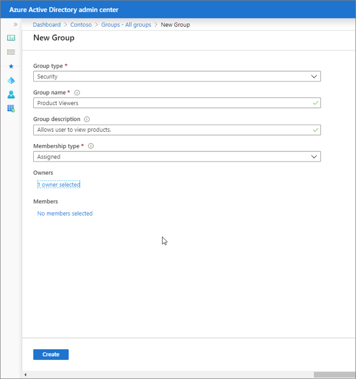
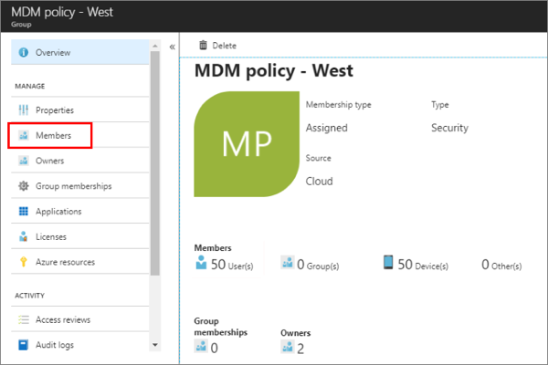

Security groups are collections of users assigned to a group. Rights can then be assigned to these security groups, granting all users in the group access to permissions within an application.

In this unit, you’ll learn what security groups are and how you can use them within your custom apps secured with Microsoft identity.

## Manage app access with Azure AD groups

Azure Active Directory (Azure AD) lets you use groups to manage access to your cloud-based apps, on-premises apps, and your resources. Your resources can be part of the Azure AD organization, such as permissions to manage objects through roles in Azure AD, or external to the organization, such as for Software as a Service (SaaS) apps, Azure services, SharePoint sites, and on-premises resources.

Azure AD helps you give access to your organization's resources by providing access rights to a single user or to an entire Azure AD group. Using groups lets the resource owner assign a set of access permissions to all the members of the group, instead of having to provide the rights one-by-one. The resource or directory owner can also give management rights for the member list to someone else, such as a department manager or the support department administrator, letting that person add and remove members, as needed.

The owner of a group can also enable users to find their own groups to join instead of explicitly assigning users to groups. Groups can be configured to automatically accept all user join requests or to require approval.

## Managing groups in Microsoft identity

Groups can be managed from the Azure AD admin center (https://aad.portal.azure.com). Select the **Groups** navigation option to open the **All groups** blade. The **All groups** blade displays all the groups in your organization.

### Create and manage groups

To add a group to your organization, first sign-in to the Azure AD admin center and select the **Groups** navigation option to open the **All groups** blade.


Select the **New group** button in the navigation to enter the group's information. Some fields are required, such as the type and name, while others are optional such as the group's description.



Groups can be one of two types:

- **Security**: Used to manage member and computer access to shared resources for a group of users. For example, you can create a security group for a specific security policy. By doing it this way, you can give a set of permissions to all the members at once, instead of having to add permissions to each member individually.
- **Office 365**: Used for shared collaboration opportunities giving members access to a shared mailbox, calendar, files, SharePoint site, and more. This option also lets you give people outside of your organization access to the group.

Administrators can select one of the following supported **membership types**:

- **Assigned**: Lets you add specific users to be members of this group and to have unique permissions. For the purposes of this article, we're using this option.
- **Dynamic user**: Lets you use dynamic membership rules to automatically add and remove members. If a member's attributes change, the system looks at your dynamic group rules for the directory to see if the member meets the rule requirements (is added) or no longer meets the rules requirements (is removed).
- **Dynamic device**: Lets you use dynamic group rules to automatically add and remove devices. If a device's attributes change, the system looks at your dynamic group rules for the directory to see if the device meets the rule requirements (is added) or no longer meets the rules requirements (is removed).

### Manage group members

Once you've created a group, you can then manage the members in the group.

Select a group from the **All groups** page and then select the **Members** navigation item.



Select the **Add members** button and search for each of the members you want to add to the group. Select each member and add them the group.

Removing a member from a group by selecting the member and then select the **Remove** button from the member's detail page.

## Security groups in custom apps

Custom apps can request a user's group membership as a way to provide or restrict access to certain functionally within the app.

By default, the ID token provided by Microsoft identity only contains basic information about the current user. Security groups the user is a member of aren't included in the ID token.

To add them to the ID token, set the `groupMembershipClaims` property to `SecurityGroup` in the manifest of the registered Azure AD app from the Azure AD admin center.

### Code configuration

With the app registered and configured in the Azure AD admin center, the next step is to update the app's configuration.

Within the method `ConfigureServices()`, locate the line that configures the `OpenIdConnectOptions`. Update the expression to match the following code:

```csharp
services.Configure<OpenIdConnectOptions>(AzureADDefaults.OpenIdScheme, options =>
{
  options.Authority = options.Authority + "/v2.0/";
  options.TokenValidationParameters.NameClaimType = "preferred_username";
  options.TokenValidationParameters.RoleClaimType = "groups";
});
```

Notice the addition of the line for the `RoleClaimType` is set to `groups`. This is added to specify the claim that represents Groups when creating the ClaimsPrincipal in ASP.NET.

In ASP.NET, you can secure a controller so only authenticated users can access it by decorating it the method with the `[Authorize]` attribute. This attribute also supports securing the endpoint based on a security group.

After configuring the OpenID Connect middleware to use Microsoft identity as the role claim, you can specify the ID of a group to secure the controller:

```csharp
[Authorize(Roles("22222222-2222-2222-2222-222222222222"))]
public class ProductsController : Controller
{ }
```

You can also use the group information in code using the `user.IsInRole("22222222-2222-2222-2222-222222222222")` method. For example, the following code will only show the **Products** navigation link if the user is in a specific group:

```cshtml
@if (User.IsInRole("22222222-2222-2222-2222-222222222222"))
{
  <li class="nav-item">
    <a class="nav-link text-dark" asp-area="" asp-controller="Products" asp-action="Index">Products</a>
  </li>
}
```

## Summary

In this unit, you learned what security groups are and how you can use them within your custom apps secured with Microsoft identity.
