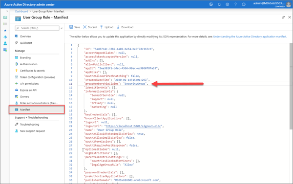
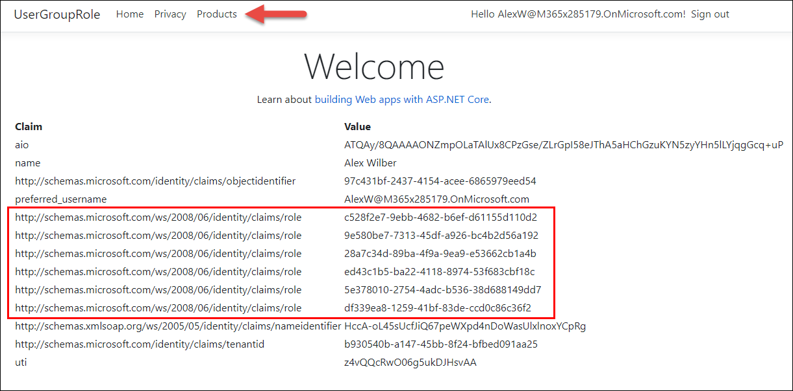

In this exercise, you’ll learn how to create and configure an application registration to include group claims in a token and authorize access to a controller using those claims.

## Update the application registration

The ID token returned by default from Microsoft identity contains only basic information about the current user. The application registration can be updated to include additional information. Configure the application registration to include group membership claims by editing the application manifest.

Open a browser and navigate to the [Azure Active Directory admin center](https://aad.portal.azure.com). Sign in using a **Work or School Account** that has global administrator rights to the tenant.

Select **Azure Active Directory** in the left-hand navigation.

Select **App registrations** in the left-hand navigation.


On the **App registrations** page, locate the application registration that represents the Users Group Roles application from the first exercise in this module. To verify the application, compare the **Application (client) ID** and **Directory (tenant) ID** in the portal to the values copied in the first exercise.


In the application registration for your application, select **Manifest**.

In the manifest editor, find the node named `groupMembershipClaims`. The default value is `null`. Set the `groupMembershipClaims` node with the following code:

```json
"groupMembershipClaims": "SecurityGroup",
```



Save the manifest.

### Configure web application middleware

In Visual Studio Code, locate and open the **./Startup.cs** file in the ASP.NET Core project.

Within the method `ConfigureServices()`, locate the line that configures the `OpenIdConnectOptions`. Update the expression to match the following code:

```csharp
services.Configure<OpenIdConnectOptions>(AzureADDefaults.OpenIdScheme, options =>
{
  options.Authority = options.Authority + "/v2.0/";
  options.TokenValidationParameters.NameClaimType = "preferred_username";
  options.TokenValidationParameters.RoleClaimType = "groups";
});
```

A new statement is added to specify the claim that represents Groups when creating the ClaimsPrincipal in ASP.NET.

### Extend application with authorization

The Home controller of the application contains the `[Authorize]` attribute, which allows any logged-in user to view the page. A new controller will demonstrate using the group claims to authorize users.

The next step is to add a model, controller, and view to the web app that will display Products from a fictitious product catalog. Only members of a specific group are allowed to view products.

#### Create a product viewer group

Open a browser and navigate to the [Azure Active Directory admin center](https://aad.portal.azure.com). Sign in using a **Work or School Account** that has global administrator rights to the tenant.

Select **Azure Active Directory** in the left-hand navigation.

Select **Groups** in the left-hand navigation.

On the **All Groups** page, select **New Group**. Create the group with the following information:

- **Group Type**: Security
- **Group Name**: Product Viewers
- **Group Description**: Allows user to view products.
- **Membership type**: Assigned
- **Owners**: Select the logged-in user account as a group owner
- **Members**: Select the logged-in user account as a group owner. Optionally select other users as group members

> [!NOTE]
> The user must be a member of the group to have it included in the group claim.

Select **Create**.


On the **All Groups** page, copy the **Object Id** of the new group. You'll need this value later in the exercise.

#### Add data models and sample data

The next step is to add data models and sample data to the web app.

By convention, .NET Core WebAPI projects store model classes in a folder named Models. Create a new folder named **Models** in the project directory.

In the **Models** folder, create a new file named **Category.cs** and add the follow C# code to it:

```csharp
namespace <PROJECT-NAMESPACE>.Models
{
  public class Category
  {
    public int Id { get; set; }
    public string Name { get; set; }
  }
```

Replace the string `<PROJECT-NAMESPACE>` with the root namespace of the project. This can be found in the **Startup.cs** file.

In the **Models** folder, create a new file named **Product.cs** and add the following C# code to it:

```csharp
namespace <PROJECT-NAMESPACE>.Models
{
  public class Category
  {
    public int Id { get; set; }
    public string Name { get; set; }
    public Category Category { get; set; }
  }
}
```

Replace the string `<PROJECT-NAMESPACE>` with the root namespace of the project. This can be found in the **Startup.cs** file.

This exercise will store sample data in-memory while the app is running. The data will randomly generated when the app is started using a NuGet package.

Install the NuGet package by running the following from your command prompt in the project folder:

```shell
dotnet add package Bogus
```

Return to **Visual Studio Code** and create a new file named **SampleData.cs** in the root folder of the project. Add the following C# code to the file:

```csharp
using System.Collections.Generic;
using Bogus;
using <PROJECT-NAMESPACE>.Models;

namespace <PROJECT-NAMESPACE>
{
  public class SampleData
  {
    public List<Category> Categories { get; set; }
    public List<Product> Products { get; set; }

    public static SampleData Initialize()
    {
      var data = new SampleData();

      var categoryIds = 0;
      var categoryFaker = new Faker<Category>()
        .StrictMode(true)
        .RuleFor(c => c.Id, f => ++categoryIds)
        .RuleFor(c => c.Name, f => f.Commerce.Categories(1)[0]);
      data.Categories = categoryFaker.Generate(10);

      var productIds = 0;
      var productFaker = new Faker<Product>()
        .StrictMode(true)
        .RuleFor(p => p.Id, f => ++productIds)
        .RuleFor(p => p.Name, f => f.Commerce.Product())
        .RuleFor(p => p.Category, f => f.PickRandom(data.Categories));
      data.Products = productFaker.Generate(20);

      return data;
    }
  }
}
```

Replace the string `<PROJECT-NAMESPACE>` with the root namespace of the project. This can be found in the **Startup.cs** file.

The sample data will be stored as a singleton in the dependency injection container built into ASP.NET core. Open the **Startup.cs** file in the root folder of the project. Locate the statement that calls the `AddControllersWithViews()` method. Before that statement, add the following:

```csharp
services.AddSingleton(SampleData.Initialize());
```

### Add controller and view for Products

Earlier, the middleware was configured to use the group claim from Microsoft identity as the role claim in ASP.NET's identity system. The `[Authorize]` attribute has a property that can specify the roles required to access a controller. Since the group claim contains the group Id, the Id is specified in the attribute. The Id is the object id copied from the Azure Active Directory admin center.

Add a new file **ProductsController.cs** to the **Controllers** folder. Add the following code to it:

```cs
using Microsoft.AspNetCore.Authorization;
using Microsoft.AspNetCore.Mvc;

namespace <PROJECT-NAMESPACE>.Controllers
{
  [Authorize(Roles(<VIEWER-GROUP-OBJECTID>))]
  public class ProductsController : Controller
  {
    SampleData data;

    public ProductsController(SampleData data)
    {
      this.data = data;
    }

    public ActionResult Index()
    {
      return View(data.Products);
    }
  }
}
```

Replace the string `<PROJECT-NAMESPACE>` with the root namespace of the project. This can be found in the **Startup.cs** file.

Replace the string `<VIEWER-GROUP-OBJECTID>` with the value copied from the All Groups page.

Now create the view to display the categories.

Add a new folder **Products** to the **Views** folder. Add a new file, **Index.cshtml**, to the new **Products** folder and add the following code to it. This will display all the products provided by the API:

```html
@model IEnumerable<<PROJECT-NAMESPACE>.Models.Product>

@{
  ViewData["Title"] = "Products";
}

<h1>Products</h1>

<table class="table">
  <thead>
    <tr>
      <th>
        @Html.DisplayNameFor(model => model.Id)
      </th>
      <th>
        @Html.DisplayNameFor(model => model.Name)
      </th>
      <th>
        @Html.DisplayNameFor(model => model.Category)
      </th>
    </tr>
  </thead>
  <tbody>
@foreach (var item in Model) {
    <tr>
      <td>
        @Html.DisplayFor(modelItem => item.Id)
      </td>
      <td>
        @Html.DisplayFor(modelItem => item.Name)
      </td>
      <td>
        @Html.DisplayFor(modelItem => item.Category.Name)
      </td>
    </tr>
}
  </tbody>
</table>
```

Replace the string `<PROJECT-NAMESPACE>` with the root namespace of the project. This can be found in the **Startup.cs** file.

The ASP.NET identity system allows for an imperative test of membership via the `User.IsInRole()` method. Use this method to update the site navigation, showing a link to the Products controller only if the user is allowed to access it.

Open the file **Views\Shared\_Layout.cshtml**. In the `<header>` element is an unordered list (`<ul>`) of links that compose the navigation. The navigation has link to Home and Privacy. After the Privacy link, add the following code:

```cshtml
@if (User.IsInRole("<VIEWER-GROUP-OBJECTID>"))
{
  <li class="nav-item">
    <a class="nav-link text-dark" asp-area="" asp-controller="Products" asp-action="Index">Products</a>
  </li>
}
```

Replace the string `<VIEWER-GROUP-OBJECTID>` with the value copied from the All Groups page.

#### Build and test the web app

Execute the following command in a command prompt to compile and run the application:

```shell
dotnet build
dotnet run
```

Open a browser and navigate to the url **https://localhost:5001**. The web application will redirect you to the Azure AD sign-in page.

Sign in using a Work and School account from your Azure AD directory. The first login will prompt for consent to the scopes required by the web API. After consent, Azure AD will redirect you back to the web application.

> Note: You must login after adding the user to the group. Any logins that occurred before the update will result in a token that does not reflect the membership. Close the browser or select **Sign out** to sign out of the session.

On the home page, the assigned groups are included in the list of claims. If the user is a member of the correct group, the navigation will include a link to the Products controller.



## Summary

In this exercise, you learned how to create and configure an application registration to include group claims in a token and authorize access to a controller using those claims.
