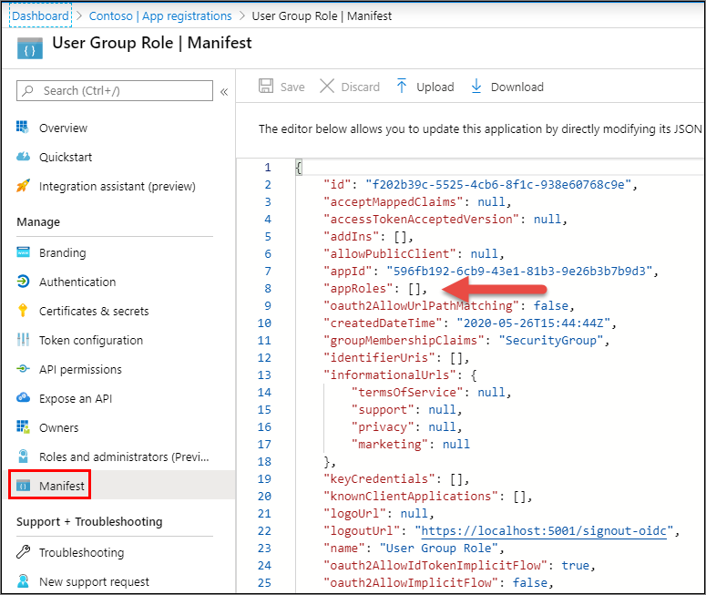
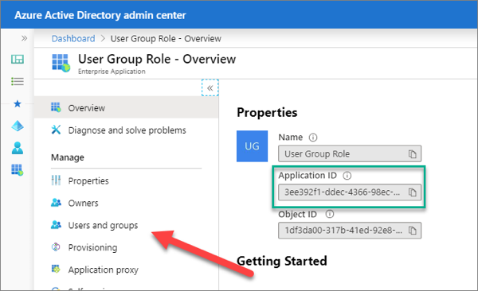
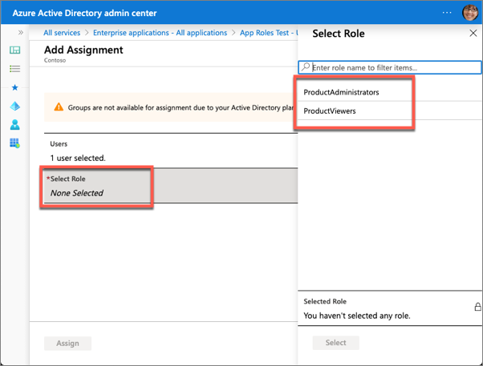

Application roles are used to assign permissions to users and apps. These roles are defined in the registered Azure AD app’s manifest.

In this unit, you’ll learn how to add app roles to an Azure AD registered app, grant users and groups to the role and use the app role within a custom app secured with Microsoft identity.

## Utilize app roles in your application

Role-based access control (RBAC) is a popular mechanism to enforce authorization in applications. The administrator can then assign roles to different users and groups to control who have access to what content and functionality.

Using RBAC with Application Roles and Role Claims, developers can securely enforce authorization in their apps with little effort on their part.

These application roles are defined in the Azure AD admin center in the application's registration manifest. When a user signs into the application, Azure AD emits a roles claim for each role that the user has been granted individually to the user and from their group membership. Assignment of users and groups to roles can be done through the portal's UI, or programmatically using Microsoft Graph.

## Declare roles for an application

App roles can be managed from the Azure AD admin center (https://aad.portal.azure.com). Select an application in the Azure AD admin center. Roles are defined in the app's manifest that is accessible from the **Manifest** navigation item.

Locate the `appRoles` setting in the manifest:



Add application roles to the manifest by adding them to this `appRoles` property. For example, the following JSON defines two new roles: **ProductAdministrators** and **ProductViewers**.

```json
"appRoles": [
  {
    "allowedMemberTypes": [ "User" ],
    "description": "Administrator role for Product Catalog web application.",
    "displayName": "ProductAdministrators",
    "id": "98ce9517-557f-4ac5-b827-f18d948ee552",
    "isEnabled": true,
    "lang": null,
    "origin": "Application",
    "value": "ProductAdministrators"
  },
  {
    "allowedMemberTypes": [ "User" ],
    "description": "Viewer role for Product Catalog web application",
    "displayName": "ProductViewers",
    "id": "7465fed6-02cc-467c-87c2-fa6e0bf4f929",
    "isEnabled": true,
    "lang": null,
    "origin": "Application",
    "value": "ProductViewers"
  }
]
```

> [!IMPORTANT]
> The `displayName` property can't contain any spaces.

### Add users and groups to roles

After defining the app roles within the app's manifest, you can now add users to the role.

From the **Enterprise application** blade in the Azure AD admin center, select the application and then select the **Users & Groups** navigation item.



Select **Add User**. On the **Add Assignment** blade, select the users or groups you want to add to the app role. Then select the app role or app roles to add the user or groups:



## Utilize app roles in custom web apps

Using app roles as the authorization source is similar to using the group claims in a previous exercise. There are two changes from using groups:

1. Turn off the ASP.NET claim type mapping (since we aren't supporting legacy applications).
1. Use the roles claims in the token as the `RoleClaimType`.

### Code configuration

With the app registered and configured in the Azure AD admin center, the next step is to update the app's configuration.

In an ASP.NET web app, within the `ConfigureServices()` method in the  **Startup.cs** file, update the configuration of the `OpenIdConnectOptions` when configuring the service to the following. This code will first disable the default mapping of claims and configure OpenIDConnect to map the roles to the app roles.

```csharp
JwtSecurityTokenHandler.DefaultMapInboundClaims = false;
services.Configure<OpenIdConnectOptions>(AzureADDefaults.OpenIdScheme, options =>
{
  options.Authority = options.Authority + "/v2.0/";
  options.TokenValidationParameters.RoleClaimType = "roles";
});
```

Notice the difference in the line for the `RoleClaimType` is set to `roles`. This is added to specify the claim that represents app roles when creating the ClaimsPrincipal in ASP.NET.

In ASP.NET, you can secure a controller so only authenticated users can access it by decorating it the method with the `[Authorize]` attribute. This attribute also supports securing the endpoint based on an app role.

After configuring the OpenID Connect middleware to use Microsoft identity as the role claim, you can specify the ID of a group to secure the controller:

```csharp
[Authorize(Roles=("ProductViewers,ProductAdministrators"))]
public class ProductsController : Controller
{ }
```

You can also use the `[Authorize]` attribute to secure specific methods on the endpoint. For example, the following code will only allow **ProductAdministrators** the ability to create new products on the `ProductsController`:

```csharp
[Authorize(Roles = ("ProductAdministrators"))]
public ActionResult Create()
{
  var viewModel = new ProductViewModel()
  {
    Categories = data.Categories
  };
  return View(viewModel);
}

[Authorize(Roles = ("ProductAdministrators"))]
[HttpPost]
[ValidateAntiForgeryToken]
public ActionResult Create([Bind("ProductName", "CategoryId")] ProductViewModel model)
{
  if (ModelState.IsValid)
  {
    data.Products.Add(new Product()
    {
      Id = data.Products.Max(p => p.Id) + 1,
      Name = model.ProductName,
      Category = new Category { Id = model.CategoryId }
    });
    return RedirectToAction("Index");
  }
  return View(model);
}
```

## Summary

In this unit, you learned how to add app roles to an Azure AD registered app, grant users and groups to the role and use the app role within a custom app secured with Microsoft identity.
