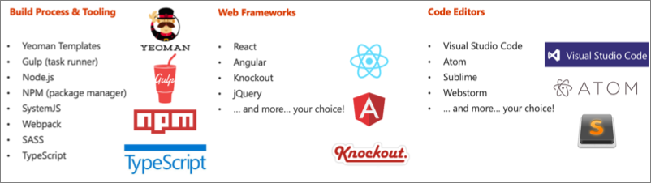
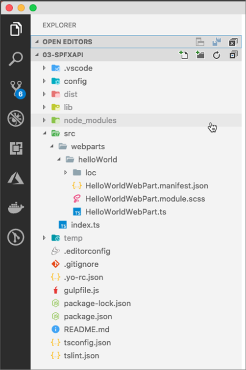

In this unit, you'll learn what developers will need and how to create custom SharePoint Framework solutions. Once you've created the custom solution, you'll then learn how to deploy your components into different environments and various hosting options for your components.

## Tooling for SPFx development

Microsoft has adopted the open-source tooling for the foundation of SharePoint Framework development. Three categories to explore when it comes to open-source tooling and libraries related to the SharePoint Framework are as follows:

- Build process and tooling
- Web frameworks
- Code editors

### Build process and tooling

Let's look at the build process and tooling first. Yeoman is used to replace the new project experience that traditional server-side SharePoint developers are familiar with in Visual Studio.

Gulp is a task runner that replaces the tool MSBuild used in .NET solutions. This is used to run various tasks, like transpiling TypeScript to JavaScript, creating JavaScript bundles and SharePoint packages.

Node.js is the underlying runtime used by all applications. The tools we're covering in this section are all built on top of Node.js. Node.js is required to run them, just like the .NET Framework is required to run .NET apps.

NPM is used as the package manager and you'll use it to install global tools and reusable code in your projects.

Webpack is used to combine all the JavaScript and CSS files in your project into a single JavaScript bundle. Bundles are the recommended way to deploy client-side applications for performance reasons.

These are tools that aren't built and provided by Microsoft, rather they're maintained by the community and are all open-source tools. One benefit of using these tools is that they're cross platform, so the same tools can be used even if your development environment is Windows, macOS, or Linux.

### Web frameworks

When building client-side applications, developers commonly use web frameworks. The SharePoint Framework doesn't limit you to any specific framework. You can use any of the popular web frameworks in your projects including React, Angular, Knockout, or Vue.js. You can even use the popular jQuery library in your custom apps.

### Code editors

You'll also want to get a code editor to develop your project. Most developers are use Visual Studio Code by Microsoft. It's a lightweight version of Visual Studio and is just a text editor that understands TypeScript and can be customized using extensions.

However, you aren't limited to Visual Studio Code. You can choose a different editor if you wanted to. Something as simple as notepad, Atom, Sublime, or WebStorm will work as well. It doesn't matter what you use as all development is done through text editors.

## Server-side tool comparison

The SharePoint Framework development toolchain is a significant change from the traditional server-side SharePoint development experience. Let's look at the two development toolchains to see how they compare and contrast

In the previous image, the top row is the server-side tool comparison, starting with the Microsoft IIS web server. This includes the .NET Framework, NuGet used for package management, MSBuild used for running build and packaging tasks, C# as the development language and Visual Studio for the development experience.

The bottom row represents the SharePoint Framework tools. Notice the lines drawn between the tools so you can see how the two compare.

## Exploring the SharePoint Framework core development and build tools

Let's look at each of the tools used in the SharePoint Framework development and build toolchain.

### Node.js

Node.js is a JavaScript runtime for running JavaScript on devices outside of the browser. It's a wrapper to the V8 JavaScript engine from the Chromium open-source browser project with some extra APIs that allow the V8 engine to run outside of the browser. This enables JavaScript to run on desktops, laptops, servers, and other devices.

> [!NOTE]
> Chromium is the project both of the browsers Google Chrome and Microsoft Edge are based on.

In the context of the SharePoint Framework, Node.js is needed as it's the runtime for the development and build tools previously covered. The SharePoint Framework doesn't require you to become a Node.js developer, but you need to install it so the apps in the development and build toolchain will run.

When compared to the server-side toolchain, Node.js serves the same role as the .NET Framework.

### NPM: Node Package Manager

NPM is a package manager for Node.js-based projects and is included with the Node.js installation. It's one of many package managers that can download and install packages from the npmjs.org registry.

When compared to the server-side toolchain, NPM serves the same role as NuGet.

### Yeoman

When building server-side SharePoint components using the Add-in model or as features or solutions, developers used Visual Studio to create and develop the project. The first step in these models is to create a project using the *New Project* wizard experience. This wizard collects information about the project and then scaffolds the project by creating folders, files, and customizing the files based on the responses to the questions.

Visual Studio Code doesn't have this *New Project* wizard experience. To simplify project creation, Yeoman is used to create the project.

Yeoman is a scaffolding engine that runs generators. A generator defines the set of questions and understands how to scaffold a new project or modify existing projects.

Microsoft provides a generator to scaffold SharePoint Framework projects, both new projects and to add components to existing projects.

### Gulp

Gulp is the task runner we use to do different tasks in our development and build process. Gulp executes tasks that are written in JavaScript. You'll use gulp to do things like building your project and transpiling the SAAS files to CSS and TypeScript to JavaScript. You'll use other tasks to combine the resulting files into bundles and package the resulting files into a SharePoint package file used for deployment.

When compared to the server-side toolchain, Gulp serves the same role as MSBuild.

### TypeScript

TypeScript is the language that you're going to write your SharePoint Framework projects with. Its super set of JavaScript with extra capabilities it to make JavaScript development easier to manage.

If you aren't familiar with JavaScript or you're not familiar with TypeScript, think of it as like a C# flavor to JavaScript. TypeScript's most popular features are type checking, the ability to use classes, and future features coming to JavaScript but not yet implemented or available except in preview.

Similar to C# based projects, you don't deploy TypeScript to production. Rather it's used to create intermediate files. The output of TypeScript is JavaScript, similar to how the output of C# is intermediate language (IL).

When compared to the server-side toolchain, TypeScript serves the same role as C#.

## SharePoint Framework project structure

The Yeoman generator for the SharePoint Framework creates the scaffolding (*folders and files*) for a new SharePoint Framework project. After building the project the first time, you'll see even more folders and files present. Just like a .NET Framework project, some of the generated files are temporary and shouldn't be kept in source control.

Let's look at the folders in a newly created and built SharePoint Framework project:

- **.vscode**: This folder contains Visual Studio Code specific files.
- **config**: This folder contains configuration files used by the project's various build tasks. You'll edit these files as necessary depending on the types of components you're creating and for specific situations, such as the site to test extensions or adding references to external libraries.
- **dist**: This folder, created automatically when you bundle the project, contains the JavaScript bundle and manifest created by the build process that will be used in deployment.
- **lib**: This folder, created automatically when you build the project, contains the temporary files generated from the compilation and transpilation of TypeScript to JavaScript and SCSS to CSS files.
- **node_modules**: This folder is created automatically when installing package dependencies using the `npm install` command.
- **src**: This folder contains all the source code for your project.
- **temp**: This folder, created automatically when you test the project, contains files used by the local development web server.

## Developing and testing solutions

Microsoft provides developers two options to test SharePoint Framework projects. The *workbench* is a special SharePoint page that contains a single canvas that developers can add their web parts to. There are two different workbench options: local and hosted.

### SharePoint-hosted workbench

The SharePoint-hosted workbench is hosted by a real SharePoint site, located at **https://{your-sharepoint-site}/_layouts/workbench.aspx**. The hosted workbench is unlike the local workbench in that because it's hosted by a real SharePoint site, it has SharePoint context. This means that your web part can access data in SharePoint lists and libraries in the same site as the hosted workbench.

### SharePoint Framework deployment artifacts

Let's start by looking at the SharePoint Framework deployment artifacts to understand the different things required for SharePoint Framework solutions to work in production.

There are two different kinds of files:

- **Installation and registration**: The installation and registration files are included in SharePoint packages deployed to the SharePoint App Catalogs. These files make SharePoint aware of the components included in the packages.

    These files include an app manifest file, feature framework files, and other files that SharePoint needs to provision the components. It doesn't include files that make the application run.

- **Component runtime files and dependencies**: These are the files that are needed to run the SharePoint Framework component once it's been deployed and installed in a SharePoint environment. Any dependencies your component uses, such as third-party web framework libraries, can optionally be included in the component's bundle or loaded at runtime from an external CDN. The component's manifest file defines all dependencies the component requires to be present on the page before it's loaded and runs.

    These files include JavaScript bundles of your components, images, CSS files, and JavaScript libraries or assets your component depends on.

### Deploy SharePoint assets

After creating the SharePoint package, the next step is to deploy it to a SharePoint environment. There are two ways to deploy SharePoint packages. Both options are SharePoint App Catalogs.

Now that you've created the package, the next step is to upload the package to one of the SharePoint App Catalogs. Part of this process is to also trust the package, indicating to SharePoint the app within the SharePoint package are safe to run in your environment.

This step makes the components available for installation and use within your SharePoint environment.

#### Tenant-scoped App Catalog

The tenant-scoped App Catalog was initially introduced to SharePoint in the SharePoint Server 2013 release. It's available in all later on-premises SharePoint Server releases and SharePoint Online.

The tenant App Catalog is managed by the SharePoint tenant administrators. All SharePoint packages deployed to the tenant's App Catalog are available to all site collections throughout the entire tenant.

#### Site collection-scoped App Catalog

The site collection App Catalog is only available in SharePoint Online. The site collection App Catalog works just like the tenant-scoped App Catalog, except SharePoint packages deployed to it are only available to that specific site collection.

The site collection App Catalog is a good option when you have a component that intended for a subset of site collections and not your entire tenant.

### Install the app from the site collection's Site Contents page

The last step is to install the app from the package into a site collection. This is done from the **New > App** menu in the **Site Contents** library in a site collection.

## Single part app pages

Single part app pages provide a capability to host SharePoint Framework web parts or Teams applications in SharePoint Online with a locked layout. End users can't modify or configure the page, which is using the Single Part App Page layout.

These single part app pages differ from traditional SharePoint web part pages in that these pages can't be edited by end users using the browser.

App pages are exposed as an option in the modern page creation capability when you chose the used page layout for your page. All web parts, which have been configured to be available also as an app page are available on the Create page capability.

## Isolated web parts

To allow your SharePoint Framework solutions to securely access APIs secured with Azure AD, you can use the API management to specify which APIs can be accessed by scripts in your tenant and with which permissions. Next, using the SharePoint Framework, you can easily retrieve an access token for the specific API.

While this simplifies communicating with APIs secured with Azure AD, it allows all scripts in the tenant to obtain an access token for any of the approved APIs, not just specific SharePoint Framework solutions. If one of the scripts you use in your tenant was exploited, then it could access any of the approved APIs for the current user.

Isolated web parts introduce a new way to isolate access to APIs secured with Azure AD and ensure that only specific SharePoint Framework web parts are allowed to obtain an access token for the particular API.

When deploying an isolated web part to the app catalog, all API permission requests are specified as isolated. Once the isolated API permission request is approved, SharePoint will create a separate Azure AD application in the tenant associated with the Microsoft 365 tenant. The Azure AD application is specific to the SharePoint Framework solution that requested API permissions and will have set OAuth permissions as requested by that solution.

The return URL of that Azure AD application, which is used by the OAuth implicit flow, will be set to a unique domain that is tied to that specific SharePoint Framework application. All web parts from solutions using isolated permissions, when added to a page, will be rendered in an Iframe that points to the unique domain tied to the particular SharePoint Framework solution.

This way, SharePoint Framework can enforce unique API permissions and ensure that no other solution or script in the tenant can obtain an access token to these APIs.

## Summary

In this unit, you'll learn what developers will need and how to create custom SharePoint Framework solutions. Once you've created the custom solution, you'll then learn how to deploy your components into different environments and various hosting options for your components.
