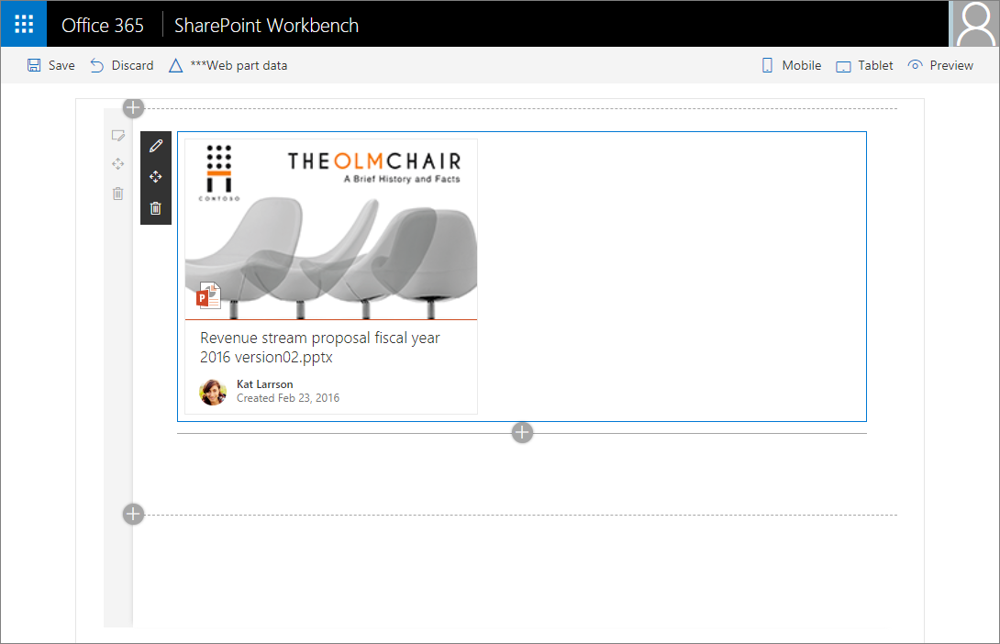
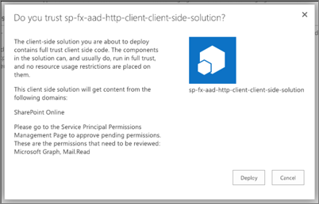
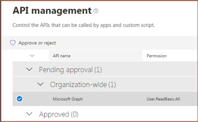
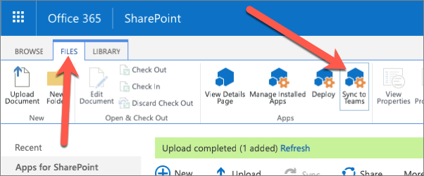

Custom SharePoint Framework solutions can incorporate data from external resources by calling APIs including the SharePoint REST API, Microsoft Graph, and third-party APIs that are open to anonymous requests or secured with Azure AD.

In this unit, you'll learn how the SharePoint Framework enables developers to incorporate data from external systems, surface customizations in other experiences like Microsoft Teams, and incorporate UI components with the Office UI Fabric (Fluent UI).

## Create appealing solutions with the Office UI Fabric (Fluent UI)

Office UI Fabric React is the front-end framework for building experiences for Office and Microsoft 365. It includes a robust collection of responsive, mobile-first components that make it easy for you to create web experiences by using the Office Design Language.

The new modern experiences in SharePoint use Office UI Fabric (Fluent UI) and Office UI Fabric React as the default front-end framework for building the new experiences. As a result, SharePoint Framework ships with a default version of Office UI Fabric (Fluent UI) and Fabric React that matches the version available in SharePoint. This ensures that the web part you're building uses the right version of the Fabric styles and components when deployed to SharePoint.

```typescript
public render(): JSX.Element {
  const previewProps: IDocumentCardPreviewProps = {
    previewImages: [
      {
        previewImageSrc: String(require('./document-preview.png')),
        iconSrc: String(require('./icon-ppt.png')),
        width: 318,
        height: 196,
        accentColor: '#ce4b1f'
      }
    ],
  };

  return (
    <DocumentCard onClickHref='http://bing.com'>
      <DocumentCardPreview { ...previewProps } />
      <DocumentCardTitle title='Revenue stream proposal fiscal year 2016 version02.pptx' />
      <DocumentCardActivity
        activity='Created Feb 23, 2016'
        people={
          [
            { name: 'Kat Larrson', profileImageSrc: String(require('./avatar-kat.png')) }
          ]
        }
      />
    </DocumentCard>
  );
}
```

If you select React as the web framework when creating a new project using the SharePoint Framework Yeoman generator, the project will be provisioned with the correct version of Office UI Fabric React. You can then directly import the Fabric components in your react components without any extra work.



## Incorporate enterprise data with APIs

The SharePoint Framework offers developers multiple API options to incorporate data from external systems in their custom components.

The following sections list some of the endpoints the SharePoint Framework API natively supports in custom solutions.

### SharePoint REST API

The SharePoint REST API is the primary API for accessing data in a SharePoint site. The API is available to both client-side and server-side solutions. Client-side solutions mean it's available to SharePoint Framework components and server-side solutions are those that run on a server but external to your SharePoint environment, such as an Azure Function or web app.

The SharePoint Framework includes an API that simplifies submitting request to the SharePoint REST API. The `SPHttpClient` API is available in all SharePoint Framework solutions on the `context` object. The `SPHttpClient` extends the `HttpClient` API, which is a wrapper to the Fetch API included in all modern browsers and includes a polyfill for older browsers that don't support the Fetch API.

The `HttpClient` is also included in the SharePoint Framework API. Developers can use it to submit HTTP requests to any REST API.

The `SPHttpClient` API automatically configures the HTTP request with the required HTTP request headers, including setting the SharePoint REST API OData version to v4 and configuring the response to only include minimal metadata for each item returned.

To submit a request to the SharePoint REST API, use the `spHttpClient` object on the current component's `context` object. You'll use either the `get()` or `post()` method to submit either an HTTP GET or HTTP POST request.

```typescript
private _getListItems(): Promise<ICountryListItem[]> {
  const endpoint: string = this.context.pageContext.web.absoluteUrl
    + `/_api/web/lists/getbytitle('Countries')/items?$select=Id,Title`

  return this.context.spHttpClient.get(
      endpoint,
      SPHttpClient.configurations.v1
    )
    .then(response => {
      return response.json();
    })
    .then(jsonResponse => {
      return jsonResponse.value;
    }) as Promise<ICountryListItem[]>;
}
```

### Microsoft Graph

The Microsoft Graph is the gateway to your data in the Microsoft cloud.


The Microsoft cloud is included of multiple services and data types that we can take advantage of from Microsoft 365, and it's all considered part of the Microsoft 365 platform.

Developers can integrate the signed-in user's email, calendar, contacts, and tasks into custom apps. We can work with content in SharePoint sites and lists files in OneDrive, channels and content within Microsoft Teams, and users in Azure Active Directory (Azure AD).

Microsoft Graph is accessible as a REST API so developers can use any technology that supports submitting and processing an HTTP request to an endpoint. Microsoft also offers many different SDKs for Microsoft Graph for different platforms and technologies to improve developer productivity.

One of the options offered by Microsoft is the [Microsoft Graph JavaScript SDK](https://github.com/microsoftgraph/msgraph-sdk-javascript). After initializing the SDK with an OAuth 2.0 access token, you can use the SDK to submit requests to Microsoft Graph. The SDK communicates directly with the Microsoft Graph REST API and returns the results as well-known objects. Microsoft also provides TypeScript type declarations for the SDK for TypeScript-based projects.

You can use Microsoft Graph in your custom SharePoint Framework solutions. Microsoft Graph is a service that is secured with Azure AD. The SharePoint Framework uses the same infrastructure for requesting and granting permissions to Azure AD secured APIs as it does for custom Azure AD secured APIs. The unit on **Call Azure AD secured third-party REST APIs** explains how the SharePoint Framework API can be used to call Azure AD secured endpoints.

The SharePoint Framework API includes the Microsoft Graph JavaScript SDK and also handles the initialization of the client. This is handled using the existing Azure AD support to obtain an access token.

To obtain an instance of the Microsoft Graph JavaScript SDK, use the `this.context.msGraphClientFactory.getClient()` method. This will return an instance of the `MSGraphClient` that is already configured with the necessary OAuth 2.0 access token:

```typescript
this.context.msGraphClientFactory
  .getClient()
  .then((client: MSGraphClient): void => {
    client.api('/me')
      .get((error: any, user: MicrosoftGraph.User, rawResponse?: any) => {
        console.log('name: ', user.displayName);
        console.log('email: ', user.mail);
        console.log('phone: ', user.businessPhones[0]);
        });
      });
  });
```

### Azure AD secured endpoints

Resources in Microsoft Azure can be secured with Azure AD. Azure AD can be used to secure REST APIs that are hosted in Microsoft Azure and API hosted in other cloud platforms. Microsoft Azure hosted resources are easier to secure as the Azure AD Admin Center provides a simplified configuration experience.

Azure AD secured REST APIs require all requests to be authorized. To authorize a request, you'll include an OAuth 2.0 access token in the **authorization** HTTP request header. This access token must be obtained from Azure AD using one of the supported OAuth flows.

The SharePoint Framework API simplifies the access token acquisition from SharePoint Online and Azure AD. The API uses the token to configure a special instance of the `HttpClient`, known as the `AadHttpClient`, you'll use to submit the request.

To do this, start by importing the `AadHttpClient` object into your TypeScript file:

```typescript
import {
  AadHttpClient,
  HttpClientResponse
} from '@microsoft/sp-http';
```

Next, use the `aadhttpClientFactory` to request an HTTP client configured with the access token for the specified resource:

```typescript
this.context.aadHttpClientFactory
  .getClient("https://your-endpoint-uri")
  .then((aadClient: AadHttpClient) => {
    /* submit request to endpoint */
  });
```

Finally, use the configured client to call the secured REST API the same way you can use the `HttpClient`:

```typescript
const endpoint: string = "https://your-endpoint-uri/api";
aadClient.get(endpoint, AadHttpClient.configurations.v1)
  .then((rawResponse: HttpClientResponse) => {
    return rawResponse.json();
  })
  .then((jsonResponse: any) => {
    // work with the result
  });
```

## Granting tenant scripts permissions to Azure AD secured services

SharePoint Framework solutions that submit requests to Microsoft Graph and other Azure AD secured services must first be granted permissions before they can obtain the access tokens that are included in the requests.

Permission requests to REST APIs, also known as *resources*, are granted to an Azure AD app provisioned in every SharePoint Online tenant: **SharePoint Online Client Extensibility Web Application Principal**.

When you grant a permission request for a specific resource, such as Microsoft Graph, to the **SharePoint Online Client Extensibility Web Application Principal** app, you're granting that entire SharePoint Online tenant the permission. It's important to understand that this permission grant isn't unique to the site or to the SharePoint Framework component; the permission grant applies to the *entire SharePoint Online tenant*.

### Declare permission requests in SharePoint Framework projects

To request a permission when a SharePoint Framework package is deployed to the App Catalog, add it to the `webApiPermissionRequests` array in the **package-solution.json** configuration file in a project. Each request must include the name of the REST API (`resource`) and the permission (`scope`) requested:

```json
// package-solution.json
{
  "solution": {
    "name": "sp-fx-aad-http-client-side-solution",
    "id": "dfb230b7-4f61-431f-9b65-a34e83922663",
    "version": "1.0.0.0",
    "webApiPermissionRequests": [
      {
        "resource": "Microsoft Graph",
        "scope": "User.ReadBasic.All"
      }
    ]
  },
  "paths": {
    "zippedPackage": "solution/sp-fx-aad-http.sppkg"
  }
}
```

When an administrator deploys the SharePoint Framework component to the tenant App Catalog, they're presented with another message in the trust dialog prompt:



This message instructs the administrator this solution contains permission requests that should be reviewed and approved or rejected. Recall that permissions aren't tied to the SharePoint Framework package. Approving or rejecting the permissions is a separate step that must be done in order for the SharePoint Framework component to work.

### Approve or reject permission requests from the SharePoint Admin Center

To approve or reject permission requests, navigate to the **API Management** page in the **SharePoint Admin Center**. Here you'll find a list of permission requests pending approval or rejection:



Select the permission request to view its details and use the buttons at the bottom of the panel to approve or reject the request:


## Extend Microsoft Teams with the SharePoint Framework

Microsoft Teams offers developers multiple extensibility options.

Developers can create a custom Microsoft Teams app that can consist of a custom tab within a team. The custom teams app can also incorporate existing bots, messaging extensions, and connectors.

Another option for developers is to create a custom bot that can receive and reply to messages from a user in one-to-one chats, group chats, and the **Conversations** channel. Bots are a great option for implementing brief interactions with your users.

In 2019, Microsoft introduced the capability to use a SharePoint Framework client-side web part as a tab in Microsoft Teams. As we've previously covered, a Microsoft Teams tab is just a web page loaded in an Iframe.

The development process of a Microsoft Teams tab that's implemented using a SharePoint client-side web part is nearly identical to creating a web part for a SharePoint site. Any web part can be exposed as a tab in Microsoft Teams.

To enable a client-side web part to be used as a tab in Microsoft Teams, you'll need to update a single property in the component's manifest.

When you use a client-side web part as the host for a Microsoft Teams tab, the URL for the tab is a page in SharePoint Online that contains a single canvas no the page. The URL parameters tell the SharePoint page which web part to load into the canvas. This URL is used to in the Iframe that implements the tab.

The tab, or client-side web part, executes in the context of the underlying SharePoint site behind the team that the tab is added to. The implication of hosting the tab in SharePoint means developers can use the SharePoint Framework API in their custom tabs. For example, because the client-side web part is running in SharePoint Online, you can access the SharePoint REST API, Microsoft Graph, and Azure AD secured endpoints all from the SharePoint Framework API without needing to force the user to authenticate again.

### How to surface SharePoint Framework web parts as Microsoft Teams tabs

The process of configuring a SharePoint Framework client-side web part to be used as a Microsoft Teams tab is straightforward. Assuming you've built and tested your SharePoint Framework client-side web part, there are three actions to take:

1. **Specify the web part can be a tab**: Locate the web part's manifest file. Within the manifest file, locate the property array `supportedHosts`. The `supportedHosts` property lists all the different places the web part can be run. By default, it contains a single entry `SharePointWebPart`. To configure the web part to be used as a Microsoft Teams tab, add `TeamsTab` to the array.
1. **Create Microsoft Teams tab images**: When you create a new SharePoint Framework project, it creates a folder **./teams** in the SharePoint project with two images. You can replace these default images with your own custom images, but make sure you don't change the size dimensions or names of the files.
1. **Create Microsoft Teams app manifest**: All Microsoft Teams apps need an app manifest that describes the app. You can create the manifest yourself, or you can let SharePoint create it for you.

After uploading and deploying the SharePoint package to the SharePoint App Catalog, you'll notice a **Sync to Teams** button in the ribbon when you select the package.



When you select the **Sync to Teams** button, SharePoint will create the Microsoft Teams app package and upload it to your tenant's Microsoft Teams store. The Microsoft Teams app package contains the tab's images and the manifest file.

Once the solution has been deployed to SharePoint and Microsoft Teams, you can add it to a channel like a native Microsoft Teams tab:


## Summary

In this unit, you learned how the SharePoint Framework enables developers to incorporate data from external systems, surface customizations in other experiences like Microsoft Teams, and incorporate UI components with the Office UI Fabric (Fluent UI).
