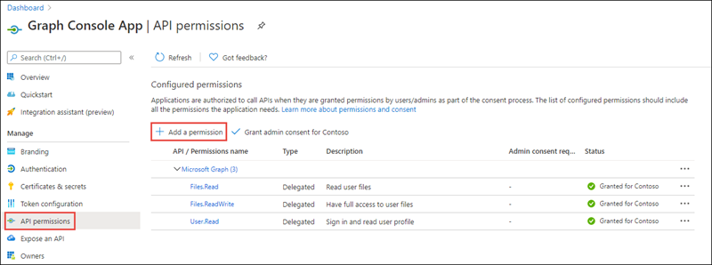
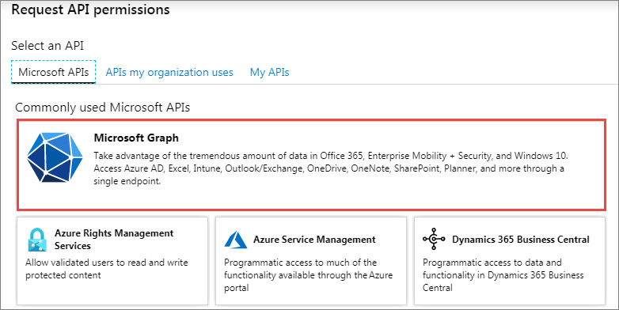
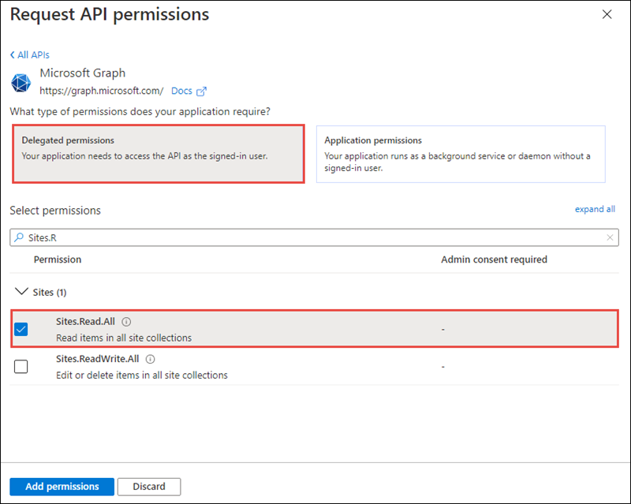
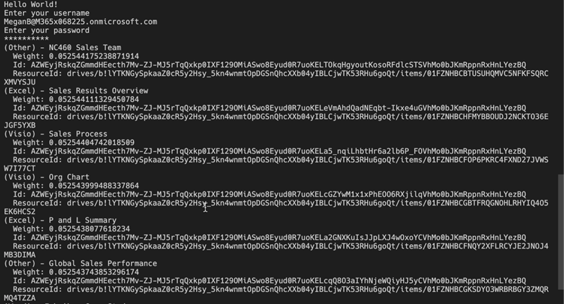

> [!VIDEO https://www.microsoft.com/videoplayer/embed/RE4OG2T]

Microsoft Graph enables more features than just reading and writing files. In this exercise, you'll learn how to get a list of files trending around a user and how to get recently modified and accessed files by the current user.

> [!IMPORTANT]
> This exercise assumes you have created the Azure AD application and .NET console application from the previous unit in this module. You'll edit the existing Azure AD application and .NET console application created in that exercise in this exercise.

## Update the Azure AD application

The first step is to add a permission grant to the Azure AD application that will enable the .NET Core console app to upload files to the signed-in user's OneDrive account.

Open a browser and navigate to the [Azure Active Directory admin center (https://aad.portal.azure.com)](https://aad.portal.azure.com). Sign in using a **Work or School Account** that has global administrator rights to the tenancy.

Select **Azure Active Directory** in the left-hand navigation.

  

Select **Manage > App registrations** in the left-hand navigation.

On the **App registrations** page, select the **Graph Console App**.

Select **API Permissions** in the left-hand navigation panel.

Select the **Add a permission** button.



In the **Request API permissions** panel that appears, select **Microsoft Graph** from the **Microsoft APIs** tab.



When prompted for the type of permission, select **Delegated permissions**.

Enter **Sites.R** in the **Select permissions** search box and select the **Sites.Read.All** permission, followed by the **Add permission** button at the bottom of the panel.



In the **Configured Permissions** panel, select the button **Grant admin consent for [tenant]**, and then select the **Yes** button in the consent dialog to grant all users in your organization this permission.

## Update .NET Core console application

In this section, you'll update the .NET console app display all files trending around the currently signed in user.

Locate the **Program.cs** file from the application you created in a previous unit in this module. Within the `Main` method, locate the following line:

```csharp
Console.WriteLine("Hello " + profileResponse.DisplayName);
```

Delete all code within the `Main` method after the above line.

Add the following code to the end of the `Main` method. This will get a list of all trending files around the currently signed-in user:

```csharp
// request 1 - get trending files around a specific user (me)
var request = client.Me.Insights.Trending.Request();

var results = request.GetAsync().Result;
foreach (var resource in results)
{
  Console.WriteLine("(" + resource.ResourceVisualization.Type + ") - " +resource.ResourceVisualization.Title);
  Console.WriteLine("  Weight: " + resource.Weight);
  Console.WriteLine("  Id: " + resource.Id);
  Console.WriteLine("  ResourceId: " + resource.ResourceReference.Id);
}
```

### Build and test the application

Run the following command in a command prompt to compile and run the console application:

```console
dotnet build
dotnet run
```

You now need to authenticate with Azure Active Directory. A new tab in your default browser should open to a page asking you to sign in. After you've logged in successfully, you'll be redirected to a page displaying the message, **"Authentication complete. You can return to the application. Feel free to close this browser tab"**. You may now close the browser tab and switch back to the console application.

The console app will display a list of files trending around the current user. Notice they're sorted in descending order by their relative weight property:



## List files accessed and used by the current user

In this section, you'll update the .NET console app to display the files recently used and accessed by the currently signed-in user.

Locate the code you added above for `// request 1 - get trending files around a specific user (me)` and comment it out so it doesn't continue to execute.

Add the following code to the `Main` method of the console application.
This code will get a list of all files in the group's root OneDrive folder and write the files to the console:

```csharp
// request 2 - used files
var request = client.Me.Insights.Used.Request();

var results = request.GetAsync().Result;
foreach (var resource in results)
{
  Console.WriteLine("(" + resource.ResourceVisualization.Type + ") - " +resource.ResourceVisualization.Title);
  Console.WriteLine("  Last Accessed: " + resource.LastUsed.LastAccessedDateTime.ToString());
  Console.WriteLine("  Last Modified: " + resource.LastUsed.LastModifiedDateTime.ToString());
  Console.WriteLine("  Id: " + resource.Id);
  Console.WriteLine("  ResourceId: " + resource.ResourceReference.Id);
}
```

### Build and test the application

Run the following command in a command prompt to compile and run the console application:

```console
dotnet build
dotnet run
```

After you've signed in, the console app will display a list of files recently accessed and modified by the current user:


## Summary

In this exercise, you learned how to get a list of files trending around a user and how to get recently modified and accessed files by the current user.
