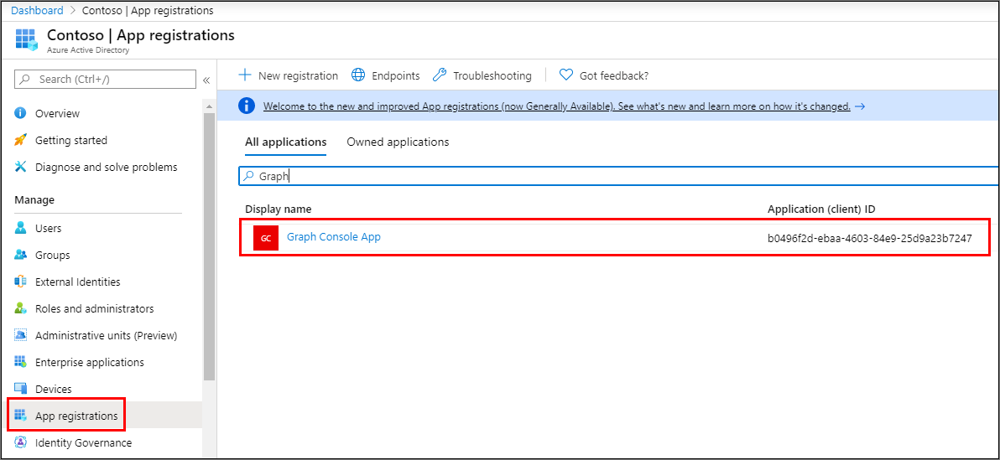
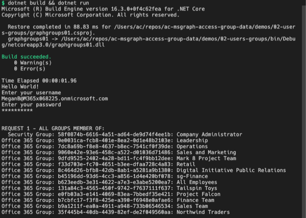
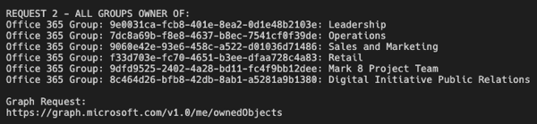

In this exercise, you'll modify the existing Azure AD application registration using the Azure Active Directory admin center, a .NET Core console application, and use Microsoft Graph to display information about the groups a user is involved with as a member or as an owner.

> [!IMPORTANT]
> This exercise assumes you have created the Azure AD application and .NET console application from the previous unit in this module. You'll edit the existing Azure AD application and .NET console application created in that exercise in this exercise.

## Update the .NET Core console app

In a previous exercise, you created a .NET console application that retrieved and displayed various Office 365 group details on the console. Let's modify the application by removing the code specific to the last exercise.

In the **Program.cs** file, locate the following line in the `Main` method:

```csharp
var client = GetAuthenticatedGraphClient(config, userName, userPassword);
```

Delete or comment out all the code in the `Main` method after the above line.

## Get all groups a user is a member of

In this section, you'll use Microsoft Graph to get all the groups the currently signed-in user is a member of.

The first step is to request all the groups the user has been added to as a member. The Microsoft Graph .NET SDK exposes this with the `MemberOf` collection on the **User** resource. This collection maps to the `/memberOf` Microsoft Graph API endpoint.

Add the following code to the end of the `Main` method:

```csharp
// request 1 - all groups member of
Console.WriteLine("\n\nREQUEST 1 - ALL GROUPS MEMBER OF:");
var requestGroupsMemberOf = client.Me.MemberOf.Request();
var resultsGroupsMemberOf = requestGroupsMemberOf.GetAsync().Result;
```

Next, add the following code to the end of the `Main` method that will display the results of the previous query:

```csharp
foreach (var groupDirectoryObject in resultsGroupsMemberOf)
{
  var group = groupDirectoryObject as Microsoft.Graph.Group;
  var role = groupDirectoryObject as Microsoft.Graph.DirectoryRole;
  if (group != null) {
    Console.WriteLine("Group: " + group.Id + ": " + group.DisplayName);
  } else if (role != null) {
    Console.WriteLine("Role: " + role.Id + ": " + role.DisplayName);
  } else {
    Console.WriteLine(groupDirectoryObject.ODataType + ": " + groupDirectoryObject.Id);
  }
}
```

You may notice this code is checking if the object returned by the query is a `Group` or `DirectoryRole`. The reason for this is that the `MemberOf` collection in the Microsoft Graph .NET SDK, which maps to the `/memberOf` Microsoft Graph API, returns both Office 365 groups as well as security groups.

Security groups are represented as objects of type `DirectoryRole`. This code first tries to cast the returned object as both objects and then checks if the objects are null to display the correct one.

### Update permissions requested by the console app

An application must be granted specific permissions to get access to groups in Office 365. The existing console application is missing the necessary permission to do this.

Within the **Program.cs** file, locate the method `CreateAuthorizationProvider()`, and locate the following code:

```csharp
List<string> scopes = new List<string>();
scopes.Add("User.Read");
scopes.Add("Group.Read.All");
scopes.Add("User.ReadBasic.All");
```

These permissions need to be updated for the code you added in the last section. Remove the permission **User.ReadBasic.All** and request the permission **Directory.Read.All**. The result should now look like the following code:

```csharp
List<string> scopes = new List<string>();
scopes.Add("User.Read");
scopes.Add("Group.Read.All");
scopes.Add("Directory.Read.All");
```

### Grant additional permissions to the Azure AD application

The next step is to update and grant the new permission **Directory.Read.All** to the Azure AD application.

Open a browser and navigate to the [Azure Active Directory admin center (https://aad.portal.azure.com)](https://aad.portal.azure.com). Sign in using a **Work or School Account** that has global administrator rights to the tenancy.

Select **Azure Active Directory** in the left-hand navigation. Locate the Azure AD app by selecting **Manage > App Registrations** and selecting the app **Graph Console App**:


Select **API Permissions** in the left-hand navigation panel.



Select the **Add a permission** button.

In the **Request API permissions** panel that appears, select **Microsoft Graph** from the **Microsoft APIs** tab.


When prompted for the type of permission, select **Delegated permissions**.

Enter **Directory.R** in the **Select permissions** search box and select the **Directory.Read.All** permission. Then select the **Add permission** button at the bottom of the panel to add the permissions to the app.

In the **Configured Permissions** panel, select the button **Grant admin consent for [tenant]**, and then select the **Yes** button in the consent dialog to grant all users in your organization this permission.

### Build and test the application

Run the following commands in a command prompt to compile and run the console application:

```console
dotnet build
dotnet run
```

After entering the username and password of a user, you'll see the results of all groups in the organization the current user is a member of:



## Get all groups a user is the owner of

In addition to getting a list of all groups a user is a member of, Microsoft Graph can also return a list of all the groups a user is listed as an owner of.

The Microsoft Graph .NET SDK exposes this with the `OwnedObjects` collection on the **User** resource. This collection maps to the `/ownedObjects` Microsoft Graph API endpoint.

Locate the code you added above for `// request 1 - all groups member of` and comment it out so it doesn't continue to execute. 

Add the following code to the end of the `Main` method. This code will get a list of all objects owned by the currently signed-in user. Using the same process as above, it will then write the results of the query to the console:

```csharp
// request 2 - all groups owner of
Console.WriteLine("\n\nREQUEST 2 - ALL GROUPS OWNER OF:");
var requestOwnerOf = client.Me.OwnedObjects.Request();
var resultsOwnerOf = requestOwnerOf.GetAsync().Result;
foreach (var ownedObject in resultsOwnerOf)
{
  var group = ownedObject as Microsoft.Graph.Group;
  var role = ownedObject as Microsoft.Graph.DirectoryRole;
  if (group != null) {
    Console.WriteLine("Office 365 Group: " + group.Id + ": " + group.DisplayName);
  } else if (role != null) {
    Console.WriteLine("  Security Group: " + role.Id + ": " + role.DisplayName);
  } else {
    Console.WriteLine(ownedObject.ODataType + ": " + ownedObject.Id);
  }
}

Console.WriteLine("\nGraph Request:");
Console.WriteLine(requestOwnerOf.GetHttpRequestMessage().RequestUri);
```

### Build and test the application

Run the following commands in a command prompt to compile and run the console application:

```console
dotnet build
dotnet run
```

After entering the username and password of a user, you'll see the results of all groups in the organization the current user owns:



## Summary

In this exercise, you updated an existing Azure AD application registration using the Azure Active Directory admin center, a .NET Core console application, and used Microsoft Graph to display information about the groups a user is involved with as a member or as an owner.
