In this exercise, you'll create an Azure AD application registration using the Azure Active Directory admin center, a .NET Core console application, and query Microsoft Graph for user data.

## Create an Azure AD application

Open a browser and navigate to the [Azure Active Directory admin center (https://aad.portal.azure.com)](https://aad.portal.azure.com). Sign in using a **Work or School Account** that has global administrator rights to the tenancy.

Select **Azure Active Directory** in the left-hand navigation.

Select **Manage > App registrations** in the left-hand navigation.

  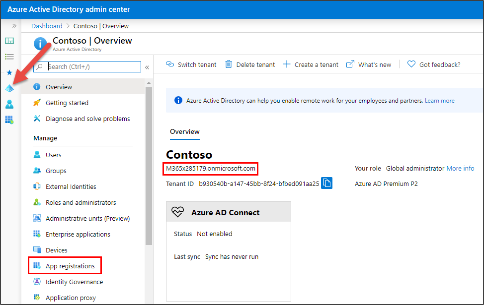

On the **App registrations** page, select **New registration**.

  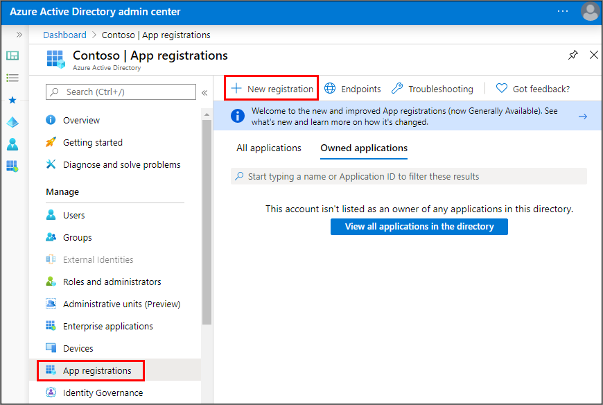

On the **Register an application** page, set the values as follows:

- **Name**: Graph Console App
- **Supported account types**: Accounts in this organizational directory only (Contoso only - Single tenant)

    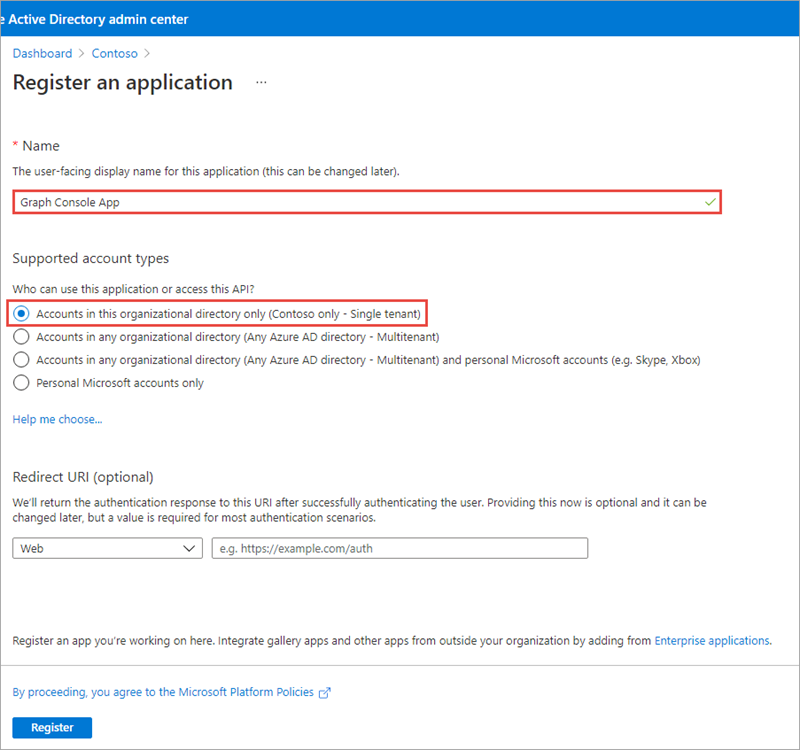

    Select **Register**.

On the **Graph Console App** page, copy the value of the **Application (client) ID** and **Directory (tenant) ID**; you'll need these in the application.

  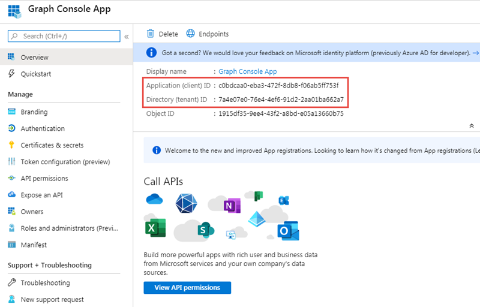

Select **Manage > Authentication**.

In the **Platform configurations** section, select the **Add a platform** button. Then in the **Configure platforms** panel, select the **Mobile and desktop applications** button:

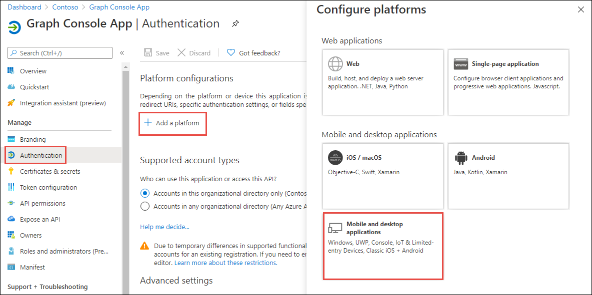

In the **Redirect URIs** section of the **Configure Desktop + devices** panel, select the entry that ends with **nativeclient**, and then select the **Configure** button:

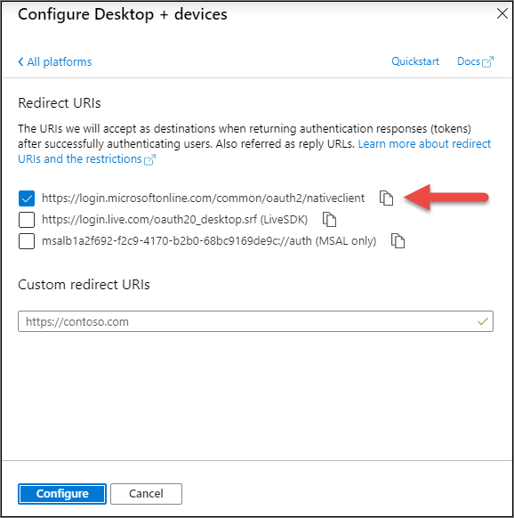

In the **Authentication** panel, scroll down to the **Default client type** section and set the toggle to **Yes**.


Select **Save** in the top menu to save your changes.

### Grant Azure AD application permissions to Microsoft Graph

After creating the application, you need to grant it the necessary permissions to Microsoft Graph.

Select **API Permissions** in the left-hand navigation panel.

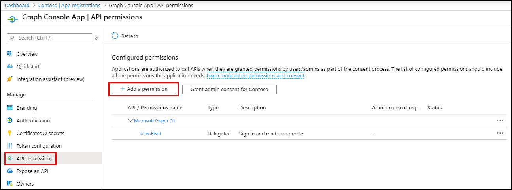

Select the **Add a permission** button.

In the **Request API permissions** panel that appears, select **Microsoft Graph** from the **Microsoft APIs** tab.

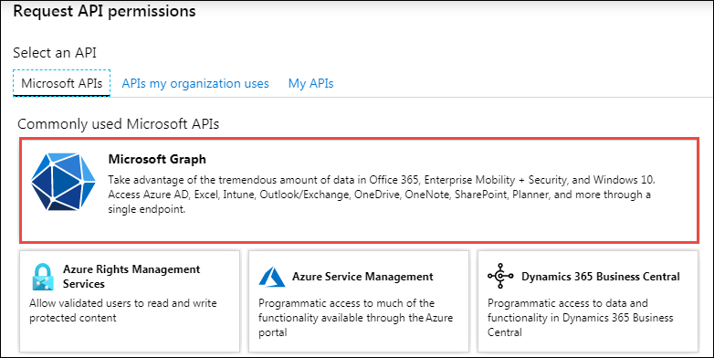

When prompted for the type of permission, select **Delegated permissions**.

Enter **User.R** in the **Select permissions** search box and select the **User.Read.All** permission, followed by the **Add permission** button at the bottom of the panel.


In the **Configured Permissions** panel, select the button **Grant admin consent for [tenant]**, and then select the **Yes** button in the consent dialog to grant all users in your organization this permission.

> [!NOTE]
> The option to **Grant admin consent** here in the Azure AD admin center is pre-consenting the permissions to the users in the tenant to simplify the exercise. This approach allows the console application to use the [resource owner password credential grant](https://docs.microsoft.com/azure/active-directory/develop/v2-oauth-ropc), so the user isn't prompted to grant consent to the application that simplifies the process of obtaining an OAuth access token. You could elect to implement alternative options such as the [device code flow](https://docs.microsoft.com/azure/active-directory/develop/v2-oauth2-device-code) to utilize dynamic consent as another option.

## Create .NET Core console application

Open your command prompt, navigate to a directory where you have rights to create your project, and run the following command to create a new .NET Core console application:

```shell
dotnet new console -o graphconsoleapp
```

After creating the application, run the following commands to add the Microsoft Authentication Library (MSAL), Microsoft Graph .NET SDK, and a few configuration packages to the project:

```shell
cd graphconsoleapp
dotnet add package Microsoft.Identity.Client
dotnet add package Microsoft.Graph
dotnet add package Microsoft.Extensions.Configuration
dotnet add package Microsoft.Extensions.Configuration.FileExtensions
dotnet add package Microsoft.Extensions.Configuration.Json
```

Open the application in Visual Studio Code using the following command:

```shell
code .
```

If Visual Studio code displays a dialog box asking if you want to add required assets to the project, select **Yes**.

### Update the console app to support Azure AD authentication

Create a new file named **appsettings.json** in the root of the project and add the following code to it:

```json
{
  "tenantId": "YOUR_TENANT_ID_HERE",
  "applicationId": "YOUR_APP_ID_HERE"
}
```

Update properties with the following values:

- `YOUR_TENANT_ID_HERE`: Azure AD directory ID
- `YOUR_APP_ID_HERE`: Azure AD client ID

#### Create helper class

Create a new folder **Helpers** in the project.

Create a new file **MsalAuthenticationProvider.cs** in the **Helpers** folder and add the following code:

```cs
using System.Net.Http;
using System.Net.Http.Headers;
using System.Security;
using System.Threading.Tasks;
using Microsoft.Identity.Client;
using Microsoft.Graph;

namespace Helpers
{
  public class MsalAuthenticationProvider : IAuthenticationProvider
  {
    private static MsalAuthenticationProvider _singleton;
    private IPublicClientApplication _clientApplication;
    private string[] _scopes;
    private string _username;
    private SecureString _password;
    private string _userId;

    private MsalAuthenticationProvider(IPublicClientApplication clientApplication, string[] scopes, string username, SecureString password)
    {
      _clientApplication = clientApplication;
      _scopes = scopes;
      _username = username;
      _password = password;
      _userId = null;
    }

    public static MsalAuthenticationProvider GetInstance(IPublicClientApplication clientApplication, string[] scopes, string username, SecureString password)
    {
      if (_singleton == null)
      {
        _singleton = new MsalAuthenticationProvider(clientApplication, scopes, username, password);
      }

      return _singleton;
    }

    public async Task AuthenticateRequestAsync(HttpRequestMessage request)
    {
      var accessToken = await GetTokenAsync();

      request.Headers.Authorization = new AuthenticationHeaderValue("bearer", accessToken);
    }

    public async Task<string> GetTokenAsync()
    {
      if (!string.IsNullOrEmpty(_userId))
      {
        try
        {
          var account = await _clientApplication.GetAccountAsync(_userId);

          if (account != null)
          {
            var silentResult = await _clientApplication.AcquireTokenSilent(_scopes, account).ExecuteAsync();
            return silentResult.AccessToken;
          }
        }
        catch (MsalUiRequiredException){ }
      }

      var result = await _clientApplication.AcquireTokenByUsernamePassword(_scopes, _username, _password).ExecuteAsync();
      _userId = result.Account.HomeAccountId.Identifier;
      return result.AccessToken;
    }
  }
}
```

### Incorporate Microsoft Graph into the console app

Open the **Program.cs** file and add the following `using` statements to the top fo the file:

```cs
using System.Collections.Generic;
using System.Security;
using Microsoft.Identity.Client;
using Microsoft.Graph;
using Microsoft.Extensions.Configuration;
using Helpers;
```

Add the following method `LoadAppSettings` to the `Program` class. The method retrieves the configuration details from the **appsettings.json** file previously created:

```cs
private static IConfigurationRoot LoadAppSettings()
{
  try
  {
    var config = new ConfigurationBuilder()
                      .SetBasePath(System.IO.Directory.GetCurrentDirectory())
                      .AddJsonFile("appsettings.json", false, true)
                      .Build();

    if (string.IsNullOrEmpty(config["applicationId"]) ||
        string.IsNullOrEmpty(config["tenantId"]))
    {
      return null;
    }

    return config;
  }
  catch (System.IO.FileNotFoundException)
  {
    return null;
  }
}
```

Add the following method `CreateAuthorizationProvider` to the `Program` class. The method will create an instance of the clients used to call Microsoft Graph.

```cs
private static IAuthenticationProvider CreateAuthorizationProvider(IConfigurationRoot config, string userName, SecureString userPassword)
{
  var clientId = config["applicationId"];
  var authority = $"https://login.microsoftonline.com/{config["tenantId"]}/v2.0";

  List<string> scopes = new List<string>();
  scopes.Add("User.Read");
  scopes.Add("User.Read.All");

  var cca = PublicClientApplicationBuilder.Create(clientId)
                                          .WithAuthority(authority)
                                          .Build();
  return MsalAuthenticationProvider.GetInstance(cca, scopes.ToArray(), userName, userPassword);
}
```

> [!IMPORTANT]
> Notice in the previous code that two scopes will be included in the request. These are the permissions you added to the Azure AD app.

Add the following method `GetAuthenticatedGraphClient` to the `Program` class. The method creates an instance of the `GraphServiceClient` object.

```cs
private static GraphServiceClient GetAuthenticatedGraphClient(IConfigurationRoot config, string userName, SecureString userPassword)
{
  var authenticationProvider = CreateAuthorizationProvider(config, userName, userPassword);
  var graphClient = new GraphServiceClient(authenticationProvider);
  return graphClient;
}
```

Add the following method `ReadPassword` to the `Program` class. The method prompts the user for their password:

```cs
private static SecureString ReadPassword()
{
  Console.WriteLine("Enter your password");
  SecureString password = new SecureString();
  while (true)
  {
    ConsoleKeyInfo c = Console.ReadKey(true);
    if (c.Key == ConsoleKey.Enter)
    {
      break;
    }
    password.AppendChar(c.KeyChar);
    Console.Write("*");
  }
  Console.WriteLine();
  return password;
}
```

Add the following method `ReadUsername` to the `Program` class. The method prompts the user for their username:

```cs
private static string ReadUsername()
{
  string username;
  Console.WriteLine("Enter your username");
  username = Console.ReadLine();
  return username;
}
```

Locate the `Main` method in the `Program` class. Add the following code to the end of the `Main` method to load the configuration settings from the **appsettings.json** file:

```cs
var config = LoadAppSettings();
if (config == null)
{
  Console.WriteLine("Invalid appsettings.json file.");
  return;
}
```

Add the following code to the end of the `Main` method, just after the code added in the last step. This code will obtain an authenticated instance of the `GraphServiceClient` and submit a request for the current user's email:

```cs
var userName = ReadUsername();
var userPassword = ReadPassword();

var client = GetAuthenticatedGraphClient(config, userName, userPassword);
```

Add the following code to request all users from the current organization and write them to the console.

```cs
// request 1 - all users
var requestAllUsers = client.Users.Request();

var results = requestAllUsers.GetAsync().Result;
foreach (var user in results)
{
  Console.WriteLine(user.Id + ": " + user.DisplayName + " <" + user.Mail + ">");
}

Console.WriteLine("\nGraph Request:");
Console.WriteLine(requestAllUsers.GetHttpRequestMessage().RequestUri);
```

### Build and test the application

Run the following command in a command prompt to compile the console application:

```shell
dotnet build
```

Run the following command to run the console application:

```shell
dotnet run
```

After entering the username and password of a user, you'll see the results of all users in the organization written to the console.

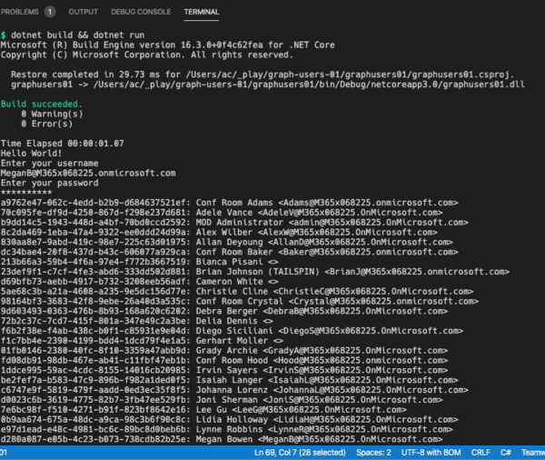

## Display the currently signed in user's details

Now, update the console app to show details on the current user.

Locate the code you added above for `// request 1 - all users` and optionally comment it out so it doesn't continue to execute.

Add the following code to the `Main` method of the console application. This will get and display the details of the currently signed in user:

```cs
// request 2 - current user
var requestMeUser = client.Me.Request();

var resultMe = requestMeUser.GetAsync().Result;
Console.WriteLine(resultMe.Id + ": " + resultMe.DisplayName + " <" + resultMe.Mail + ">");

Console.WriteLine("\nGraph Request:");
Console.WriteLine(requestMeUser.GetHttpRequestMessage().RequestUri);
```

### Build and test the application

Run the following command in a command prompt to compile and run the console application:

```shell
dotnet build
dotnet run
```

After entering the username and password of a user, you'll see the details of the currently signed in user in the organization written to the console.

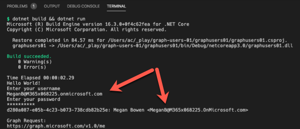

## Display details of a specific user

In this last section, you will learn how to obtain a specific user's details.

Locate the code you added above for `// request 2 - current user` and optionally comment it out so it doesn't continue to execute.

The first step is finding a specific user's unique identifier in your organization. From the first example above, copy the `Id` of a user in your organization other than the one that is currently signed in.

Add the following code to the `Main` method of the console application. This will obtain the details of a specific user:

```cs
// request 3 - specific user
var requestSpecificUser = client.Users["{{REPLACE_WITH_USER_ID}}"].Request();
var resultOtherUser = requestSpecificUser.GetAsync().Result;
Console.WriteLine(resultOtherUser.Id + ": " + resultOtherUser.DisplayName + " <" + resultOtherUser.Mail + ">");

Console.WriteLine("\nGraph Request:");
Console.WriteLine(requestSpecificUser.GetHttpRequestMessage().RequestUri);
```

Update the `{{REPLACE_WITH_USER_ID}}` string with the `Id` of an existing user you copied previously. Notice that this code will get a specific user by passing in their `Id` into the `Users` collection.

### Build and test the application

Run the following command in a command prompt to compile and run the console application:

```shell
dotnet build
dotnet run
```

After entering the username and password of a user, you'll see the details of a specific user.

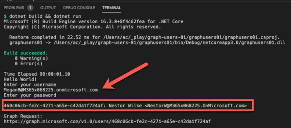

## Summary

In this exercise, you created an Azure AD application registration using the Azure Active Directory admin center, a .NET Core console application, and query Microsoft Graph for user data.
