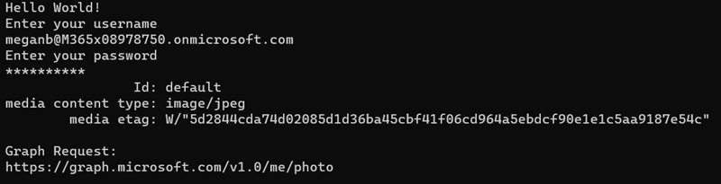
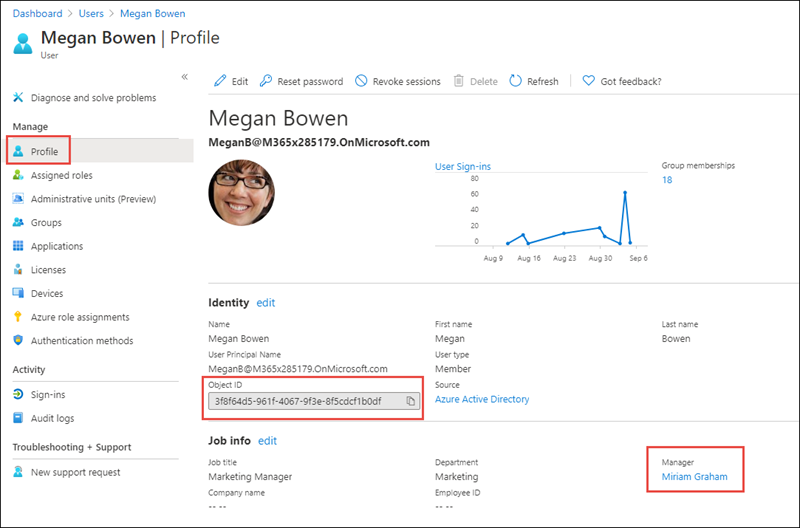
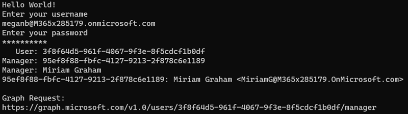

> [!VIDEO https://www.microsoft.com/videoplayer/embed/RE4OO37]

In this exercise, you'll update the existing Azure AD application registration using the Azure Active Directory admin center and a .NET Core console application to query Microsoft Graph for user profile photos and get the user's manager's profile.

> [!IMPORTANT]
> This exercise assumes you have created the Azure AD application and .NET console application from the previous unit in this module. You'll edit the existing Azure AD application and .NET console application created in that exercise in this exercise.

## Set up the .NET Core console application

Locate the **Program.cs** file from the application you created in a previous unit in this module.

Within the `Main` method, locate the following line:

```csharp
var client = GetAuthenticatedGraphClient(config, userName, userPassword);
```

Delete all code within the `Main` method after the above line.

## Get the currently signed in user's profile photo

> [!NOTE]
> This section assumes the currently signed in user has set their profile picture.

Add the following code to the end of the `Main` method. This code will obtain a reference to the currently signed in user's profile photo and display its details:

```csharp
// request 1 - current user's photo

var requestUserPhoto = client.Me.Photo.Request();
var resultsUserPhoto = requestUserPhoto.GetAsync().Result;
// display photo metadata
Console.WriteLine("                Id: " + resultsUserPhoto.Id);
Console.WriteLine("media content type: " + resultsUserPhoto.AdditionalData["@odata.mediaContentType"]);
Console.WriteLine("        media etag: " + resultsUserPhoto.AdditionalData["@odata.mediaEtag"]);

Console.WriteLine("\nGraph Request:");
Console.WriteLine(requestUserPhoto.GetHttpRequestMessage().RequestUri);

// get actual photo

// create the file
```

### Build and test the application

Run the following command in a command prompt to compile and run the console application:

```console
dotnet build
dotnet run
```

After entering the username and password of a user, you'll see the details of the user's profile photo:



### Save the profile photo

Next, save the profile photo to your workstation.

Locate the comment `// get actual photo` from the code you added in the last section. Add the following lines after the comment:

```csharp
var requestUserPhotoFile = client.Me.Photo.Content.Request();
var resultUserPhotoFile = requestUserPhotoFile.GetAsync().Result;
```

Next, locate the comment `// create the file` from the code you added in the last section. Add the following lines after the comment:

```csharp
var profilePhotoPath = System.IO.Path.Combine(System.IO.Directory.GetCurrentDirectory(), "profilePhoto_" + resultsUserPhoto.Id + ".jpg");
var profilePhotoFile = System.IO.File.Create(profilePhotoPath);
resultUserPhotoFile.Seek(0, System.IO.SeekOrigin.Begin);
resultUserPhotoFile.CopyTo(profilePhotoFile);
Console.WriteLine("Saved file to: " + profilePhotoPath);

Console.WriteLine("\nGraph Request:");
Console.WriteLine(requestUserPhoto.GetHttpRequestMessage().RequestUri);
```

This code will create a new image file in the current folder of the application and write the contents of the response to this file.

### Build and test the application

Run the following command in a command prompt to compile and run the console application:

```console
dotnet build
dotnet run
```

After entering the username and password of a user, you'll find a file **profilePhoto_{{XXXX}}.jpg** in the root folder of the .NET Core console application project.

## Get a user's manager

Microsoft Graph can display related users, such as a user's manager as defined in the organization. For this next section, you need to ensure a user has the manager property set on their account in Azure AD.

### Set a user's manager property

Open a browser and navigate to the [Azure Active Directory admin center (https://aad.portal.azure.com)](https://aad.portal.azure.com). Sign in using a **Work or School Account** that has global administrator rights to the tenancy.

Select **Azure Active Directory** in the left-hand navigation.

  

Select **Manage > Users** in the left-hand navigation.

Select a user within the organization and on their profile page, copy the user's **Object ID** property:



In the **Job info** section, verify the **Manager** property is set.

If it isn't set, select **edit** next to **Job info** and select a manager for the currently selected user.

### Update the .NET Core console application

Go back to the .NET Core console application.

Locate the code you added above for `request 1 - current user's photo` and comment it out so it doesn't continue to execute.

Add the following code immediately after the code you just commented out:

```csharp
// request 2 - user's manager
var userId = "{{REPLACE_WITH_USER_ID}}";
var requestUserManager = client.Users[userId]
                                .Manager
                                .Request();
var resultsUserManager = requestUserManager.GetAsync().Result;
Console.WriteLine("   User: " + userId);
Console.WriteLine("Manager: " + resultsUserManager.Id);
var resultsUserManagerUser = resultsUserManager as Microsoft.Graph.User;
if (resultsUserManagerUser != null)
{
  Console.WriteLine("Manager: " + resultsUserManagerUser.DisplayName);
  Console.WriteLine(resultsUserManager.Id + ": " + resultsUserManagerUser.DisplayName + " <" + resultsUserManagerUser.Mail + ">");
}

Console.WriteLine("\nGraph Request:");
Console.WriteLine(requestUserManager.GetHttpRequestMessage().RequestUri);
```

Set the value of the `userId` variable to the **Object ID** of the user you ensured had a manager configured on their profile in the Azure AD admin portal.

This code will get the specified user, and select that user's manager property. It will then display the manager's **ID** and **DisplayName** properties on the console.

### Build and test the application

Run the following command in a command prompt to compile and run the console application:

```console
dotnet build
dotnet run
```

After entering the username and password of a user, the specified user and their manager details are displayed on the console:



## Summary

In this exercise, you updated the existing Azure AD application registration using the Azure Active Directory admin center and a .NET Core console application to query Microsoft Graph for user profile photos and get the user's manager's profile.
