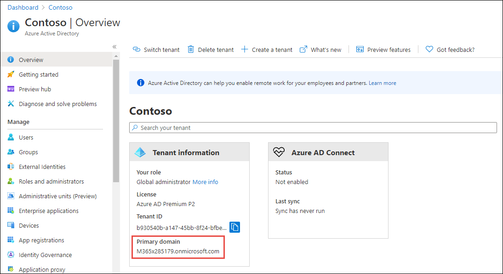
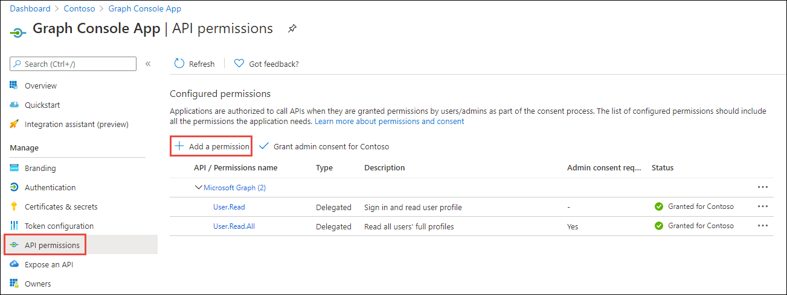
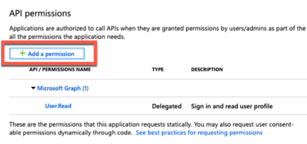
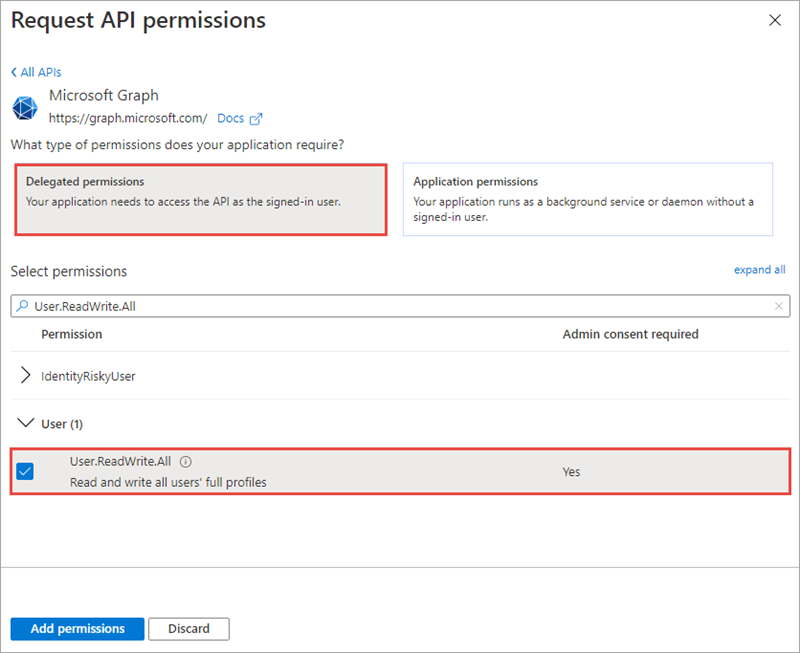
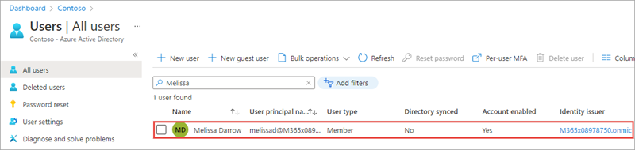
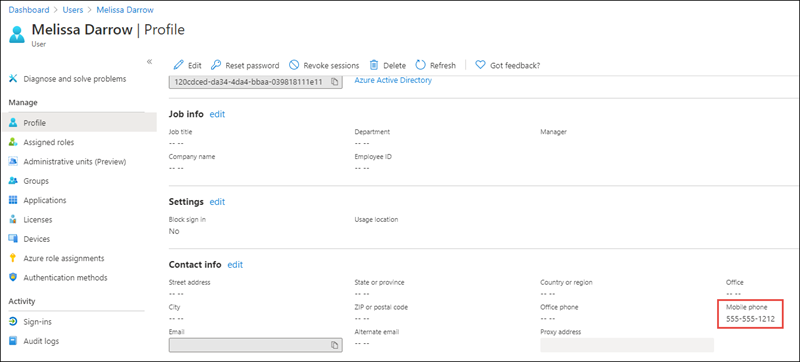
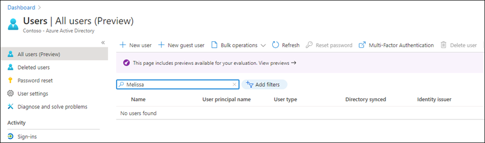

> [!VIDEO https://www.microsoft.com/videoplayer/embed/RE4OAT4]

In this exercise, you'll modify an existing Azure AD application registration using the Azure Active Directory admin center, a .NET Core console application, and use Microsoft Graph to create, update, and delete users in your organization.

> [!IMPORTANT]
> This exercise assumes you have created the Azure AD application and .NET console application from the previous unit in this module. You'll edit the existing Azure AD application and .NET console application created in that exercise in this exercise.

## Set up the .NET Core console application

Locate the **Program.cs** file from the application you created in a previous unit in this module.

Within the `Main` method, locate the following line

```csharp
var client = GetAuthenticatedGraphClient(config);
```

Delete all code within the `Main` method after the above line.

## Create a new user in your organization

Add the following `using` statement to the top of the **Program.cs** file:

```csharp
using System.Threading.Tasks;
```

Add the following code to the end of the `Main` method. This code will call a method that will use Microsoft Graph to create a new user:

```csharp
// request 1: create user
var resultNewUser = CreateUserAsync(client);
resultNewUser.Wait();
Console.WriteLine("New user ID: " + resultNewUser.Id);
```

Next, add the `CreateUserAsync()` method to the console application:

```csharp
private static async Task<Microsoft.Graph.User> CreateUserAsync(GraphServiceClient client) {
  Microsoft.Graph.User user = new Microsoft.Graph.User() {
    AccountEnabled = true,
    GivenName = "Melissa",
    Surname = "Darrow",
    DisplayName = "Melissa Darrow",
    MailNickname = "MelissaD",
    UserPrincipalName = "melissad@{{REPLACE_YOUR_ORG_DOMAIN}}",
    PasswordProfile = new PasswordProfile() {
      Password = "Password1!",
      ForceChangePasswordNextSignIn = true
    }
  };
  var requestNewUser = client.Users.Request();
  return await requestNewUser.AddAsync(user);
}
```

Update the `{{REPLACE_YOUR_ORG_DOMAIN}}` string with the domain of your organization. You can find this if you sign in to the Azure AD admin portal (https://aad.portal.azure.com):



### Update the Azure AD application's permissions

The last step is to grant the application the necessary permission to create a new user.

Open a browser and navigate to the [Azure Active Directory admin center (https://aad.portal.azure.com)](https://aad.portal.azure.com). Sign in using a **Work or School Account** that has global administrator rights to the tenancy.

Select **Azure Active Directory** in the left-hand navigation.

  

Select **Manage > App registrations** in the left-hand navigation.

On the **App registrations** page, select the **Graph Console App**.

Select **API Permissions** in the left-hand navigation panel.



Select the **Add a permission** button.

In the **Request API permissions** panel that appears, select **Microsoft Graph** from the **Microsoft APIs** tab.



When prompted for the type of permission, select **Delegated permissions**.

Enter **User.R** in the **Select permissions** search box and select the **User.ReadWrite.All** permission, followed by the **Add permission** button at the bottom of the panel.



In the **Configured Permissions** panel, select the button **Grant admin consent for [tenant]**, and then select the **Yes** button in the consent dialog to grant all users in your organization this permission.

### Build and test the application

Run the following command in a command prompt to compile and run the console application:

```console
dotnet build
dotnet run
```

You now need to authenticate with Azure Active Directory. A new tab in your default browser should open to a page asking you to sign-in. After you've logged in successfully, you'll be redirected to a page displaying the message, **"Authentication complete. You can return to the application. Feel free to close this browser tab"**. You may now close the browser tab and switch back to the console application.

The application will display the ID of the new user. Verify the user was created by going back to the Azure Active Directory admin center, selecting **Manage > Users** and finding the new user:



## Update an existing user

In this section, you'll update the .NET Core console application to update the user created in the previous section.

First, comment out the following code you added in the previous section. Otherwise, the application will throw an error when it tries to create the same user again:

```csharp
// request 1: create user
var resultNewUser = CreateUserAsync(client);
resultNewUser.Wait();
Console.WriteLine("New user ID: " + resultNewUser.Id);
```

Next, add the following code. This will update the user you created in the last section:

```csharp
// request 2: update user
// (1/2) get the user we just created
var userToUpdate = client.Users.Request()
                               .Select("id")
                               .Filter("UserPrincipalName eq 'melissad@{{REPLACE_YOUR_ORG_DOMAIN}}'")
                               .GetAsync()
                               .Result[0];
// (2/2) update the user's phone number
var resultUpdatedUser = UpdateUserAsync(client, userToUpdate.Id);
resultUpdatedUser.Wait();
Console.WriteLine("Updated user ID: " + resultUpdatedUser.Id);
```

Update the `{{REPLACE_YOUR_ORG_DOMAIN}}` string with the domain of your organization.

Next, add the `UpdateUserAsync()` method to the console application:

```csharp
private static async Task<Microsoft.Graph.User> UpdateUserAsync(GraphServiceClient client, string userIdToUpdate) {
  Microsoft.Graph.User user = new Microsoft.Graph.User() {
    MobilePhone = "555-555-1212"
  };
  return await client.Users[userIdToUpdate].Request().UpdateAsync(user);
}
```

### Build and test the application

Run the following command in a command prompt to compile and run the console application:

```console
dotnet build
dotnet run
```

After you've logged in, you'll see the ID of the updated user. Verify the user was updated by going back to the Azure Active Directory admin center, selecting **Manage > Users** and finding the user. Select the user and examine the **Mobile phone** property. It may take a moment to reflect the change, so be patient and keep refreshing the page:



### Delete the existing user

In this section, you'll update the .NET Core console application to delete the user updated in the previous section.

Add the following code to the end of the `Main()` method in the console application:

```csharp
// request 3: delete user
var deleteTask = DeleteUserAsync(client, userToUpdate.Id);
deleteTask.Wait();
```

Next, add the `DeleteUserAsync()` method to the console application:

```csharp
private static async Task DeleteUserAsync(GraphServiceClient client, string userIdToDelete) {
  await client.Users[userIdToDelete].Request().DeleteAsync();
}
```

### Build and test the application

Run the following command in a command prompt to compile and run the console application:

```console
dotnet build
dotnet run
```

After you've logged in, you'll see the application exit without error. Verify the user was deleted by going back to the Azure Active Directory admin center, selecting **Manage > Users** and trying to find the user. They shouldn't be present in the search results:



## Summary

In this exercise, you modified an existing Azure AD application registration using the Azure Active Directory admin center, a .NET Core console application, and use Microsoft Graph to create, update, and delete users in your organization.
