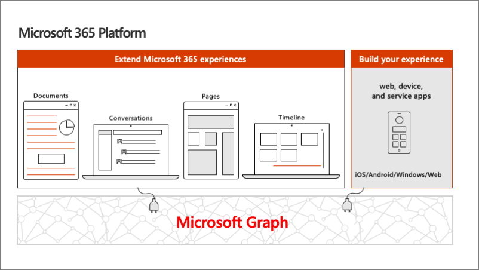
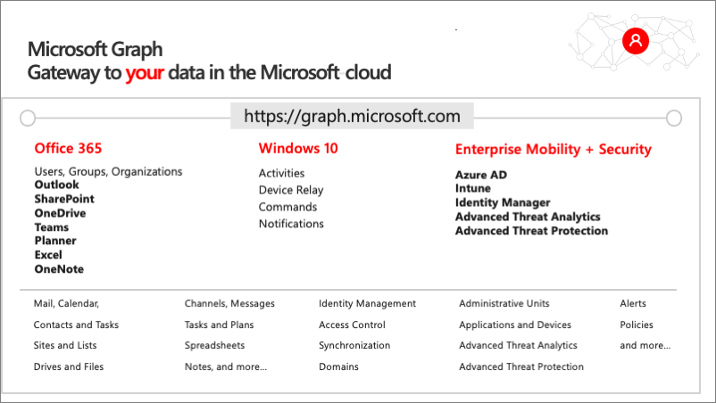
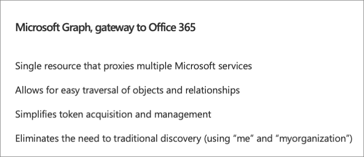
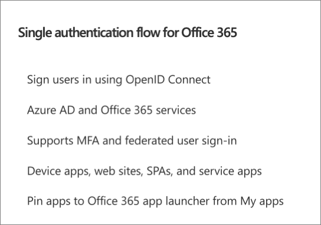
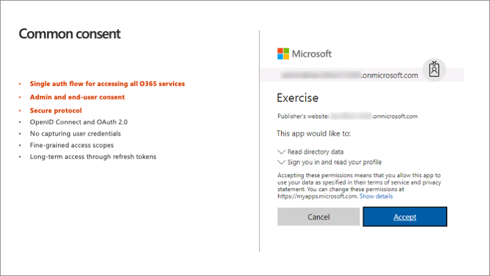
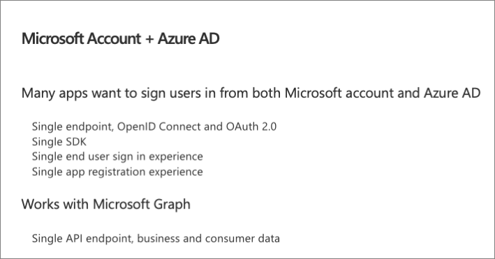
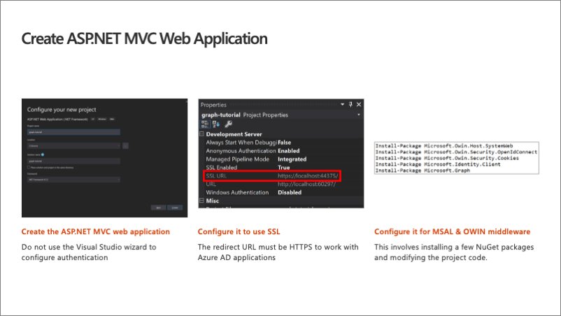

In this unit, you'll learn how Microsoft Graph fits into the larger Microsoft 365 platform. You'll then learn how to use Microsoft Graph in an ASP.NET MVC application to display events from the currently signed in user's calendar.

## Microsoft 365 platform

The Microsoft 365 developer vision focuses on the user's experience and their data and as a developer you can bring your application into the user experience with over 1.2 billion users of office worldwide. This is a huge opportunity to provide a window into your application and to enable users to connect into their data to intelligence to your application.

There are currently over 850 million events created each month and a total of over 400 petabytes of data stored in the service that can add value for your users.

The Microsoft Graph is the gateway to your data in the Microsoft cloud as you see there.

### Microsoft Graph - gateway to your data in the Microsoft cloud

The Microsoft cloud is included of multiple services and data types that we can take advantage of from Office 365, and it's all considered part of the Microsoft 365 platform.

Developers can integrate the signed-in user's email, calendar, contacts, and tasks into custom apps. We can work with content in SharePoint sites and lists files in OneDrive, channels and content within Microsoft Teams, and users in Azure Active Directory (Azure AD).

There are many different services that developers can take advantage of in their custom apps. Many of these services have their own APIs developers can interact with.

However, this can be challenging to go to each of these individual services with their individual endpoints. Each API may have its own permission model, which means they have individual access control configurations. Different endpoints for each service mean our custom applications will need to obtain an access token from Azure AD for each one.

### Microsoft Graph simplifies access to Microsoft 365 data

One of the benefits of Microsoft Graph is that it serves as a proxy endpoint to all of these other services. Microsoft Graph encompass things such as Office 365, Windows 10 enterprise mobility and security (EMS), and it brings all of these different services under one unified endpoint: **graph.microsoft.com**.

The advantage to using Microsoft Graph is that it allows developers to just have a single endpoint, a resource, which means you're only going to need a single access token authenticate the different services. Each service still has its own individual permissions so that everything is still secured in an individual way. A single endpoint makes it easier for developers to build applications.

Microsoft Graph also enables easy navigation of entities and the relationships between entities. While there are many different Microsoft 365 services such as OneDrive for files, or Outlook for contacts and calendars, these different entities are related to each other. These relationships are in Microsoft Graph, which makes it easy to navigate from one entity to another, even if it crosses different underlying endpoints.

### Single authentication flow

Microsoft Graph simplifies token acquisition because with all of these different services in Microsoft 365, we would have to obtain a separate access token for each one of them.

Microsoft Graph proxies the different services together so we don't need to obtain individual tokens for each service. Microsoft Graph, through one endpoint, will proxy calls to each service's endpoint.

This eliminates the need for traditional discovery service. Prior to Microsoft Graph, developers had to use a discovery service to ask the different endpoints with Microsoft 365 for the user-specific endpoints for each service, such as OneDrive or Outlook.

One thing to keep in mind is that because it is a proxy, you may see new functionality and features show up in these downstream endpoints before they appear in Microsoft Graph. This is because Microsoft Graph is a proxy and it can't expose functionality that doesn't exist downstream in one of the services that is proxying.

### Authentication and the consent framework

Office 365 has a single authentication flow that Microsoft Graph also uses. Users sign in using a technology called Open ID Connect, which is an open standard. Open ID Connect is a wrapper to the OAuth 2.0 authentication protocol that will include details about the individual who's logged in.

Azure AD is used for all of the authentication. Microsoft Graph uses the same authentication model as Azure and Office 365 that is built on top of the authentication model of Azure AD. Both of these services trust Azure AD and by having this shared trust, we can leverage the authentication to take advantage of both of these different services with the same authentication flow.

This authentication flow also supports multi-factor authentication, also referred to as MFA, and federated user sign-ons and it supports all different kinds of applications from device applications, including mobile devices, websites, single page applications that live 100% in the client or as a headless application with no user involvement, also referred to as a daemon app or as a service.

One of the concepts with Azure AD is the *common consent framework*. To best understand consent, think about permissions in the concept of a triangle.

One point of the triangle is the permission, another point is the user or the application, and the last point is the resource that you're trying to talk to. The user needs to have the permission to the resource to talk to it.

The first time the user signs into Azure AD, to obtain an access token to authenticate with Microsoft Graph, Azure AD first checks see if this user has granted this application access to the Microsoft Graph. It specifically checks to see if the app has been granted access to these permissions.

The way that this works is that if the user hasn't gone through this process, the common consent framework kicks in and after they sign-in you'll see the dialog shown in the previous image above.

When the user hasn't granted the permission to the endpoint, to the application, the consent framework prompts them to do so. This process is called delegated consent. When the user approves the dialog prompt, it grants the specific application a specific permission to the app to act on the user's behalf.

### Authentication options

Microsoft Graph supports two options to authenticate. One option is Azure AD only, or a work or school account. The other option is converged auth, which is Azure AD and or Microsoft accounts. In this case you can use the exact same code in the Microsoft Graph, the same endpoints, the same SDKs to get my files either in OneDrive consumer or OneDrive for Business. The same is true for calendar, contacts, and email in outlook.com or Office 365.

The nice thing about this is that the data you fetch is all dependent on the login of the user that signed in. So you don't have to write special code or use different APIs or endpoints to get data for consumer accounts or for business accounts.

### Microsoft Accounts & Azure AD

As previously stated, Microsoft Graph supports both Microsoft Accounts and Azure AD accounts, also referred to as work and school accounts. Nothing in Microsoft Graph's APIs or SDKs is unique to the sign-in; the code is the same and the sign-in determines which service Microsoft Graph will access. If the user signed in with a Microsoft Account, the files endpoint maps to OneDrive Consumer while work and school sign-ins map to OneDrive for Business. This is just one example.

To determine which account type your app supports, or if it supports both, you set a specific setting in the associated Azure AD app registered in the Azure AD admin center.

## Microsoft Graph and ASP.NET MVC web applications

Developers can use Microsoft Graph in many different types of applications. In this module, you'll add support for calling Microsoft Graph to display events from the currently signed in user's calendar in an ASP.NET MVC web application.

The first step is to create an ASP.NET MVC web application using the Visual Studio project creation wizard. Next, add, and configure the Microsoft Authentication Library (MSAL) for .NET and the OWIN middleware. This enables the web application to allow users to sign in and to obtain access tokens from Azure AD to use when submitting requests to Microsoft Graph. These two libraries will require you to install a few libraries into your project. The libraries are available as NuGet packages.

Next, ensure that your application is using SSL. When you register an application with Azure AD, you'll need to specify the redirect URL where users will be sent to after a successful sign-in. This URL must be configured to use HTTPS to work with an Azure AD application.

## Summary

In this unit, you learned how Microsoft Graph fits into the larger Microsoft 365 platform. You then learned how to use Microsoft Graph in an ASP.NET MVC application to display events from the currently signed in user's calendar.
