> [!VIDEO https://www.microsoft.com/videoplayer/embed/RE4OG3g]

In this exercise, you'll create an ASP.NET MVC web application with Visual Studio and Azure AD application with the Azure Active Directory admin center. Once the application is created, you'll then add the necessary packages and libraries that support user authentication and requesting data from Microsoft Graph.

## Prerequisites

Developing Microsoft Graph apps requires a Microsoft 365 tenant.

For the Microsoft 365 tenant, follow the instructions on the [Microsoft 365 Developer Program](https://developer.microsoft.com/microsoft-365/dev-program) site for obtaining a developer tenant if you don't currently have a Microsoft 365 account.

The exercises in this module assume you have the following tools installed on your developer workstation.

- [Visual Studio 2019](https://visualstudio.com)

## Create ASP.NET MVC web application

Open Visual Studio, and select **Create a new project**.

In the **Create new project** dialog, choose the **ASP.NET Web Application (.NET Framework)** option that uses C#, then select **Next**.

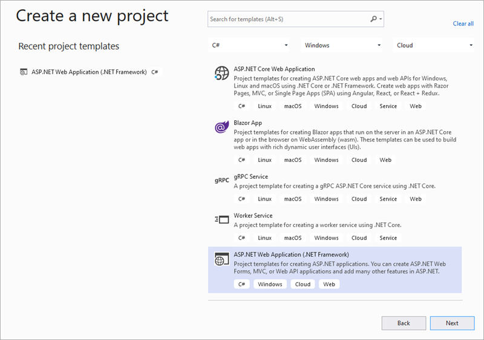

Enter **graph-tutorial** in the **Project name** field and select **Create**.

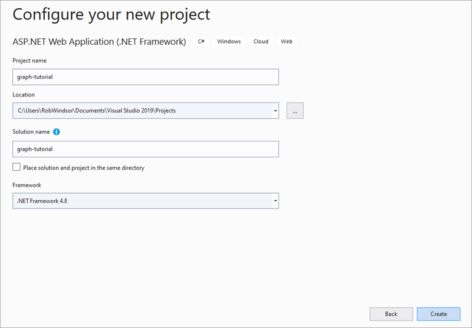

> [!NOTE]
> Ensure that you enter the exact same name for the Visual Studio Project that is specified in these instructions. The Visual Studio Project name becomes part of the namespace in the code. The code inside these instructions depends on the namespace matching the Visual Studio Project name specified in these instructions. If you use a different project name the code will not compile unless you adjust all the namespaces to match the Visual Studio Project name you enter when you create the project.

Select **MVC** and select **Create**.

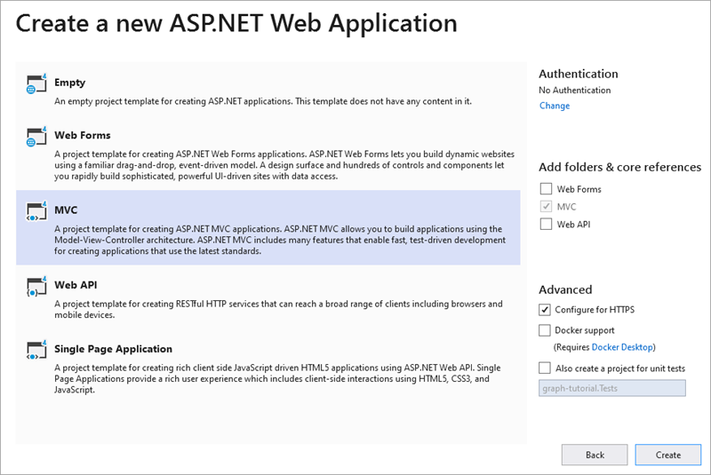

Press **F5** or select **Debug > Start Debugging**. If everything is working, your default browser should open and display a default ASP.NET page.

## Add NuGet packages

Before moving on, update the **bootstrap** NuGet package, and install some additional NuGet packages that you'll use later:

- [Microsoft.Owin.Host.SystemWeb](https://www.nuget.org/packages/Microsoft.Owin.Host.SystemWeb/) to enable the [OWIN](http://owin.org/) interfaces in the ASP.NET application.
- [Microsoft.Owin.Security.OpenIdConnect](https://www.nuget.org/packages/Microsoft.Owin.Security.OpenIdConnect/) for doing OpenID Connect authentication with Azure.
- [Microsoft.Owin.Security.Cookies](https://www.nuget.org/packages/Microsoft.Owin.Security.Cookies/) to enable cookie-based authentication.
- [Microsoft.Identity.Client](https://www.nuget.org/packages/Microsoft.Identity.Client/) for requesting and managing access tokens.
- [Microsoft.Graph](https://www.nuget.org/packages/Microsoft.Graph/) for making calls to Microsoft Graph.

Select **Tools > NuGet Package Manager > Package Manager Console**.

In the **Package Manager Console**, enter the following commands.

```powershellb
Update-Package bootstrap -Version 4.6.0
Install-Package Microsoft.Owin.Host.SystemWeb
Install-Package Microsoft.Owin.Security.OpenIdConnect
Install-Package Microsoft.Owin.Security.Cookies
Install-Package Microsoft.Identity.Client -Version 4.35.1
Install-Package Microsoft.Graph -Version 4.3.0
```

## Design the app

In this section, you'll create the basic structure of the application.

Create a basic OWIN startup class. Right-click the **graph-tutorial** folder in **Solution Explorer** and select **Add > New Item**. Choose the **OWIN Startup Class** template, name the file **Startup.cs**, and select **Add**.

Right-click the **Models** folder in **Solution Explorer** and select **Add > Class...**. Name the class **Alert** and select **Add**. Replace the entire contents of **Alert.cs** with the following code.

```csharp
namespace graph_tutorial.Models
{
    // Used to flash error messages in the app's views.
    public class Alert
    {
        public const string AlertKey = "TempDataAlerts";
        public string Message { get; set; }
        public string Debug { get; set; }
    }
}
```

Open the **./Views/Shared/_Layout.cshtml** file, and replace its entire contents with the following code to update the global layout of the app.

```html
@{
    var alerts = TempData.ContainsKey(graph_tutorial.Models.Alert.AlertKey)
        ? (List<graph_tutorial.Models.Alert>)TempData[graph_tutorial.Models.Alert.AlertKey]
        : new List<graph_tutorial.Models.Alert>();
}

<!DOCTYPE html>
<html>
<head>
    <meta charset="utf-8" />
    <meta name="viewport" content="width=device-width, initial-scale=1.0">
    <title>ASP.NET Graph Tutorial</title>
    @Styles.Render("~/Content/css")
    @Scripts.Render("~/bundles/modernizr")

    <link rel="stylesheet" href="https://use.fontawesome.com/releases/v5.1.0/css/all.css"
            integrity="sha384-lKuwvrZot6UHsBSfcMvOkWwlCMgc0TaWr+30HWe3a4ltaBwTZhyTEggF5tJv8tbt"
            crossorigin="anonymous">
</head>

<body>
    <nav class="navbar navbar-expand-md navbar-dark fixed-top bg-dark">
        <div class="container">
            @Html.ActionLink("ASP.NET Graph Tutorial", "Index", "Home", new { area = "" }, new { @class = "navbar-brand" })
            <button class="navbar-toggler" type="button" data-toggle="collapse" data-target="#navbarCollapse"
                    aria-controls="navbarCollapse" aria-expanded="false" aria-label="Toggle navigation">
                <span class="navbar-toggler-icon"></span>
            </button>
            <div class="collapse navbar-collapse" id="navbarCollapse">
                <ul class="navbar-nav mr-auto">
                    <li class="nav-item">
                        @Html.ActionLink("Home", "Index", "Home", new { area = "" },
                            new { @class = ViewBag.Current == "Home" ? "nav-link active" : "nav-link" })
                    </li>
                    @if (Request.IsAuthenticated)
                    {
                        <li class="nav-item" data-turbolinks="false">
                            @Html.ActionLink("Calendar", "Index", "Calendar", new { area = "" },
                                new { @class = ViewBag.Current == "Calendar" ? "nav-link active" : "nav-link" })
                        </li>
                    }
                </ul>
                <ul class="navbar-nav justify-content-end" style="align-items:center;">
                    <li class="nav-item">
                        <a class="nav-link" href="https://developer.microsoft.com/graph/docs/concepts/overview" target="_blank">
                            <i class="fas fa-external-link-alt mr-1"></i>Docs
                        </a>
                    </li>
                    @if (Request.IsAuthenticated)
                    {
                        <li class="nav-item dropdown">
                            <a class="nav-link dropdown-toggle" data-toggle="dropdown" href="#" role="button" aria-haspopup="true" aria-expanded="false">
                                @if (!string.IsNullOrEmpty(ViewBag.User.Avatar))
                                {
                                    
                                }
                                else
                                {
                                    <i class="far fa-user-circle fa-lg rounded-circle align-self-center mr-2" style="width: 32px;"></i>
                                }
                            </a>
                            <div class="dropdown-menu dropdown-menu-right">
                                <h5 class="dropdown-item-text mb-0">@ViewBag.User.DisplayName</h5>
                                <p class="dropdown-item-text text-muted mb-0">@ViewBag.User.Email</p>
                                <div class="dropdown-divider"></div>
                                @Html.ActionLink("Sign Out", "SignOut", "Account", new { area = "" }, new { @class = "dropdown-item" })
                            </div>
                        </li>
                    }
                    else
                    {
                        <li class="nav-item">
                            @Html.ActionLink("Sign In", "SignIn", "Account", new { area = "" }, new { @class = "nav-link" })
                        </li>
                    }
                </ul>
            </div>
        </div>
    </nav>
    <main role="main" class="container">
        @foreach (var alert in alerts)
        {
            <div class="alert alert-danger" role="alert">
                <p class="mb-3">@alert.Message</p>
                @if (!string.IsNullOrEmpty(alert.Debug))
                {
                    <pre class="alert-pre border bg-light p-2"><code>@alert.Debug</code></pre>
                }
            </div>
        }

        @RenderBody()
    </main>
    @Scripts.Render("~/bundles/jquery")
    @Scripts.Render("~/bundles/bootstrap")
    @RenderSection("scripts", required: false)
</body>
</html>
```

> [!NOTE]
> This code adds [Bootstrap](https://getbootstrap.com/) for simple styling, and [Font Awesome](https://fontawesome.com/) for some simple icons. It also defines a global layout with a nav bar, and uses the `Alert` class to display any alerts.

Open **Content/Site.css** and replace its entire contents with the following code.

```csharps
body {
    padding-top: 4.5rem;
}

.alert-pre {
    word-wrap: break-word;
    word-break: break-all;
    white-space: pre-wrap;
}
```

Open the **Views/Home/Index.cshtml** file and replace its contents with the following.

```html
@{
    ViewBag.Current = "Home";
}

<div class="jumbotron">
    <h1>ASP.NET Graph Tutorial</h1>
    <p class="lead">This sample app shows how to use the Microsoft Graph API to access a user's data from ASP.NET</p>
    @if (Request.IsAuthenticated)
    {
        <h4>Welcome @ViewBag.User.DisplayName!</h4>
        <p>Use the navigation bar at the top of the page to get started.</p>
    }
    else
    {
        @Html.ActionLink("Click here to sign in", "SignIn", "Account", new { area = "" }, new { @class = "btn btn-primary btn-large" })
    }
</div>
```

Right-click the **Controllers** folder in Solution Explorer and select **Add > Controller...**. Choose **MVC 5 Controller - Empty** and select **Add**. Name the controller **BaseController** and select **Add**. Replace the contents of **BaseController.cs** with the following code.

```csharp
using graph_tutorial.Models;
using System.Collections.Generic;
using System.Web.Mvc;

namespace graph_tutorial.Controllers
{
    public abstract class BaseController : Controller
    {
        protected void Flash(string message, string debug=null)
        {
            var alerts = TempData.ContainsKey(Alert.AlertKey) ?
                (List<Alert>)TempData[Alert.AlertKey] :
                new List<Alert>();

            alerts.Add(new Alert
            {
                Message = message,
                Debug = debug
            });

            TempData[Alert.AlertKey] = alerts;
        }
    }
}
```

Open **Controllers/HomeController.cs** and change the `public class HomeController : Controller` line to:

```csharp
public class HomeController : BaseController
```

Save all of your changes and restart the server. Now, the app should look different.

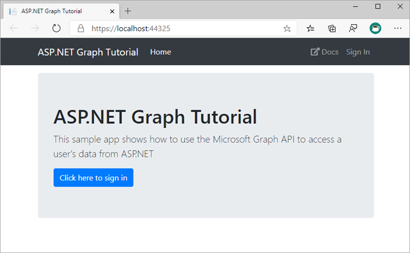

## Create an Azure AD application

In this section, you'll create a new Azure AD web application registration using the Azure Active Directory admin center.

Determine your ASP.NET app's SSL URL. In Visual Studio's **Solution Explorer**, select the **graph-tutorial** project. In the **Properties** window, find the value of **SSL URL**. Copy this value.

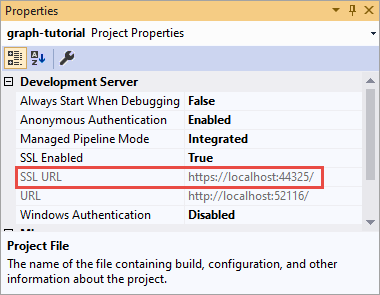

Open a browser and navigate to the [Azure Active Directory admin center (https://aad.portal.azure.com)](https://aad.portal.azure.com). Sign in using a **Work or School Account** that has global administrator rights to the tenancy.

Select **Azure Active Directory** in the left-hand navigation.

Select **Manage > App registrations** in the left-hand navigation.

  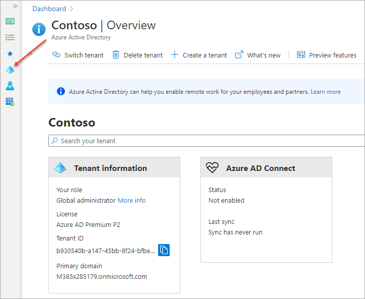

On the **App registrations** page, select **New registration**.

  

Select **New registration**. On the **Register an application** page, set the values as follows.

- Set **Name** to **ASP.NET Graph Tutorial**.
- Set **Supported account types** to **Accounts in any organizational directory and personal Microsoft accounts**.
- Under **Redirect URI**, set the first drop-down to **Web** and set the value to the ASP.NET app URL you previously obtained in this section.

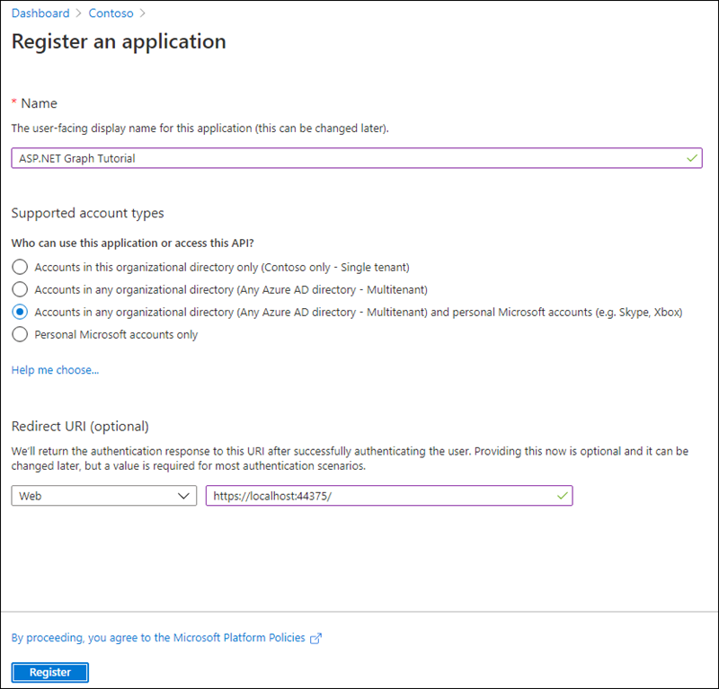

Select **Register**. On the **ASP.NET Graph Tutorial** page, copy the value of the **Application (client) ID** and save it, you'll need it in the next step.

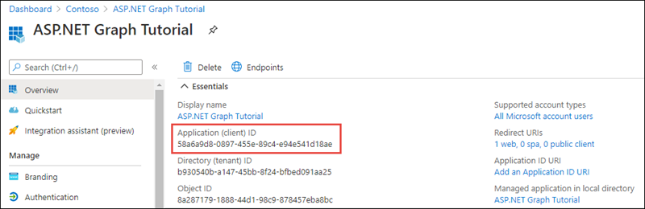

Select **Authentication** under **Manage**. Locate the **Implicit grant and hybrid flows** section and enable **ID tokens (used for implicit and hybrid flows)**.

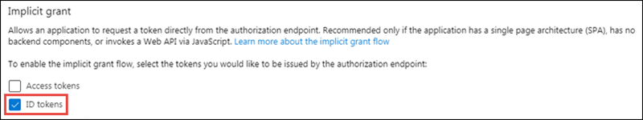

Select **Save** in the top menu to save your changes.

Select **Certificates & secrets** under **Manage**. Select the **New client secret** button. Enter a value in **Description** and select one of the options for **Expires** and select **Add**.

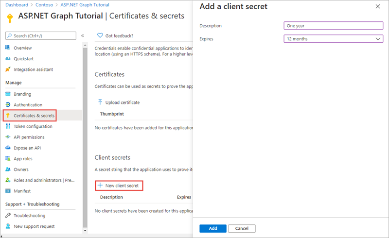

Copy the client secret value before you leave this page. You'll need it in the next step.

> [!IMPORTANT]
> This client secret is never shown again, so make sure you copy it now.

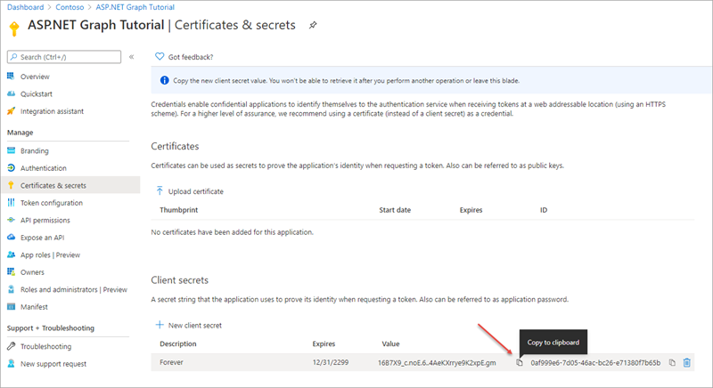

## Summary

In this exercise, you created an ASP.NET MVC web application with Visual Studio and Azure AD application with the Azure Active Directory admin center. With the application created, you then added the necessary packages and libraries that support user authentication and requesting data from Microsoft Graph.
