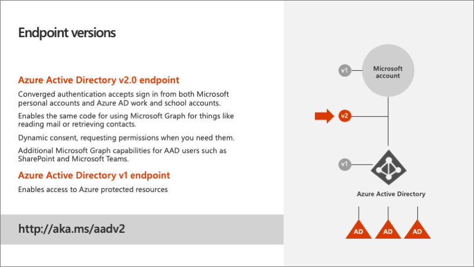
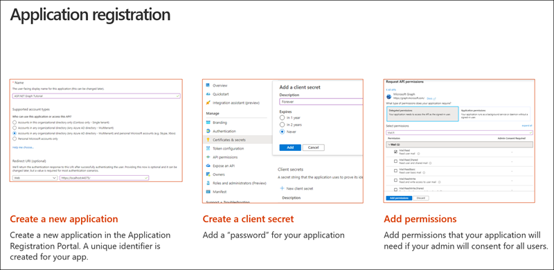

> [!VIDEO https://www.microsoft.com/videoplayer/embed/RE4OO3f]

In this unit, the focus is on the Azure Active Directory (AD). You'll learn how to use the Azure AD admin center to register an application, set up the app's credentials, and configure the type of the application. Next, you'll learn how to modify an existing ASP.NET MVC application so it will work with Azure AD.

## Azure AD endpoint versions

Azure AD contains two authentication and token endpoints. The v2 endpoint is the recommended endpoint for all applications that use Microsoft Graph should adopt. To understand why, it helps to understand what the benefits of it are over the v1 endpoint.

### Azure AD v1 endpoint

The Azure AD v1 endpoint only supports the Azure AD authentication. It doesn't support any other styles of authentication such as a Microsoft Account. What that meant is that if the user was logging in with a personal account or consumer account, also known as a Microsoft Account, and they wanted to access things like their OneDrive consumer account or Outlook.com, the developer of the application would have to write special authentication code to handle these types of accounts. This is a disadvantage of the v1 endpoint as it only supports work in school accounts (Azure AD accounts).

Another other challenge with the v1 endpoint is that it only supports static consent. Static consent means all single permissions that an application needs must be defined ahead of time and the user, on their first login, would be required to grant consent to the application for all permissions.

### Azure AD v2 endpoint

The Azure AD v2 endpoint addresses these two shortcomings with the v1 endpoint. First, it implements converged authentication that merges the Microsoft account and the work and school (Azure AD) account sign-in experiences together. Developers no longer need to direct users to specific sign-in experiences; all users are sent to the converged sign-in experience and rely on Microsoft identity to determine the type of account. This also enables developers to write the same code to access Microsoft Graph for things like reading mail and retrieving contacts.

Another benefit to the v2 endpoint is dynamic consent. Dynamic consent differs from static consent in that when a user signs in, the application requests the permissions it needs at that time. Microsoft identity will determine if the user has previously consented to the requested permissions. If one or more hasn't been consented to, the user is presented with the consent dialog for only those new permissions requests.

The v2 endpoint also supports the OpenID Connect standard of including an **ID token** when requested at sign-in. This is an extension to the authentication protocol and once the user successfully signed in, will be returned in the sign-in request to the application. The ID token contains information about the current user, such as their email address and their name. While the v1 endpoint had some support for OpenID Connect, the v2 endpoint better conforms to the OpenID connect specification.

## Register Azure AD applications with the Azure AD admin center

All apps that need to be granted permissions to use other apps must be registered in Azure AD. App registration is done through the Azure AD admin center at **https://aad.portal.azure.com**. The Azure AD admin center doesn't require users to have a paid Azure subscription to manage users and apps. A user must have access to read and edit users, groups, apps, or manage the directory. The admin center unifies various app management portals previously available to developers and administrators under one site. From this portal, you can manage apps that were created to use the v1 and v2 Microsoft identity endpoints.

Custom applications can use one of the authentication libraries provided by Microsoft. Each of the two libraries is made available through various SDKs for each of the platforms and languages supported by Microsoft identity.

Apps that use the v2 endpoints can use the Microsoft Authentication Library (MSAL) SDKs. MSAL replaced the previous library, Azure AD Authentication Library (ADAL) that only works with the v1 endpoints.

For apps that are integrated with Microsoft Graph, Microsoft recommends developers use the Microsoft identity v2 endpoints, so use the MSAL library.

### Web applications and Microsoft identity

In this module, we're using an ASP.NET MVC web application to demonstrate how to request and display events from a user's calendar with Microsoft Graph. This scenario implements the OAuth 2.0 authorization code grant flow to obtain an access token from Azure AD. The access token is included in each request submitted to Microsoft Graph to authenticate the user and application.

The web app must authenticate with Azure AD when it requests the access token. As part of the access token request, the app must include its app ID, also known as the client ID, and a secret. The secret can be an x509 certificate or a string.

The web app must also tell Microsoft identity the address of the web app that Microsoft identity should redirect the user to on a successful login. This address is called the *redirect URI*. The redirect URI included in the login must match the address in the app registration.

The last step in the app registration process in the Azure AD admin center is to specify any permissions the app will need. This can include either delegated permissions or application permissions. Delegated permissions are those that the user grants the app to act on their behalf when they're signed into the app. Application permissions are used by the app when no interactive user session is present as if there's a service app or daemon app. Permissions defined within the Azure AD admin center are static permissions, not dynamic permissions. Users are presented with these permissions when they sign in to the application the first time as part of the common consent previously discussed.

## Summary

This unit focused on Azure AD and the app registration. You learned how to use the Azure AD admin center to register an application, set up app's credentials, and configure the type of the application. You also learned how to modify an existing ASP.NET MVC application so it will work with Azure AD.
