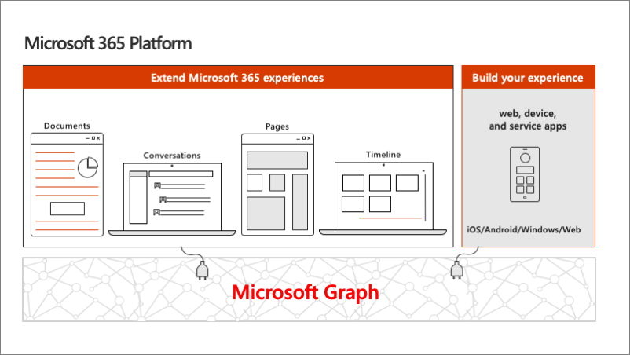
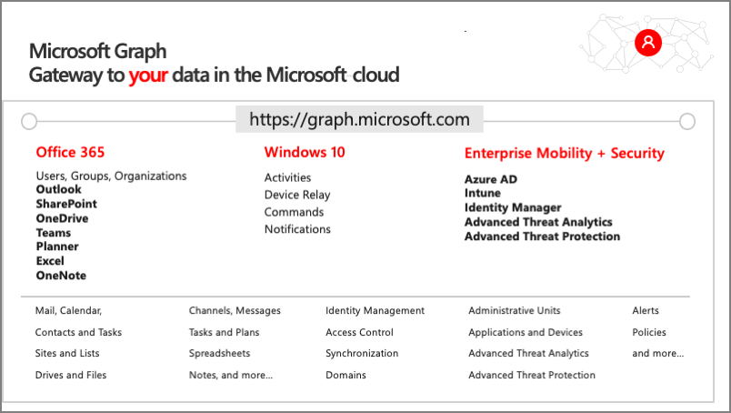
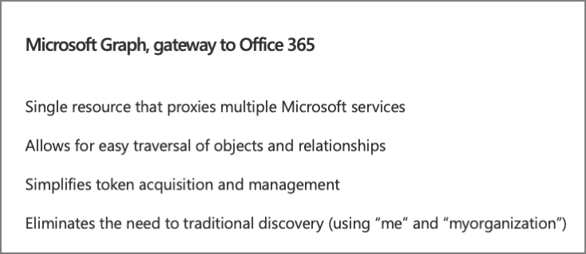
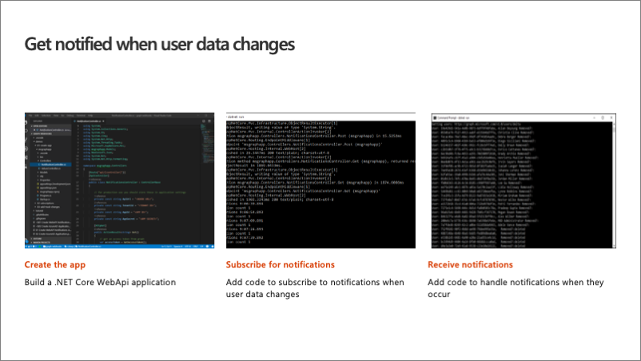

> [!VIDEO https://www.microsoft.com/videoplayer/embed/RE4OATk]

In this unit, you'll learn how Microsoft Graph fits into the larger Microsoft 365 platform. Next, you'll learn how to create a .NET Core web API that will be used to create and receive HTTP POST requests from Microsoft Graph.

## Microsoft 365 Platform

The Microsoft 365 developer vision focuses on the user's experience and their data and as a developer you can bring your application into the user experience with over 1.2 billion users of office worldwide. This is a huge opportunity to provide a window into your application and to enable users to connect into their data and add intelligence to your application.

There are currently over 850 million events created each month and a total of over 400 petabytes of data stored in the service that can add value for your users.

The Microsoft Graph is the gateway to your data in the Microsoft cloud.

### Microsoft Graph - gateway to your data in the Microsoft cloud

The Microsoft cloud includes multiple services and data types that we can take advantage of from Office 365, and it's all considered part of the Microsoft 365 platform.

Developers can integrate the signed-in user's email, calendar, contacts, and tasks into custom apps. We can work with content in SharePoint sites, files in OneDrive, channels and content within Microsoft Teams, and users in Azure Active Directory (Azure AD).

There are many different services that developers can take advantage of in their custom apps. Many of these services have their own APIs developers can interact with.

### Microsoft Graph simplifies access to Microsoft 365 data

One of the benefits of Microsoft Graph is that it serves as a proxy endpoint to all of these other services. Microsoft Graph encompass things such as Office 365, Windows 10 enterprise mobility and security (EMS), and it brings all of these different services under one unified endpoint: **graph.microsoft.com**.

The advantage to using Microsoft Graph is that it allows developers to just have a single endpoint, a resource, which means you're only going to need a single access token authenticate the different services. Each service still has its own individual permissions so that everything is still secured in an individual way. A single endpoint makes it easier for developers to build applications.

Microsoft Graph also enables easy navigation of entities and the relationships between entities. While there are many different Microsoft 365 services such as OneDrive for files, or Outlook for contacts and calendars, these different entities are related to each other. These relationships are in Microsoft Graph, which makes it easy to navigate from one entity to another, even if it crosses different underlying endpoints.

## Change notifications

Let's focus on a specific feature Microsoft Graph has to offer developers: change notifications.

Change notifications enable applications to be alerted when data changes or is created in Microsoft Graph. When the wanted entity is created, updated, or deleted, Microsoft Graph submits an HTTP POST to the specified endpoint. Your custom endpoint listens for these messages and acts on them based on the logic defined by your business requirements.

What can you get notifications for?

You can get notifications on messages, events, contacts, users, groups, conversations, OneDrive files, alerts, and more. This allows you to stay up to date and in sync with data that that is accessible via Microsoft Graph. It also allows you to avoid implementing a polling infrastructure where you submit requests to Microsoft Graph at regular intervals to get the most recent changes. Instead, you can go back to Microsoft Graph asking for changes when a notification is received by your application. This way you'll never miss a change to data that is exposed or was accessible via Microsoft Graph.

### Example scenarios

Let's look at a couple of different example notifications scenarios.

When an email is received, you want to translate it from its native language to another language and make it easier for the consumer to read that email.

When a new user is added to your organization, you want to automatically create an account for that user in your corporate third-party time tracking system and send them an email alerting them that their new account has been set up.

How would you implement these scenarios with change notifications?

You first need to create an app that will host a web API to listen for notifications. This will be the component that won't only trigger the request to create the subscription, but it will also manage subscription renewals and receive and respond to notifications received from Microsoft Graph.

### Change notification subscriptions

Your application is notified of this activity by creating a subscription with Microsoft Graph. The subscription tells Microsoft Graph what entities you want to receive notifications about and the address of your web API to post them to.

Developers must renew subscriptions for notifications as needed as all subscriptions have an expiration time associated with them. If the subscription isn't renewed, it will eventually expire. You'll have to keep track of the subscriptions and make sure that you renew.

The change notifications that your app receives from Microsoft Graph can allow you to track the changes of entities if you need to replicate data in your own system.

## Developing change notifications

The development experience for creating an app that receives change notifications can be challenging because you do have to stand up a well-known and accessible HTTPS secured endpoint to receive the notifications.

A free tool, [ngrok](https://ngrok.com) simplifies the developer experience. It creates a temporary well-known endpoint that redirects to your developer environment. Once you start your local web server to host your application, you start ngrok in a separate process. Ngrok creates a public HTTPS secured endpoint that points to your local web server. Once both are running, Microsoft Graph can submit HTTP POST requests to the ngrok URL, which will be routed down to your local web server.

## Summary

In this unit, you learned how Microsoft Graph fits into the larger Microsoft 365 platform. You then learned how to create a .NET Core web API that is used to create and receive HTTP POST requests from Microsoft Graph.
