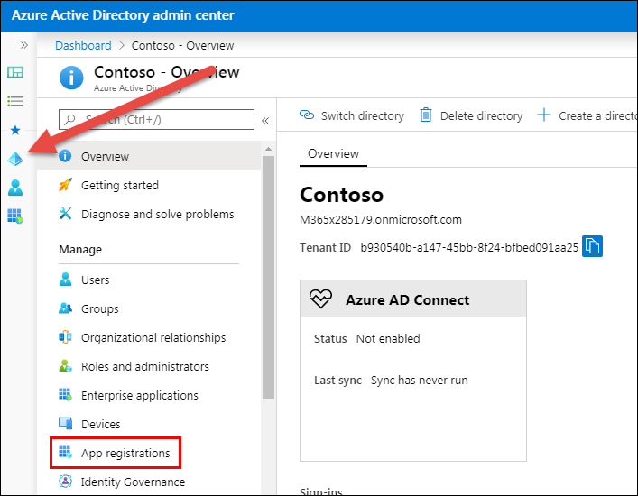
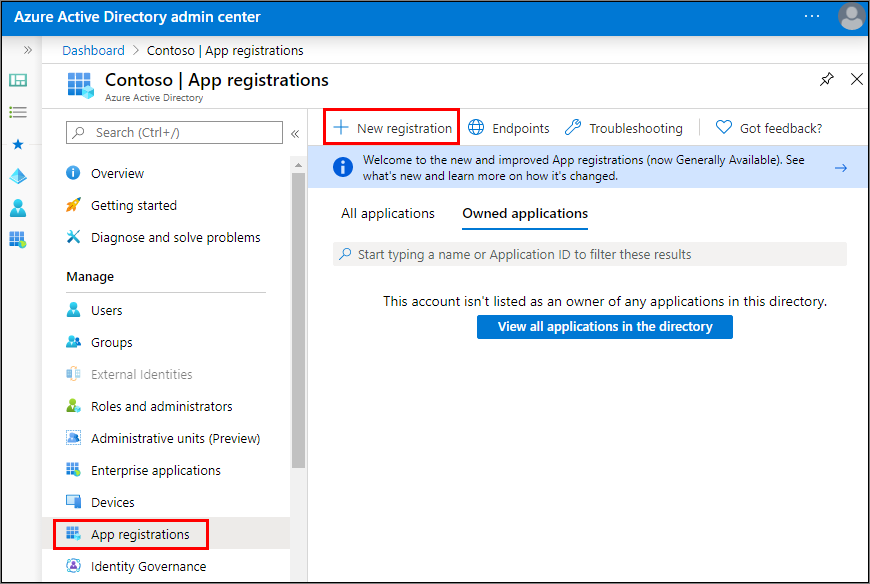
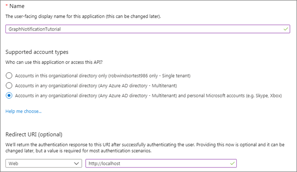
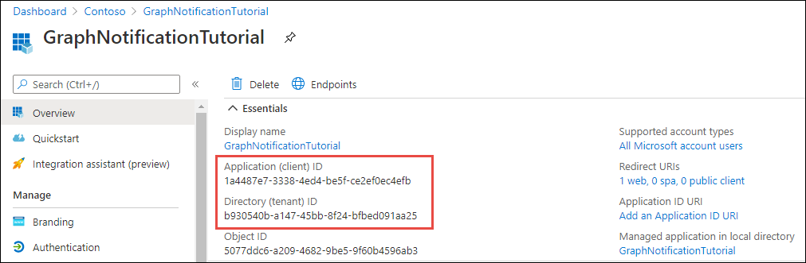
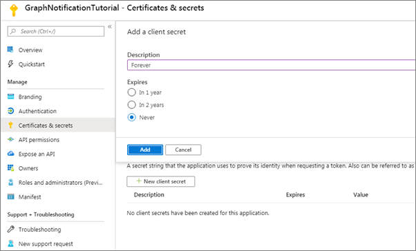
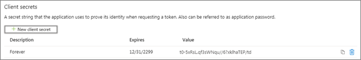
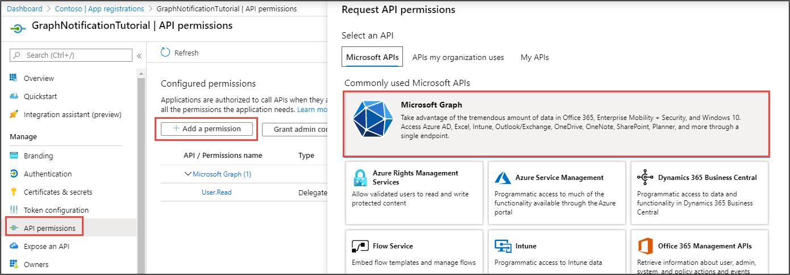
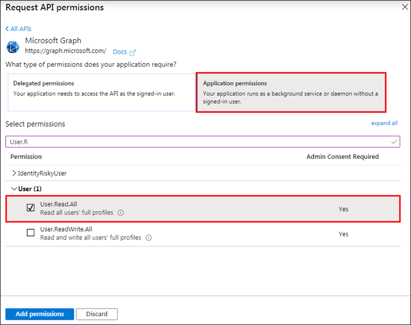
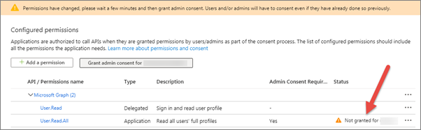
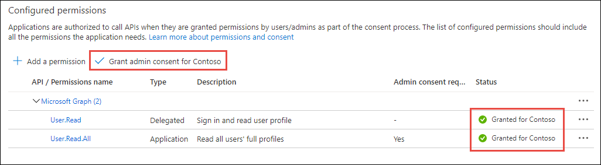

In this exercise, you'll create a new Azure AD app registration using the Azure AD admin center and grant administrator consent to the required permission scopes.

## Register Azure AD app

Open a browser and navigate to the [Azure Active Directory admin center](https://aad.portal.azure.com). Login using a **Work or School Account**.

Select **Azure Active Directory** in the left-hand navigation, then select **App registrations** under **Manage**.



Select **New registration**. On the **Register an application** page



Set the values as follows:

- **Name**: GraphNotificationTutorial
- **Supported account types**: Accounts in any organizational directory and personal Microsoft accounts
- **Redirect URI**: Web > http://localhost



Select **Register**.

On the **GraphNotificationTutorial** page, copy the value of the **Application (client) ID** and **Directory (tenant) ID** save it, you'll need them later in the exercise.



Select **Manage > Certificates & secrets**.

Select **New client secret**.

Enter a value in **Description** and select one of the options for **Expires** and select **Add**.




Copy the client secret value before you leave this page. You'll need it later in the exercise.

> [!IMPORTANT]
> This client secret is never shown again, so make sure you copy it now.



Select **Manage > API Permissions**.

Select **Add a permission** and select **Microsoft Graph**.



Select **Application Permission**, expand the **User** group, and select **User.Read.All** scope.

Select **Add permissions** to save your changes.





The application requests an application permission with the **User.Read.All** scope. This permission requires administrative consent.

Select **Grant admin consent for [your tenant name]**, then select **Yes** to consent this application and grant the application access to your tenant using the scopes you specified.



## Create an ASP.NET Core web API project

In order for the Microsoft Graph to send notifications to your application running on your development machine, you need to use a tool such as ngrok to tunnel calls from the internet to your development machine. Ngrok allows calls from the internet to be directed to your application running locally without needing to create firewall rules.

Before you continue, you should have [ngrok](https://ngrok.com) installed on your development machine.

Run ngrok by executing the following command from the command line:

```shell
ngrok http 5000
```

This will start ngrok and will tunnel requests from an external ngrok url to your development machine on port 5000.

Copy the https forwarding address. In the following sample output, that is **https://787b8292.ngrok.io**. You'll need this URL later.

```shell
ngrok by @inconshreveable

Session Status                online
Account                       ???? ???? (Plan: Free)
Version                       2.3.15
Region                        United States (us)
Web Interface                 http://127.0.0.1:4040
Forwarding                    http://787b8292.ngrok.io -> http://localhost:5000
Forwarding                    https://787b8292.ngrok.io -> http://localhost:5000

Connections                   ttl     opn     rt1     rt5     p50     p90
                              0       0       0.00    0.00    0.00    0.00
```

> [!IMPORTANT]
> Each time ngrok is restarted a new address will be generated and you'll need to copy it again.

Open your command prompt, navigate to a directory where you have rights to create your project, and run the following command to create a new .NET Core WebApi app:

```shell
dotnet new webapi -o msgraphapp
```

After creating the application, run the following commands to ensure your new project runs correctly.

```shell
cd msgraphapp
dotnet add package Microsoft.Identity.Client
dotnet add package Microsoft.Graph
dotnet run
```

The application will start and display the following in the console:

```shell
info: Microsoft.Hosting.Lifetime[0]
      Now listening on: https://localhost:5001
info: Microsoft.Hosting.Lifetime[0]
      Now listening on: http://localhost:5000
info: Microsoft.Hosting.Lifetime[0]
      Application started. Press Ctrl+C to shut down.
info: Microsoft.Hosting.Lifetime[0]
      Hosting environment: Development
info: Microsoft.Hosting.Lifetime[0]
      Content root path: [your file path]\msgraphapp
```

Stop the application running by pressing <kbd>CTRL</kbd>+<kbd>C</kbd>.

Open the application in Visual Studio Code using the following command:

```shell
code .
```

If Visual Studio Code displays a dialog box asking if you want to add required assets to the project, select **Yes**.

## Summary

In this exercise, you created a new Azure AD app registration using the Azure AD admin center and grant administrator consent to the required permission scopes.
