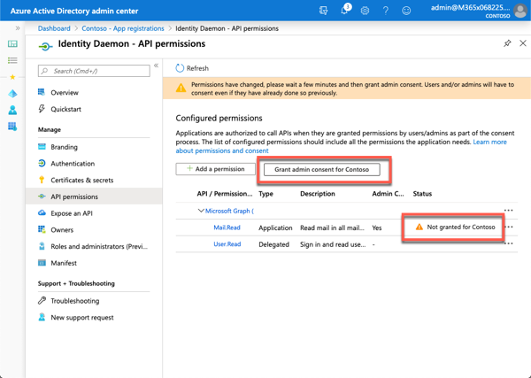

Many apps expect user interaction to authenticate and obtain tokens to call web APIs on behalf of users. But what about apps that need to run without user interaction such as processing batch jobs, or those that run services such as a service on Windows, or daemon processes on Linux? Developers can create applications that obtain tokens without user interaction using the OAuth 2.0 client credentials flow.

In this unit, you’ll learn how to create apps that obtain tokens without user interaction to either act on behalf of a user or do tasks as the app’s identity.

## Daemon and non-interactive apps

Your application can acquire a token to call a web API on behalf of itself (not on behalf of a user).

This scenario is typically used when an app needs an access token but doesn't want to work under the context of a user+app permissions. Instead, the app needs its own permissions to work independently of a user. These types of permissions are called *application permissions*.

Application permissions are common in service or daemon-related apps. The way this works is the application has its own credentials that are used to authenticate and obtain an access token form a token issuer.

Here are some examples of use cases for daemon apps:

- web applications that are used to provision or administer users, or do batch processes in a directory
- desktop applications (such as windows services on Windows, or daemons processes on Linux) that do batch jobs, or an operating system service running in the background
- web APIs that need to manipulate directories, not specific users

Another common case where non-daemon applications use the client credentials flow is when they need elevated privileges that a user doesn't have. For example, even when apps act on behalf of users, they need to access a web API or a resource with their identity and not the user's identity, such as accessing secrets in Azure KeyVault or an Azure SQL database for a cache.

Applications that acquire a token for their own identities:

- Are confidential client applications. These apps, given that they access resources independently of a user, need to prove their identity. They're also rather sensitive apps, which they need to be approved by the Azure Active Directory (Azure AD) tenant admins.
- Have registered a secret (application password or certificate) with Azure AD. This secret is passed-in during the call to Azure AD to get a token.

## OAuth 2.0 client credentials flow

Unlike the scenario covered in the previous unit, the app doesn't need to sign-in to obtain an authorization code. During the Azure AD application registration process, you create an SSL certificate public/private key pair.

The public certificate is register with our Azure AD app. Within the service or daemon app, the private certificate is used to encrypt a string that is sent to the access token endpoint.

Administrators also can use a client secret instead of a certificate.

## Azure AD app registration

In order for a service or daemon app to use Microsoft identity to enable users to authenticate and obtain access tokens for use with services such as Microsoft Graph, you must register a new app with Azure AD. This can be done using the Azure AD admin center https://aad.portal.azure.com.

Unlike the previous examples covered in this module, you don't need to specify a redirect URI or sign out URI.

In addition, you don't need to enable the ID token or access token for the implicit grant flow; these don't apply to the client credentials grant flow.

One unique aspect to apps that use the client credentials grant flow is that their permissions must be defined ahead of time, also referred to as static permissions.

## Permissions

Daemon application can only request application permissions to APIs (not delegated permissions). Application permissions are defined on the API Permission page for the application registration.


Daemon applications require have a tenant admin pre-consent to the application calling the web API. This consent is provided in the same API Permission page.



## MSAL .NET & code configuration

The configuration of an app that leverages the client credentials flow is similar to a web app or console app. First create an instance of the confidential client using the MSAL library:

```cs
string tenantId = config["tenantId"];
string clientId = config["applicationId"];
string clientSecret = config["applicationSecret"];
string authority = $"https://login.microsoftonline.com/{config["tenantId"]}/v2.0";

var cca = ConfidentialClientApplicationBuilder.Create(clientId)
                  .WithAuthority(authority)
                  .WithClientSecret(clientSecret)
                  .Build();
```

This code uses the client secret option with the client credentials flow. The following example demonstrates how to do the same thing using a certificate that has been set in the Azure AD app registration:

```cs
string tenantId = config["tenantId"];
string clientId = config["applicationId"];
X509Certificate2 certificate = ReadCertificate(config.CertificateName);
string authority = $"https://login.microsoftonline.com/{config["tenantId"]}/v2.0";

var cca = ConfidentialClientApplicationBuilder.Create(clientId)
                                        .WithAuthority(authority)
                                        .WithCertificate(certificate)
                                        .Build();
```

## Signing in & acquiring tokens

Once the confidential client is created, use the `AcquireTokenForClient()` method to obtain an access token for the app:

```cs
List<string> scopes = new List<string>();
scopes.Add("https://graph.microsoft.com/.default");

result = await cca.AcquireTokenForClient(_scopes).ExecuteAsync();
return result.AccessToken;
```

Note the scopes specified when requesting an access token. In other scenarios, the code specified the exact permission (also known as scopes) the application needed.

The scope to request for a client credential flow is the name of the resource followed by `/.default`. This tells Azure AD to use the application level permissions declared statically during the application registration.

## Calling APIs (MS Graph)

Finally, you can use the configured confidential client to call a secured endpoint, such as Microsoft Graph. When using the Microsoft Graph .NET SDK, first create an instance of the MSAL authentication provider:

```cs
public class MsalAuthenticationProvider : IAuthenticationProvider
{
  private IConfidentialClientApplication _application;
  private string[] _scopes;

  public MsalAuthenticationProvider(IConfidentialClientApplication application, string[] scopes)
  {
    _application = application;
    _scopes = scopes;
  }

  public async Task AuthenticateRequestAsync(HttpRequestMessage request)
  {
    request.Headers.Authorization = new AuthenticationHeaderValue("bearer", await GetTokenAsync());
  }

  public async Task<string> GetTokenAsync()
  {
    AuthenticationResult result = null;

    try {
      result = await _application.AcquireTokenForClient(_scopes).ExecuteAsync();
    } catch (MsalServiceException) { }

    return result.AccessToken;
  }
}

// create the confidential client application (cca)
var app = new MsalAuthenticationProvider(cca, scopes);
```

Next, use the MSAL authentication provider in creating a new instance of the `GraphServiceClient` from the Microsoft Graph .NET SDK:

```cs
private static GraphServiceClient GetAuthenticatedGraphClient(IConfigurationRoot config)
{
  var authenticationProvider = CreateAuthorizationProvider(config);
  return new GraphServiceClient(authenticationProvider);
}
```

Finally, use the `GraphServiceClient` to submit requests to Microsoft Graph:

```cs
var client = GetAuthenticatedGraphClient(config);
var requestUserEmail = client.Users[config["targetUserId"]].Messages.Request();
var results = requestUserEmail.GetAsync().Result;
```

## Summary

In this unit, you learned how to create apps that obtain tokens without user interaction to either act on behalf of a user or do tasks as the app’s identity.
