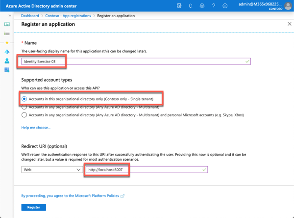
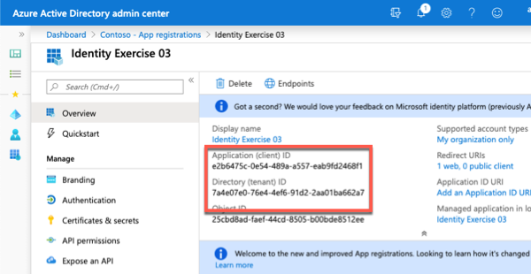
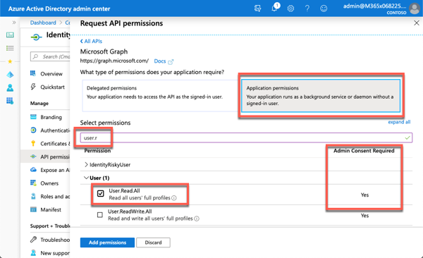
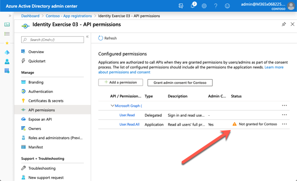
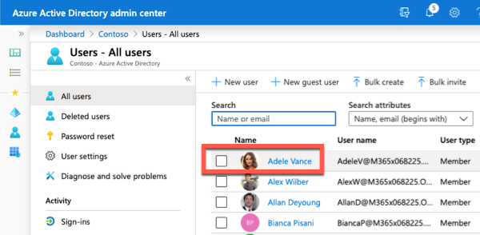
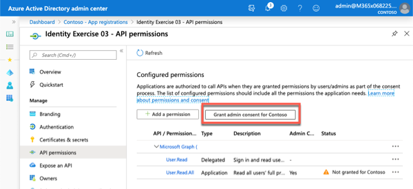
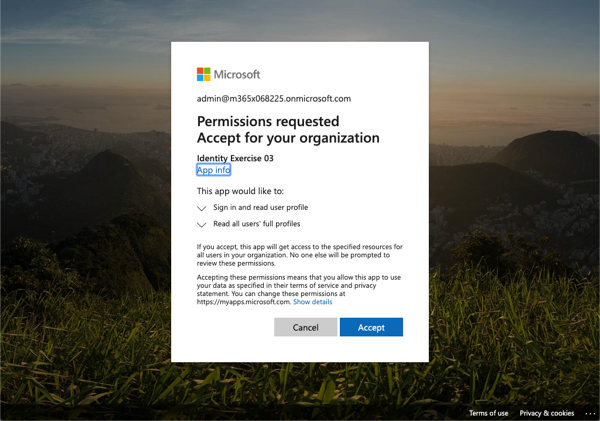
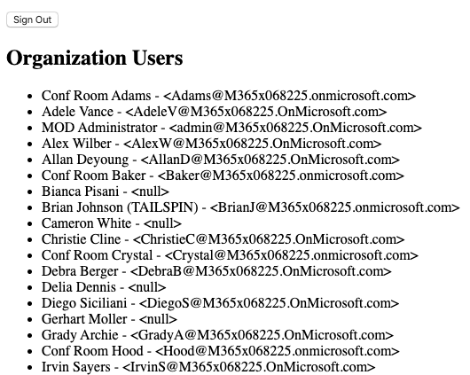

Application permissions are the other type of permission supported by the Microsoft identity platform. Application permissions are used by apps that run without a signed-in user present such as services or daemon processes.

In this unit, you’ll learn about application permissions, how to define them and how to grant them using a different type of consent flow in your apps.

> [!IMPORTANT]
> This exercise assumes you have created the single page app (SPA) from the previous unit in this module. You'll edit the SPA created in that exercise in this exercise.

### Create an Azure AD application

The web page you created in the previous exercises currently submits a request to Microsoft Graph to retrieve the user's emails or calendar items. You will modify it to display all users in the organization. To do this, you must create an Azure AD application that has been granted the necessary permission to read all users in the organization. This is an *application permission*, unlike the delegated permissions you have worked with so far in this module. Application permissions require administrator approval.

Open a browser and navigate to the [Azure Active Directory admin center](https://aad.portal.azure.com). Sign in using a **Work or School Account** that has global administrator rights to the tenancy.

Select **Azure Active Directory** in the left-hand navigation.

Then select **Manage > App registrations** in the left-hand navigation.

  

On the **App registrations** page, select **New registration**.

  

On the **Register an application** page, set the values as follows:

- **Name**: Identity Exercise 03
- **Supported account types**: Accounts in this organizational directory only (Single tenant)
- **Redirect URI**: Web = http://localhost:3007

    

Select **Register** to create the application.

On the **Identity Exercise 03** page, copy the values **Application (client) ID** and **Directory (tenant) ID**; you'll need these values later in this exercise.

  

On the **Identity Exercise 03** page, select the **1 web, 0 public client** link under the **Redirect URIs**.

Locate the section **Implicit grant** and select both **Access tokens** and **ID tokens**. This tells Azure AD to return these tokens the authenticated user if requested.

#### Add permissions to the Azure AD app

Select **API Permissions** from the left-hand navigation, and then select **Add a permission**.

On the **Request API Permissions** page, select **Microsoft APIs**, **Microsoft Graph**, and then select **Delegated permissions**:

In the search box in the **Select permissions** section, enter **user.r**, select the permission **User.Read.All** permission, and then select **Add permissions**.

  

Notice the **User.Read.All** permission has a warning message that states **Not granted for Contoso**. This indicates that an administrator must grant this permission to the app.

  

Before granting this permission, let's update the SPA to see what a non-administrative user would see.

### Update the SPA with the Azure AD application details

Locate the following markup in the **index.html** file in the SPA:

```html
<h2>Latest messages</h2>
<div id="messages"></div>
```

Replace this markup with the following:

```html
<h2>Organization Users</h2>
<div id="users"></div>
```

Locate the `var graphConfig = {}` code in the **index.html** file. The `scopes` array contains the permissions the app will request in the access token when the user signs-in. You also need to modify the endpoint for the request:

  - Replace the **/me** in the `graphMeEndpoint` property with **/users**.
  - Replace the **calendars.read** permission in the `scopes` array with **users.read.all**.

The `graphConfig` object should now look like the following code:

```js
var graphConfig = {
  graphMeEndpoint: "https://graph.microsoft.com/v1.0/users",
  requestObj: {
    scopes: ["user.read", "user.read.all"]
  }
};
```

Now change the Microsoft Graph requests to request users instead of calendar items. Search for all instances of `/events?$top=10&$select=subject` in the SPA and replace them with `/?$select=displayName,mail`. There should be 4 of them. The rest of the request can remain as is because both email messages and calendar events have a *subject* property.

The last step is to update the method that renders the results. Locate the method `graphAPICallback()` and update the `forEach` loop within it to display all users by their display name and email address. The `graphAPICallback()` should look like the following after making the change:

```js
function graphAPICallback(data) {
  var htmlBody = '';
  data.value.forEach(user => {
    htmlBody += `<li>${user.displayName} - &lt;${user.mail}&gt;</li>`;
  });
  document.getElementById("users").innerHTML = `<ul>${htmlBody}</ul>`;
}
```

### Test the web application

To test the web page, first start the local web server. In the command prompt, execute the following command from the root of the project:

```shell
node server.js
```

Next, open a browser and navigate to http://localhost:3007. The page initially contains a default welcome message and sign-in button.

Select the **Sign In** button.

Depending on the browser, you're using, a popup window will load or the page will redirect to the Azure AD sign in prompt.

Sign in using a **Work or School Account** of a user in your organization *that doesn't have the global administrator role assigned to them*. On the next screen, notice how the consent dialog is notifying the user they can't use the app until an administrator has granted the permission:



Close the dialog and browser.

### Grant application permission via admin consent

To fix this, you need to login as an administrator and use the admin consent experience to grant the application permission.

One way to do this is using the URL method shown in previous exercises. Another way to trigger this experience is from the Azure AD admin center.

Open a browser and navigate to the [Azure Active Directory admin center](https://aad.portal.azure.com). Sign in using a **Work or School Account** that has global administrator rights to the tenancy.

Select **App Registrations**, select the app **Identity Exercise 03**, and then select **API permissions**.

To launch the admin consent experience, select the **Grant admin consent for Contoso** button.

  

This will launch the admin consent dialog:

  

Notice the permission **Read all users' full profiles**. Select **Accept** to grant this permission to all users in the organization.

Sign-out and navigate back to the SPA at http://localhost:3007.

Select the **Sign In** button and sign-in with the same non-administrator account you used before. This time, it will not prompt you for permissions and display users within the organization because the admin granted all users that permission:

  

## Summary

In this unit, you learned about application permissions, how to define them and how to grant them using a different type of consent flow in your apps.
