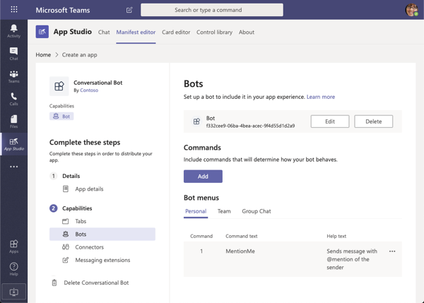

> [!VIDEO https://www.microsoft.com/videoplayer/embed/RE4NHyi]

Conversation bots allow users to interact with a web service through text, interactive cards, and task modules from the Microsoft Teams client. This capability enables developers to create a guided interaction with your users.

In this unit, you’ll learn the basics of bots, the Microsoft Bot Framework, and the steps required to register a bot in a Microsoft Teams app to interact with it from the Microsoft Teams client.

## What tasks are best handled by bots?

Bots in Microsoft Teams can be part of a one-to-one conversation, a group chat, or a channel in a team. Each scope provides unique opportunities, and challenges, for your conversational bot.

### Bots in channels

Channels contain threaded conversations between multiple people. This potentially gives your bot massive reach, but individual interactions need to be concise. Traditional multi-turn interactions probably won't work well. Instead, look to use interactive cards or task modules, or potentially move the conversation to a one-to-one conversation if you need to collect lots of information.

Your bot only has access to messages where it's @mentioned directly. You can retrieve extra messages from the conversation using Microsoft Graph.

Some scenarios where bots excel in a channel include:

- **Notifications**, particularly if you provide an interactive card for users to take additional information.
- **Feedback** scenarios like polls and surveys.
- Interactions that can be resolved in a **single request/response cycle**, where the results are useful for multiple members of the conversation.

### Bots in group chats

Group chats are non-threaded conversations between three or more people. They tend to have fewer members than a channel and are more transient. Similar to a channel, your bot will only have access to messages where it's @mentioned directly.

Scenarios that work well in a channel will usually work as well in a group chat.

### Bots in one-to-one chats

This is the traditional way for a conversational bot to interact with a user. They can enable diverse workloads. Q&A bots, bots that start workflows in other systems, bots that tell jokes, and bots that take notes are just a few examples.

Remember to consider whether a conversation-based interface is the best way to present your functionality.

## How do bots work?

A conversational bot consists of three things:

- A publicly accessible web service that you host.
- Your bot registration that registers your bot with the Bot Framework.
- Your Teams app package that contains your app manifest. This is what your users install and connects the Teams client to your web service (routed through the Bot Service).

Bots for Microsoft Teams are built on the [Microsoft Bot Framework](https://dev.botframework.com/). Microsoft recommends you use either C# or Node.js to take advantage of our [SDKs](/microsoftteams/platform/#pivot=sdk-tools). These packages extend the basic Bot Builder SDK classes and methods:

- use specialized card types such as adaptive cards
- send and receive Microsoft Teams channel-specific data on activities
- process messaging extension requests

## How are bots in Microsoft Teams unique?

Bots created using the Microsoft Bot Framework are diverse and can be used in multiple platforms. Bots developed for Microsoft Teams contain some differences from other platforms. The primary difference in bots developed for Microsoft Teams is in how activities are handled.

The Microsoft Teams activity handler derives from the Bot Framework's activity handler to route all Teams activities before allowing any non-Teams-specific activities to be handled.

### Microsoft Teams activity handlers

When a bot for Microsoft Teams receives an activity, it passes it on to its *activity handlers*. Under the covers, there's one base handler called the *turn handler*, that all activities are routed through. The turn handler calls the required activity handler to handle whatever type of activity was received.

Where a bot designed for Microsoft Teams differs is that its derived from `TeamsActivityHandler` class that is derived from the Bot Framework's `ActivityHandler` class.

### Microsoft Teams bot events

Your conversational bot can subscribe to events unique to Microsoft Teams. Some of these events are as follows:

- **Team Member Events**
  - `teamMemberAdded`
  - `teamMemberRemoved`
- **Channel Events**
  - `channelCreated`
  - `channelRenamed`
  - `channelDeleted`
- **Team Events**
  - `teamRenamed`
- **Message Reactions**
  - `reactionsAdded`
  - `reactionsRemoved`

## Developing bots for Microsoft Teams

To create a conversational bot for Microsoft Teams, you need to do the following things:

1. create a web service
1. register the web service as a bot with Microsoft Bot Framework
1. create your Microsoft Teams app manifest and app package
1. upload your app package to Microsoft Teams

Microsoft provides SDKs for multiple platforms, including .NET and Node.js. This module will use the Node.js SDK.

### Create a web service

The heart of your bot is the web service. It will define a single HTTPS route on which to receive all requests. The Microsoft Bot Framework will send different types of messages to your web service. Your web service can inspect the type of message to route it to the wanted logic. The other option is to use one of the available SDKs that expose methods the SDK will call when messages matching specific types are received.

For example, when a messaging extension action command is invoked, the SDK will detect the message type `composeExtension/fetchTask` and call the `handleTeamsMessagingExtensionFetchTask()` method, passing in a context and the payload from the message sent as an HTTPS POST from the Microsoft Bot Framework.

The following code defines a new bot that is watching for messages that contain the string `mentionme`. When it receives this message, it responds with a message that starts with `Hi...` and @mentions the user who sent the original message.

```typescript
export class ConvoBot extends TeamsActivityHandler {
  constructor() {
    super();

    this.onMessage(async (context: TurnContext, next: () => Promise<void>) => {
      const botMessageText: string = context.activity.text.trim().toLowerCase();

      if (botMessageText === "mentionme") {
        await this.handleMessageMentionMeOneOnOne(context);
      }
      await next();
    });

  }

  private async handleMessageMentionMeOneOnOne(context: TurnContext): Promise<void> {
    const mention = {
      mentioned: context.activity.from,
      text: `<at>${new TextEncoder().encode(context.activity.from.name)}</at>`,
      type: "mention"
    };

    const replyActivity = MessageFactory.text(`Hi ${mention.text} from a 1:1 chat.`);
    replyActivity.entities = [mention];
    await context.sendActivity(replyActivity);
  }
}
```

### Register the web service as a bot with Microsoft Bot Framework

Once you've created your web service, you'll register it as a bot with the Microsoft Bot Framework.

Registering your web service with the Bot Framework provides a secure communication channel between the Microsoft Teams client and your web service. The Microsoft Teams client and your web service never communicate directly. Instead, messages are routed through the Bot Framework Service.

When you register a new bot with the Microsoft Bot Framework, you'll associate it with a new or existing Microsoft Azure AD app. This app contains an app ID and secret that are used for the Bot Framework to authenticate with your web service and Microsoft Teams app.

### Create your Microsoft Teams app manifest and app package

Before deploying your Microsoft Teams app and custom bot to Microsoft Teams, you need to define the bot with the custom app. This is done by adding an entry to the app's manifest file.

You can use App Studio to add a bot to the app's manifest file. App Studio can create a new app manifest file, or you can import an existing one to add a bot to it:



The following JSON is taken from the app's manifest for the bot you'll create in the next unit of this module. This bot defines a new command, **MentionMe** that is displayed to users who want to interact with it. Listing all the supported commands isn't required, but it does make your bot more user-friendly.

```json
"bots": [
  {
    "botId": "f332cee9-06ba-4bea-acec-9f4d55d1d2a9",
    "scopes": ["personal"],
    "supportsFiles": false,
    "isNotificationOnly": false,
    "commandLists": [
      {
        "scopes": ["personal"],
        "commands": [
          {
            "title": "MentionMe",
            "description": "Sends message with @mention of the sender"
          }
        ]
      }
    ]
  }
]
```

### Upload your app package to Microsoft Teams

The last step is to create the Microsoft Teams app package and upload it to Microsoft Teams. Once this is done, users can begin to use your bot.

## Basics of conversation bots

A conversation is a series of messages sent between your bot and one or more users. There are three kinds of conversations (also called scopes) in Teams:

- **teams**: also called channel conversations, visible to all members of the channel
- **groupChat**: conversation between a bot and two or more users
- **personal**: conversations between bots and a single user

A bot behaves slightly differently depending on what kind of conversation it's involved in:

- Bots in channel and group chat conversations require the user to @mention the bot to invoke it in a channel.
- Bots in a one-to-one conversation don't require an @mention. All messages sent by the user will be routed to your bot.

### Activities

Each message is an `Activity` object of type `messageType: message`. When a user sends a message, Teams posts the message to your bot; specifically, it sends a JSON object to your bot's messaging endpoint. Your bot examines the message to determine its type and respond correctly.

### Receive a message

To receive a text message, use the `text` property of the `Activity` object. In the bot's activity handler, use the turn context object's `Activity` to read a single message request.

### Send a message

To send a text message, specify the string you want to send as the activity. In the bot's activity handlers, use the turn context object's `SendActivity()` method to send a single message response.

## Summary

In this unit, you learned the basics of bots, the Microsoft Bot Framework, and the steps required to register a bot in a Microsoft Teams app to interact with it from the Microsoft Teams client.
