In this exercise, you’ll learn how to create and add a new bot to a Microsoft Teams app and interact with it from the Microsoft Teams client.

> [!NOTE]
> This exercise requires a valid Azure subscription in order to create a bot using Bot Framework. However, if you do not have an Azure subscription, you can use the legacy Bot Framework Registration Portal. Refer to the following docs for more information: [Create a bot for Microsoft Teams](https://docs.microsoft.com/microsoftteams/platform/bots/how-to/create-a-bot-for-teams)

## Prerequisites

Developing Microsoft Teams apps requires an Office 365 tenant, Microsoft Teams configured for development, and the necessary tools installed on your workstation.

For the Office 365 tenant, follow the instructions on [Microsoft Teams: Prepare your Office 365 tenant](https://docs.microsoft.com/microsoftteams/platform/get-started/get-started-tenant) for obtaining a developer tenant if you don't currently have an Office 365 account. Make sure you have also enabled Microsoft Teams for your organization.

Microsoft Teams must be configured to enable custom apps and allow custom apps to be uploaded to your tenant to build custom apps for Microsoft Teams. Follow the instructions on the same **Prepare your Office 365 tenant** page mentioned above.

You'll use Node.js to create a custom Microsoft Teams app in this module. The exercises in this module assume you have the following tools installed on your developer workstation.

> [!IMPORTANT]
> In most cases, installing the latest version of the following tools is the best option. The versions listed here were used when this module was published and last tested.

- [Node.js](https://nodejs.org/) - v10.\* (or higher)
- NPM (installed with Node.js) - v6.\* (or higher)
- [Gulp](https://gulpjs.com/) - v4.\* (or higher)
- [Yeoman](https://yeoman.io/) - v3.\* (or higher)
- [Yeoman Generator for Microsoft Teams](https://github.com/OfficeDev/generator-teams) - v2.\* (or higher)
- [Visual Studio Code](https://code.visualstudio.com)

You must have the minimum versions of these prerequisites installed on your workstation.

## Register a new bot in Microsoft Azure

The first step is to create a new Microsoft Teams bot. Adding a bot to the Teams app involves two steps:

1. Register the bot with Microsoft Azure's Bot Framework
1. Add a bot to the project codebase

### Register the bot with Microsoft Azure's Bot Framework

Open a browser and navigate to the [Azure portal](https://portal.azure.com). Sign in using a **Work or School Account** that has rights to create resources in your Azure subscription.

Select **Create a resource** in the left-hand navigation:

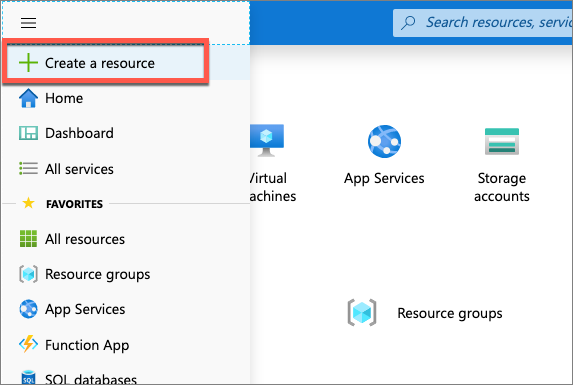

Enter **resource group** in the **Search the marketplace** input box, and select **Resource group**.


On the **Resource Group** page, select the **Create** button to create a new resource group.

Select a valid subscription, enter a name for the resource group, and select the wanted region. *None of these choices will impact the bot registration and are up to you.*


Complete the wizard to create the resource group. Once Azure has completed the resource group creation process, navigate to the resource group.

From the resource group, select the **Add** or **Create resources** button.


Enter **bot** in the **Search the marketplace** input box, and select **Bot Channels Registration** from the list of resources returned. Then select **Create** on the next page to start the process of registering a new bot resource:


In the **Bot Channels Registration** blade, enter the following values and then select **Create**:

- **Bot handle**: *Enter a globally unique name for the bot*
- **Subscription**: *Select the subscription you selected previously when creating the resource group*
- **Resource group**: *Select the resource group you created previously*
- **Location**: *Select your preferred Azure region*
- **Pricing tier**: *Select a preferred pricing tier; the F0 tier is free*
- **Messaging endpoint**: https://REPLACE_THIS.ngrok.io/api/messages

    > The bot registration needs to know the endpoint of the web service where the bot is implemented. This will change each time you start the ngrok utility used in previous exercises.

- **Application Insights**: Off
- **Microsoft App ID and password**: Auto create App ID and password

Azure will start to provision the new resource. This will take a moment or two. Once it is finished, navigate to the bot resource in the resource group.


### Enable the Microsoft Teams channel for the bot

In order for the bot to interact with Microsoft Teams, you must enable the Teams channel.

From the bot resource in Azure, select **Channels** in the left-hand navigation.

On the **Connect to channels** pane, select the Microsoft Teams channel, then select **Save** to confirm the action.

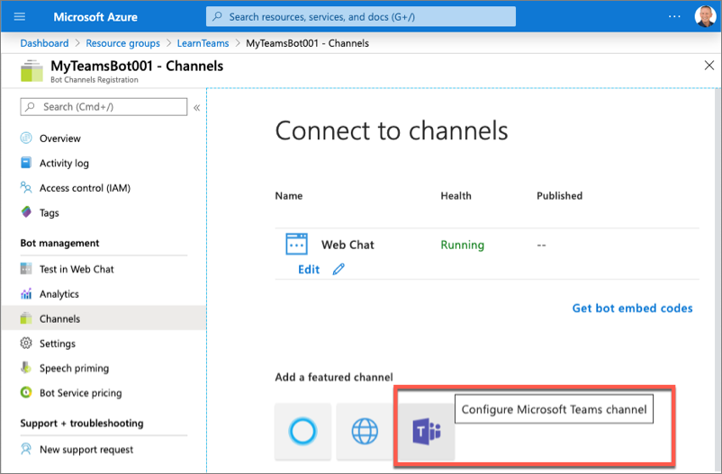

Once this process is complete, you should see both the **Web Chat** and **Microsoft Teams** listed in your enabled channels:

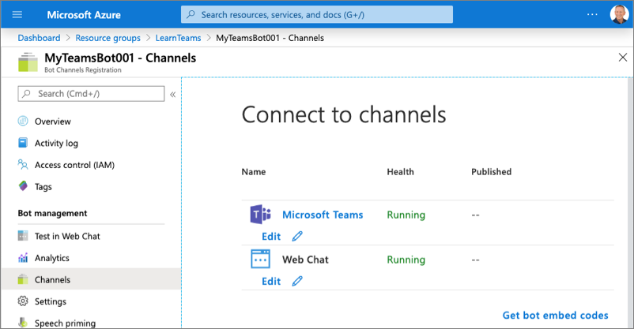

### Retrieve the bot app id and password

When Azure created the bot, it also registered a new Azure AD app for the bot. You need to generate this new bot app a secret and copy the app's credentials.

Select **Settings** from the left-hand navigation. Scroll down to the **Microsoft App ID** section.

Copy the ID of the bot as you'll need it later.

Select **Manage** to navigate to the Azure AD app blade:

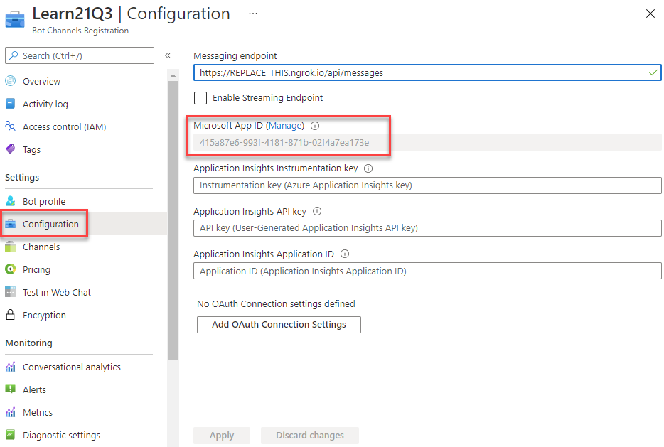

### Create a client secret for the app

In order for the daemon app to run without user involvement, it will sign in to Azure AD with an application ID and either a certificate or secret. In this exercise, you'll use a secret.

Select **Certificates & secrets** from the left-hand navigation panel.

Select the **New client secret** button:

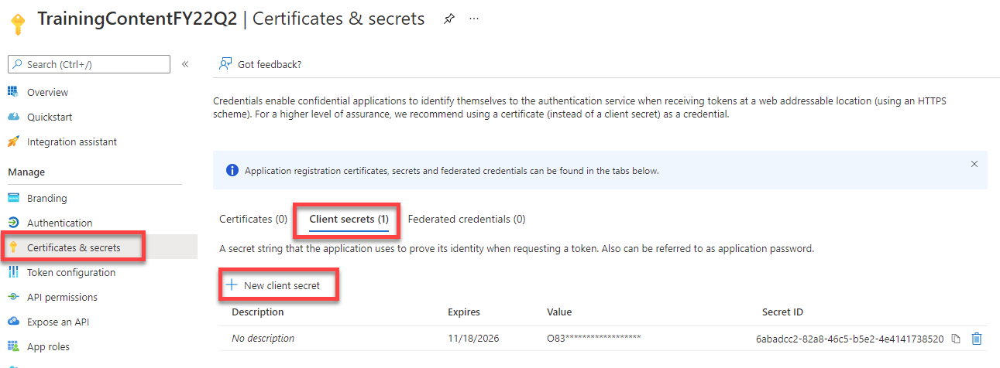

When prompted, give the secret a description and select one of the expiration duration options provided and select **Add**. *What you enter and select doesn't matter for the exercise.*

The **Certificate & Secrets** page will display the new secret. It's important you copy this value as it's only shown this one time; if you leave the page and come back, it will only show as a masked value.

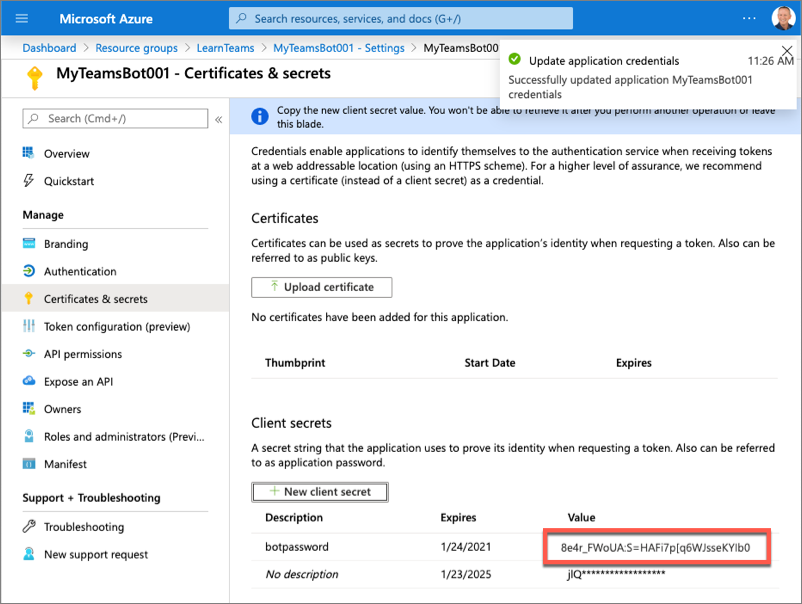

Copy the value of the secret as you'll need it later.

## Create Microsoft Teams app

In this section, you'll create a new Node.js project.

> [!NOTE]
> At the time of publication of this module, there are plans to update the Yeoman generator for Microsoft Teams to scaffold new bot projects using the  the Bot Framework v4 SDK. However, at the time of publication of this module, the default project uses an older version of the Bot Framework SDK.
>
> Therefore, the steps in this section may change over time because the Yeoman generator may simplify the creation of bots. This exercise will guide you through creating a bot and configuring the project manually to use the Bot Framework v4 SDK because this is the current recommended approach.

Open your command prompt, navigate to a directory where you want to save your work, create a new folder **learn-msteams-bots**, and change directory into that folder.

Run the Yeoman Generator for Microsoft Teams by running the following command:

```shell
yo teams
```

Yeoman will launch and ask you a series of questions. Answer the questions with the following values:

- **What is your solution name?**: ConversationalBot
- **Where do you want to place the files?**: Use the current folder
- **Title of your Microsoft Teams App project?**: Conversational Bot
- **Your (company) name? (max 32 characters)**: Contoso
- **Which manifest version would you like to use?**: 1.5
- **Enter your Microsoft Partner Id, if you have one?**: (Leave blank to skip)
- **What features do you want to add to your project?**: *(uncheck the default option **A Tab** using the <kbd>space</kbd> key and press <kbd>enter</kbd>)*
- **The URL where you'll host this solution?**: https://conversationalbot.azurewebsites.net
- **Would you like to include Test framework and initial tests?**: No
- **Would you like to use Azure Applications Insights for telemetry?**: No

> [!NOTE]
> Most of the answers to these questions can be changed after creating the project. For example, the URL where the project will be hosted isn't important at the time of creating or testing the project.

After answering the generator's questions, the generator will create the scaffolding for the project and then execute `npm install` that downloads all the dependencies required by the project.

> [!NOTE]
> At the time of publication of this module, the project created by the Yeoman generator for Microsoft Teams includes outdated dependencies to Bot Framework related packages. In the next few steps, you'll update the project's dependencies to use the currently recommended packages.

Remove the older bot SDK-related packages by executing the following command in the command line from the root folder of the project:

```shell
npm uninstall botbuilder-dialogs botbuilder-teams botframework-config
```

Next, upgrade the existing **botbuilder** package and **\@microsoft/teams-js** packages to the recommended versions:

```shell
npm install botbuilder@4.7.1 @microsoft/teams-js@1.6.0 -SE
```

### Add a bot to the project

In this section, you'll manually add a bot to the project.

Create a new folder **convoBot** in the **./src/app** folder.

Create a new file **convoBot.ts** in this new folder **./src/app/convoBot/convoBot.ts**.

Add the following code to the **convoBot.ts** file:

```ts
import {
  TeamsActivityHandler,
  TurnContext,
  MessageFactory
} from "botbuilder";

import * as Util from "util";
const TextEncoder = Util.TextEncoder;

import * as debug from "debug";
const log = debug("msteams");

export class ConvoBot extends TeamsActivityHandler {
  constructor() {
    super();

    this.onMessage(async (context: TurnContext, next: () => Promise<void>) => {
      // insert onMessage() handler code here
    });
  }
}
```

The first version of this bot will respond to the message **MentionMe** in a 1:1 chat conversation. The response will mention the user who initiated the conversation.

To implement this functionality, add the following method to the `ConvoBot` class:

```ts
private async handleMessageMentionMeOneOnOne(context: TurnContext): Promise<void> {
  const mention = {
    mentioned: context.activity.from,
    text: `<at>${new TextEncoder().encode(context.activity.from.name)}</at>`,
    type: "mention"
  };

  const replyActivity = MessageFactory.text(`Hi ${mention.text} from a 1:1 chat.`);
  replyActivity.entities = [mention];
  await context.sendActivity(replyActivity);
}
```

Next, call this method when the bot receives the specific string **MentionMe**. Add the following code to the `onMessage()` handler, replacing the code comment `// insert onMessage() handler code here` to implement this:

```ts
const botMessageText: string = context.activity.text.trim().toLowerCase();

if (botMessageText === "mentionme") {
  await this.handleMessageMentionMeOneOnOne(context);
}
await next();
```

### Expose the bot as part of the Node.js app's REST API

After creating the bot, the next step is to expose it as part of the app's REST API.

First, add the bot to the **./src/app/TeamsAppsComponents.ts** file by adding the following code to the end of that file:

```ts
export * from "./convoBot/convoBot";
```

This file is used in the core web server file. This file needs to be updated to expose the bot to the app's API and to configure a bot adapter for the app.

Locate and open the web server file, **./src/app/server.ts**.

Add the following two `import` statements after the existing `import` statements in the file:

```ts
import { BotFrameworkAdapter } from "botbuilder";
import { ConvoBot } from "./convoBot/convoBot";
```

> [!TIP]
> Locate the following lines in the **server.ts** file. These lines load all the components and registers them with the web server's REST API routing.
>
> ```ts
> import * as allComponents from "./TeamsAppsComponents";
> ...
> express.use(MsTeamsApiRouter(allComponents));
> ```

The last step is to configure the bot framework and call the bot when requests are received through the `/api/messages` path. Add the following code to the end of the **./src/app/server.ts** file:

```ts
// register and load the bot
const botAdapter = new BotFrameworkAdapter({
  appId: process.env.MICROSOFT_APP_ID,
  appPassword: process.env.MICROSOFT_APP_PASSWORD
});

// configure what happens when there is an unhandled error by the bot
botAdapter.onTurnError = async (context, error) => {
  console.error(`\n [bot.onTurnError] unhandled error: ${error}`);
  await context.sendTraceActivity("OnTurnError Trace", `${error}`, "https://www.botframework.com/schemas/error", "TurnError");
  await context.sendActivity("bot error");
};

// run the bot when messages are received on the specified path
const bot = new ConvoBot();
express.post("/api/messages", (request, response) => {
  botAdapter.processActivity(request, response, async (context) => {
    await bot.run(context);
  });
});
```

In the code above, the first section initializes the Bot Framework adapter with the Azure AD app credentials created when you registered the bot in the Azure portal. These two properties, the Azure AD app's ID and secret, are pulled from an environment variable. This project contains a file, **./.env** that is used to set environment variables when it runs. You need to set these two values for the bot to work:

Locate and open the file **./.env**.

Locate the following section in the file, and set the values of the two properties that you obtained when registering the bot:

```txt
# App Id and App Password ofr the Bot Framework bot
MICROSOFT_APP_ID=
MICROSOFT_APP_PASSWORD=
```

### Register the bot in the Microsoft Teams app

The last step before you can test bot is to add it to the Microsoft Teams app manifest.

Locate and open the **./src/manifest/manifest.json**.

Locate the property `id`. Change its value to match the GUID of the Azure AD app that was created when creating the bot in the Azure portal.

Locate the property `bots`. Add a new bot to the collection of bots registered with this Microsoft Teams app by adding the following JSON to the array. This code will add our bot to the personal scope of the user when its installed. It includes a single help message that will show the command it supports, **MentionMe**.

```json
"bots": [
  {
    "botId": "<REPLACE_WITH_MICROSOFT_APP_ID>",
    "scopes": ["personal"],
    "supportsFiles": false,
    "isNotificationOnly": false,
    "commandLists": [
      {
        "scopes": ["personal"],
        "commands": [
          {
            "title": "MentionMe",
            "description": "Sends message with @mention of the sender"
          }
        ]
      }
    ]
  }
],
```

> [!IMPORTANT]
> Ensure you replace the `botId` property's value with the Azure AD app ID you obtained when registering the bot.

At this point, your bot is ready to test!

## Test the conversation bot

From the command line, navigate to the root folder for the project and execute the following command:

```shell
gulp ngrok-serve
```

This gulp task will run many other tasks all displayed within the command-line console. The **ngrok-serve** task builds your project and starts a local web server (http://localhost:3007). It then starts ngrok with a random subdomain that creates a secure URL to your local webserver.

> [!NOTE]
> Microsoft Teams requires all content displayed within a tab be loaded from an HTTPS request. In development, can be done using the tool [ngrok](https://www.ngrok.com) that creates a secure rotatable URL to your local HTTP webserver. Ngrok is included as a dependency within the project so there is nothing to setup or configure.

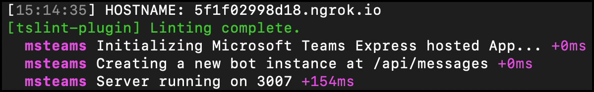

Note the URL of the Ngrok URL displayed in the console. In the previous screenshot, NGrok has created the temporary URL **ec7d937d.ngrok.io** that will map to our locally running web server. In order for the Bot Framework to route messages from Microsoft Teams to our locally running bot, you need to update the bot's messaging endpoint in the Azure portal.

Open a browser and navigate to the [Azure portal](https://portal.azure.com) and sign in using a **Work or School Account** that has rights to create resources in your Azure subscription.

Locate the bot by selecting the Azure Resource Group and Bot Channels Registration resource you created at the beginning of this exercise.

Using the left-hand navigation, select **Bot management** > **Settings**.

Locate the property **Configuration** > **Messaging endpoint** and set the domain to the NGrok domain.

Finally, save your changes to the bot configuration using the **Save** button at the top of the page.

> [!IMPORTANT]
> The free version of Ngrok will create a new URL each time you restart the web server. Make sure you update the **Messaging endpoint** of your URL each time you restart the web server when you are testing the app.

### Install the custom app in Microsoft Teams

Now let's install the app in Microsoft Teams. In the browser, navigate to **https://teams.microsoft.com** and sign in with the credentials of a Work and School account.

> [!NOTE]
> Microsoft Teams is available for use as a web client, desktop client and a mobile client. In this module, we will use the web client but any of the clients can be used.

Using the app bar navigation menu, select the **Mode added apps** button. Then select **Browse all apps** followed by **Upload for me or my teams**.


In the file dialog that appears, select the Microsoft Teams package in your project. This app package is a ZIP file that can be found in the project's **./package** folder.

Once the package is uploaded, Microsoft Teams will display a summary of the app. Here you can see some "todo" items to address. *None of these "todo" items are important to this exercise, so you'll leave them as is.*

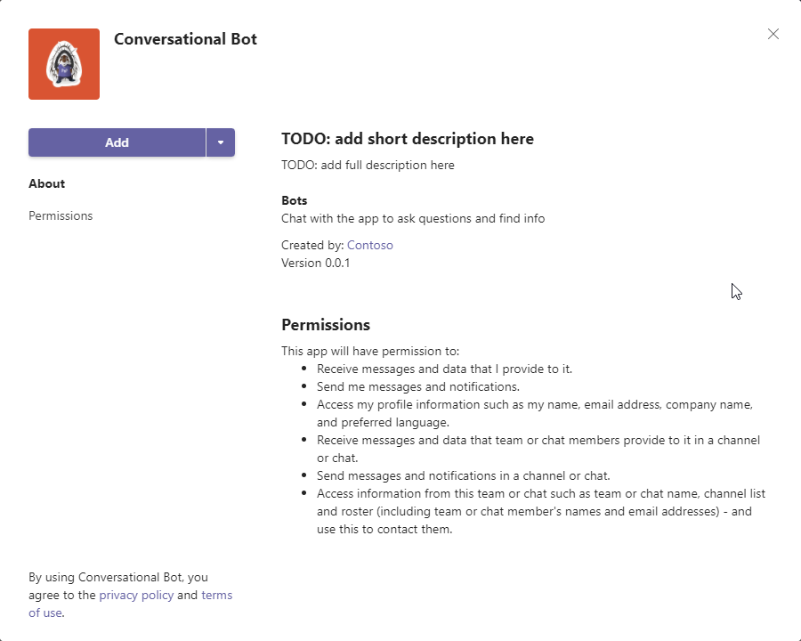

Select the **Add** button to install the app, adding a new personal tab to your **More added apps** dialog:

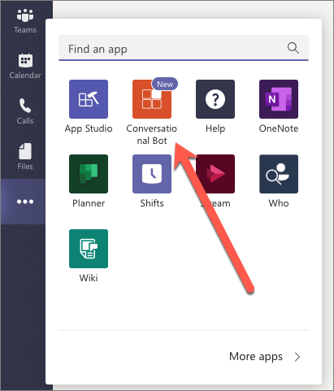

Select the app to navigate to chat with the bot:

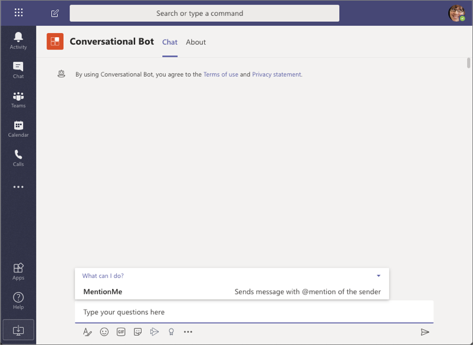

Notice the commands that the bot supports are shown in the compose box when the app loads. Let's test the bot!

Select the **MentionMe** command, or manually type **mentionme** in the compose box, then press <kbd>enter</kbd>.

After a few seconds, you should see the bot respond mentioning the user you are signed in with:

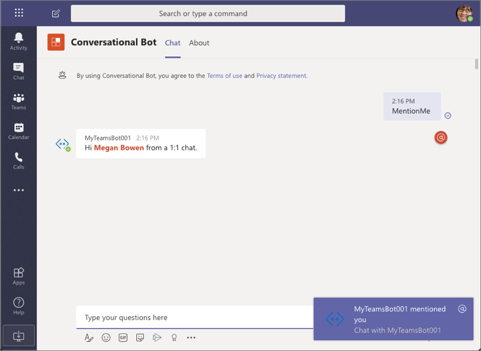

At this point, we have a working bot that is responding when it's mentioned.

## Summary

In this exercise, you’ll learn how to create and add a new bot to a Microsoft Teams app and interact with it from the Microsoft Teams client.
