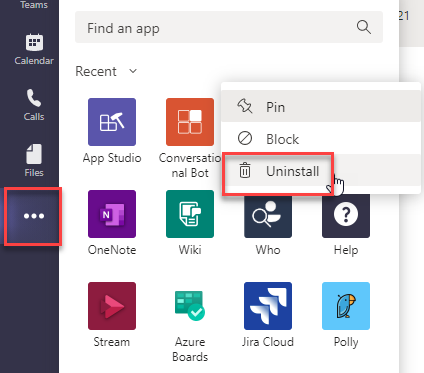
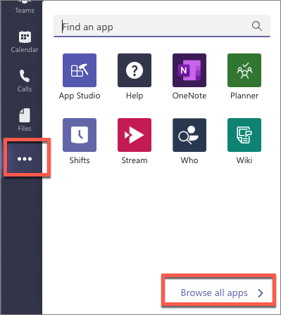
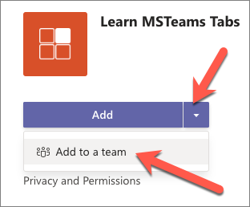
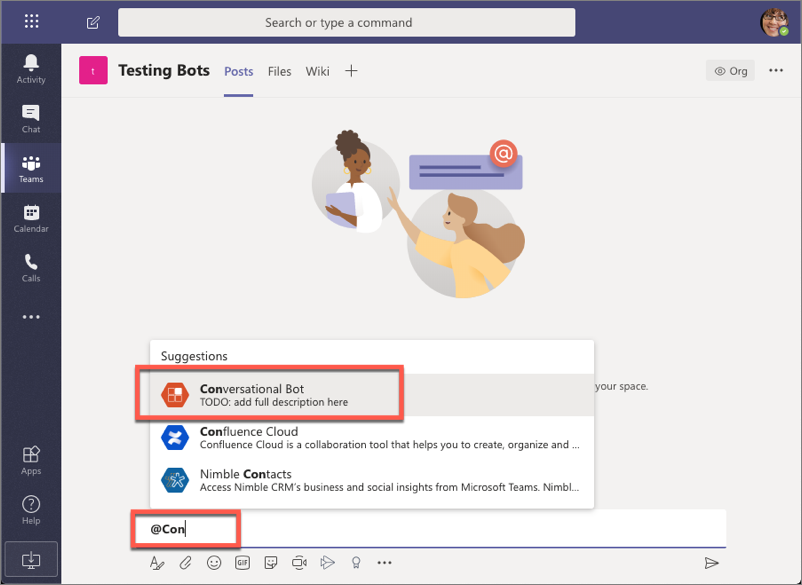
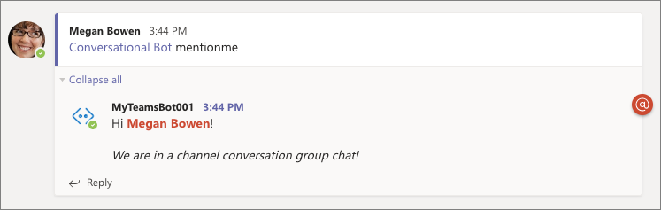
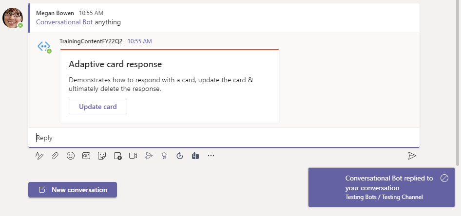
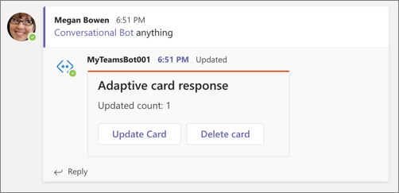
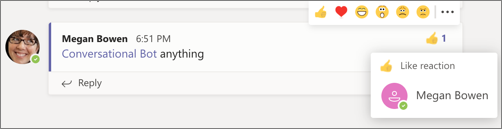
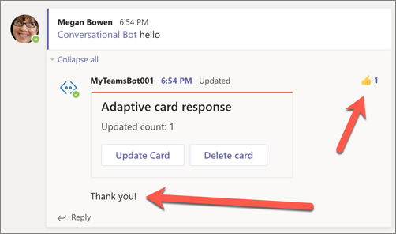

> [!VIDEO https://www.microsoft.com/videoplayer/embed/RE4NHyh]

Conversation bots can do many things within the Microsoft Teams client. They can proactively send a message to a channel or group chat, listen for and act on Microsoft Teams specific events and even update their own messages.

In this exercise, you’ll modify the existing Microsoft Teams app to update your bot to respond to message reactions, and update or delete messages capabilities.

> [!IMPORTANT]
> This exercise assumes you have created the Microsoft Teams app project with the Yeoman generator from the previous exercise in this module.

## Add channel support to a conversation bot

In a previous exercise, you created a bot that could be used in the personal scope that enabled one:one chat. When a bot is used in a channel, you must @mention it to receive messages.

In this section, you'll modify the existing Microsoft Teams app to support being added to a team and respond to messages from the **Posts** tab.

### Update the app's configuration

First, update app's manifest to add channel support. Locate and open the **./src/manifest/manifest.json** file.

You must increment the version of the app to upgrade an existing installed version. Locate the property `version` and increment the version to something greater than the default value `0.0.1`.

### Update the bot code

The next step is to update the bot's code.

In the previous exercise, our code was looking for the specific message `MentionMe` to respond. This works in a 1:1 personal chat because the bot isn't mentioned in the conversation.

However, in a channel conversation, a user must @mention the bot to trigger it. This results in a message containing a reference to the bot, not just the message submitted.

While there are multiple ways to address this, let's check the type of conversation the message is from and handle it correctly.

Locate and open the bot in the file **./src/server/conversationalBot/ConversationalBot.ts**. Locate the existing `onMessage()` handler in the class constructor and find the `if` statement that checks for the `mentionme` string. Replace the contents of the `if` statement to check the type of conversation the message was sent from to call the corresponding handler:

```typescript
if (context.activity.conversation.conversationType == "personal") {
  await this.handleMessageMentionMeOneOnOne(context);
} else {
  await this.handleMessageMentionMeChannelConversation(context);
}
```

The complete `if` statement in the `onMessage()` handler should now look like the following:

```typescript
if (text.startsWith("mentionme")) {
  if (context.activity.conversation.conversationType === "personal") {
    await this.handleMessageMentionMeOneOnOne(context);
  } else {
    await this.handleMessageMentionMeChannelConversation(context);
  }
  return;
} else if (text.startsWith("hello")) {
  await context.sendActivity("Oh, hello to you as well!");
  return;
} else if (text.startsWith("help")) {
  const dc = await this.dialogs.createContext(context);
  await dc.beginDialog("help");
} else {
  await context.sendActivity(`I\'m terribly sorry, but my developer hasn\'t trained me to do anything yet...`);
}
```

Finally, add the following method to the `ConversationalBot` class to implement the handler for our new scenario:

```typescript
private async handleMessageMentionMeChannelConversation(context: TurnContext): Promise<void> {
  const mention = {
    mentioned: context.activity.from,
    text: `<at>${new TextEncoder().encode(context.activity.from.name)}</at>`,
    type: "mention"
  };

  const replyActivity = MessageFactory.text(`Hi ${mention.text}!`);
  replyActivity.entities = [mention];
  const followupActivity = MessageFactory.text("*We are in a channel conversation*");
  await context.sendActivities([replyActivity, followupActivity]);
}
```

Save your changes, update, and test the installed app.

### Test the conversation bot in a channel

From the command line, navigate to the root folder for the project and execute the following command:

```console
gulp ngrok-serve
```

> [!IMPORTANT]
> Recall from a previous exercise, Ngrok will create a new subdomain. You need to update your bot registration's **Messaging endpoint** in the Azure portal (*shown in a previous exercise*) with this new domain before testing it.

First, update the existing installed version of the bot.

In the browser, navigate to **https://teams.microsoft.com** and sign in with the credentials of a Work and School account.

Using the app bar navigation menu, select the **More added apps** button. Then right-click on the **Conversational Bot** application. Select **Uninstall**. Select **Uninstall** again to confirm.



Using the app bar navigation menu, select the **More added apps** button. Then select **Browse all apps** followed by **Upload for me or my teams**.



In the file dialog that appears, select the Microsoft Teams package in your project. This app package is a ZIP file that can be found in the project's **./package** folder.

After the package is uploaded, Microsoft Teams displays a summary of the app. Select the arrow next to the **Add** button, and select **Add to a team** to install the app:



In the **Select a channel to start using** dialog box, select an existing team. Then select **Set up a tab**:


Navigate to an existing channel in a team.

From the channel's **Conversations** tab, @mention the bot. The first time you @mention the bot, you'll be prompted to install it into the team.



After installing the bot, when you @mention it and include the message `mentionme`, the bot will reply to your message:



## Reply to messages with Adaptive cards

> [!VIDEO https://www.microsoft.com/videoplayer/embed/RE4NHym]

In this section, you'll update the bot to respond to unknown messages using an Adaptive card. The card's single action will trigger the bot to update the existing message with a new Adaptive card. The updated message will include an additional action that will trigger the bot to delete the message.

Locate and open the bot in the file **./src/server/conversationalBot/ConversationalBot.ts**.

Locate the existing `onMessage()` handler in the class constructor. Replace the `else` statement's contents with the following code to the existing `if` statement to respond with an adaptive card if the bot receives an unknown command:

```typescript
const value = { cardAction: "update", count: 0 };
const card = CardFactory.adaptiveCard({
  $schema: "http://adaptivecards.io/schemas/adaptive-card.json",
  type: "AdaptiveCard",
  version: "1.0",
  body: [
    {
      type: "Container",
      items: [
        {
          type: "TextBlock",
          text: "Adaptive card response",
          weight: "bolder",
          size: "large"
        }
      ]
    },
    {
      type: "Container",
      items: [
        {
          type: "TextBlock",
          text: "Demonstrates how to respond with a card, update the card & ultimately delete the response.",
          wrap: true
        }
      ]
    }
  ],
  actions: [
    {
      type: "Action.Submit",
      title: "Update card",
      data: value
    }
  ]
});
await context.sendActivity({ attachments: [card] });
return;
```

The `onMessage()` handler's `if` statement should now look similar to the following:

```typescript
if (text.startsWith("mentionme")) {
  if (context.activity.conversation.conversationType == "personal") {
    await this.handleMessageMentionMeOneOnOne(context);
  } else {
    await this.handleMessageMentionMeChannelConversation(context);
  }
  return;
} else if (text.startsWith("hello")) {
  await context.sendActivity("Oh, hello to you as well!");
  return;
} else if (text.startsWith("help")) {
  const dc = await this.dialogs.createContext(context);
  await dc.beginDialog("help");
} else {
  const value = { cardAction: "update", count: 0 };
  const card = CardFactory.adaptiveCard({..});
  await context.sendActivity({ attachments: [card] });
  return;
});
```

Notice the `else` statement will send a card to the conversation that contains a `data` object in the single `actions`. This object has a `count` property & `cardAction` property. When a user triggers the action, this object will be sent to the bot.

Add the following methods to implement the `updateCardActivity()` & the `deleteCardActivity()` handlers:

```typescript
private async updateCardActivity(context): Promise<void> {
  const value = {
    cardAction: "update",
    count: context.activity.value.count + 1
  };
  const card = CardFactory.adaptiveCard({
    $schema: "http://adaptivecards.io/schemas/adaptive-card.json",
    type: "AdaptiveCard",
    version: "1.0",
    body: [
      {
        type: "Container",
        items: [
          {
            type: "TextBlock",
            text: "Adaptive card response",
            weight: "bolder",
            size: "large"
          }
        ]
      },
      {
        type: "Container",
        items: [
          {
            type: "TextBlock",
            text: `Updated count: ${ value.count }`,
            wrap: true
          }
        ]
      }
    ],
    actions: [
      {
        type: "Action.Submit",
        title: "Update card",
        data: value
      },
      {
        type: "Action.Submit",
        title: "Delete card",
        data: { cardAction: "delete"}
      }
    ]
  });

  await context.updateActivity({ attachments: [card], id: context.activity.replyToId, type: 'message' });
}

private async deleteCardActivity(context): Promise<void> {
  await context.deleteActivity(context.activity.replyToId);
}
```

In the code you've added, notice the `updateCardActivity()` retrieves and increments the `count` property it received. It then creates a new card with the same data, but with an additional action to delete the card. Finally, the method uses the `updateActivity()` method to update an existing message.

The `deleteCardActivity()` deletes the card using the `deleteActivity()` method.

The last step is to handle messages that are sent from the adaptive card correctly.

1. Within the `onMessage()` method, locate the following line of code:

    ```typescript
    case ActivityTypes.Message:
    ```

1. You're going to add a conditional check to determine if the message is an action from our card or a message from the user. First, wrap the entire contents of this `case` statement in the `else` part of a new `if-else` block:

    ```typescript
    case ActivityTypes.Message:
      // if a value property exists = adaptive card submit action
      if () {
        // TODO - insert card action logic
      } else {
        // existing code goes here
      }
      break;
    ```

1. Next, update the `if` statement to check if the message contains a `value` property:

    ```typescript
    case ActivityTypes.Message:
      // if a value property exists = adaptive card submit action
      if (context.activity.value) {
        // TODO - insert card action logic
      } else {
        // existing code goes here
      }
      break;
    ```

1. Finally, add the following `switch` statement to the `if` block, replacing the `// TODO - insert card action logic` comment, to determine if the action requested should update or delete the card:

    ```typescript
    switch (context.activity.value.cardAction) {
      case "update":
        await this.updateCardActivity(context);
        break;
      case "delete":
        await this.deleteCardActivity(context);
        break;
    }
    ```

The final `onMessage()` method should look like the following code:

```typescript
this.onMessage(async (context: TurnContext): Promise<void> => {
  switch (context.activity.type) {
    case ActivityTypes.Message:
      // if a value property exists = adaptive card submit action
      if (context.activity.value) {
        switch (context.activity.value.cardAction) {
          case "update":
            await this.updateCardActivity(context);
            break;
          case "delete":
            await this.deleteCardActivity(context);
            break;
        }
      } else {
        let text = TurnContext.removeRecipientMention(context.activity);
        text = text.toLowerCase();
        if (text.startsWith("mentionme")) {
          if (context.activity.conversation.conversationType == "personal") {
            await this.handleMessageMentionMeOneOnOne(context);
          } else {
            await this.handleMessageMentionMeChannelConversation(context);
          }
          return;
        } else if (text.startsWith("hello")) {
          await context.sendActivity("Oh, hello to you as well!");
          return;
        } else if (text.startsWith("help")) {
          const dc = await this.dialogs.createContext(context);
          await dc.beginDialog("help");
        } else {
          const value = { cardAction: "update", count: 0 };
          const card = CardFactory.adaptiveCard({
            // code omitted for brevity
          });
          await context.sendActivity({ attachments: [card] });
          return;
        }
        break;
      }

    default:
      break;
  }
  // Save state changes
  return this.conversationState.saveChanges(context);
});
```

### Test the bot updating existing messages

From the command line, navigate to the root folder for the project and execute the following command:

```console
gulp ngrok-serve
```

> [!IMPORTANT]
> Recall from a previous exercise, Ngrok will create a new subdomain. You need to update your bot registration's **Messaging endpoint** in the Azure portal (*shown in a previous exercise*) with this new domain before testing it.

In the Microsoft Teams client, go to the channel you installed the bot in the previous section. From the **Conversations** tab, @mention the bot with a random string to trigger the `else` condition.

The bot will reply to the message with a card:



Select the button **Update card**. After a few seconds, the card should be updated with a new card containing an incremented counter value and a new button:



Select the **Update card** button a few more times to see the counter get updated.

Finally, select the **Delete card** button. After a few seconds, the card will be removed by the bot.

## Reply to message reactions

In this section, you'll update the bot to respond when someone likes a message from the bot.

Locate and open the bot in the file **./src/server/conversationalBot/ConversationalBot.ts**.

Locate the existing `this.onMessageReaction()` handler in the class constructor method and replace its contents with the following code:

```typescript
if (context.activity.reactionsAdded) {
  context.activity.reactionsAdded.forEach(async (reaction) => {
    if (reaction.type === "like") {
      await context.sendActivity("Thank you!");
    }
  });
}
```

This code will execute when a user adds a reaction to a message from the bot. If the reaction is a *like*, the bot will reply with a *"Thank you!"* message

### Test the bot reacting to message reactions

From the command line, navigate to the root folder for the project and execute the following command:

```console
gulp ngrok-serve
```

> [!IMPORTANT]
> Recall from a previous exercise, Ngrok will create a new subdomain. You need to update your bot registration's **Messaging endpoint** in the Azure portal (*shown in a previous exercise*) with this new domain before testing it.

In the Microsoft Teams client, go to the channel you installed the bot in the previous section. From the **Conversations** tab, find a message from the bot and apply a *like* reaction to it:



After a few seconds, the bot will reply with a message, thanking them for liking the reaction:



## Summary

In this exercise, you modified the existing Microsoft Teams app to update your bot to respond to message reactions, and update or delete messages capabilities.
