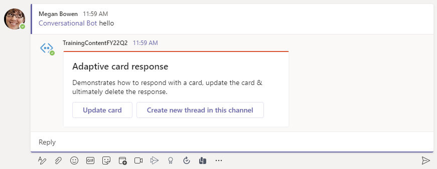
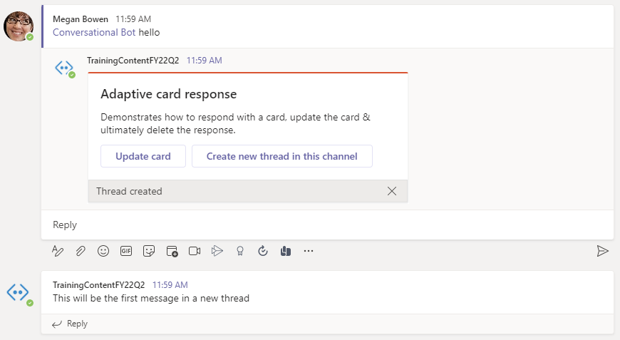

> [!VIDEO https://www.microsoft.com/videoplayer/embed/RE4NHyk]

In this exercise, you’ll update the existing Teams app to send a proactive message from your bot.

> [!IMPORTANT]
> This exercise assumes you have created the Microsoft Teams app project with the Yeoman generator

## Start a proactive message from the bot

Locate and open the bot in the file **./src/server/conversationalBot/ConversationalBot.ts**.

Add the following objects to the existing `import {...} from "botbuilder";` statement you'll need:

```typescript
import {
  ConversationReference,
  ConversationParameters,
  teamsGetChannelId,
  Activity,
  BotFrameworkAdapter,
  // existing imports omitted for clarity
} from "botbuilder";
```

Locate the card in the `else` statement in the `onMessage()` handler you added in the previous section.

Add a second action button to the card that will trigger the creation of a new message:

```typescript
{
  type: "Action.Submit",
  title: "Create new thread in this channel",
  data: { cardAction: "newconversation" }
}
```

The card should now look like the following:

```typescript
const card = CardFactory.adaptiveCard({
  $schema: "http://adaptivecards.io/schemas/adaptive-card.json",
  type: "AdaptiveCard",
  version: "1.0",
  body: [
    {
      type: "Container",
      items: [
        {
          type: "TextBlock",
          text: "Adaptive card response",
          weight: "bolder",
          size: "large"
        }
      ]
    },
    {
      type: "Container",
      items: [
        {
          type: "TextBlock",
          text: "Demonstrates how to respond with a card, update the card & ultimately delete the response.",
          wrap: true
        }
      ]
    }
  ],
  actions: [
    {
      type: "Action.Submit",
      title: "Update card",
      data: value
    },
    {
      type: "Action.Submit",
      title: "Create new thread in this channel",
      data: { cardAction: "newconversation" }
    }
  ]
});
```

Next, add another `case` statement to the `switch (context.activity.value.cardAction)` statement the `onMessage()` handler to detect this new action:

```typescript
case "newconversation":
  const message = MessageFactory.text("This will be the first message in a new thread");
  await this.teamsCreateConversation(context, message);
  break;
```

The last step is to add the `teamsCreateConversation()` method that will create the new conversation. Add the following method to the `ConversationalBot` class:

```typescript
private async teamsCreateConversation(context: TurnContext, message: Partial<Activity>): Promise<void> {
  // get a reference to the bot adapter & create a connection to the Teams API
  const adapter = <BotFrameworkAdapter>context.adapter;
  const connectorClient = adapter.createConnectorClient(context.activity.serviceUrl);

  // set current teams channel in new conversation parameters
  const teamsChannelId = teamsGetChannelId(context.activity);
  const conversationParameters: ConversationParameters = {
    isGroup: true,
    channelData: {
      channel: {
        id: teamsChannelId
      }
    },
    activity: message as Activity,
    bot: context.activity.recipient
  };
  
  // create conversation and send message
  await connectorClient.conversations.createConversation(conversationParameters);
}
```

### Test the bot sending new messages

From the command line, navigate to the root folder for the project and execute the following command:

```console
gulp ngrok-serve
```

> [!IMPORTANT]
> Recall from a previous exercise, Ngrok will create a new subdomain. You need to update your bot registration's **Messaging endpoint** in the Azure portal (*shown in a previous exercise*) with this new domain before testing it.

In the Microsoft Teams client, go to the channel you installed the bot in the previous section. From the **Conversations** tab, @mention the bot with a random string to trigger the `else` condition.

The bot will reply to the message with the updated card that contains two buttons:



Select the second button, **Create new thread in this channel**. Within a few seconds, you should see a new conversation appear in the channel:



## Summary

In this exercise, you’ll modify the existing Microsoft Teams app update the bot to send a proactive message from your bot.
