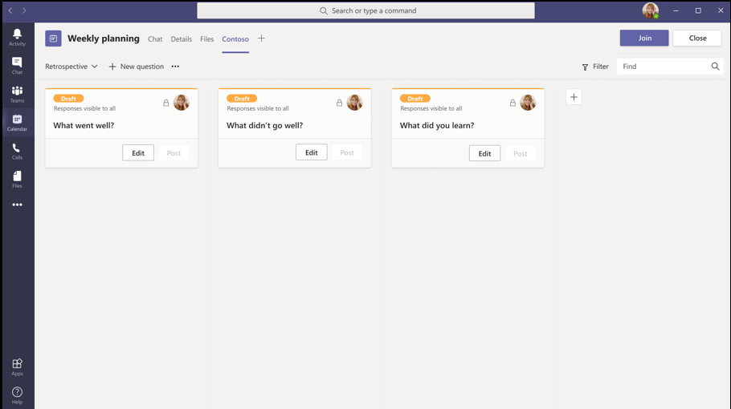
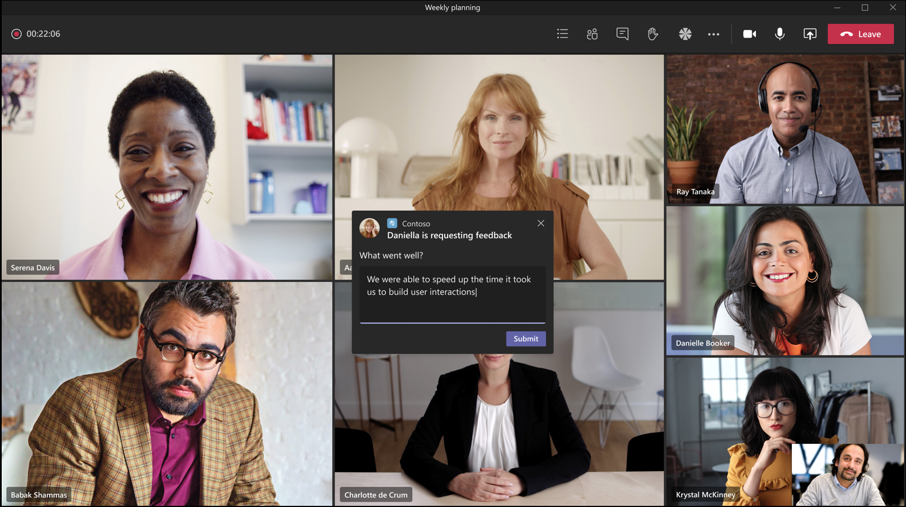
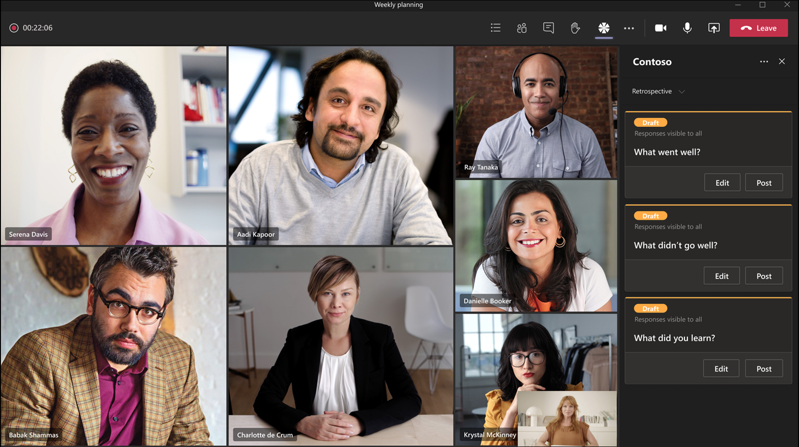

Enhance your meeting experience by using the meeting extensibility feature. This feature enables you to integrate your apps within meetings. It also includes different stages of a meeting lifecycle, where you can integrate tabs, bots, and messaging extensions.

In this unit, you'll learn what Microsoft Teams meetings apps are, how to create one, and how to interact with the app before the meeting starts.

## Microsoft Teams meeting apps

Microsoft Teams meetings apps are based on the following concepts:

- Meeting lifecycle has different stages: pre-meeting, in-meeting, and post-meeting.
- There are three distinct participant roles in a meeting: organizer, presenter, and attendee.
- There are various user types in a meeting: in-tenant, guest, federated, and anonymous users.

## Meeting lifecycle

A meeting lifecycle consists of pre-meeting, in-meeting, and post-meeting app experience. You can integrate tabs, bots, and messaging extensions in each stage of the meeting lifecycle.

### Integrate tabs into the meeting lifecycle

Tabs allow the team members to access services and content in a specific space within a meeting. The team works directly with tabs and has conversations about the tools and data available within tabs.

### Pre-meeting app experience

With the pre-meeting app experience, you can find and add meeting apps. You can also do pre-meeting tasks, such as developing a poll to survey the meeting participants.

Add meeting apps to meetings using the same process you can add tabs to channels. Use the plus icon from the meeting details tab to open the gallery. Once in the gallery, you can select the meeting app that you want to add.


Once the meeting app is installed in a meeting, it's accessible as a tab.



### In-meeting app experience

With the in-meeting app experience, you can engage participants during the meeting by using apps and the in-meeting dialog box. Meeting apps are hosted on the toolbar of the meeting window as an in-meeting tab. Use the in-meeting dialog box to showcase actionable content for meeting participants.



In addition to dialogs, meeting apps can also be surfaced within the side-panel of an active meeting. This is a great way for developers to implement a user-specific interface for the meeting app as each meeting attendee can see individual content during the meeting in the side-panel.



Finally, the meeting app developer can implement a shared view experience with the meeting stage. This area, launched from the side-panel, is presented to everyone else in the meeting.

## Create meeting apps for Microsoft Teams

Developers can create custom apps for Microsoft Teams meetings. You'll use many of the same techniques to implement your app as other Microsoft Teams extensibility points, such as tabs and bots.

To enable your app to be available within Microsoft Teams meetings, you need to make a few changes to your app's **manifest.json** file. These settings are all defined in the **manifest.json**'s `configurableTabs` array:

### App manifest

The tab's `scope` array must include the `groupchat` scope. This property defines who can access the app.

```json
{
  ...
  "configurableTabs": [{
    "scopes": [ "groupchat" ],
    "context": [ .. ],
    "meetingSurfaces": [ .. ]
  }]
  ...
}
```

The tab's `context` array determines what must be shown when a user invokes an app in a meeting depending on where the user invokes the app. This property, along with the scopes property, enable you to determine where the app must appear.

The following `context` options apply to meeting apps. Your meeting app can support one or more of the following contexts:

- **meetingChatTab**: A tab in the header of a group chat between a set of users for a scheduled meeting. You can specify either `meetingChatTab` or `meetingDetailsTab` to ensure the apps work in mobile.
- **meetingDetailsTab**: A tab in the header of the meeting details view of the calendar. You can specify either `meetingChatTab` or `meetingDetailsTab` to ensure the apps work in mobile.
- **meetingSidePanel**: An in-meeting panel opened through the unified bar. *This is the same location where you access the meeting chat and meeting participant list.
- **meetingStage**: An app from the `meetingSidePanel` can be shared to the meeting stage. You can't use this app either on mobile or Teams room clients.

```json
{
  ...
  "configurableTabs": [{
    "scopes": [ "groupchat" ],
    "context": [
      "meetingChatTab",
      "meetingDetailsTab",
      "meetingSidePanel",
      "meetingStage"
    ],
    "meetingSurfaces": [ .. ]
  }]
  ...
}
```

The tab's `meetingSurfaces` array is a set of scopes where the app is shown. The following `meetingSurfaces` options apply to meeting apps and can support one or both surfaces:

- **sidePanel**: An in-meeting panel opened through the unified bar. *This is the same location where you access the meeting chat and meeting participant list.
- **stage**: An app from the `stage` can be shared to the meeting stage. You can't use this app either on mobile or Teams room clients.

```json
{
  ...
  "configurableTabs": [{
    "scopes": [ "groupchat" ],
    "context": [ .. ],
    "meetingSurfaces": [
      "sidePanel",
      "stage"
    ]
  }]
  ...
}
```

## Get meeting details in your meeting app

Developers can get details about the current meeting the app is installed in different ways. Meeting apps can take advantage of the support for single sign-on for all apps.

Refer to the Microsoft Teams documentation on [Single sign-on (SSO) support for tabs](/microsoftteams/platform/tabs/how-to/authentication/auth-aad-sso) for more information, including how to configure Azure AD and your app to obtain an SSO token from Microsoft Teams.

Azure AD applications used to support SSO in Microsoft Teams have many requirements. For example, they must be multitenant applications, they expose the `access_as_user` permission, and should also trust all Microsoft Teams client applications calling the app.

Creating and configuring this permission is done in the **Expose an API** section of the Azure AD app configuration. Here you specify a unique URI for the application in the format of **api://APP_HOST_DOMAIN/APP_ID**.

You then add permissions and optionally trust existing client apps to call this permission. When you automatically trust existing client apps, such as Microsoft Teams desktop, mobile, and web clients, Azure AD won't require the user to consent the application this permission.

To configure the Azure AD application to trust the Microsoft Teams clients, add them to the app as preauthorized applications by their ID's and trust the `access_as_user` permission:

- **Microsoft Teams mobile & desktop clients:** `1fec8e78-bce4-4aaf-ab1b-5451cc387264`
- **Microsoft Teams web client:** `5e3ce6c0-2b1f-4285-8d4b-75ee78787346`

### Associate the Microsoft Teams app with the Azure AD application

Once the Azure AD application has been created, it must be associated with the Microsoft Teams app. This is done in the app's **manifest.json** file in the `webApplicationInfo` section:

```json
"webApplicationInfo": {
  "id": "023adcaa-4fef-4a4d-a94a-0cde3a0c5b31",
  "resource": "api://app.contoso.com/023adcaa-4fef-4a4d-a94a-0cde3a0c5b31"
}
```

There are two parts of this section that must be updated for your application:

- **ID**: This is the client ID of the registered Azure AD application
- **Resource**: This is the URL of the app, which is the same thing as the URI that was used when registering the app in Azure AD. The domain portion of the URI must also be listed in the `validDomains` array in the app's manifest.

### Implement the code in the tab or bot to obtain access tokens

The last step is to write the code that requests an access token from Azure AD for the current user. This token is only used to identify the user: it won't have permissions for Microsoft Graph.

#### Use the access token to identify the user

Your app may need to identify the user. In this case, your app typically provides this token to your own backend system that uses the token to store user preferences or other information specific to the currently signed in user.

In this scenario, the token returned includes a few properties that can be useful to your application:

- **name**: this is the user's display name
- **preferred_username**: this is the user's UPN, or email address
- **oid**: this is the unique object ID of the user - this should be used to identify the user in your back-end system as the name and preferred_username properties can be changed by the user or an administrator
- **tid**: this is the unique tenant ID the user belongs to

#### Use the access token in your own API

If you use the access token in your own API, you should implement accepted best practices when forwarding the token received from Microsoft Teams. This includes validating the token to ensure it was created by Azure AD, it's from the expected authority, the app is the intended audience of the token, the token hasn't expired, and the scope is set to `access_as_user`.

#### Use the access token to access Microsoft Graph

In the scenario where your app needs to access Microsoft Graph, your code can use this token provided by Microsoft Teams to your app to start the [OAuth2 On-Behalf-Of (OBO) flow](/azure/active-directory/develop/v2-oauth2-on-behalf-of-flow). When the token is used in this way, it's referred to as the "bootstrap token" because it's only used to obtain an access token that can be used to call Microsoft Graph.

### Get meeting details from Microsoft Graph

One way to get the current meeting details in a tab is using Microsoft Graph.

The Microsoft Teams `context` object contains a `meetingId` property of the current meeting. This ID contains the ID of the chat for the meeting, surrounded by `0#` and `#0`.

Developers can take the `meetingId`, remove this prefix & suffix, and use  it to get more details from Microsoft Graph by querying the chat by ID:

```http
HTTP GET https://graph.microsoft.com/beta/chats/{chatID}
```

> [!IMPORTANT]
> The Microsoft Graph `chat` endpoint requires the **Chat.Read** scope.

The response contains some information about the current meeting, including the `joinWebUrl` of the meeting. Developers can use this to query Microsoft Graph for all details about the meeting:

```http
HTTP GET https://graph.microsoft.com/v1.0/me/onlineMeetings?$filter=JoinWebUrl eq '{chat.onlineMeetingInfo.joinWebUrl}'
```

> [!IMPORTANT]
> The Microsoft Graph `chat` endpoint requires the **OnlineMeetings.Read** scope.

The response from the `onlineMeetings` endpoint contains all information about the meeting, including meeting participants, their roles, and other details related to the meeting.
