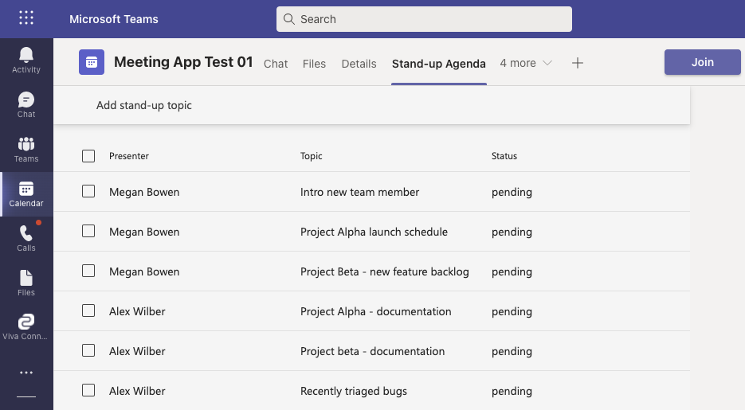
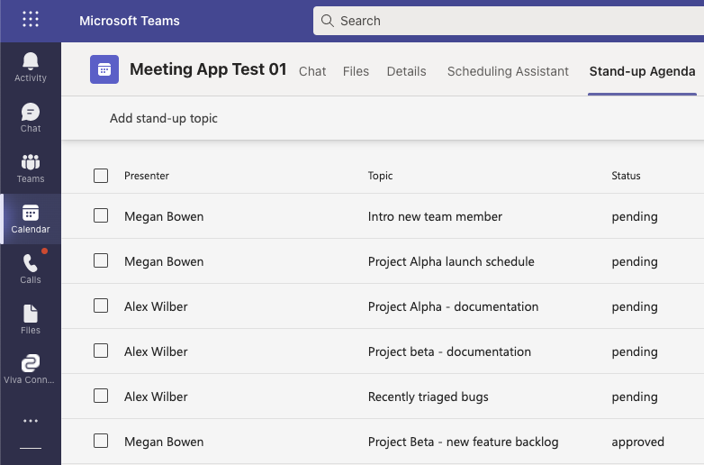
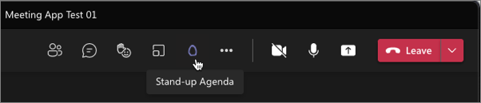
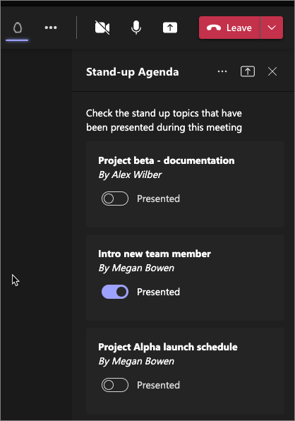

> [!VIDEO https://www.microsoft.com/videoplayer/embed/RWUwJw]

In this exercise, you’ll implement the in-meeting experience for the meeting and improve the existing pre-meeting experience.

In the pre-meeting experience, organizers can approve and modify the presentations submitted by other meeting participants.

In addition, the in-meeting experience will display a different experience depending on if the participant is a presenter, organizer, or attendee of the meeting in the side panel of the meeting.

> [!IMPORTANT]
> This exercise assumes you've created the Azure AD app and Microsoft Teams meetings app from the previous exercises in this module.

## Implement conditional pre-meeting experience based on the attendee's meeting role

Let's update our meeting app created in the previous example to provide a different experience based on the current user's role within the meeting.

You'll update the pre-meeting experience if the current user is the meeting organizer. Meeting organizers will have the ability to approve submitted topics for the meeting agenda.

### Add ability to determine user's meeting role

Locate and open the **./src/client/standUpAgendaTab/StandUpAgendaTab.tsx** file in the existing meeting app project you started in the previous exercise.

Locate the collection of `const` statements that define the state properties for our app. Add the following property to track if the current user is the meeting organizer or not:

```typescript
const [currentUserIsOrganizer, setCurrentUserIsOrganizer] = useState<boolean>(false);
```

Next, add a new React hook that fires when the `currentUserId` and `onlineMeeting` state properties change. This hook will check if the current user is the organizer or not.

Add the following code just after the last existing `useEffect()` method:

```typescript
useEffect(() => {
  if (onlineMeeting && currentUserId && onlineMeeting?.participants?.organizer?.identity?.user?.id === currentUserId) {
    setCurrentUserIsOrganizer(true);
  } else {
    setCurrentUserIsOrganizer(false);
  }
}, [currentUserId, onlineMeeting]);
```

### Add handler to toggle the topic status

Next, add a function to handle when the current user changes the state of the stand-up topic. Add the following code immediately after the existing `onNewStandupTopicSubmit` method.

```typescript
const toggleStandupTopicStatus = (targetTopicId: string): void => {
  // get all topics except current one
  let updatedTopics = standupTopics.filter((topic) => { return topic.id !== targetTopicId });

  // find existing topic
  let currentTopic = standupTopics.filter((topic) => { return topic.id === targetTopicId })[0];
  currentTopic.approved = !currentTopic.approved;

  // add updated topic back to collection
  updatedTopics.push(currentTopic);

  // save changes
  (async () => { await saveStandupTopics(updatedTopics); })();
};
```

### Update the user experience

Let's now update the user experience. When the user isn't the meeting organizer, the current experience will not change.

However, if the current user is the organizer, when they select a single topic from the list, they should see a new toolbar action to toggle the status of the topic.

Within the existing `getPreMeetingUX` function, locate the code that converted the topics to an array of objects that are used for the rows in the list. The code will look similar to the following:

```typescript
const rows = standupTopics.map(standupTopic => (
  {
    id: standupTopic.id,
    topic: standupTopic.title,
    presenter: standupTopic.presenter.name,
    status: (standupTopic.approved) ? 'approved' : 'pending'
  })
).reduce((prevValue, currValue, index, array) => (
  {
    ...prevValue,
    [currValue.id]: currValue
  }),
  {}
);
```

Add a new property to the object returned from the `.map` function, immediately after the `status` property:

```typescript
actions: {
  toggleStatus: {
    title: (standupTopic.approved) ? 'Reject' : 'Approve'
  }
}
```

This new `actions` property defines an action **toggleStatus**. We'll use this to detect which action in the toolbar was selected (*in this case, **toggleStatus***) and what text to use for the action.

Next, let's update the actual list. First, add a new property `selectable` that's set to **true** only if the current user is the meeting organizer:

```typescript
selectable={currentUserIsOrganizer}
```

Finally, locate the `onInteraction` property on the `<List>` control. Add a new `case` statement to the existing `switch` statement. This will call our function `toggleStandupTopicStatus` when the organizer selects that toolbar action:

```typescript
case "toggleStatus":
  toggleStandupTopicStatus((toolbarInteraction.subject as string[])[0]);
  break;
```

The final `<List>` control should now look like the following:

```tsx
<List
  title="Standup Meeting Topics"
  selectable={currentUserIsOrganizer}
  columns={{
    presenter: { title: "Presenter" },
    topic: { title: "Topic" },
    status: { title: "Status" }
  }}
  rows={rows}
  onInteraction={async (interaction: TListInteraction) => {
    if (interaction.target === "toolbar") {
      const toolbarInteraction = interaction as TToolbarInteraction;
      switch (toolbarInteraction.action) {
        case "addTopic":
          setShowAddTopicForm(true);
          break;
        case "toggleStatus":
          toggleStandupTopicStatus((toolbarInteraction.subject as string[])[0]);
          break;
      }
    }
  }}
  emptyState={{
    fields: {
      title: "Create your first standup meeting topic",
      desc: "Add your first proposed topic to cover during the stand up meeting by selecting 'Add topic' in the header of this list"
    },
    option: CommunicationOptions.Empty
  }}
  emptySelectionActionGroups={addTopicAction} />
```

## Build and test the application

Let's now test the changes made in this exercise.

From the command line, navigate to the root folder for the project and execute the following command:

```console
gulp ngrok-serve
```

The app manifest didn't change so we don't have to upload or update the app on our existing meetings.

Using the Microsoft Teams client, sign in with the credentials of a Work and School account of the **user who is not the meeting organizer**.

Go back to the two meetings you previously created.

Notice all the topics look the exact same as they did from the previous exercise. There's no checkbox at the start of each row to indicate they're selectable.


So, the meeting attendee can't make changes to the topic status'.

Now, sign out of Microsoft Teams and sign back in using the Work and School account of the meeting organizer.

Go back to the two meetings you previously created.

Notice the topics all have checkboxes next to them indicating they're selectable:



Select one of the meeting topics. Notice how the toolbar changes to remove the existing action to add a new topic and it's replaced with a new action to approve the selected topic.

The new topic action that's no longer visible went away because we'd added it using the `<List>` control's `emptySelectedActionGroups` property. Therefore, it's only shown when no items are selected in the list.


Select the **Approve** action in the toolbar to approve the topic. The app will save the change and update the collection of stand-up topics.



## Implement in-meeting experience with a side-panel

> [!VIDEO https://www.microsoft.com/videoplayer/embed/RWUreF]

Meeting apps for Microsoft Teams can implement a side-panel experience for user interaction. The side-panel occupies the same space where the meeting participant list and chat is located.

You can use this area to provide a user-specific experience during the meeting related to your app.

Now, let's update the meeting app to display a different experience during the meeting in the side-panel.

You'll update the in-meeting experience so users can view all the attendees can see a list of the topics they're supposed present, and mark topics as having been presented.

### Add ability to toggle the presented status of a stand-up topic

Locate and open the **./src/client/standUpAgendaTab/StandUpAgendaTab.tsx** file in the existing meeting app project.

Before we update the meeting experience, add the following code just after the existing `toggleStandupTopicStatus` function. This code will toggle the status of the topic to indicate if it's been presented or not:

```typescript
const togglePresentedState = (topicId: string): void => {
  let updatedTopics = standupTopics.filter((topic) => { return topic.id !== topicId });

  // find existing topic
  let currentTopic = standupTopics.filter((topic) => { return topic.id === topicId })[0];
  currentTopic.presented = !currentTopic.presented;

  updatedTopics.push(currentTopic);

  // save changes
  (async () => { await saveStandupTopics(updatedTopics); })();
}
```

### Implement the side-panel user experience

Now let's add the user experience for the side panel.

Add the following code after the existing `getPreMeetingUX` function:

```typescript
const getSidepanelUX = () => {
  const filteredTopics = standupTopics.filter((topic) => {
    return (currentUserIsOrganizer)
      ? (topic.approved === true)
      : ((topic.approved === true) && (topic.presenter.id === currentUserId));
  });
  const sortedTopics = sortBy(filteredTopics, [topic => topic.presenter.name, topic => topic.title]);

  // TODO: add side-panel code here
}
```

This code will first get a list of all the approved stand-up topics, but if the current user isn't the meeting organizer, it excludes other attendee's submitted topics.

Next, implement the user experience. This will consist of a series of cards. Each card will have a toggle control to indicate if the topic has been presented. Switching it will toggle the presented status.

Replace the existing `// TODO: add side-panel code here` comment with the following code:

```tsx
return (
  <Flex fill={true} column styles={{ gap: "10px" }}>
    <Text content="Check the stand up topics that have been presented during this meeting" />
    {
      sortedTopics.map(topic => (
        <Card>
          <Card.Header>
            <Text content={topic.title} weight="bold" />
            <Text content={`By ${topic.presenter.name}`} temporary />
          </Card.Header>
          <Card.Footer>
            <Checkbox toggle
              label="Presented"
              checked={topic.presented}
              disabled={!(setCurrentUserIsOrganizer || topic.presenter.id !== currentUserId)}
              onChange={(e, v) => {
                togglePresentedState(topic.id);
              }} />
          </Card.Footer>
        </Card>
      ))
    }
  </Flex>
)
```

The last step is to tell the app to use this new function when the app is running in the side-panel of the meeting. This can be determined by the `frameContext` of the meeting.

Locate the `switch` statement for our tab that creates the user experience. It should look like the following code:

```typescript
let mainContentElement: JSX.Element | JSX.Element[] | null = null;
switch (frameContext) {
  case microsoftTeams.FrameContexts.content:
    mainContentElement = getPreMeetingUX();
    break;
  default:
    mainContentElement = null;
```

Add the following `case` statement to the `switch` to create our new side-panel experience when appropriate:

```typescript
let mainContentElement: JSX.Element | JSX.Element[] | null = null;
switch (frameContext) {
  case microsoftTeams.FrameContexts.content:
    mainContentElement = getPreMeetingUX();
    break;
  case microsoftTeams.FrameContexts.sidePanel:
    mainContentElement = getSidepanelUX();
    break;
  default:
    mainContentElement = null;
```

## Build and test the application

Let's now test the changes made to the side-panel in-meeting experience.

If the app isn't still running from our previous test, from the command line, navigate to the root folder for the project and execute the following command:

```console
gulp ngrok-serve
```

The app manifest didn't change so we don't have to upload or update the app on our existing meetings.

Using the Microsoft Teams client, sign in with the credentials of a Work and School account of the **user who is not the meeting organizer**.

Go back to the two meetings you previously created. This time, join the meeting instead of just editing it. In the header bar of the meeting window, select our custom meeting app to launch the side-panel:



When the tab loads, it will display all the approved meeting topics. If you're signed in as the organizer,  you can see everyone's approved topics. Otherwise, you only see your approved topics.

You can also select the **Presented** toggle to change the status of the topic:


