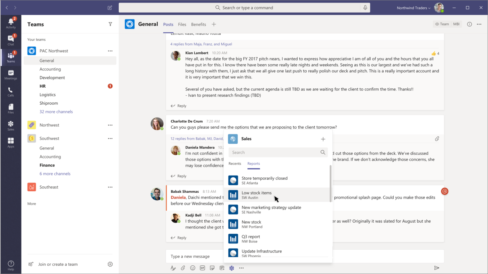

> [!VIDEO https://www.microsoft.com/videoplayer/embed/RE4OIvK]

Messaging extension search commands allow your users to search external systems and insert the results of that search into a message in the form of a card.

In this unit, you’ll learn how to execute a messaging extension search command from an existing message.

## Search commands

Search commands allow your users to search an external system for information (*either manually through a search box, or by pasting a link to a monitored domain into the compose message area*), then insert the results of the search into a message.

In the most basic search command flow, the initial invoke message will include the search string the user submitted. You'll respond with a list of cards and card previews. The Microsoft Teams client will render the card previews in a list for the end user to select from. When the user selects a card, the full-size card will be inserted into the compose message area.



## Developing search commands

Search actions can be triggered from the compose message area or the command box. Unlike action commands, they can't be triggered from a message.

### Registering search command messaging extensions

To register a search command messaging extension, add it to the `composeExtensions` array property in the Microsoft Teams app manifest:

```json
"composeExtensions": [
  {
    "botId": "{{MICROSOFT_APP_ID}}",
    "canUpdateConfiguration": false,
    "commands": [
      {
        "id": "planetExpanderSearch",
        "type": "query",
        "title": "Planet Lookup",
        "description": "Search for a planet.",
        "context": ["compose"],
        "parameters": [{
          "name": "searchKeyword",
          "description": "Enter 'inner','outer' or the name of a specific planet",
          "title": "Planet"
        }]
      }
    ]
  }
]
```

The `type` property specifies this is an `query` command.

The `context` property defines where the messaging extension can be invoked.

The `parameters` property defines the input fields displayed in the search experience when the messaging extension is invoked.

If you include the property `initialRun` to `true`, your web service will receive the invoke message as soon as the search command is invoked. Otherwise, it will only receive a message when the search is executed. This property defaults to `false` if it's omitted.

### Respond to the search command

When your search action is invoked, the Bot Framework will send an `Activity` object to your web service of type `composeExtension/query` with the command ID that you need to respond to with an object containing a `composeExtension` object within five seconds of receiving the request:

```typescript
export class PlanetBot extends TeamsActivityHandler {
  protected handleTeamsMessagingExtensionQuery(context: TurnContext, query: MessagingExtensionQuery): Promise<MessagingExtensionResponse> {
    // get the search query
    let searchQuery = "";
    if (query &&
        query.parameters &&
        query.parameters[0].name === "searchKeyword" &&
        query.parameters[0].value) {
      searchQuery = query.parameters[0].value.trim().toLowerCase();
    }

    // execute search logic
    let queryResults: string[] = ...;

    // get results as cards
    let searchResultsCards: MessagingExtensionAttachment[] = [];
    queryResults.forEach((planet) => {
      searchResultsCards.push(this.getPlanetResultCard(planet));
    });

    let response: MessagingExtensionResponse = <MessagingExtensionResponse>{
      composeExtension: {
        type: "result",
        attachmentLayout: "list",
        attachments: searchResultsCards
      }
    };

    return Promise.resolve(response);
  }
}
```

The method `handleTeamsMessagingExtensionQuery()` is called by the Bot Framework SDK when a message of type `composeExtension/query` is received.

The `type` property can be one of the following options:

- `result`: displays a list of the search results
- `message`: displays a plain text message
- `auth`: prompts the user to authenticate
- `config`: prompts the user to set up the messaging extension

The `attachmentLayout` property can be either a `list` of results containing thumbnails, titles and text fields, or a `grid` of thumbnail images.

The `attachments` property is used when `type` is set to `result` and contains an array of supported cards.

If `type` is set to `message`, an extra property `text` can be used to set the plain text message displayed.

When `type` is set to `auth` or `config`, use the `suggestedActions` property to suggest extra actions to do.

## Summary

In this unit, you learned how to execute a messaging extension search command from an existing message.
