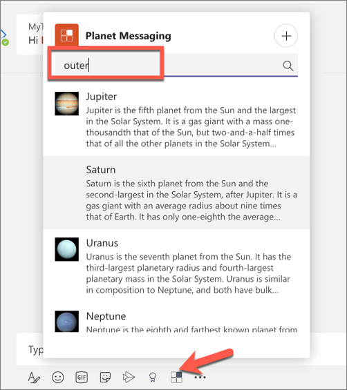

> [!VIDEO https://www.microsoft.com/videoplayer/embed/RE4OFZH]

In this exercise, you’ll learn how to execute a messaging extension search command from an existing message.

> [!IMPORTANT]
> This exercise assumes you have created the Microsoft Teams app project with the Yeoman generator.

## Add a new search messaging extension to the Teams app

In a previous exercise, you created an action messaging extension that enabled a user to add the details of a planet to a message.

In this section, you'll add a search messaging extension to find a specific planet.


### Update the app's configuration

You must increment the version of the app to upgrade an existing installed version. Use the following command to increment the version:

```console
npm version patch
```

Locate and open the **./src/manifest/manifest.json** file. Find the `composeExtensions.commands` array. Add a new item with the following properties:

```json
{
  "id": "planetExpanderSearch",
  "type": "query",
  "title": "Planet Lookup",
  "description": "Search for a planet.",
  "context": ["compose"],
  "parameters": [{
    "name": "searchKeyword",
    "description": "Enter 'inner','outer' or the name of a specific planet",
    "title": "Planet"
  }]
}
```

### Add the query command handler to the bot

The next step is to implement the query command messaging extension using a well-known method in the bot. 

Locate and open the bot in the file **./src/server/planetBot/planetBot.ts**.

Update the `import` statement for the **botbuilder** package to include the `MessagingExtensionQuery` and `MessageExtensionResponse` objects:

```typescript
import {
  // ... existing imports
  MessagingExtensionQuery, 
  MessagingExtensionResponse
} from "botbuilder";
```

Next, add the following method to the `PlanetBot` class:

```typescript
protected handleTeamsMessagingExtensionQuery(context: TurnContext, query: MessagingExtensionQuery): Promise<MessagingExtensionResponse> {
  // get the search query
  let searchQuery = "";
  if (query && query.parameters && query.parameters[0].name === "searchKeyword" && query.parameters[0].value) {
    searchQuery = query.parameters[0].value.trim().toLowerCase();
  }

  // load planets
  const planets: any = require("./planets.json");
  // search results
  let queryResults: string[] = [];

  switch (searchQuery) {
    case "inner":
      // get all planets inside asteroid belt
      queryResults = planets.filter((planet) => planet.id <= 4);
      break;
    case "outer":
      // get all planets outside asteroid belt
      queryResults = planets.filter((planet) => planet.id > 4);
      break;
    default:
      // get the specified planet
      queryResults.push(planets.filter((planet) => planet.name.toLowerCase() === searchQuery)[0]);
  }

  // get the results as cards
  const searchResultsCards: MessagingExtensionAttachment[] = [];
  queryResults.forEach((planet) => {
    searchResultsCards.push(this.getPlanetResultCard(planet));
  });

  const response: MessagingExtensionResponse = {
    composeExtension: {
      type: "result",
      attachmentLayout: "list",
      attachments: searchResultsCards
    }
  } as MessagingExtensionResponse;

  return Promise.resolve(response);
}
```

This method will first get the search keyword from the query sent to the bot from Microsoft Teams. It then will retrieve planets based on three different queries:

- **inner**: this will return all the planets inside the asteroid belt (*Mercury to Mars*)
- **outer**: this will return all planets outside the asteroid belt (*Jupiter to Neptune*)
- *keyword*: this will retrieve the specific planet entered

It will then take the query results, convert them to cards and add them to the `MessagingExtensionResult` returned to the Bot Framework and ultimately to Microsoft Teams.

Lastly, add the following utility method to the `PlanetBot` class to create the card for each search result:

```typescript
private getPlanetResultCard(selectedPlanet: any): MessagingExtensionAttachment {
  return CardFactory.heroCard(selectedPlanet.name, selectedPlanet.summary, [selectedPlanet.imageLink]);
}
```

### Test the updated messaging extension

From the command line, navigate to the root folder for the project and execute the following command:

```console
gulp ngrok-serve --debug
```

> [!IMPORTANT]
> Recall from a previous exercise, Ngrok will create a new subdomain. You need to update your bot registration's **Messaging endpoint** in the Azure portal (*shown in a previous exercise*) with this new domain before testing it.

First, update the existing installed version of the bot. Upload the zip file from the **package** directory.

After updating the app, go back to the 1:1 chat where you tested the messaging extension in the previous exercise. Select the **Planet Messaging** icon below the compose message box in the chat. This will now present the search experience.

Enter the string **outer** in the search box and wait a few seconds. Microsoft Teams will execute the search and return the results:



## Summary

In this exercise, you learned how to execute a messaging extension search command from an existing message.
